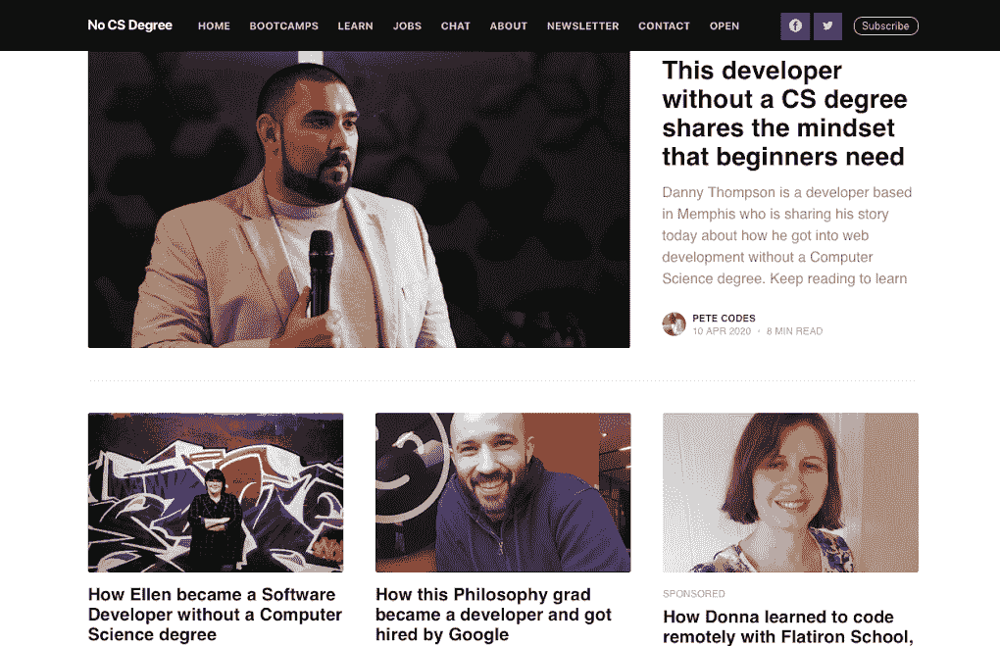
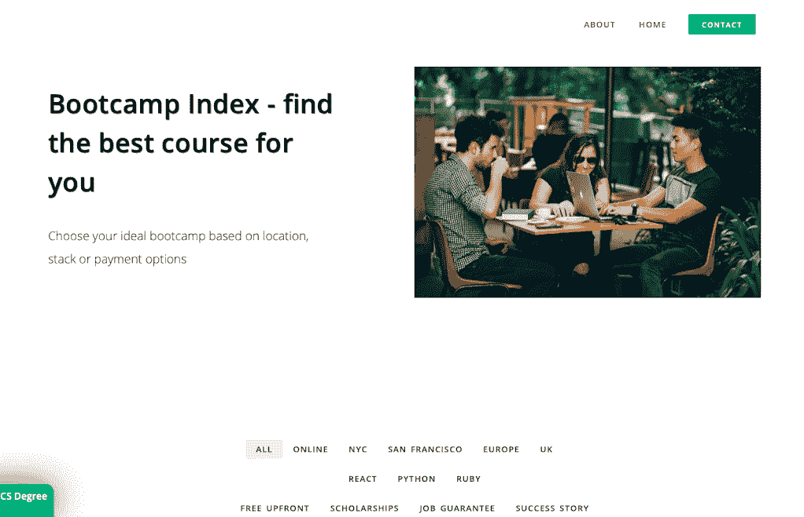
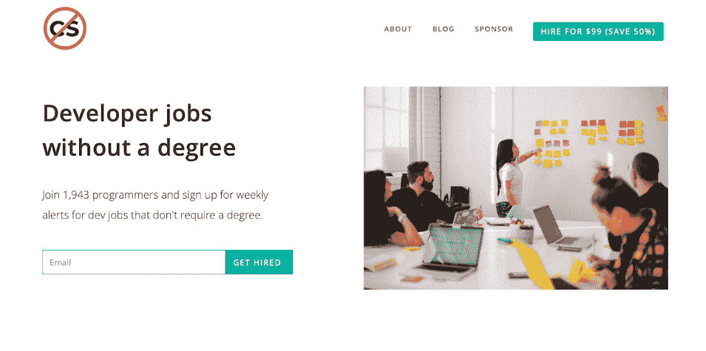
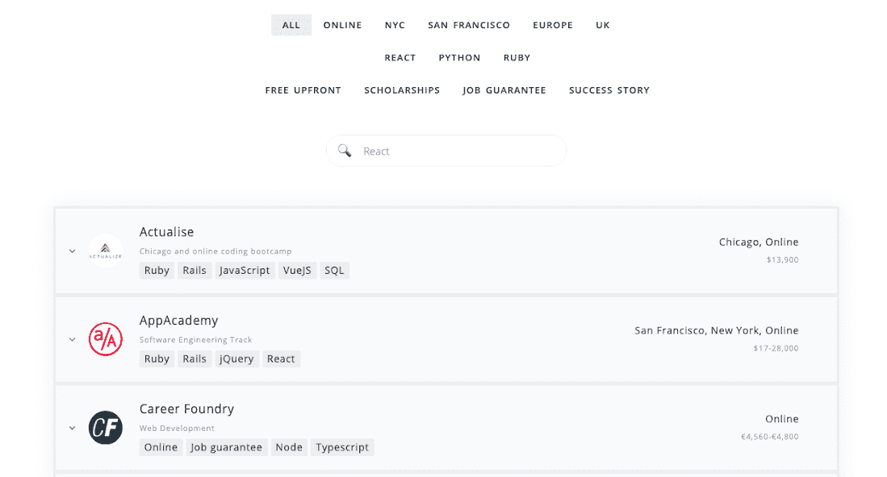
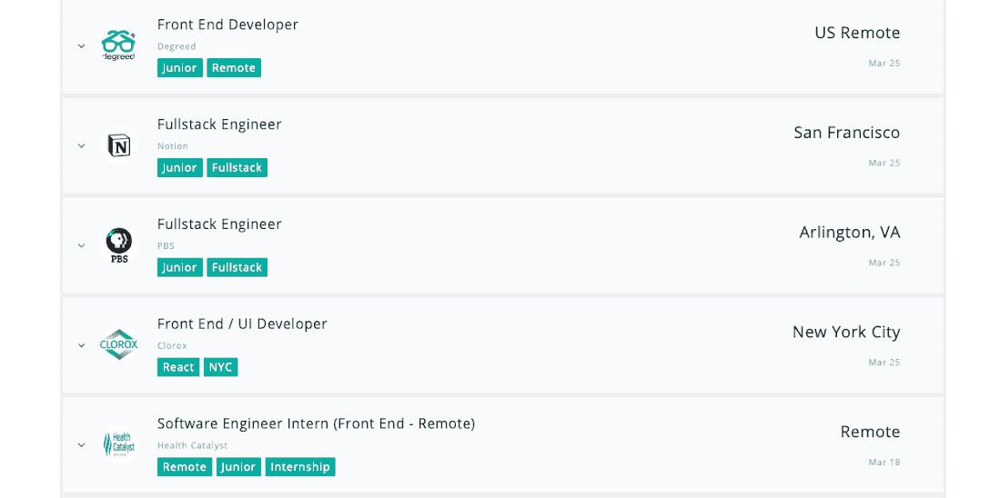

# 我是如何为自学成才的开发者构建资源谋生的

> 原文：<https://www.indiehackers.com/interview/how-im-making-a-living-building-resources-for-self-taught-devs-0f9bb7965e>

## 你好！你的背景是什么，你在做什么？

嘿，独立黑客们！我的名字叫皮特，我经营 [No CS Degree](https://www.nocsdegree.com) ，这是一个博客，我在这里采访成功的开发者，他们要么是自学的，要么去过训练营。

所以我有一个非常复杂的背景。我在大学学习政治和西班牙语，然后在道德投资行业担任研究员。2018 年我离职去追求创业，但是没有计划。我失败了，不得不依靠福利救济，然后在一家赌博店找了份工作，那里充斥着暴力和毒品。有人威胁要刺伤我的经理后，我离开了。

【T2

自从去年 6 月辞去那份工作以来，我一直靠没有计算机科学学位谋生。我问人们一些问题，比如他们是如何开始编程的，他们是如何克服像冒名顶替综合症这样的挑战的，以及他们获得聘用的秘诀。对我来说，这是一件有趣的事情，因为我可以了解人们的故事，然后与世界分享！

从那以后，我开始在这一领域建立起一个不错的受众群体，我为没有 CS 学位的开发人员制作了一个[工作板](https://nocsok.com)，并且我最近推出了[训练营索引](https://www.bootcampindex.com)，这是一种轻松找到最佳编码训练营的方法。它允许用户根据地点、你将学习什么技术、是否有奖学金等进行筛选，并且与其他训练营相比，它给了网站访问者更多的控制权。

到目前为止，我最好的一个月是在 2020 年 2 月，收入 2300 美元，我的支出每月只有 100 美元左右。我是开放创业运动的忠实信徒，所以你可以在[无 CS 学位开放页面](https://www.nocsdegree.com/open/)查看我的收入。

## 是什么激励你没有 CS 学位就入门？

独立黑客显然是一个很大的灵感！我最初的想法是，就像独立黑客为没有风险投资基金的企业家服务一样，我可以为没有计算机科学学位的开发人员创建一个网站。我已经积累了足够维持六个月的积蓄。我在 2019 年 7 月底开始，几天后找到了我的第一个简讯赞助商。10 月份，我赚了 1693 美元，从那以后，我非常自信我能做到。

我最初的动机是，通过与没有典型开发背景的人交谈，我可以在学习编码时保持灵感。我只会问我认识的没有学位的网友，他们是如何成功的。我的第一批面试者之一是一位 21 岁的开发人员，月收入超过 10，000 美元。我对此很感兴趣，因为他 16 岁就从高中辍学了。所以我想其他人也会觉得这很有趣。

作为一名自由撰稿人，我已经做了很多工作，而且我有多年的办公室研究经验，所以我很有信心我能做到。此外，我还看到《星球大战》中的[帕特·沃尔斯从零开始发展他的事业。](https://www.starterstory.com/starters/pat-walls)

我在早期得到了很多肯定！我用一个全新的用户账号登上了黑客新闻的[头条，网站一天之内就有了 29000 次访问。当我发布工作公告板时，](https://news.ycombinator.com/item?id=20506945) [No CS OK](https://nocsok.com) ，它在黑客新闻上停留了整整两天！

在接下来的一两个月里，我将在编码世界之外推出一些其他的想法，这很令人兴奋。没有一个 CS 学位似乎是显而易见的追求，因为有很多人在学习编程，而我会有内在的动力，因为它也会帮助我学习。

我已经看到像 Pieter Levels 这样的公司占据了像远程工作/数字游牧者这样的不断增长的利基市场，并围绕这个市场建立了业务，所以我想我也可以这样做。到目前为止，我已经建立了博客，这是主要的收入来源，但我也推出了就业委员会，我刚刚推出了[训练营指数](https://www.bootcampindex.com)。

## 构建最初的产品需要什么？

所以我花了大约三个星期来制作它。我必须选择使用什么博客平台。幸运的是，我刚刚向 Pieter Levels 发了一条推文，问他我应该使用什么，他建议使用 [Ghost](https://ghost.org/) ，这是一个由曾经在 Wordpress 工作的人建立的非营利组织。它有很多很好的功能，比如文章在社交媒体上的内置预览等等，而且你不必像使用 Wordpress 那样安装所有这些插件。一切都是现成的，所以我选择了它。

除了联系人们，问他们是否想参加，没有什么别的事可做。我想在发布之前，我可能已经准备好了十篇文章，而网站是从四篇博文开始的。我觉得留一些储备会很好，这样我就不会有压力，这是个好决定！

## 你们是如何吸引用户，成长到没有 CS 学位的？

我在 2019 年 7 月底推出了网站。我把它放在[产品搜索](https://www.producthunt.com/posts/no-cs-degree)上，它得到了推荐，但没有得到我希望的第一名。我在之前的发布中获得了当天的产品，所以我有点失望，但事后看来，它进行得很好，获得了 277 张赞成票。

当天晚些时候，我去了一家咖啡馆，决定把它放在黑客新闻上。我以前从来没有在那里发过帖子，我只知道它是一个名声不好的网站。我问了 WIP Telegram 组的几个人关于如何用词的建议。你不想太卖弄——你应该给它起个名字，就像你在向朋友解释你的东西一样，所以我发了一个帖子，叫做[“没有计算机科学学位——采访自学成才的开发人员”](https://news.ycombinator.com/item?id=20506945)。

一切都开始变得疯狂！《邮报》获得了 692 张支持票，有人在电报上告诉我，他们从未见过一个帖子被炸得这么快！它连续 24 小时位居黑客新闻榜首。在此期间，我没有任何时事通讯呼吁行动，所以我在没有任何测试的情况下，匆忙地在生产中添加了一个。我给这个开发人员 Steph Smith 发消息，她告诉我如何添加一个固定的标题，等等。事后看来，这很有趣，但当时非常激烈。第一天就有 29，000 人访问了该网站，其中大部分来自黑客新闻。

我在 Twitter 上非常活跃，这肯定很有帮助。这是一个既能找到新的采访对象又能找到更多读者的好地方。拥有一份时事通讯对我来说绝对非常重要，无论是从获得更多流量还是赚更多钱的角度来说。我也有一个 Slack 社区，在那里我也可以联系到其他人。

我在 Twitter 上非常活跃，这肯定很有帮助。

TweetShare

我现在最大的流量来源是谷歌，所以我的搜索引擎优化一定很好。我是谷歌上“没有计算机科学学位”和“没有计算机科学学位”的第一个结果，所以我很高兴。我已经采访了 70 多名开发者，所以我认为如果你有那么多关于某个领域的文章，你会在搜索结果中排名很好。我想这是让这个网站只面向没有学位的开发者的好处之一；如果我只是采访了一般的开发者，那么就不会有这么强的品牌，它会更加通用。

## 你的商业模式是什么，你是如何增加收入的？

所以我有几个不同的收入来源，我认为这对企业家来说是个好主意，而不是依赖一种方式赚钱。迄今为止，我最大的来源是时事通讯广告销售。我在邮件的末尾附上了一些关于产品的句子，通常是某种编码资源，还有一个链接，仅此而已。在我发布的几天后，我做了我的第一份简讯销售。一开始我还做了一个[给我买咖啡的页面](https://www.buymeacoffee.com/nocsdegree)，有几个人给了钱，这是很好的早期验证。

除了时事通讯销售，我收入的另一大来源是与希望吸引更多学生的编码训练营合作经营赞助文章。因为我有一个非常小众的网站，旨在让人们进入编码领域，并使 web 开发更加容易，这是一个值得一提的 bootcamps 的吸引人的地方。到目前为止，我已经与熨斗学校，霍尔伯顿学校和制造商合作。

【T2

分享这些成功的故事对我来说是非常有益的。这里有一个赞助文章的例子，有人去了[熨斗学校](https://www.nocsdegree.com/donna-interview-flatiron-school-remote/)学习远程编码。她能够辞掉服务员的工作，成为一名开发人员！

我的文章中有一些编码课程的附属链接，这是令人惊讶的有利可图的东西。我的一位早期受访者成为了算法专家，我在六个月内已经因此获得了超过 1000 美元的被动收入。我和韦斯·博斯也有会员关系，我也采访过他。

此外，我还向亚马逊这样的公司收费，让它们在我为自学和编写代码的训练营开发者准备的求职板 [No CS OK](https://nocsok.com) 上发布职位。我最近推出了 Bootcamp Index(我之前已经详细介绍过了)，我乐观地认为这也将是一个很好的收入来源。

我从 Steli Efti 对独立黑客的采访中学到了很多关于销售的东西。你真的只需要喜欢你的产品，并把自己放在那里！没有人会为你做销售。有一天，我的一个朋友说，我比企业家更有优势，因为我没有计算机科学的背景，所以我花更多的时间在销售和营销上，而不是不断地给网站添加功能和专注于技术。

你真的只需要喜欢你的产品，并把自己放在那里！没有人会为你做销售。

TweetShare

我收入最高的月份是两个月前的 2020 年 2 月，当时我赚了 2337 美元。这是我上市以来第二次突破 2000 美元大关，我有信心在未来一两个月内突破 3000 美元至 4000 美元大关。我上个月挣了 1007 美元，比以前少了一点，但我认为在目前的经济环境下，由于电晕，你必须看到半满的杯子。

我非常感激，我不仅可以在网上谋生，而且我参与了一个我认为会在经济衰退时增长的领域，因为更多的人需要转行并因此学习编程。

我一个月的开销大约是 100 美元，这说明了经营网上生意是多么有利可图，为什么每个人都应该尝试一下！我目前每月的支出如下:

*   幽灵:35 美元
*   第二页:35 美元
*   扎皮尔:10 美元
*   mailchimp:10 美元

## 你未来的目标是什么？

我的目标很简单:做我想做的事情，在我想做的地方，在我想做的时候。让我们来分析一下。

我想要什么:这只是意味着决定我自己对企业的愿景，这是我可以做到的，因为我是独立的，没有联合创始人

**我想去哪里；我喜欢住在苏格兰的爱丁堡。一旦电晕锁定结束，我想偶尔做一点远程工作，如离开几个星期或几个月的异国情调的地方，然后回家休息一年。我喜欢能够在家或者在凉爽的咖啡馆工作，而不是在办公室！**

**当我需要的时候:**拥有一个灵活的时间表真是太棒了！这意味着(在非电晕时间)我可以在安静的时候去健身房，然后如果我想的话，可以工作到晚上。圣诞节我不用请假了。我可以在白天照看我的侄子和朋友，然后在晚些时候工作。掌控自己的时间表是非常自由的！

我也有一些收入目标。我的一个朋友 Andrey Azimov 向我挑战，要我在明年的这个时候每月挣 1 万英镑，我认为这是可行的。他上个月刚跑了 10 公里，所以这是对可能性的进一步鼓励！所以如果我的生意意味着我能满足前四点，我很开心。数字永远不会结束，所以要小心追逐它们。最终，我想成为像 Lynne Tye 那样一年挣几十万美元的人，但是我不需要成为百万富翁。

## 如果你必须重新开始，你会做什么不同的事？

就赢得订户而言，我真的没有好好利用这次发布。我喜欢 Ghost，但当时只有一个小小的订阅按钮，现在有了大的 CTA。在获得黑客新闻之后，我在一天之内就有了 30，000 的访问者，我应该有更多的电子邮件注册。我确实从没有 CS OK，就业委员会那里学到了东西，由于一个大的 ol 注册表格和一个英雄形象，我在第一周就有了 1000 个订户。

另一件我不应该做的事情是为工作公告板创建一个不同的品牌，因为它只是创建了另一个人们必须记住的名字。我假设 Pieter Levels 创建了单独的远程 OK 工作板，因为他想以一个全新的名称在 Product Hunt 上进行另一次启动(有规则禁止使用相同的 URL 启动)。所以我为就业委员会制作了这个单独的身份，后来才发现 Pieter 实际上制作了 Remote OK，因为他意识到许多远程工作者不是游牧者，所以他们不应该成为游牧者名单品牌的一部分。因此，在公共场合直接询问他的品牌塑造方法就可以避免这种情况。再说一次，我正在从中学习，并向我的导师寻求建议。

## 有没有发现什么特别有帮助或者有优势的？

有榜样帮助很大！当我辞职的时候，我会在爱丁堡附近散步，听关于独立黑客的播客。她一年挣 30 万美元，没有计算机学位或商业培训。我*仍然*在我心情不好的时候听那集。当然，像 Pat Walls 这样以 Starter Story 的形式制作了一个非常成功的访谈网站的人对我帮助很大，因为它为我提供了一个途径。我看到帕特在很长一段时间里从零开始建立它。所以我在夏天想，“好吧，帕特一个月挣四千。所以我也能做到。”当然现在他一个月挣七千所以我必须赶上，哈哈！

我真的不相信书，因为我相信书可以代替行动。如果你买了一本关于企业家精神的书，就好像你告诉自己已经有所成就。你干得好！但是，你没有。你刚买了一本书。总会有更多的书可以读，所以最好现在就开始读。

此外，Twitter 是任何制造商都可以要求的最佳资源！当我刚起步时，我会进入 Twitter，搜索 Pieter Levels 写的任何东西。因此，如果我想听听他对某件事的看法，我只需搜索*@ level SiO“sales”*，这样我就能得到他所有的销售技巧。与其买书，你还不如分析其他制造商哪里做得对或错，向更多成功人士提问，像海绵一样吸收知识。

我很高兴我建立了一个非常独特的品牌。理解我的产品是关于什么的非常简单明了。我总是采取一种简单的命名方式，我只是说事情是什么，而不是一些时髦的东西，比如称你的公司为“aviato”。我很高兴我只为没有 CS 学位的开发者制作了它，因为它与我的观众建立了更强大的联系。我非常相信与小众观众交谈！

我还预计学习编码的人数将继续增长至少十年，所以我很高兴我选择了一个不断增长的市场。最终，我很高兴能以如此低廉的价格制造出这样的产品。我不确定在历史上有多少次你每月只花 100 美元就能维持生活。

## 对于刚刚起步的独立黑客，你有什么建议？

我最大的一条建议是确保你的想法通过我提出的被公共汽车撞上的 T3 T4 测试。你应该在做一个对你来说非常重要的项目，如果你明天被公交车撞了，你会死在街上，你会想，“哦，好吧，至少我在做 X 项目。”钱是好东西，但是如果你讨厌你每天所做的事情，那就不是成功的秘诀。

从这一点出发，你必须解决自己的问题。我曾经为滑雪者和滑雪板爱好者制作了一个类似流浪者列表的网站，叫做滑雪场列表。唯一的问题？我不经常滑雪！所以我对产品不感兴趣，也不知道人们在度假胜地真正寻找的是什么。我根本不玩滑雪板，所以我在网站上询问人们想要什么。所以如果你不打网球，就不要做寻找网球伙伴的 app！

相比之下，我是一个没有计算机科学学位，却对编码感兴趣的人。我需要没有 STEM 背景的榜样。所以没有一个计算机科学学位做得好的部分原因是我天生就有动力。此外，我还为没有学位的开发人员制作了一个求职板。还是那句话，这是在解决我自己的问题。这不是什么无私的行为，哈哈，这是在帮助未来的我！(虽然希望我可以继续独立，我不需要很快找到工作，哈哈。)

最后一条建议是活跃在独立黑客这样的社区，电报组如 [WIP](https://wip.chat) 和 [Maker Log](https://getmakerlog.com/) ，当然还有 Twitter。例如，在 10 月份，我 1700 美元的收入几乎全部来自向其他制造商销售时事通讯。一个赞助商是我通过 WIP 联系的人，他付给我 920 美元。那次交易为我支付了大约 4 年的 WIP 会员资格。

不打网球就不要做找网球伙伴的 app！

TweetShare

之后，我在 Indiehackers 上发布了一个里程碑，说我第一次在一个月内赚了 1000 美元。就在那之后，Indiehackers 论坛上的某个人看到了这一点，并购买了另一批广告！我计算出，在 10 月份，我只需与大约 5 或 6 名决策者交谈，就能赚到 1700 美元，他们都是我可以在 Twitter 或 Telegram 上快速发送电子邮件的人。所以，成为你正在贡献的社区的一部分，成为一个积极的成员，绝对是一个很大的帮助！

## 我们可以去哪里了解更多？

我经常使用 Twitter！你可以查看[无 CS 学位](https://www.twitter.com/nocsdegree)和[我的个人账户](https://www.twitter.com/petecodes)。我也在我的[博客](https://www.petecodes.io)上记录我个人的故事。

以下是我的网站:

*   [没有 CS 学位](https://www.nocsdegree.com)
*   [训练营指数](https://www.bootcampindex.com)
*   [没有 CS OK](https://nocsok.com)

如果任何人有关于没有 CS 学位，公共建筑或其他任何问题，请在评论中告诉我！

——[<picture id="ember7996761" class="user-avatar ember-view user-link__avatar"></picture>皮特代号](/petecodes?id=nmCFpSrUVbaLH2UJ3lBZ7uByMvv2)，创始人无 CS 学位

## 想像没有 CS 学位一样自己创业？

你应该加入[独立黑客社区](/)！🤗

我们是几千名创始人，互相帮助建立有利可图的业务和副业。来分享你正在做的事情，并从你的同事那里获得反馈。

还没准备好开始使用你的产品吗？没问题。这个社区是一个认识人、学习和实践的好地方。随意[随便浏览](/)！

—[<picture id="ember7996766" class="user-avatar ember-view user-link__avatar"></picture>考特兰艾伦](/csallen?id=ibTLPyjwVebnZjMGKvz6ztarnuV2)，独立黑客创始人

20votes