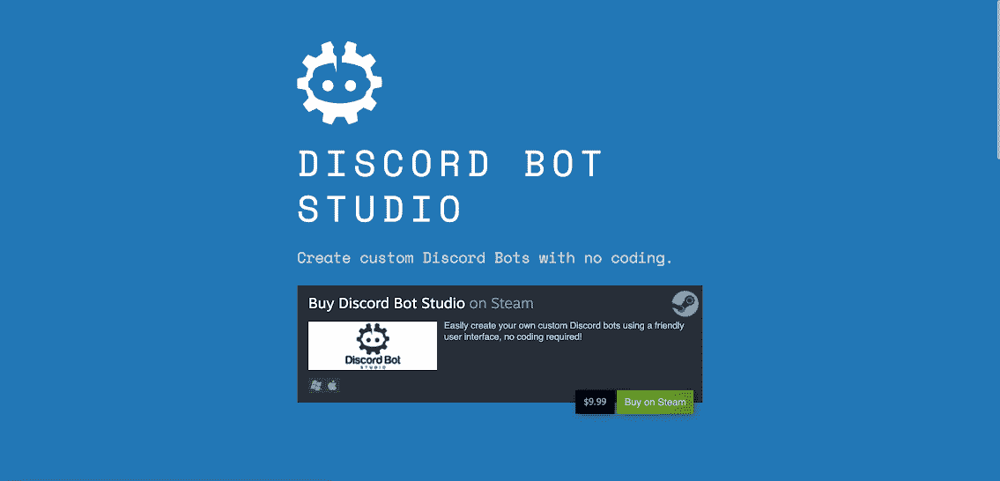
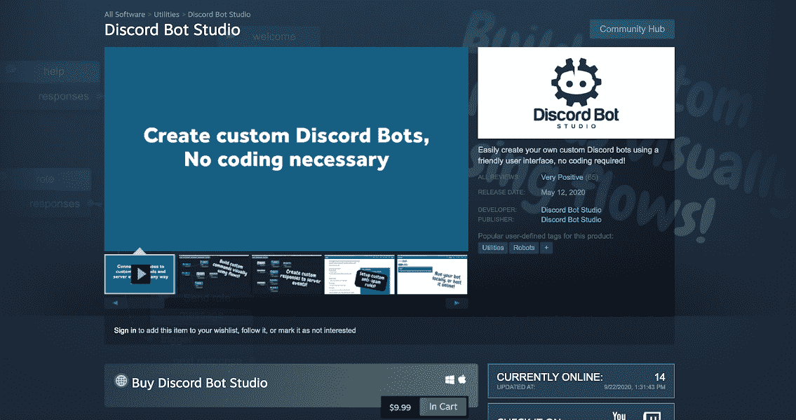
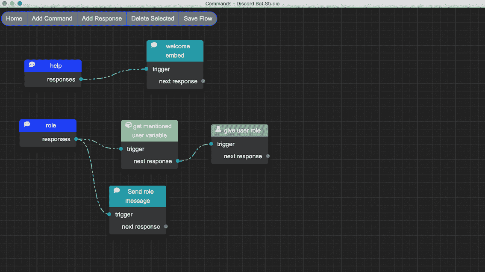
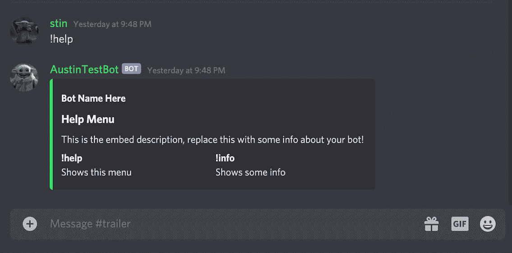

# 我如何利用我大学的最后一年来构建一个无代码的应用程序

> 原文：<https://www.indiehackers.com/interview/how-im-using-my-senior-year-of-college-to-build-a-no-code-app-95ebf25dc2>

## 你好！你的背景是什么，你在做什么？

我叫奥斯汀·雷普，是一名大四学生，学习计算机工程和工商管理。我有从事软件工程工作的经验，这可能是我毕业后开始做的事情，但我真正的长期目标是自主创业。

我是 Discord Bot Studio(DBS)的唯一创造者，这是一个在 Discord 上制作聊天机器人的可视化编程工具。这个工具允许用户使用流程图风格的编辑器创建聊天机器人，不需要编码。

【T2

自今年 5 月发布以来，DBS 平均每月收入约 2500 美元，几乎全部是利润。

## 是什么激励你开始使用 Discord Bot Studio？

大约一年前，我在市场上偶然发现了一个用于创建[不和谐](https://discord.com/)机器人的成熟工具。我立刻有了这样的印象:我可以创建一个具有更好用户体验的工具。我快速算了一下，算出我认为它们在上市后的几年里卖出了多少。我觉得这个市场足够大，也不太拥挤，所以我决定试一试。

我做的第一件事是用 [Carrd](https://carrd.co/) 创建一个登陆页面。登录页面有一些关于该工具将要做什么的信息，还有一个供人们加入邮件列表以保持更新的地方。我开始看到网站的有机流量，人们开始注册邮件列表。这给了我在 Steam 上创建软件列表的信心。Steam 是一个用于购买和玩视频游戏的平台，但他们也允许一些实用软件在他们的平台上销售。由于我的竞争对手蒸蒸日上，我也跟着做了。这最终成为一个非常有帮助的决定，因为 DBS 的大部分流量都直接来自 Steam。

找到一个能够有机地创造动力的想法。

TweetShare

当我开始在 DBS(2019 年夏天)上工作时，我对 Discord 很熟悉，但我不是它的经常用户。Discord 很大程度上被游戏玩家所使用，在这一点上我已经停止了大部分的游戏。也就是说，一个年轻版本的我将会是这个产品的目标用户，所以我对理解这个工具需要如何被展示感到很舒服。

当我开始构建数据库时，我正在完成我的软件工程合作工作。当我在 2019 年秋天回到学校时，我决定把这个项目放在次要位置。我不想为了一个我不知道会成功的项目而危及我的成绩或社交生活。

## 构建最初的产品需要什么？

当我回到 2020 年春天的合作工作时，我知道我有空闲时间(晚上和周末远离学校和朋友的干扰)和更多的动力来完成这个项目。在这一点上，我决定对产品进行大规模的返工，以使用户界面更好。这是我实现目前产品中存在的流程图样式编辑器的时候。我认为重写绝对值得投入时间，因为流程图编辑器是我的产品与竞争对手的最大区别。

作为一名开发人员，除了我的时间投资之外，我在开发 db 时几乎没有花费任何成本。整个过程中最大的成本是在 Steam 上上市的费用，为 100 美元。这让我对这个项目充满信心，因为我觉得成本如此之低，几乎没有风险。

我在晚上和周末工作，最终得到了一个我认为对封闭测试足够有价值的产品，一个月后正式发布(2020 年 5 月)。

我找到的那个原创产品现在是我最大的竞争对手！

## 你的技术是什么？

Discord Bot Studio 是一款基于 [Electron.js](https://www.electronjs.org/) 构建的桌面应用。使用电子技术让我能够将 HTML、CSS 和 Javascript 知识转移到桌面上。

该应用程序使用户能够使用可视化界面开发 Discord 机器人。生成的机器人代码然后被保存到他们的计算机上。我选择 Discord.js 作为 bot 代码的基础，因为它是这个领域中最受欢迎、文档最丰富的库。

DBS 在技术上并不是一个特别具有挑战性的产品。我面临的大部分困难都集中在完成一个如此大范围的项目和创建一个非程序员也能直观使用的用户界面上。

## 你们是如何吸引用户，让 Discord Bot Studio 成长起来的？

当我推出 DBS 的时候，邮件列表上有大约 1100 人，Steam 上有大约 4000 个愿望列表。这意味着 DBS 在第一天就卖出了 112 份，第一周又卖出了几百份。从那以后，销售额一直相当稳定，每月的净总额在 2200 美元到 2800 美元之间。

我为 DBS 获取用户的主要渠道是通过 Steam 本身。这是在 Steam 上发布的一个巨大优势，因为每天都有数百万游戏玩家在使用这个平台。我每天大约有 250-300 次访问 Steam store 页面。其中约 80%来自 Steam 搜索和建议。其余的来自有机搜索流量和来自 DBS 的 YouTube 频道的推荐。

迄今为止，给产品带来新的有机流量是最大的挑战。我尝试过内容营销，创建 YouTube 视频，甚至几个 Reddit 广告。我还尝试了[微影响者营销](https://austinrepp.com/youtubemicro/),接触了我所在领域的 YouTube 频道。我唯一看到持续流量的方法是我上传的 YouTube 视频。它们是教学视频，帮助用户了解 DBS 的不同功能。它还有一个额外的好处，那就是允许在 YouTube 上搜索一般不和谐机器人教程的人找到我的产品。这带来了一些稳定的流量，但这里的增长缓慢。

## 你的商业模式是什么，你是如何增加收入的？

DBS 的售价是 10 美元的一次性费用。蒸汽从顶部切掉 30%。损失 30%的收入令人沮丧，但我知道如果它不在 Steam 上上市，我不会卖出这么多本，所以这种权衡是值得的。自推出以来，收入一直相当平稳。迄今为止的收入数字如下:

| 月 | 收入 |
| --- | --- |
| 5 月 20 日 | 2196 |
| 2010 年 6 月 | 2781 |
| 2010 年 7 月 | 2445 |

看到需要多少销量才能获得合理的月收入，尤其是当每份拷贝只能净赚 7 美元时，这真是令人大开眼界。

## 你是大学四年级学生。你还提到有另一份工作。你是如何平衡独立黑客 DBS 的？

我可能没有很好地解释这一点，但我提到的工作是合作社。有了合作社，你可以在工作学期和学校学期之间交替。所以我没有一边工作一边上学。我发现，在工作学期中，我实际上有更多的时间来做我的兼职项目，因为我的晚上和周末没有和同龄人一起出去玩的诱惑，这在我上学时更容易做到。

当我工作的时候，我试着每天在 DBS 上完成一件有成效的事情。我发现这是一个持续、稳定进步的好方法，不会累垮。

## 你未来的目标是什么？

目前，我满足于不断尝试不同的营销策略来增加流量，进而增加收入。我每周只花几个小时在开发上，所以对于投入的时间来说，每月的收入是很大的。

实事求是地说，我不认为 DBS 有足够大的市场来产生收入，让我全职从事这项工作。我曾经想过创建一个托管服务，允许人们全天候托管他们的机器人(想想 Heroku，但只针对 DBS 机器人)。托管是有需求的，也是很多用户的痛点。这里的问题是客户是否愿意支付，或者每月支付合理的金额。也就是说，我认为不值得花时间去追求这个。

我很高兴在全职工作的同时继续支持 DBS，并在新项目出现时更加关注它们。我的目标是在 25 岁之前完全自主创业，我认为 DBS 是我开始这条道路的一个很好的方式。

## 你想做全职独立黑客，要么有 DBS，要么有未来项目。你什么时候决定这是你想做的？

我想当我开始从事我的第一份“真正的”开发工作时，我就已经决定了。我意识到朝九晚五地完成一系列我无法控制的任务可能会非常无聊。我不反对努力工作或长时间工作。我反对在标准工作中这样做，因为这样做对我没有直接好处。

## DBS 的风险是什么？你觉得在追求这个项目的过程中，有什么是你在冒险的吗？

总的来说，我认为赌注相当低。正如我提到的，我没有在这个项目上投入太多的资金，所以我唯一担心会失去的就是我的时间。我认为，当你不确定一个项目是否会成功时，很难在这个项目上投入很多个夜晚和周末。

话虽如此，我很高兴我做到了。该产品相对来说比较成功，现在处于维护模式，我根本不用在它上面花太多时间。追求这个项目并没有危及我的学业、工作前景或社交生活。如果有的话，这是一个额外的奖励，在我的简历上有这种类型的项目，因为我申请的是全职软件工程工作。

## 你面临的最大挑战和克服的障碍是什么？

我在头三个月面临的最大挑战是堆积如山的支持案例。我为 Discord 上的产品创建了一个支持服务器，用户可以在那里讨论 DBS 开发并寻求帮助。在我的脑海中，我设想这是一个用户可以互相帮助的地方，我可以退居二线。事实并非如此！我会在我的手机上收到来自愤怒用户的通知，不分昼夜。我一天要花几个小时回应用户和灭火。这是令人难以置信的压力，我知道为一个每个用户终身价值 7 美元的产品做持续的实际支持不是一个好的长期解决方案。

随着时间的推移，一些志愿者主动提出帮助支持新用户，因为他们非常喜欢使用 DBS。这让我卸下了很多负担，也是在这个时候，我意识到支持案例不值得我一直强调。我关闭了手机上支持案例的推送通知，从那以后，我只在喜欢的时候查看支持问题。

## 有没有发现什么特别有帮助或者有优势的？

对我来说，最大的好处是让 DBS 上了 Steam。我幸运地做了这个决定；如果我的竞争对手不在那里销售，我可能也不会这么做。蒸汽带来了比其他来源更多的流量。

## 你在业余时间做过什么对这个项目有贡献的事情吗？

在我的空闲时间，我经常发现自己在学习市场营销，或者关注其他独立黑客在做什么。

## 对于刚刚起步的独立黑客，你有什么建议？

我给单独创业者的最大建议是，创造一个范围足够小的产品，让你能够在几个月内完成。如果你着眼于某个巨大的事业，很可能你不会完成它。在建立 DBS 之前，我阅读了许多关于建立微型 SaaS 企业的信息，我发现这些信息很有帮助。

如果你着眼于某个巨大的事业，很可能你不会完成它。

TweetShare

此外，我认为找到一个能够有机地创造动力的想法非常重要。如果你正在努力寻找用户(这是你在构建之前和构建的时候需要做的)，那么销售产品的过程将会更加困难和令人沮丧。这显然是说起来容易做起来难，但是

我认为关键是去你的顾客去的地方逛逛，看看他们是否感兴趣。

## 我们可以去哪里了解更多？

您可以通过以下链接找到我:

*   [我的推特](https://twitter.com/AustinRepp)
*   [我的个人网站和博客](https://austinrepp.com)
*   [Steam 上的不和谐机器人工作室](https://store.steampowered.com/app/1118380/Discord_Bot_Studio/)

请不要犹豫，我喜欢讨论独立黑客和企业家的东西！

——[<picture id="ember8167285" class="user-avatar ember-view user-link__avatar"></picture>奥斯瑞普](/stin23?id=O7vv1eGNyKNZwNHLlT9nmz3VlUj1)【Discord Bot 工作室创始人

## 想像 Discord Bot 工作室一样自己创业？

你应该加入独立黑客社区！🤗

我们是几千名创始人，互相帮助建立有利可图的业务和副业。来分享你正在做的事情，并从你的同事那里获得反馈。

还没准备好开始使用你的产品吗？没问题。这个社区是一个认识人、学习和实践的好地方。随意[随便浏览](/)！

——[<picture id="ember8167290" class="user-avatar ember-view user-link__avatar"></picture>柯特兰艾伦](/csallen?id=ibTLPyjwVebnZjMGKvz6ztarnuV2)，独立黑客创始人

26votes