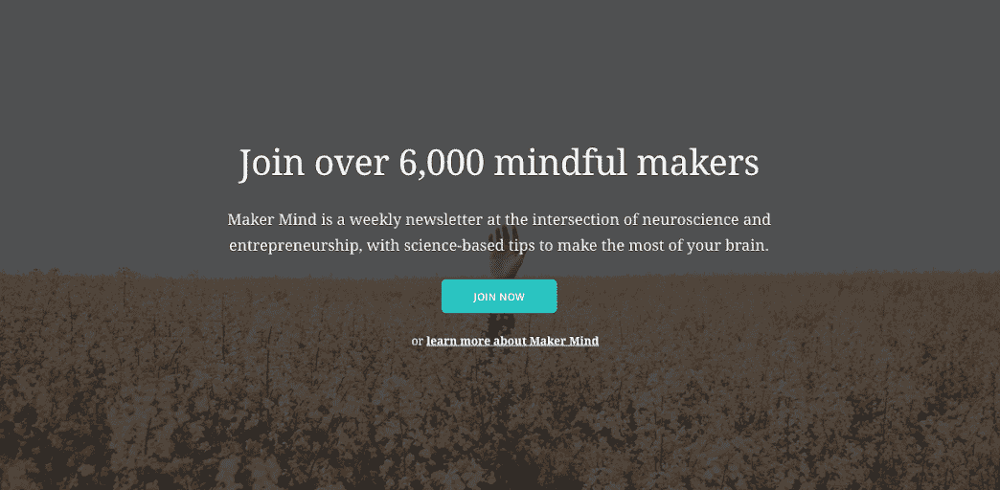
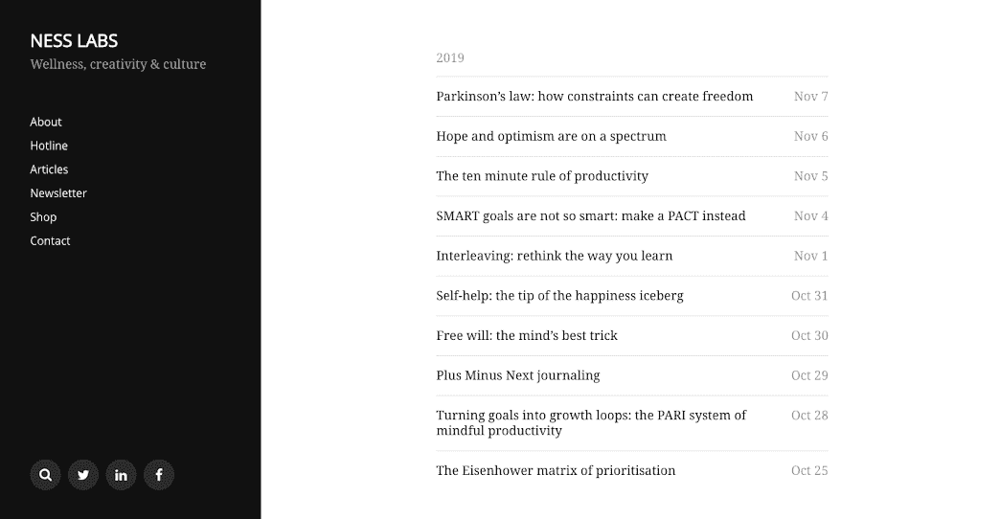
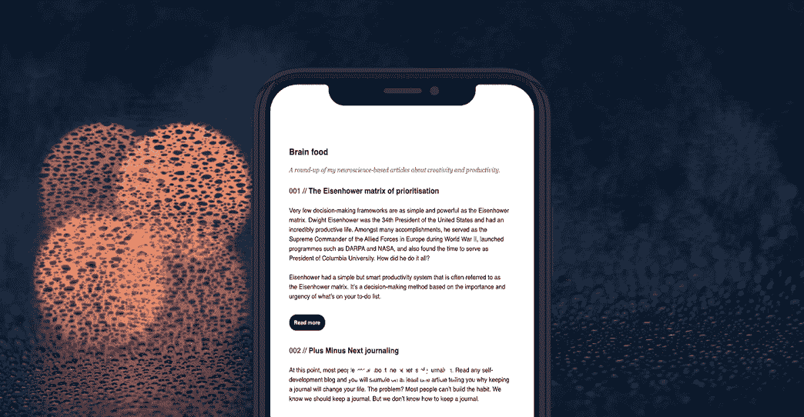

# 我如何利用神经科学来制作一份成功的时事通讯

> 原文：<https://www.indiehackers.com/interview/how-im-using-neuroscience-to-build-a-successful-newsletter-84bd561d77>

## 你好！你的背景是什么，你在做什么？

谢谢你邀请我！我是安妮-劳雷·勒康夫，我是奈斯实验室的创始人，这家公司年收入约为 8 万美元。两年前，我离开了谷歌，专注于开发产品，帮助人们过上更幸福、更健康的生活。我也是伦敦大学国王学院的一名神经科学学生，在那里我研究所有关于我们大脑工作的奇怪方式。

我正在用我在硕士学位所学的东西，以及我作为企业家的经验，来创造一些内容和产品，帮助人们实现他们的目标，而不牺牲他们的心理健康。这些产品包括 [Teeny Breaks](https://teenybreaks.com/) ，一个提醒人们在工作中休息的 Chrome 扩展，以及 [Maker Mind](https://makermind.nesslabs.com/) ，一个关于专注生产力的每周时事通讯。

发布四个月后，Maker Mind 拥有 6000 多名订户，每月收入 800 美元——与 Ness Labs 的收入相比微不足道，但却是一个令人兴奋的开始。附带的博客平均每月有大约 3 万访客。长期目标是通过课程、内容、工具和专属社区，为对专注生产力感兴趣的创客(如企业家、创造者和开发人员)创建首选目的地。

## 是什么促使你开始使用 Maker Mind？

作为谷歌员工和初创公司创始人，我都经历过精疲力竭。像许多企业家一样，我患有时间焦虑症，我总是试图充分利用我的时间。它让我成为一个非常有创造力和生产力的人，但它并不总是对我的心理健康最好的。

 

当我开始学习神经科学时，我意识到有许多基于科学的方法可以在不牺牲精神健康的情况下最大限度地提高一个人的表现。我也了解了许多关于我们大脑如何工作的神经节律。例如，很多人认为我们要么是左脑型，要么是右脑型，这是完全不正确的。

我在学习期间学到的一件事是，对你所学的内容创造你自己的版本是吸收新内容的最好方法之一。所以我决定每个工作日开始在我的博客上写神经科学和企业家精神交叉的话题。

我很幸运，我的主要业务是盈利的——今年约 8 万美元——所以我不需要马上考虑货币化。我非常支持在公共场合工作和学习，时事通讯似乎是让自己变得有责任感的好方法。我在博客上每篇文章的底部添加了一个订阅框，并致力于在一致的基础上写作。

## 构建最初的产品需要什么？

我没有花几个月的时间来构建一个复杂的产品，而是思考最简单的方法来传递价值，同时最大化我的个人成长。我已经有了一个 MailChimp 账户，所以我创建了一个新的受众群，并张贴了一张订阅表格。

我在建立[决策者思维](https://makermind.nesslabs.com/)方面所做的每一个决定都是围绕最小化摩擦，所以我会坚持下去。建立内容业务时，一致性是关键。时事通讯是纯文本的，博客使用 WordPress。这是一种价值来自内容而不是技术的产品，所以这是我关注的重点。

每天早上，我会留出一个半小时来写一篇新文章。这是我做的第一件事。封锁时间让我养成了一个习惯。如果我吃了一顿网络早餐或发生了什么事情，迫使我将写作时间推迟到一天的晚些时候，这感觉很奇怪。

对于创客思维的未来，我有很多想法，但这就是让总体想法起步的全部。

## 你是如何吸引用户和培养创客意识的？

我从第一天开始就使用一个简单的系统。我写我的每日文章，然后我把它发布在黑客新闻和推特上。第一个月，我的四篇文章登上了 HN 的头版。它为网站带来了许多访问者，其中一部分转化为时事通讯订户。我的一些最受欢迎的文章包括关于 [JOMO](https://nesslabs.com/jomo) 和[时间焦虑](https://nesslabs.com/time-anxiety)的文章。这让我在头几个月就有了大约 2000 名订户。

让你的产品尽可能快地出现在用户面前比把一切都做好更重要。

TweetShare

然后我决定[开始寻找产品](https://www.producthunt.com/posts/maker-mind)。原来，他们有一个专门的通讯类别。我建立了一个专门的登录页面，上面有订阅者的评论、截图等等，并在周一发布。这一天的大部分时间都是第一名，晚上以超过 1000 张的投票排在第二名。仅在那次发布中，我就增加了 2000 名订户，总共有 4000 名订户。

从那以后，我一直在使用各种策略把我的内容发布出去。我在脸书小组上发帖，我在 LinkedIn 上有每周文章综述，我有时在 Slack 或 Telegram 上发帖。我现在有 6000 多名订户，没有花一分钱。

但是目前最大的获取渠道——转化最好的渠道——是 Twitter。人们转发我的文章，与他们的同事分享，包括他们自己的通讯。合格的流量才能转化好。

另一件让我兴奋的事情是 SEO。这仍然是我流量的一小部分，但它正在稳步增长，与社交媒体上病毒式帖子的起伏相比，我喜欢它的可预测性。我从来没有因为 SEO 而写过一个话题，但是我用 Yoast SEO 插件优化了我所有的文章。我有几篇文章在一些长尾查询中排名第一。希望它会继续上涨。

## 你的商业模式是什么，你是如何增加收入的？

正如我提到的，我非常支持在公共场所工作、建设和学习。我在这里分享我在独立黑客、Twitter 和 LinkedIn 上的里程碑。当我有了大约 4000 名订户时，赞助商开始主动联系我。目前，我已经有了未来几个月的赞助商，使用 Stripe 每周收取 200 美元的时事通讯费。

 

我喜欢这种集客方式的原因是，赞助商已经确信这将是一种有益的合作关系，我不需要做任何艰难的推销。赞助模式也意味着我可以保持时事通讯免费，并且不出售我的订户数据，这是我永远也不想做的。

我的网站上甚至没有专门的赞助商页面。他们只是通过联系方式给我发邮件，或者回复一份时事通讯，问我他们是否会出现在下一期杂志中。如果我认为他们的产品或服务很合适，我会请他们发送副本，有时我会在他们的同意下进行一些编辑，以便更好地适应整体基调。我总是确保它对我的订户有价值。

每月 800 美元是一个很好的开始，我的成本很低，所以我有很高的利润，但这显然不足以让我从通过主营业务提供营销和产品战略服务中解脱出来。此外，虽然我已经为未来几期杂志预定了赞助商，但我不想开始一场追逐潜在赞助商的激烈竞争。我想建造更稳定、更可持续的东西。

## 你未来的目标是什么？

正如我提到的，我想使我的收入来源多样化。我已经在[开设了一家店铺](https://twitter.com/anthilemoon/status/1190667819819708416)，在那里我出售基于我所写内容的 t 恤。我目前正在根据我写的所有关于正念生产力的东西创建一门课程。虽然人们可以从我写的关于这个主题的 100 多篇文章中拼凑出大部分内容，但这将是一个循序渐进、可操作的指南，以学习如何将这些见解付诸实践。

我还想通过会员制度产生经常性收入。以后，免费会员只能接触到我每周写的五篇文章中的一部分。付费会员可以访问所有的文章，以及一个专属的工具库和关于正念生产力的内容。长期目标是建立一个整合了工具、内容和服务的平台，帮助人们在不牺牲精神健康的情况下实现目标。

这并不容易。虽然我今年学会了如何编码，而且我现在对 Node 已经相当熟悉了，但是我现在所想的比我现在所能构建的要复杂一些。但我认为这是需要的，所以我想推动并实现它。我将来可能会和某人合伙，因为我不介意和合适的联合创始人一起工作。

就收入而言，我的短期目标是将目前的人数增加一倍，并设计一个以经常性收入为核心的更稳定的商业模式，这样我仍然可以与赞助商合作，但不需要依赖他们。现在一切都在进行中，但是很难预测。

 

## 如果你必须重新开始，你会做什么不同的事？

我知道我说过这不是一个技术驱动的行业，但我仍然后悔当初选择了这个组合。我目前使用的是 MailChimp、WordPress 和 GoDaddy。这种组合既笨重又昂贵。我接下来几个月的目标之一是找时间过渡到 Mailjet、Ghost、NameCheap 和 DigitalOcean。

但我仍然认为我的方法是好的:建立第一个版本，与用户交谈，看看什么能坚持下去。我本可以花很多时间在真空中得到堆栈。既然我知道人们对内容感兴趣，那么就应该过渡到更强大、更实惠的堆栈。让你的产品尽可能快地出现在用户面前比把一切都做好更重要。

## 有没有发现什么特别有帮助或者有优势的？

最有帮助的做法是围绕我的业务建立一种习惯。早上起床，写我的每日文章，每周在同一天发送我的时事通讯。它逐渐成为你的一部分。就数字而言——访客、订户、收入——有起有落，但养成这个习惯有助于我坚持下去。它帮助我专注于产出而不是结果；着眼于长期的成就而不是短期的胜利。

除此之外，在国王学院学习神经科学可能是我目前做的最有价值的事情，但我知道不是每个人都能负担得起重返学校的费用。最棒的是网上有很多免费的内容。我真的会鼓励任何想在一个新的领域开发产品的企业家充分利用那里的所有内容。你可以轻而易举地免费获得相当于大学学位的学位。

如果你对大脑如何工作特别感兴趣——我认为任何企业家都可以从这些知识中受益——我收集了一系列关于神经科学的书籍。在 [Coursera](https://www.coursera.org/learn/learning-how-to-learn) 上还有一个关于如何学习的很棒的课程。它是免费的，也是目前平台上最受欢迎的课程。

## 对于刚刚起步的独立黑客，你有什么建议？

这似乎很明显...但是一定要开始！我[辅导过许多企业家，看到他们患上分析麻痹是很常见的。他们最终会花大量时间研究最佳解决方案，而实际上他们会通过实践学到更多东西。创业是一个持续的过程。最好的办法是现在就开始行动，并在行动中调整你的策略。](https://nesslabs.com/consulting)

最有帮助的做法是围绕我的业务建立一种习惯。

TweetShare

如果我有一些建议要与想创办时事通讯的独立黑客分享，那就是选择一个时间表，坚持下去，并在几个频道上持续分享你的作品，看看哪些表现最好。说到建立内容业务，没有灵丹妙药。制作高质量的内容，尽可能吸引更多的眼球。

## 我们可以去哪里了解更多？

我在 [Twitter](https://twitter.com/anthilemoon/) 上相当活跃——可能太活跃了，你也可以[在 Ness Labs 网站上联系我](https://nesslabs.com/contact)。

如果你对意识生产力感兴趣，请订阅[创客意识时事通讯](https://nesslabs.com/newsletter)。我很想听听你的想法，所以请在下面的评论区告诉我任何问题！

——[<picture id="ember8169718" class="user-avatar ember-view user-link__avatar"></picture>安妮-劳雷·勒康夫](/anthilemoon?id=JSPsaLo4hpWM7s2T3aovgZKfXxG2)【创客心智/ Ness Labs 创始人

## 想像 Maker Mind / Ness Labs 一样建立自己的企业？

你应该加入[独立黑客社区](/)！🤗

我们是几千名创始人，互相帮助建立有利可图的业务和副业。来分享你正在做的事情，并从你的同事那里获得反馈。

还没准备好开始使用你的产品吗？没问题。这个社区是一个认识人、学习和实践的好地方。随便去[随便浏览](/)！

——[<picture id="ember8169723" class="user-avatar ember-view user-link__avatar"></picture>考特兰艾伦](/csallen?id=ibTLPyjwVebnZjMGKvz6ztarnuV2)，独立黑客创始人

45votes