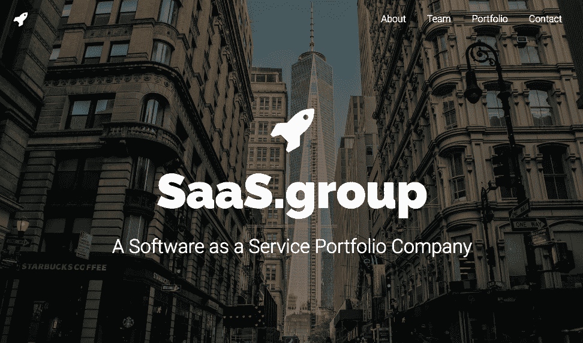
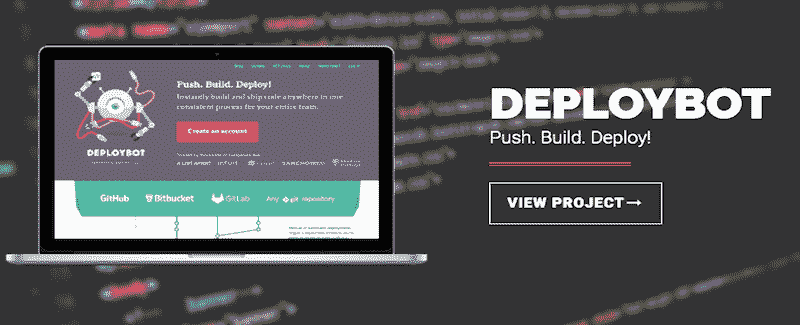
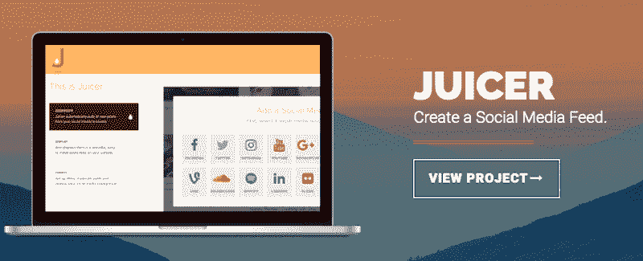
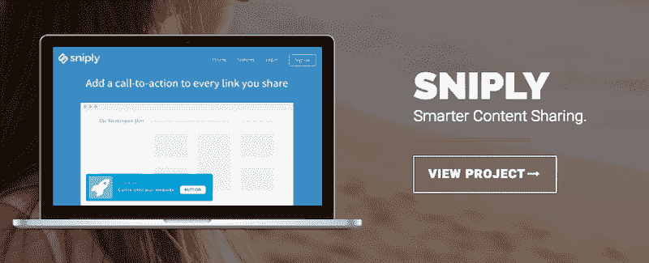

# 我是如何建立和发展独立企业集团的

> 原文：<https://www.indiehackers.com/interview/how-ive-built-and-grown-a-conglomerate-of-indie-businesses-2f745388db>

## 你好！你的背景是什么，你在做什么？

嘿！我是蒂姆·舒马赫。我的背景是互联网消费产品，做了很长时间的开发者。

当我还是个孩子的时候，我就开始开发第一台个人电脑和其他东西，并且一直是一名程序员。后来，我的兴趣开始转向商业和经济学。当我 23 岁大学毕业时，我创办了我的第一家公司， [Sedo](http://www.sedo.com/) ，一个域名市场。我做了十多年的首席执行官，把它发展到超过 300 人的规模，然后把它卖给了一家大型德国互联网集团。

在过去的八年里，我一直在做自己的项目和天使投资，其中最著名的是 [Eyeo](http://www.eyeo.com/) 。它因其主要产品 Adblock Plus 而为人所知。

在过去的两年里，我花了很多时间在 SaaS 项目上，并建立了我们所谓的 [SaaS.group](https://saas.group/) ，这是一个独立的 SaaS 项目组合。

## 你做 SaaS.group 多久了？是什么让你开始做这件事的？你是怎么想出这个主意的？

SaaS.group 现在大概两年了。我产生这个想法是因为我偶然发现了如此多的 SaaS 项目，并与许多独立的 SaaS 开发商进行了交谈，似乎很多市场都只关注那些有风险投资支持的 SaaS 大公司。他们得到了很多媒体和所有的风险投资，但也有一群非常棒的 SaaS 项目，独立开发者已经在那里投入了生命*年*。在某些时候，他们会说，“嘿，你知道，我不一定要一辈子做这个，我在这里做了一些很棒的东西，但是谁会把它带到下一个层次，谁会从我这里买呢？”

如果你是独立开发者，你需要做*所有的事情*。你需要回复客户的电子邮件，保持服务，等等。但不是每个人都想永远处于那个位置。我们说，“嘿，你知道，这个应该有市场！”

比起想出一个主意并试图创造出适合市场的产品，我更擅长将项目推向下一个层次。这就是我们如何想出这个主意的。我用我以前项目赚的钱建立了它。所以我们开始实际收购项目。

## 您能告诉我更多关于产品采购流程的信息吗？

我们有两种不同的方法去做这件事。首先是当人们来找我们的时候。这些人可能是听说过我们的人，或者更罕见的是经纪人。另一种方法是，我们主动联系那些我们感兴趣的项目的所有者。

找那些能掩盖你弱点的人，不要试图一个人做所有的事情。

TweetShare

然后有些人说他们对卖给我们不感兴趣。当然，这完全没问题。但是很多人对此感兴趣，所以我们开始交谈，开始互相了解。人们首先担心的是我们是谁，为什么我们对他们的 SaaS 感兴趣。当人们问及这个问题时，我们会很感激，因为我们不是愚蠢的金融买家，对 SaaS 行业的发展一无所知，只想快速获利。我们理解人们希望看到我们确实知道他们在做什么。而在我们这边，我们想知道业务的底细。

理想情况下，我们会在价格和过渡期上达成一致。我们非常灵活地适应不同的生活状况。我们遇到过这样的情况，人们真的想尽快离开，不管是出于什么原因——个人原因还是工作原因。我们遇到过这样的情况，人们想在船上呆很长时间，但只是不想再单独行动了。我们也有过这样的例子，人们想多呆一段时间，但最终还是培养了他们的继任者。所有这些选择都是合法的，我们关心的是帮助最初的创始人度过他们需要的任何过渡期。

## 您在销售周期中使用任何内部软件吗？

我们不想仅仅为了给人们发垃圾邮件而联系他们。因此，我们建立了一个非常棒的 SaaS 产品内部数据库，我们对它们进行分类和排名，看看哪些是我们的最佳选择。

这就是我们产生交易流的方式，开发交易流的过程是与很多人交谈。

这就好像我们为客户建立了一个网站或一个 SaaS 产品。我们与很多人交谈，验证我们的想法，接触人们，看看哪里合适。然后建了一些软件。

## 这个内部数据库的技术是什么？

我们使用了一个叫做 Forest 的数据库系统，这个系统非常好用。其余的都很标准。我们的前端是 WordPress，并没有太多的魔力。

然后是实际的项目本身。到目前为止，我们已经收购了三个项目。第一个是部署机器人，第二个是榨汁机，第三个是 Snip.ly。你可以在我的独立黑客档案中找到他们。

【T2

对于每一次收购，我们都使用他们现有的技术体系。比如我们最大的项目是基于 Ruby 的，而 Snip.ly 用的是 Python。所以技术堆栈真的取决于项目！

## 你是如何发展 SaaS.group 的？

这是一个有趣的问题，因为我认为这是我们不同于其他项目的地方。我们主要通过购买额外的项目来实现有机增长。但是我们也试图通过发展每个独立的项目来发展它。

我们做的任何营销，通常都是内容制作和 SEO。但一般来说，我们只是依赖于进一步改进产品。有时我们会发现一些被忽视的项目。因此，人们将其置于维护模式，然后是我们试图重振这些项目。

## 你会如何描述你的商业模式？

我们的三项业务都是标准 SaaS 定价的经典 SaaS 产品。所以我们有订阅收入。通常的套餐从每月 20 美元到数百美元不等。我们总是试图将免费用户转化为付费用户，试图追加销售，试图保持低流失率。

我们的每一项业务本质上都和其他业务一样。总的来说只是各部分的总和。

## 你未来的目标是什么？

其中一个目标是为独立开发者创造一个好的家园，这些独立开发者要么希望帮助他们的项目更上一层楼，要么在某种程度上已经厌倦了。

其中一个目标是将我们的公司组合扩大到 10 家，然后更多。我们模式的好处是所有的公司和项目都相当独立地运作。这样你就不会陷入大公司的结构中。

疯狂分享你的想法。没有人会窃取你的想法。

TweetShare

我喜欢把它想象成船！我们有许多小型船只，而不是一艘大型油轮，几年后，我们希望拥有一支完整的船队，一切都很好，发展很快。

## 你在起步时遇到的最大挑战或障碍是什么？

我们看到的障碍之一是找到合适的人来经营这些业务。独立开发者的伟大之处在于他们是超级多面手。我的意思是，他们必须做每件事，而且必须做得相当好。编写网站代码，做一些基本的营销，管理销售，回复客户服务邮件，然后当然是编写繁重的后端代码。因此，最困难的事情是找到那种多面手来取代想要出售的创始人。

我们已经找到了一些很棒的人，但实际上要找到合适的人，能够以极大的热情追随一位企业家多年来所做的事情，比我们想象的要难。

## 如果你必须重新开始，你会做什么不同的事？

好问题。我可能会在各自的产品团队中投入更多的资源。我认为我们有时太过谨慎——我们太过小心不要让团队负担过重。如果有一个独立的开发人员，并且这个人被转移出去，他们戴着这么多的帽子，有时你需要更多的资源。

我们应该不那么害怕投入更多的资源，更快地投入到各自的项目中。

## 你有没有发现什么特别有用或有利的东西？

我读了不少书，而且我是 SaaS 杂志的忠实读者，这是一本杂志。我非常喜欢像独立黑客这样的社区，尤其是那些在我们寻找的产品类型和从事我们喜欢的工作的开发人员方面非常专业的社区。这两个都非常有帮助。

【T2

## 你以前出售过其他企业。你从那些项目中学到了什么并继续应用了吗？

完全同意。我认为我以前学到的一个主要技能是如何扩展事物。在早期阶段确定产品与市场的契合度方面，肯定有比我更好的人。

但是我在我之前的公司学到的一个技能，因为他们肯定要大得多，就是在某些时候你需要在你的项目中的所有东西后面放一些专业的结构。独立开发人员的心态真的很强，它将确保你有一个真正高效的机器，但它只会带你到此为止。在某些时候，你需要开放招聘，即使只有几个员工。如果你不这样做，那么在某个时候你会碰到天花板，竞争对手会来改变你的领域，没有什么是永恒的。

知道你擅长什么，知道你在哪里需要别人来弥补你的弱点也很重要。我认为这是每个人都应该思考的核心问题之一。找那些能掩盖你弱点的人，不要试图一个人做所有的事情。

## 你对那些刚刚起步或者想要创建这样一个企业的独立黑客有什么建议？

公开你的模型——和人们谈论它，不要保密。没有什么想法是超级特别的。我认为当你开始你的项目时，通常会认为只有你一个人在做。然后你越深入一个行业，你会突然发现有很多其他人在做同样的事情。

一个想法本身真的没什么价值，但值得和很多人交流。验证你的想法，听取反馈，传播信息，认可你的产品，这比保密重要得多。

所以疯狂分享你的想法吧。没有人会窃取你的想法。

## 我们可以去哪里了解更多？

我们的网站是 [SaaS.group](https://saas.group/) 。就我个人而言，我在[推特](https://twitter.com/TimSchu)上相当活跃。

如果你有任何问题或者想了解更多，请在下面的评论里问我！

——[<picture id="ember8056549" class="user-avatar ember-view user-link__avatar"></picture>迪姆·舒马赫](/TimSchu?id=mcZUcBgL1eYoXjMj60df9Ua6Sbk2)，SaaS.group 创始人

## 想像 SaaS.group 一样建立自己的企业？

你应该加入[独立黑客社区](/)！🤗

我们是几千名创始人，互相帮助建立有利可图的业务和副业。来分享你正在做的事情，并从你的同事那里获得反馈。

还没准备好开始使用你的产品吗？没问题。这个社区是一个认识人、学习和实践的好地方。随意[随便浏览](/)！

——[<picture id="ember8056554" class="user-avatar ember-view user-link__avatar"></picture>考特兰艾伦](/csallen?id=ibTLPyjwVebnZjMGKvz6ztarnuV2)，独立黑客创始人

46votes