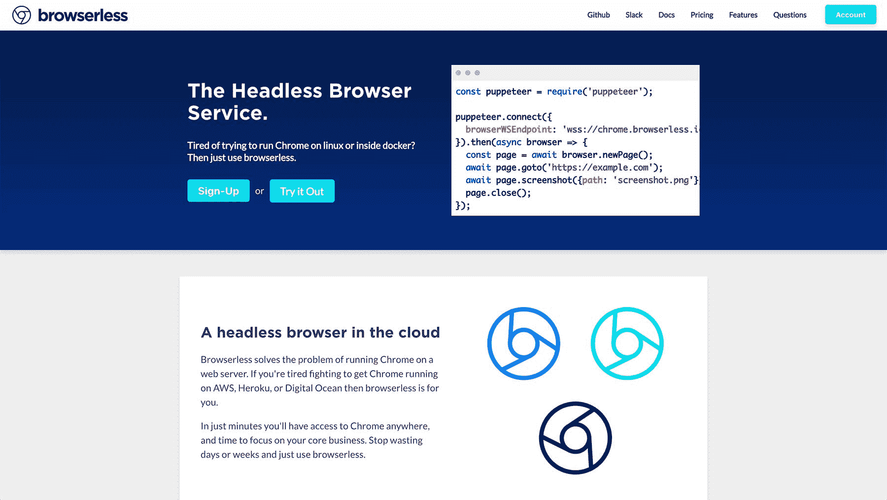
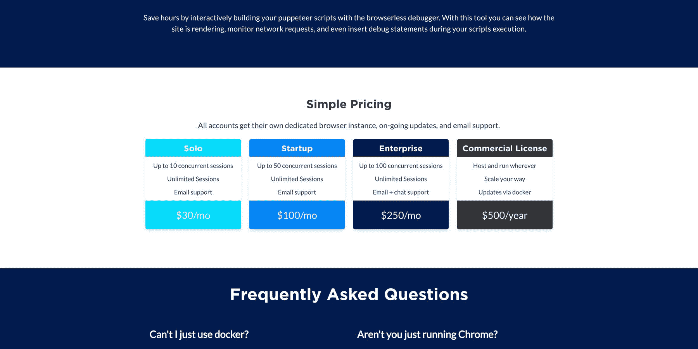
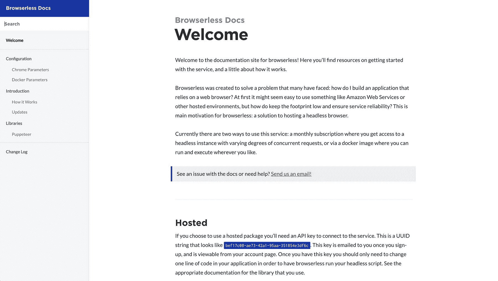

# 我如何将我的无头浏览器业务发展到每月 1000 美元

> 原文：<https://www.indiehackers.com/interview/how-ive-grown-my-headless-browser-business-to-1-000-mo-6abb96ab8a>

## 你好！你的背景是什么，你在做什么？

嘿朋友们！我是乔尔·格里菲斯，[无浏览器](https://www.browserless.io/)创始人。我是一名全职软件工程师，已婚，是两个孩子的父亲，是一名失败的爵士小号手，也是我第六个项目的 soloprenuer。我甚至可以说我是一个连续的失败者，因为我之前尝试过的五个左右的项目收益很低或者没有收益，我认为让人们听到这一点很重要，因为这有时就像中了彩票。

无浏览器只是一种无浏览器服务，仅此而已。如果你经常看黑客新闻，你可能听说过无头浏览器——如果没有，它是一种不用任何图形界面就能运行网络浏览器的方式。这有相当多的用途，包括网页抓取、测试网站、生成截图和打印 pdf。无浏览器使得做所有这些事情变得很简单，不需要花费很多时间来正确设置 Chrome。如果你搜索一下流行的无头库，你会毫无疑问地看到人们在尝试这样做时所面临的所有问题。

自从我大约三个月前推出以来，它一直在稳步增长，到目前为止，我从大约 15 个付费客户那里看到了大约每月 800 美元的经常性收入。

 

## 是什么激励你开始使用无浏览器？

这可能会令人震惊，但我实际上从未打算建造[无浏览器](https://www.browserless.io/)。我最初在做一个愿望清单应用程序，用户可以从网上粘贴他们想要的不同东西的链接，然后与他们的朋友和家人分享。我有一个[节点](https://nodejs.org/en/)程序，它将加载用户提交的网站并抓取所有适当的细节——相当简单。然后我在一个大品牌网站上测试了这个，很快就失败了，因为他们运行的是一个所谓的单页应用程序，它的初始 HTML 中没有任何内容。这是一个相当大的阻碍，需要我运行一个网络浏览器来加载他们的页面，以便抓取内容。

几乎在同一时间，Chrome 发布了一个 headless mode，然后我为它写了一个开源库，以便在我的 wishlist 项目中使用。这个名为 [navalia](https://github.com/joelgriffith/navalia) 的库在 GitHub 上获得了一些良好的牵引力，并最终引起了 [chromeless](https://github.com/graphcool/chromeless) 和[木偶师](https://github.com/GoogleChrome/puppeteer)的注意。

如果你看到一些你擅长的热门事物，尽你所能抓住它。

TweetShare

当我积极参与这些项目时，我注意到一种趋势，即开发人员在试图让他们在生产环境中工作时有令人沮丧的经历。让 headless Chrome 在 Heroku 或 T2 的 AWS 上运行并不容易或迅速，当你成功时，像字体这样的东西看起来并不好或根本不起作用。我开始寻找任何一种我可以亲自使用并推荐给这些用户的无头浏览器提供商——但是一个也没有。

所有这些不同的事件在我与马修·穆勒交谈时达到高潮，他是[单口相声杰克](https://standupjack.com/)的创始人，他直截了当地说，“你为什么不做一个无头服务来做这个？”这是推动我破土而出的“啊哈”时刻。

## 构建最初的产品需要什么？

因为我对这些项目有很好的理解，我确切地知道要建造什么，我希望在几个月左右完成，因为我没有接受任何形式的资助。

我也不想为任何外部帮助付费，因为我在这方面的投入实际上是 0 美元。这种类型的思维模式与我产生了很好的共鸣，因为它迫使我快速行动，而不是在诸如框架选择和技术堆栈这样的琐事上搅动。我记得我经常对自己说，“它不一定要完美，只要能工作就行了。”我认为这对工程师来说非常重要，因为我们似乎都被灌输了“只制作漂亮、优雅的代码”没门，伙计。如果它有效、安全并能产生收入，那才是最重要的。

从那以后，我决定*而不是*尝试为这个项目学习任何新的技术。我使用了我能尽快使用的工具，对我来说，这意味着完全使用 JavaScript，因为我主要是一名前端开发人员。缩放和帐户管理是唯一真正留下来的东西，谢天谢地，有一些很好的资源。

我使用 Stripe 进行支付处理，使用 DigitalOcean 满足所有硬件需求，使用 GitHub 进行版本控制，使用 Docker 托管图像和进行构建。对我来说，最大的未知是支付和硬件。Stripe 使支付处理变得非常简单，尤其是在测试环境和订阅方面。DigitalOcean 也成为一个重要的组成部分，因为它允许我在每次有人注册或取消时管理新的实例，这意味着我不会为未使用的硬件买单。

然而，对我来说最大的困难是时间。我有一个妻子，两个年幼的孩子，还有一份软件工程师的全职工作；所以时间非常紧张。为此，你必须非常有斗志，利用你能利用的一切:在每个人都睡着后工作，在飞机上编码，在你不能真正编程的时候用手机组织。甚至当我通勤上班时，我也会听[独立黑客访谈](https://www.indiehackers.com/podcast)，当我实际上不会编程时，我会尽可能多的尝试和吸收。我想我已经听了三遍之前的剧集了，而且我还在不断地学习。

我记得有几次，我在无浏览器工作中睡着后，在笔记本电脑上醒来。这显然是不可持续的，但有时你不得不竭尽全力。

 

## 你们是如何吸引用户，成长为无浏览器的？

第一批初始用户是我在木偶师、chromeless 和 navalia 上合作过的开发人员。最初的几个客户已经排好了队，这有助于我确认这个想法是合理的，并激励我启动这个项目。我一上线就发布了大多数常见的问题:黑客新闻、reddit 和一些 GitHub 问题。我很快发现，由于这项服务的受众很少，大型网站似乎并不太在意。我做了*没有*头版，也没有在任何地方出现。起作用的是在 StackOverflow 和 Github 上回答人们的问题——即使这并不意味着立即转化，但它开始创建一些到网站的反向链接，这至少有助于 SEO。

大约几个星期后，我开始看到越来越多来自我提到的那些图书馆的用户购买订阅。事实上，第一个客户买了我最贵的方案，这让我有动力出货。接下来的几天，我开始收到来自 CTO 和开发人员的询问，其中一些人立即购买了订阅，其他人我只是回答问题。我试着做了一段时间的广告，这确实带来了更多的流量，但是相对于产生的价值来说是昂贵的。从那以后，我几乎没有做过任何广告。

一旦我和几个客户有了一些“进展”，我开始更频繁地写关于如何在介质上用无头 Chrome 完成某些任务。偶尔，我会展示[无浏览器](https://www.browserless.io/)如何让这些任务变得更容易，这导致了更多的转换和查询。我不认为这个过程从长远来看一定是可扩展的，但是我的感觉是口碑会传播一点，headless Chrome 将开始获得比旧技术更多的牵引力。

我认为即将推出的几个特性将帮助新用户更快上手，并拥有更好的开发人员人机工程学，我相信这将有助于推广。这种类型的业务的好处是几乎没有竞争，所以我没有看到很多用户流失。然而，缺点是，在你找到它所解决的问题之前，你通常不会知道或需要无浏览器。正因为如此，我真的试图专注于一个高度抛光的产品和文档，以便它继续脱颖而出。

我想向其他人强调的一点是，如果你的产品的利基市场很小，不要期望得到太多的关注，至少在最初。即使现在，browserless 每天也只能看到大约 50 个用户，坦白地说，这算不了什么。我认为重要的是，它解决了这些人面临的一个问题，所以这 50 个用户已经进入了转化漏斗。正因为如此，你不需要一天 100k 个用户就能让你的产品成功(虽然它确实有帮助)，你只需要很好地了解问题，以及在哪里找到沮丧的用户。

| 月 | 客户 |
| --- | --- |
| 2017 年 11 月 | 6 |
| 2017 年 12 月 | 13 |
| 2018 年 1 月 | 20 |

## 你的商业模式是什么，你是如何增加收入的？

当谈到货币化时，我几乎窃取了像 [Ghost](https://www.indiehackers.com/businesses/ghost) 和 [Sidekiq](https://www.indiehackers.com/businesses/sidekiq) 这样的项目所使用的模式。基本上，[通过两种方式赚钱:](https://www.browserless.io/)

1.  出售公司许可证，以便用户可以使用他们自己的基础设施。
2.  销售不同层级的托管计划。

托管计划占了我无浏览器收入的大部分。我的假设是，大多数开发人员并不真的想花大量的时间提取图像，并为这类工作准备好基础设施。他们遇到了一个问题，只需要快速见效的东西，因为这不是他们的核心业务，也不是他们正在解决的问题。对于托管计划，大约需要五分钟就可以让一切运行起来，这是完全自动化的，然后就可以开始了。

托管计划显然利润更低，因为无浏览器需要租赁基础设施。每当有新用户注册时，我都会使用 DigitalOcean API 来启动一个 droplet，并为它提供所有需要的软件。这确保有足够的规模来满足需求，并帮助我更好地预测成本和长期利润。由于这种策略，我可能会过度租用硬件，因为不是每个用户都会 100%利用他们的帐户，但它确保了可用性，并有助于保持会话隔离，这一直是一个问题。

起初，我很难向用户收费，我相信这里的许多人都能理解。由于这种抑制，我运行了一个封闭的测试版，运行了近三个月…当我只打算它是一个。我希望我能早点开始收费，我记得有一个用户甚至提到“让我知道，这样我就可以为你出色的服务付钱了。”工程师们，我自己也感到内疚，似乎把太多的时间和精力放在了解决问题上，以至于忘记了经营企业的所有其他事情——也就是赚钱。这是我认为大多数人必须学习的课程之一，尽管他们已经被告知很多次了。我肯定要付出惨痛的代价。

| 月 | 收入 |
| --- | --- |
| 2017 年 11 月 | 340 |
| 2017 年 12 月 | 650 |
| 2018 年 1 月 | 1000 |

## 你未来的目标是什么？

关于[无浏览器](https://www.browserless.io/)最好和最坏的事情就是它有多新，多不为人知。因为这可能是第一个无头浏览器服务，所以没有做什么的大纲。因此，有大量的教育进入服务如何工作，最初我不希望这是一个小问题，所以我希望像新的无服务器工作流这样的事情将有助于缓解这一点。

我还想继续为那些在基础设施中使用无头浏览器的大型消费者提供服务。我无法计算我在日常工作中花了多少时间来调试或修复无头工作流，这比任何无浏览器计划都要花费公司更多的钱。

预测逐月增长，到年底达到 100 个付费用户会很好。为了实现这一目标，我加倍投入了我的文档和博客/内容营销，并向我知道可以从该软件中受益的公司发送了更多冰冷的电子邮件。

我认为最后一点是，允许不同平台的第三方集成将是非常棒的，这是无服务器将有所帮助的。Zapier 和 even IFTT 将很容易整合，一旦无浏览器更易于外部访问，我觉得这将为更多用户打开大门。

 

## 你面临的最大挑战和克服的障碍是什么？

就像其他人在这里说的一样:“向你的用户收费。”在晚上和周末没有收入的时候，继续努力是很困难的，尽管如果我做得好的话，T2 本可以做得更好。没有比看到第一笔存款打到你的银行更好的感觉了，我认为这是最大的认可。

我认为我现在面临的最大挑战是找到用户。我知道问题就在那里，我知道人们正在寻找答案，但这是一个教育和获得正确信息的问题。我正试图通过记录最佳实践和常见问题，用这种柠檬制作一些柠檬水。围绕[创建一个无浏览器](https://www.browserless.io/)社区可能对它的成功至关重要，这也是我正在努力寻找的出路。

## 有没有发现什么特别有帮助或者有优势的？

如果你正在读这篇文章:你已经找到了一个有用的资源！来自独立黑客的建议是无价的，我无法想象我因此节省了多少时间。还有大量优秀的技术可以让你很快上手。我强烈建议使用 Stripe、DigitalOcean、Docker、Github 和 Netlify 来帮助你实现项目目标。付费套餐非常便宜，而且物有所值。

我还觉得，获得能产生收入的东西肯定有一点偶然性。我只是*碰巧*需要一个库，写了一个，找到了用户，并且有远见把它做成一个生意。这种情况不会经常发生，所以如果你看到一些你擅长的热门事物，尽你所能抓住它。

## 对于刚刚起步的独立黑客，你有什么建议？

根据评论或反应对你最喜欢的开源项目的问题进行分类，看看你能构建和赚钱的是什么。举个例子，如果 Ghost 博客平台只是一个开源博客会怎么样？你可以很容易地创建一个托管版本，并开始自己赚钱，这些家伙正在杀死它。我确信还有很多其他数据库、框架和其他很酷的东西可以被做成合适的托管服务——只是没有人这么做。

我之前尝试过的五个左右的项目收入很少或者没有收入，我认为让人们听到这一点很重要。

TweetShare

我能给的另一个建议是——在这里已经给过无数次了——去做吧。建造一些你希望存在但不存在的东西，并把它建造好。你不仅会有激情，而且你还会知道到底要建造什么。对我来说，我一直觉得无头浏览器真的很有趣，并且知道我自己作为一个开发者想要什么，所以我就做了这个。

## 我们可以去哪里了解更多？

你可以在推特 [@browserless](https://twitter.com/browserless) 查看更多无浏览器更新。或者可以直接在 [@griffith_joel](https://twitter.com/griffith_joel) 关注我！谢谢你邀请我。

——[<picture id="ember8165233" class="user-avatar ember-view user-link__avatar"></picture>乔尔·格里菲斯](/jgriffith?id=IWNGfS2puAZNdWeo0shLFdDJcRt1)，无浏览器的创始人

## 想像 browserless 一样建立自己的事业？

你应该加入独立黑客社区！🤗

我们是几千名创始人，互相帮助建立有利可图的业务和副业。来分享你正在做的事情，并从你的同事那里获得反馈。

还没准备好开始使用你的产品吗？没问题。这个社区是一个认识人、学习和实践的好地方。随意[随便浏览](/)！

——[<picture id="ember8165238" class="user-avatar ember-view user-link__avatar"></picture>柯特兰艾伦](/csallen?id=ibTLPyjwVebnZjMGKvz6ztarnuV2)，独立黑客创始人

68votes