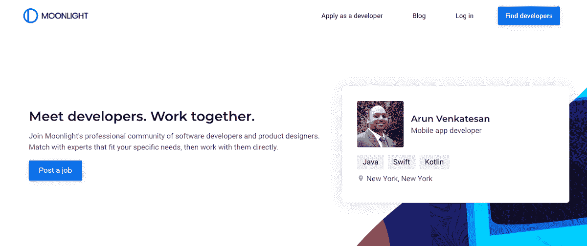
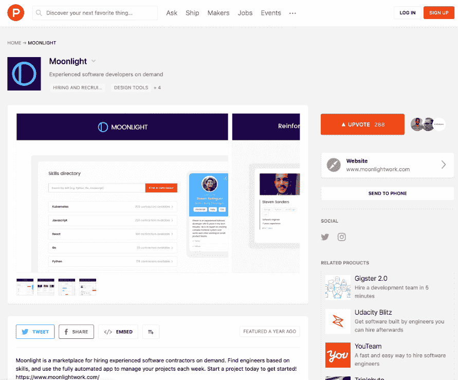
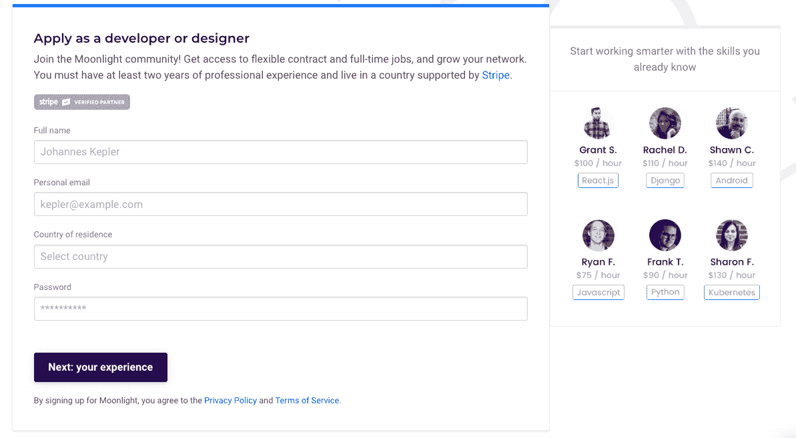
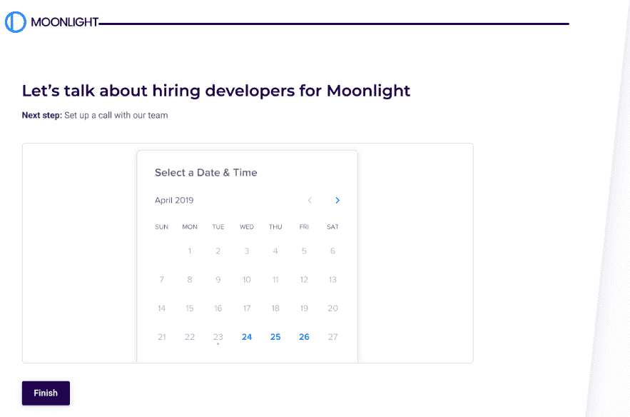
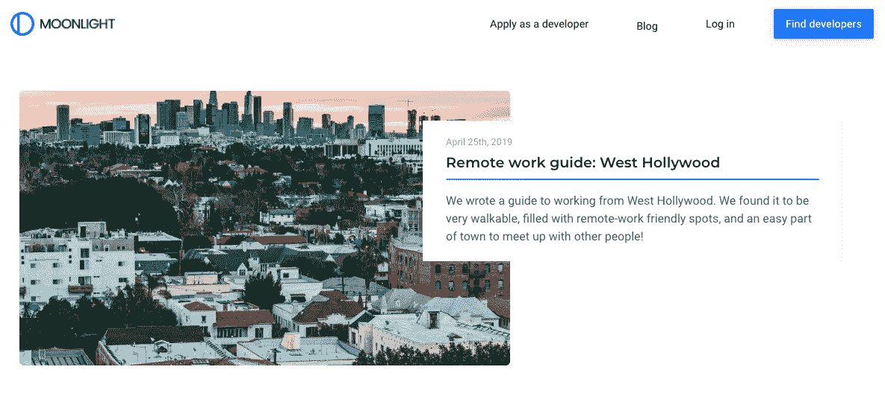

# 推出会员模式如何让我们的收入增长了 300%

> 原文：<https://www.indiehackers.com/interview/how-launching-a-membership-model-grew-our-revenue-by-300-8f8335167a>

## 你好！你的背景是什么，你在做什么？

我是艾玛·劳勒，[月光](https://www.moonlightwork.com)的联合创始人。我在旧金山生活了四年，在 Fitbit 这样的初创公司做产品设计师。2017 年 5 月，我和我的联合创始人辞掉工作，离开湾区，去世界各地的城市生活，建立月光。

Moonlight 是一个软件开发人员的专业社区。我们的使命是帮助世界一起工作，我们通过匹配公司和开发者的工作来做到这一点。我们两年前创立了这家公司，如今仍然是一个靠自我创业、靠拉面盈利的两人团队。

最初，我们通过在市场交易中加价来赚钱。我们意识到人们正在利用 Moonlight 上的合同工作来雇佣全职员工，所以我们重新推出了 Moonlight 作为一个会员社区。现在，公司支付每月或每年的订阅费，以获得开发人员匹配、采购工具和我们的每周发票产品，但对开发人员是免费的。

自从推出订阅会员以来，我们已经看到付费用户周环比增长 19%，参与度增长 79%。

 

## 是什么促使你开始接触月光？

在我们创办 Moonlight 之前，我的联合创始人 Philip 正在他创办的最后一家名为 [Staffjoy](https://www.staffjoy.com/) 的初创公司工作。他能够从优步和 HotelTonight 这样的公司雇佣高级工程师，让他们成为兼职承包商。他了解到，在求职者准备跳槽之前让他们参与进来，可以让每个人决定他们是否喜欢在压力较小的情况下一起工作。

在讨论了一些最初的商业想法后，我们买了一个域名，在 [Squarespace](https://squarespace.com) 上做了一个简单的登陆页面，带有[类型的表单](https://typeform.com)，新用户可以加入。我们给 1000 名软件开发人员发了电子邮件，请他们加入 Moonlight，通过做短期软件项目赚钱。我们有 18%的人从冷冰冰的电子邮件转为注册，这验证了我们最初的假设。相比之下，Staffjoy 的出站电子邮件的注册转化率约为 0.5%。

出于个人和职业原因，菲利普和我都希望离开湾区，以数字游民的身份生活和工作。每隔几周就要在 Airbnbs 之间搬家，这意味着我们需要建立一个可以在任何时区运营的业务。这些限制迫使我们开发远程友好和异步的工具。

## 构建最初的产品需要什么？

我们创办 Moonlight 是作为一个市场，帮助开发者在业余时间寻找兼职项目赚钱。开发人员会注册并给我们他们的工作偏好和背景。公司会发布职位来寻找可以雇佣的开发人员。

在写一行代码之前验证你的想法。你可以走得很远，不需要任何自动化就可以开始赚钱。

TweetShare

“产品”的第一个版本是一个手动过程，我们没有写一行代码就一起黑了出来。我们将现有的 Typeform 注册连接到 [Zapier](https://zapier.com) 中，通知我们新项目的情况。然后，我们会制作一个谷歌表单来收集建议，并通过电子邮件发送给我们电子表格中的匹配候选人。一旦客户雇佣了承包商，我们使用另一个谷歌文档制作开发人员时间表，使用[付费实验室](https://paidlabs.com/)手工开具每周发票，并使用[应付款](https://payable.com)向开发人员付款。在实现自动化之前，我们处理了第一笔 10 万美元的商品总量。我们通过在开发商发送的每张发票上增加 15%的加价来赚钱。

在开出我们的第一批发票后，我们知道我们需要自动化这个过程，所以我们开始设计和开发一个应用程序。我们首先制作了一个新的主页来取代 Squarespace。然后，我们慢慢地开始用代码替换 Google Sheets 和 Typeforms。首先，我们构建了开发人员入职，然后我们编写了与支付的 [Stripe Connect](https://stripe.com/connect/) 的集成，然后我们构建了开发人员档案和搜索，然后我们添加了发票，然后我们添加了公司注册。在这个过程中，我们在应用程序的每个部分都准备好的时候发布，所以我们的网站是手动流程和自动化流程的混合体。

2018 年 3 月(获得第一个付费客户后约 9 个月)，我们推出了 [Moonlight on Product Hunt](https://www.producthunt.com/posts/moonlight-3) 。开发者可以申请匹配工作，公司可以加入发布工作。一旦项目开始，Moonlight 管理每周的发票和付款。

## 你们是如何吸引用户，壮大月光的？

当我们在 2018 年 3 月推出 web 应用程序时，我们使用了产品搜索、[黑客新闻](https://news.ycombinator.com)和我们的邮件列表的组合来获得注册。我们的开发者和创业创始人用户群在互联网论坛上花费了大量时间，因此我们在这些渠道上取得了多次成功。

我们已经从每次发布中看到了参与的步骤。看看我们关于新客户注册的数据趋势，这是一个很好的提醒，提醒我们在一年中经常进行公开发布。2018 年 3 月的第一次产品搜索发布导致了我们一天内最多的注册。我们继续在 Product Hunt 上发布重大更新或产品(始终使用 Ship 功能提前计划)。我们在[创建客户贴纸包指南](https://www.moonlightwork.com/blog/publish-your-sticker-pack)中详细介绍了我们的发布流程。

 

我们还每周进行内容营销，以推动全年的持续参与。

最近，我们推出了一个名为 [Broadcasts](https://www.moonlightwork.com/broadcasts) 的功能，当符合标准的开发人员正在积极寻找工作时，它会向公司发出警报。这种内容得到了公司和开发者的高度参与，因为这是他们在其他地方得不到的东西。电子邮件营销对于增加我们的网络效应和保持现有用户参与社区至关重要。

我们的核心营销工具包括:

*   **每周简讯**:每周二，我们会给所有开发人员和招聘经理发一封电子邮件。它一半是人工的，一半是算法的——我们为每个用户组编写个人介绍，我们的系统为每个用户生成定制的匹配和更新。

*   [月光博客](https://www.moonlightwork.com/blog):我们采访社区中的开发者和公司，报道令人兴奋的技术趋势，分享分布式工作和招聘的最佳实践。

*   随着我们对 Moonlight 产品的迭代，我们发布了对 Headway 的修改。一系列的更新让我们保持动力，并让我们的社区知道我们已经建立了什么。

*   [每周社交媒体帖子](https://instagram.com/moonlight_work):我们有一个社交媒体内容日历，让我们在一周内多次发布品牌信息。

*   **社区论坛**:我们有一个反映月光应用的 Slack 社区。我们在 Slack 上构建了这个工具，因为我们的用户每天已经在那里花了很多时间(在这里[阅读更多信息](https://www.moonlightwork.com/blog/announcing-full-messaging))。最终，这将变成一个更重要的月光论坛，帮助远程公司和员工访问分布式社区。

*   [推荐计划](https://updates.moonlightwork.com/referrals-invite-and-earn-$500-87747):我们有一个推荐计划，我们向用户支付推荐新客户的费用(当他们推荐新的开发人员时，还会送赠品)。推荐帮助我们建立一个更可持续的人际网络，这些人会长期留在我们身边。

## 你的商业模式是什么，你是如何增加收入的？

迄今为止，Moonlight 一直是自筹资金的，这意味着收入一直是我们的核心关注点。对源源不断的资金的需求迫使我们保持精简，并寻找最直接的方式来获得牵引力。

当 Moonlight 推出时，我们正在处理公司向开发者支付的款项。我们在每小时工作的价格上增加了 15%的加价。公司给我们发工资，但是收入不稳定。有些星期，我们赚的钱远远超过了生存所需，而有些星期，我们几乎没有达到目标。这种收入策略还要求我们控制工作流程，并花大量时间将员工留在市场中。

我们也开始看到公司以一种我们没有预料到的方式使用月光。在延长全职工作之前，他们用月光项目对开发人员进行一两周的评估。

人际关系让我们更容易与用户保持一致。快乐的顾客创造网络效应！

TweetShare

到 2018 年底，我们参与度最高的客户之一希望在三周内雇佣三名开发人员。他提议我们给他无限制的雇佣权，以换取年度会员资格。我们测试了年度合同，发现它增加了参与度，允许公司雇佣多个开发人员，并使我们成为他们需要雇佣人员时的首选。

这一成功促使我们改变了定价模式，从付费加价转变为通过订阅提供无限制的访问。现在，公司可以加入 Moonlight，成为月度或年度会员。

随着价格的变化，我们已经能够将 Moonlight 作为一个产品而不是一个市场来发展。从注册到付费的渠道现在简单多了。因为没有雇佣成本，招聘经理把兼职作为主要的招聘工具，而不是备用。我们的数字也反映了这一点——我们的 MRR 在过去四个月中几乎翻了两番。

 

## 你未来的目标是什么？

月光的使命是帮助世界共同建设未来。我们希望看到每个知识工作者加入我们的分布式社区。我们从软件开发人员开始，但计划将其扩展到人们在线工作的所有行业。

今年，我们将推出产品改进，使公司招聘更容易、更快捷。我们正在开发更智能的工具系统，因此分散的团队可以一致地寻找候选人，制定长期的招聘策略，并查看他们的职位和通信数据。

另一个焦点是改善开发者社区。无论某人是否准备好了一份新工作，需要学习新的技术技能，或者寻找远程同事，他们都可以在月光下找到。与公司、编码学校、共同工作空间和开源项目的合作都将是我们战略的一部分。

向会员制订阅模式的转变，让我们能够自由地对业务前景进行更长远的思考。我们很高兴以任何可能的方式帮助客户实现他们的目标，而不控制他们使用我们的工具或与网络中其他成员的关系。

## 你面临的最大挑战和克服的障碍是什么？如果你必须重新开始，你会做什么不同的事？

公司和开发人员擅长合作，他们都有适合自己的独特流程。我们花了一年多的时间试图说服公司，他们应该使用我们的管理系统与承包商合作进行短期项目。当我们倾听客户的意见时，我们了解到他们需要一个更加开放、透明的平台。这种学习引导我们走向会员制模式，它开启了如此多令人兴奋的机会。

现在，我们试图每周与尽可能多的用户通话。我们通过在入职流程的不同流程中嵌入日历表单来做到这一点。人际关系使得我们的激励措施和产品时间表更容易与我们的用户保持一致。快乐的顾客也创造了网络效应！

 

## 有没有发现什么特别有帮助或者有优势的？

我们很幸运能够过上我们通过品牌推广的偏远生活方式。所以我们在为自己打造月光。我们开始是月光下的第一批开发者，现在我们通过社区招聘。我们尽可能构建无代码解决方案，并且我们正在战略性地构建一个分布式公司。我们与人们分享我们的知识，并以任何可能的方式帮助他们实现目标。

菲利普和我都有技术背景，但我们已经学会严重依赖我们的人际交往技巧。在分布式团队中工作时，沟通技巧和技术能力一样重要。这里有几本书帮助我们磨练沟通技巧，更清楚地影响结果:

*   永远不要分割差异:这本书将帮助你在任何情况下谈判并影响结果。非常适合销售、薪资谈判和产品讨论。

*   [彻底的坦诚](https://www.amazon.com/Radical-Candor-Kick-Ass-Without-Humanity/dp/1250103509/ref=sr_1_1?keywords=radical%20candor&qid=1556039989&s=gateway&sr=8-1):与团队成员交流的框架，增强你感同身受和判断个性类型的能力。

*   [远程](https://www.amazon.com/Remote-Office-Required-Jason-Fried-ebook/dp/B00C0ALZ0W/ref=sr_1_10?keywords=remote&qid=1556040001&s=gateway&sr=8-10):我们阅读的关于如何发展和管理分布式组织的第一批书籍之一。由 Basecamp 团队编写，如果你打算远程工作，这是必读的。

## 对于刚刚起步的独立黑客，你有什么建议？

我的建议是在写一行代码之前验证你的想法。你可以走得很远，不需要任何自动化就可以开始赚钱。即使你是一个会编程的技术创始人，在投入时间和资源解决问题之前，也有一些手动方法可以确保你做的是人们想要的东西。

一个企业很少会在没有大量迭代的情况下起飞。

TweetShare

很少有企业在没有大量迭代和用户行为分析的情况下起飞。如果你正在创建一项服务(比如月光)，自己动手去获得你的第一批客户。此外，如果你正在开发一个消费者应用程序(比如 Instagram)，用电子邮件或短信制作一个原型，然后和你的朋友一起测试。在这个过程中，你会学到很多东西，最终得到一个更强的 MVP。

在雇佣开发人员或自己开发技术之前，请查看一下 MakerPad。他们将帮助你弄清楚如何不用代码来验证你的业务。像 Zapier、Airtable 和 Stripe 这样的简单工具可以让你原型化一个端到端的用户流，一个周末就能赚钱。

 

这里有一些非常适合学习如何迭代地构建产品的书籍:

*   [Sprint](https://www.amazon.com/Sprint-Solve-Problems-Test-Ideas-ebook/dp/B010MH1DAQ/ref=sr_1_1?keywords=sprint&qid=1556040042&s=gateway&sr=8-1) :为期五天的框架，用于测试和发布谷歌风投设计团队的新产品或新功能。

*   [精益创业](https://www.amazon.com/Lean-Startup-Entrepreneurs-Continuous-Innovation-ebook/dp/B004J4XGN6/ref=sr_1_3?keywords=lean%20startup&qid=1556040055&s=gateway&sr=8-3):策略和案例研究，帮助你反复测试假设，推出极简 MVP 产品。

*   高增长手册:洞察如何从一个小公司成长为一个大公司。了解实现这一目标的代价。我们了解到不断尝试定价是多么重要。

## 我们可以去哪里了解更多？

加入月光公司[做公司](https://www.moonlightwork.com/start/)，或者[做开发](https://www.moonlightwork.com/onboarding/developer)。一旦你注册，你将会收到一份关于你比赛的每周简讯。你也可以在 [Twitter](https://twitter.com/moonlight_work) 和 [Instagram](https://instagram.com/moonlight_work) 上关注我们的旅程！

如有任何问题或反馈，请在下方留言！

——[<picture id="ember5315836" class="user-avatar ember-view user-link__avatar"></picture>艾玛·劳勒](/emmalawler?id=iPrAzqYWghOX1cDCmMlBx3eDqz13)【月光】联合创始人

## 想像月光一样建立自己的事业？

你应该加入独立黑客社区！🤗

我们是几千名创始人，互相帮助建立有利可图的业务和副业。来分享你正在做的事情，并从你的同事那里获得反馈。

还没准备好开始使用你的产品吗？没问题。这个社区是一个认识人、学习和实践的好地方。随意[随便浏览](/)！

——[<picture id="ember5315841" class="user-avatar ember-view user-link__avatar"></picture>柯特兰艾伦](/csallen?id=ibTLPyjwVebnZjMGKvz6ztarnuV2)，独立黑客创始人

46votes