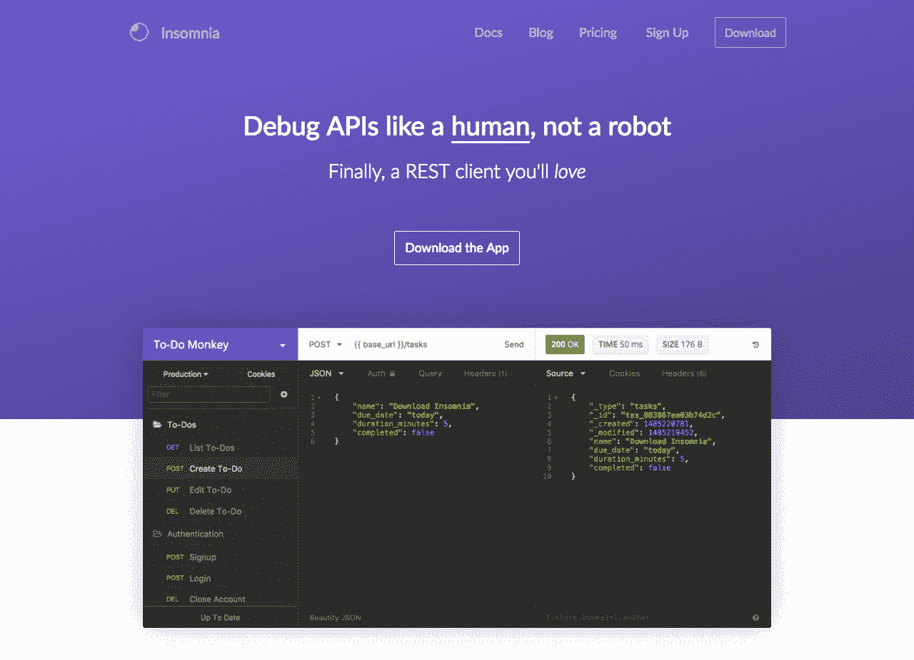

# 学会完成我开始的事情如何帮助我的生意

> 原文：<https://www.indiehackers.com/interview/how-learning-to-finish-what-i-started-helped-my-business-57984c1a6a>

## 你好！你的背景是什么，你在做什么？

我叫 Greg Schier，是一名全栈开发人员，住在加拿大维多利亚。2008 年，我从一个小镇搬到维多利亚，开始攻读机械工程学位，在第一年的编程课程中被介绍给计算机科学后，最终过渡到了计算机科学。在大学期间，我建立并启动了许多兼职项目，创业失败，并作为首批两名员工之一加入了 Sendwithus。现在我是一名全职的 solopreneur，致力于治疗失眠。

[失眠症](https://insomnia.rest)是一个桌面应用程序，旨在帮助开发者与 HTTP APIs 进行交互。它允许用户在一个易于使用和设计良好的界面中定义、组织和执行 HTTP 请求(这是大多数开发人员工具所缺乏的)。

这个应用程序开始时只是一个兼职项目，并一直保持了一年多，直到我最终辞去工作，开始全职开发它。离开后，我建立了失眠的功能集，并努力尽快推出一个付费计划。

《失眠》现在每月有 20，000 名用户，2 月份的总收入超过 800 美元，这是第四个月的收入。用户群目前每月增长 20%以上，这将在未来八个月内实现可持续性。

 

## 是什么激励你开始失眠的？

我开始在 Sendwithus 研究[失眠症](https://insomnia.rest)，帮助我们与正在构建的 API 进行交互。用户群开始有机增长，我的动机也是如此。不到一年，我每周花近 40 个小时在这上面——除了我真正的工作——快累垮了。我一直想为自己工作，所以我决定离开 Sendwithus，全职治疗失眠症，这个决定花了六个多月才做出。

我无法解释不用进办公室或向任何人汇报的感觉有多好。

TweetShare

该应用的第一个版本非常简单直观，因为它只需要与 Sendwithus API 进行交互。当时，类似的工具也存在(甚至是由 *real* 公司制造的)，但我发现它们很难理解和操作。创建一个我会喜欢使用的工具的挑战极大地激励了我。

由于市场上有类似的工具，我没有花太多时间来验证这个想法。在发布后不久，很明显用户对现有工具的感觉和我一样。即使在今天，在功能和复杂性大幅增加后，设计仍然是一个巨大的优先事项，仍然是失眠最大的竞争优势之一。

## 构建最初的产品需要什么？

第一版[失眠](https://insomnia.rest)是真正的 [MVP](https://en.wikipedia.org/wiki/Minimum_viable_product) (最小可行产品)，没有名字也没有 logo，只用了一个周末的时间就打造出来了。它由几百行 jQuery、一个[、20 美元的 ThemeForest 主题](https://themeforest.net/item/bucket-admin-bootstrap-3-responsive-flat-dashboard/6642985)和一个提交反馈的突出按钮组成。我选择以 Chrome 应用的形式发布它，是为了让发布变得容易，仅此而已。我坚持使用我习惯的无聊的工具，它得到了回报。

然而，作为一个 Chrome 应用程序，它有一些限制，阻止了失眠症提供某些关键功能。因此，我开始了用 [Electron](http://electron.atom.io) 将它改写成一个独立的桌面应用程序的艰巨任务。通常应该不惜一切代价避免重写，但那时失眠仍然是一个附带项目，所以我把它当作一个学习机会。花了三个月的时间才达到 Chrome 版本的同等功能，最终得到了更易维护的代码库。

你能做的唯一最有价值的事情就是完成你开始的事情。

TweetShare

当我离开 Sendwithus 时，重写工作只完成了一半，所以我在网站上添加了一个注册表单，并开始为一个大型发布收集电子邮件。一个月后，失眠向 1200 人发起。这些注册大多来自于从 Chrome 商店页面点击进入网站，一小部分来自于社交媒体。

重写结果证明是非常有益的。不久之后，谷歌[宣布计划](https://blog.chromium.org/2016/08/from-chrome-apps-to-web.html)在 2017 年停止 Chrome 应用。如果我没有花三个月的时间重写它，用户会开始寻找替代工具。此外，Chrome 商店上的一些主要竞争对手仍然没有替代品，这使得失眠症处于一个非常有利的位置。

## 你用了什么策略来吸引用户，增长失眠？

我首先承认营销是我最弱的资产之一。我有制作一个像样网站的设计技能，但在公关、搜索引擎优化或内容营销方面没有太多的实际经验。我很幸运，Chrome 商店推动了最初的增长，但这个渠道在重新推出后消失了。

失去 Chrome 增长频道后，我知道[失眠](https://insomnia.rest)需要一个更大的网站，所以我花了一周时间建立了一个合适的网站，并实现了我能找到的所有 SEO 技巧。在推出新网站后不久,《失眠》就登上了《黑客新闻》,并在榜首呆了一整天。

《HN 邮报》吸引了 40，000 次网站访问，其中大约三分之一来自 Reddit 和社交媒体上对《T2》的转发。这种流量的突然增加让“失眠”网站的第一批用户达到了 10，000 人，并启动了有机增长。失去 Chrome 商店渠道不再是一个问题。

| 月 | 会议 |
| --- | --- |
| 第一 | 529 |
| 第二 | 493 |
| 第三 | 178 |
| 第四 | 205 |
| 第 5 | 17435 |
| 第六 | 25701 |
| 第七届 | 5247 |
| 第 8 | 2903 |
| 第九届 | 1994 |
| 第 10 名 | 838 |
| 第 11 | 893 |
| 第十二 | 1526 |
| 13 号 | 1281 |
| 第 14 届 | 1194 |

这一切都发生在 2016 年 9 月初。从那以后，我就能在[上得到失眠的特写了，OMG！Ubuntu！](http://www.omgubuntu.co.uk/2016/09/insomnia-3-is-free-rest-client-for-linux)和[电子主页](http://electron.atom.io)但是与 HN 相比，这些网站的流量是最小的。展望未来，我肯定想花更多的时间在公关上，以帮助点燃增长之火。

以下是自发布以来用户增长的情况:

| 月 | 收入 |
| --- | --- |
| 8/1 | 8 |
|  | 15 |
|  | 29 |
|  | 40 |
|  | 31 |
|  | 9 |
|  | 13 |
|  | 31 |
|  | 23 |
|  | 26 |
|  | 25 |
|  | 21 |
|  | 3 |
|  | 11 |
|  | 28 |
|  | 50 |
|  | 100 |
|  | 85 |
|  | 71 |
|  | 35 |
|  | 107 |
|  | 348 |
|  | 424 |
|  | 464 |
|  | 479 |
|  | 406 |
|  | 120 |
|  | 171 |
|  | 487 |
|  | 547 |
|  | 557 |
| 9/1 | 550 |
|  | 443 |
|  | 139 |
|  | 196 |
|  | 1089 |
|  | 2927 |
|  | 1804 |
|  | 1609 |
|  | 1301 |
|  | 368 |
|  | 513 |
|  | 1402 |
|  | 1430 |
|  | 1397 |
|  | 1593 |
|  | 1360 |
|  | 486 |
|  | 610 |
|  | 1558 |
|  | 1684 |
|  | 1652 |
|  | 1527 |
|  | 1300 |
|  | 375 |
|  | 586 |
|  | 1569 |
|  | 1618 |
|  | 1651 |
|  | 1613 |
|  | 1307 |
| 10/1 | 360 |
|  | 506 |
|  | 1453 |
|  | 1595 |
|  | 1614 |
|  | 1535 |
|  | 1374 |
|  | 490 |
|  | 612 |
|  | 1493 |
|  | 1683 |
|  | 1595 |
|  | 1654 |
|  | 1401 |
|  | 409 |
|  | 605 |
|  | 1875 |
|  | 2042 |
|  | 1957 |
|  | 1909 |
|  | 1562 |
|  | 455 |
|  | 791 |
|  | 1973 |
|  | 2002 |
|  | 1952 |
|  | 1913 |
|  | 1563 |
|  | 444 |
|  | 643 |
|  | 1689 |
| 11/1 | 1688 |
|  | 1806 |
|  | 1815 |
|  | 1585 |
|  | 473 |
|  | 805 |
|  | 1963 |
|  | 1980 |
|  | 1920 |
|  | 1915 |
|  | 1540 |
|  | 490 |
|  | 807 |
|  | 1918 |
|  | 1990 |
|  | 2008 |
|  | 1954 |
|  | 1700 |
|  | 490 |
|  | 821 |
|  | 1994 |
|  | 2047 |
|  | 1990 |
|  | 1773 |
|  | 1437 |
|  | 548 |
|  | 906 |
|  | 2128 |
|  | 2214 |
|  | 2149 |
| 12/1 | 2120 |
|  | 1825 |
|  | 589 |
|  | 944 |
|  | 2208 |
|  | 2314 |
|  | 2348 |
|  | 2304 |
|  | 1951 |
|  | 599 |
|  | 1034 |
|  | 2289 |
|  | 2436 |
|  | 2447 |
|  | 2400 |
|  | 1974 |
|  | 561 |
|  | 1011 |
|  | 2358 |
|  | 2390 |
|  | 2336 |
|  | 2173 |
|  | 1523 |
|  | 424 |
|  | 718 |
|  | 1214 |
|  | 1632 |
|  | 1766 |
|  | 1632 |
|  | 1180 |
|  | 391 |
| 1/1 | 529 |
|  | 1459 |
|  | 2296 |
|  | 2426 |
|  | 2454 |
|  | 1926 |
|  | 688 |
|  | 1159 |
|  | 2691 |
|  | 2850 |
|  | 2900 |
|  | 2881 |
|  | 2388 |
|  | 739 |
|  | 1265 |
|  | 2924 |
|  | 3031 |
|  | 3110 |
|  | 3090 |
|  | 2615 |
|  | 828 |
|  | 1296 |
|  | 3031 |
|  | 3177 |
|  | 3075 |
|  | 2951 |
|  | 2502 |
|  | 784 |
|  | 1166 |
|  | 3038 |
|  | 3129 |
| 2/1 | 3267 |
|  | 3208 |
|  | 3055 |
|  | 928 |
|  | 1414 |
|  | 3403 |
|  | 3605 |
|  | 3568 |
|  | 3532 |
|  | 3066 |
|  | 889 |
|  | 1580 |
|  | 3666 |
|  | 3645 |
|  | 3805 |
|  | 3783 |
|  | 3140 |
|  | 951 |
|  | 1555 |
|  | 3547 |
|  | 3957 |
|  | 3947 |
|  | 3673 |
|  | 3101 |
|  | 949 |
|  | 1604 |
|  | 3678 |
|  | 3872 |
| 3/1 | 3965 |
|  | 3889 |
|  | 3289 |
|  | 987 |
|  | 1725 |
|  | 4013 |
|  | 4031 |
|  | 3979 |
|  | 4042 |
|  | 3468 |
|  | 1049 |
|  | 1463 |
|  | 4118 |
|  | 4136 |
|  | 4182 |
|  | 4114 |
|  | 3559 |
|  | 1063 |
|  | 1551 |
|  | 4213 |

## 你的商业模式是如何运作的？

[失眠症](https://insomnia.rest)桌面应用程序免费使用，但可以与[付费账户](https://insomnia.rest/pricing)配对，以解锁数据同步和团队协作等云功能。这意味着免费用户从不需要服务器资源。一切与云相关的事物都需要付费账户来保持业务的可持续性。这是制作离线应用相对于 web 应用的最大优势之一。对于网络应用来说，没有办法避免维护免费用户群的金钱成本。

首个付费计划于 2016 年 11 月推出。花了一个月的时间写了一个基本的数据同步引擎，账户管理，通过 [Stripe](https://stripe.com) 收款。我还选择依赖托管服务，如 [Heroku](https://heroku.com) 、 [New Relic](https://newrelic.com) 和 [Sentry](https://sentry.io) ，这增加了初始成本，但节省了无数的工作时间。目前的成本约为每月 100 美元，这是当前 MRR(每月经常性收入)的一大部分。但是，当前的配置应该能够处理至少未来六个月的增长。

自去年 11 月推出付费计划以来，MRR 每月都在翻倍增长，目前 50 个客户之间的费用为 350 美元。然而，由于每年有超过一半的客户订阅，失眠症患者在 2 月份实际上赚了 800 多美元。如果可能的话，我强烈建议增加一个年度计划，因为额外的前期资金会对 runway 产生巨大的影响。

这是 MRR 发射后的样子:

| 月 | 收入 |
| --- | --- |
| 七月 | 0 |
| 八月 | 0 |
| 九月 | 0 |
| 十月 | 0 |
| 十一月 | 15 |
| 十二月 | 46 |
| 一月 | 111 |
| 二月（February 的缩写） | 323 |
| (三月) | 395 |

这还不包括年度订阅的收入。

## 你对失眠的未来有什么目标？

失眠患者的首要目标是培育足够的 MRR 来维持我目前的生活方式。2000 美元/月足以让[拉面盈利](http://paulgraham.com/ramenprofitable.html)，10000 美元/月是我为另一家公司工作的收入。在这一点上，我有信心达到 2，000-5，000 美元，但达到 10，000 美元就不那么确定了。

到目前为止，我已经奢侈地瞄准了现有的用户群进行升级，所以 MRR 的增长率一直很高，大约每月 200%。然而，很难预测这口井干涸后，事情会如何发展。根据我掌握的数据，大多数升级来自新用户，所以希望这一趋势继续下去。

除了显而易见的可持续发展目标，我还有一个离开加拿大环游世界的个人目标。我选择独立的很大一部分原因是它提供的自由。我无法解释不用进办公室、不用向任何人汇报、不用参加不重要的会议的感觉有多好。显然有所取舍，但到目前为止，我喜欢这种生活方式，并计划尽可能长时间地单身。

## 你面临的最大挑战是什么？

作为一名职业开发人员，我面临的最大挑战之一就是不要表现得像个开发人员。软件开发永远是构建[失眠](https://insomnia.rest)的重要部分，但是在上面花费不必要的时间是非常容易的。例如，重构代码是软件开发中最有回报的部分之一，但在初创企业中，这通常是巨大的时间浪费。为什么？因为如果你不知道是否有人想要你正在构建的东西，就没有理由让它变得可维护，甚至是可理解。对于独立开发者来说尤其如此，因为只有一个人需要理解它。

如果某样东西“工作”了，通常就足够好了，这不仅仅适用于重构。如果你能找到其他节省时间的方法，那就去做吧。如果你能支付托管解决方案的费用，就不要把时间浪费在运行自己的数据库或服务器这样的琐事上。无聊的堆栈易于维护，可以腾出时间专注于重要的事情。然而，我已经多次吸取了这个教训，仍然偶尔陷入坏习惯。

在为失眠的付费功能构建后端服务器时，我首先尝试用[无服务器框架](https://serverless.com)来构建，这是我以前没有用过的。在工作了几个星期后，我不得不重写它，因为它不符合性能要求。然后，在重写 app 的时候，我选择了尝试 [Elm 语言](http://elm-lang.org)，但最后因为更精通而换成了 [React](https://facebook.github.io/react) 。

如果我重新开始，除了避免这些浪费时间的话题，我不认为我会做什么不同。我很幸运地从以前项目中的许多严重错误中吸取了教训，并为失眠症迄今为止的顺利进展感到自豪。然而，前面的路还很长。

## 你最大的优势是什么？有什么特别有用的吗？

自从在大学发现编程以来，我已经开发了工具和应用来解决自己的问题。我注意到许多程序员也这样做，但是许多人忽略了发布公开版本所需的最后 10%的努力。

因为我花了额外的时间来发布我构建的东西，我学到了除编程以外的其他主题的宝贵经验，如营销、设计、写作和客户支持。兼职项目是学习有价值的产品经验的一个很好的低风险方式，而没有经营一家初创公司的风险。我从他们身上学到的东西在制造失眠的过程中帮助很大。

我也很幸运在 [Sendwithus](https://www.sendwithus.com) 度过了人生中的三年，体验了作为早期员工经历 [Y Combinator](http://www.ycombinator.com) 的感觉，发展了 SaaS 的业务，与客户交谈，扩展了后端服务。我认为对我来说，没有什么比在 Sendwithus 度过的时光更有价值了，无论是在职业还是个人成长方面。

机会不会凭空出现，你必须自己去创造。

TweetShare

最后一件事——可能也是最重要的一件事——是能够在两年内还清 3.5 万美元的学生贷款，然后继续节省一年的生活费。我有幸挣了 6 万到 9 万美元的薪水，所以每个月都有可能把其中的一半以上存起来。我知道这不是每个人都能做到的，但如果你能负担得起，就设定一个中期储蓄目标，并相应地调整你的生活方式。

## 对于刚刚起步的独立黑客，你有什么建议？

作为一个发起过许多项目的人，我可以告诉你，你能做的最有价值的一件事就是*完成*你开始的事情。我知道很多人为自己开始项目，但从来没有真正把它们拿出来给别人使用。这是一次错失的机会。一旦你试图公开发布一些东西，你就不得不考虑可用性、文档、软件更新、分析、营销、支持等等。所以，如果你从这次采访中只学到一件事，那就是:抓住一切机会练习向真实用户推出产品。这也会让你知道你是否真的喜欢做一名独立黑客。

我的第二条建议是不要重新发明轮子。在 Sendwithus，我们能够在只有少数后端开发人员的情况下，将我们的服务扩展到每小时数百万个 API 请求。这是大量投资托管服务的直接结果。

托管服务器、维护数据库和跟踪用户是已解决的问题，尤其是在启动阶段。为存在的东西付费，停止浪费时间。以下是我反复使用的服务的详尽列表:

*   用于服务器托管的 Heroku
*   [服务器日志的文档跟踪](https://papertrailapp.com)
*   [哨兵](https://sentry.io)进行异常追踪
*   [服务器监控的新遗迹](https://newrelic.com)
*   [Sendwithus](https://www.sendwithus.com) 用于交易类邮件(咄！)
*   [UI 主题的主题森林](https://themeforest.net)
*   [帮助寻找](https://www.helpscout.net)客户支持

我给你的最后一条建议是，问问你想要什么。机会不会凭空出现，你必须自己去创造。几周前，我希望在[电子主页](https://electron.atom.io)上获得[失眠](https://insomnia.rest)专题，但我不确定选择过程是如何进行的。所以，有一天[我只是问了一下](https://github.com/electron/electron.atom.io/pull/552#issuecomment-266322631)，失眠在第二周就成了特色——就这样。

## 我们可以去哪里了解更多？

如果你有兴趣了解更多关于我与[失眠](https://insomnia.rest)的旅程，请前往[透明页面](https://insomnia.rest/transparency)，那里展示了增长数字，也链接到我每个月底写的透明博客文章。你也可以在 Twitter 上关注我，获得更多个人体验。

我希望你喜欢读这篇文章，我很乐意回答你的任何问题。

——[<picture id="ember7994947" class="user-avatar ember-view user-link__avatar"></picture>格里高利](/GregorySchier?id=GJkXiestYCPbiON8i9bV0ibvfmz1)，失眠的创始人

## 想像失眠一样建立自己的事业？

你应该加入[独立黑客社区](/)！🤗

我们是几千名创始人，互相帮助建立有利可图的业务和副业。来分享你正在做的事情，并从你的同事那里获得反馈。

还没准备好开始使用你的产品吗？没问题。这个社区是一个认识人、学习和实践的好地方。随意[随便浏览](/)！

——[<picture id="ember7994952" class="user-avatar ember-view user-link__avatar"></picture>考特兰艾伦](/csallen?id=ibTLPyjwVebnZjMGKvz6ztarnuV2)，独立黑客创始人

39votes