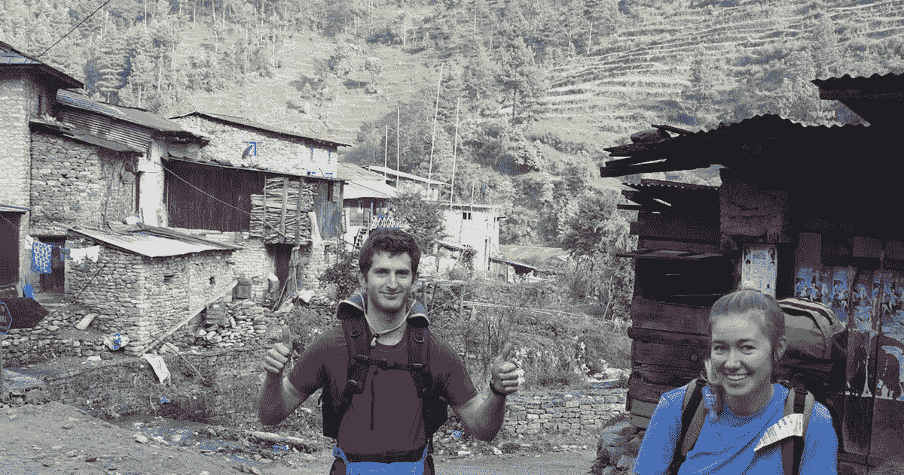
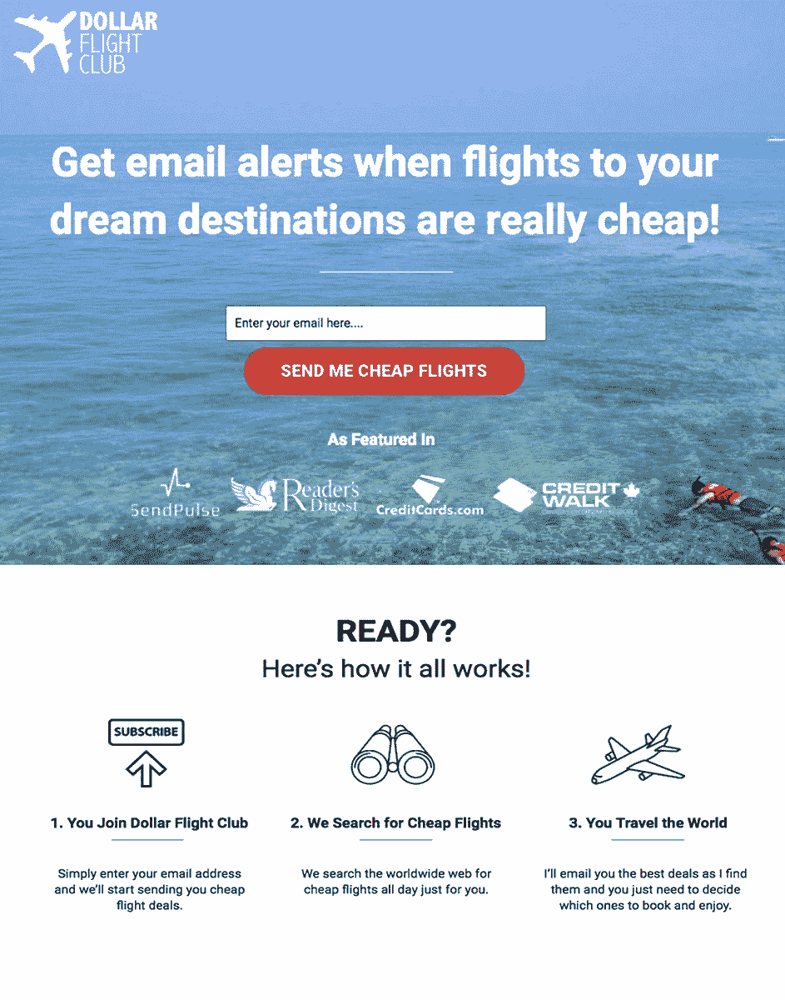
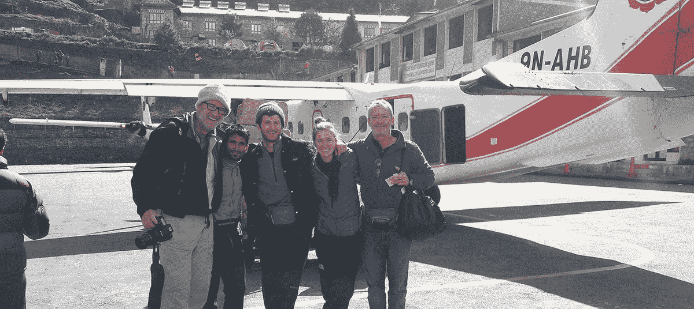
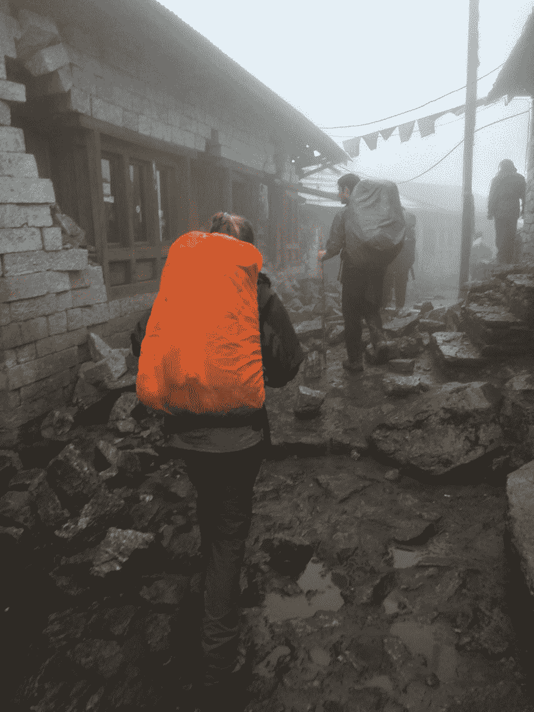
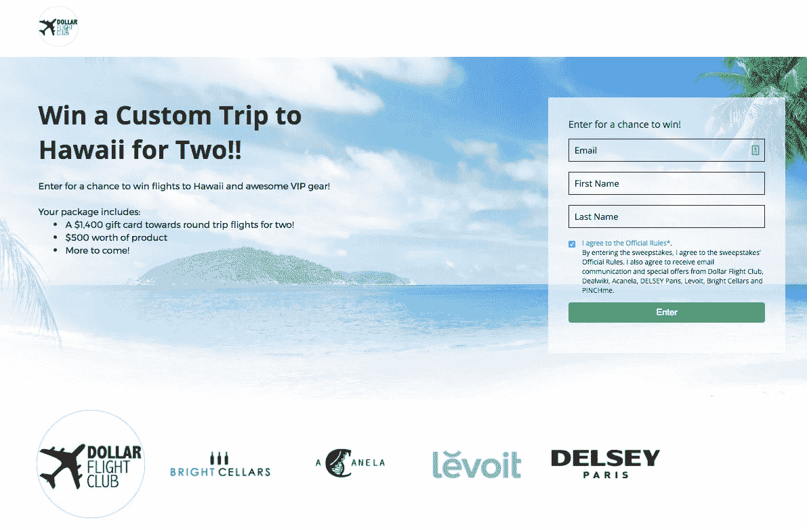
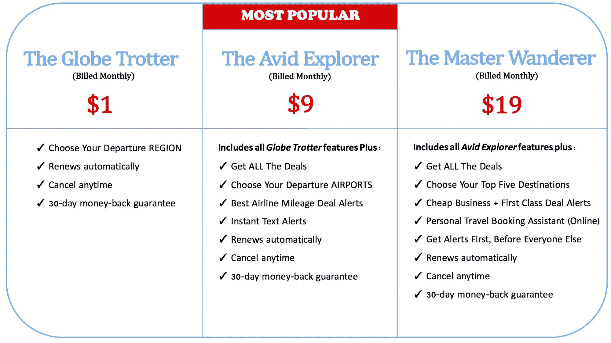

# 国外生活如何帮助我在半年内赚到 1500 美元

> 原文：<https://www.indiehackers.com/interview/how-life-abroad-helped-me-launch-to-1-500-in-half-a-year-5ad224f03a>

## 嘿杰西！你的故事是什么，你目前在做什么？

你好。我叫杰西·纽加滕。我是美元飞行俱乐部(Dollar Flight Club)的创始人，这是一项电子邮件订阅服务，帮助超过 5 万人节省了惊人的机票费用。

2015 年 4 月 25 日，尼泊尔发生 7.8 级地震，我被困在珠穆朗玛峰大本营下面两周，之后我的创业之旅开始了[。(更多信息请见下文！)](http://www.nbcsandiego.com/news/local/Jesse-Neugarten-Larry-Neugarten-Stuck-in-Nepal-After-Earthquake-301578281.html)

在去尼泊尔之前，我很幸运地走遍了世界各地，积累了成千上万的飞行常客积分。在这个过程中，我学会了旅行黑客的方法。慢慢地，朋友和家人开始要求我帮助他们享受他们自己的廉价假期，于是[美元飞行俱乐部](http://www.dollarflightclub.com/)电子邮件列表诞生了。

Dollar Flight Club 专门通知用户飞往令人敬畏的国际目的地的航班何时非常非常便宜(如巴厘岛往返 392 美元或巴塞罗那往返 350 美元)。

我还用创造性的技巧向用户发出提醒，帮助他们充分利用新信用卡，并使用积分免费环游世界。当我找到一笔好交易时，我会给订户发电子邮件，告诉他们重要的细节:哪些日期可以预订、出发和目的地机场的列表、预订说明等等。

到目前为止，Dollar Flight Club 已经帮助用户平均每张机票节省了 550 美元。

 

会员使用美元飞行俱乐部有几个原因:

*   他们不必花很多时间去省钱。我们每天花 8 到 10 个小时搜索航班，然后把信息发送给用户，这样他们就不用花那么多时间自己去做了。对于许多人来说，一个月只花几美元，那就很有价值了。

*   他们不知道在哪里可以找到这些交易。大多数人不知道你可以找到从美国到欧洲的往返航班，价格在 300-400 美元之间。人们只是习惯于为那些航班支付数千美元，我对此不以为然！我花了数百个小时在网上搜索航班；知道去哪里找超级重要。大多数人甚至不知道从哪里开始！这就是他们加入俱乐部的原因。

*   他们得到廉价的航班提醒，并帮助使用新的信用卡旅行。环游世界可能既昂贵又复杂。但是对于那些知道去哪里旅游的人来说，旅行从来没有这么便宜过。我的目标是帮助其他人在任何预算下看世界。

*   电子邮件提醒简单易懂。如今，网上有大量与旅游相关的信息。这在很多方面都很棒。但说到快速找到便宜的航班，实在是太多了。人们很容易被这么多搜索航班的网站弄得不知所措。我们发出的电子邮件提醒简单明了，没有任何附加条件。

今天，我们大约有 50，000 名会员，每月收入 1，500 美元！

## 你能告诉我更多关于尼泊尔的事情以及你加入美元飞行俱乐部的动机吗？

从小到大，我从未想过我会成为任何事情的创始人。我在尼泊尔的经历将会改变这一切。

回到家后，我决定努力做一些改变人们生活的事情。我创办了一个非营利组织来帮助那些受尼泊尔地震影响的人们重建家园。我们成功地帮助了 10 多个家庭彻底重建。但这是不可持续的。从那以后，我总是对那些影响他人生活的想法感兴趣。

在我徒步穿越世界上最高的山脉(珠穆朗玛峰)的山麓小丘的第六天，发生了 7.8 级地震。我和我的女朋友埃莉以及我们的两个爸爸正在进行为期两周的徒步旅行。我们在离一个叫布普萨的小村庄只有几英里的 11000 英尺的陡坡上爬了四个小时。地面摇晃了 30 秒，这是我从未有过的感觉。我不记得有任何噪音，只记得我脚下的地面摇晃，强大的山体滑坡席卷山谷。

我们都很害怕，但对刚刚发生的事情更加困惑。

喜玛拉雅山的消息传播很慢，所以我们不知道整个地区的破坏程度。大约 45 分钟后，当下一次强烈的余震震动地面时，我们的问题有了答案。我们的下一步是导航到卢卡拉机场——世界上最高也是最危险的机场，它从跑道尽头的悬崖上跌落数百英尺(见下图)。

这将是另一个星期，直到我们能够赶上飞机，使它回家。

这是一次改变人生的经历，将永远伴随着我。我遇到的一些人的破坏、自私和腐败不会被忘记。但是，那些在这样的情况下把别人放在第一位的人的善良，塑造了我的人生。为什么我能起身离开，而善良的尼泊尔人民却不得不回到破败的村庄？

当我从尼泊尔回到家时，大多数人都以为我已经结束了旅行。但实际上，我的经历对我产生了相反的影响:我被激励去更多的地方旅行。我意识到体验和接触其他文化是作为一个人成长的最好方式。

几周后，我在 travel hacked 上花了 210 美元买了一张从纽约到斯德哥尔摩的往返机票。我又和埃莉一起走了。瑞典没有发生地震，但是考虑到那里有多冷，地震突然看起来没那么糟糕了！

那次旅行让我们去了斯德哥尔摩、瑞典北部、巴黎、伦敦、布鲁塞尔、阿姆斯特丹和伦敦。

就在那时，我的脑袋开始转动。我想我可以把航班提醒和帮助别人看世界结合起来——所有这些都带有社会使命。

美元飞行俱乐部让我可以做自己喜欢的事情，所以我随大流。到目前为止反响很惊人！

## 启动并运行该服务需要什么？

这项业务完全是围绕电子邮件展开的。电子邮件不仅是我向现有用户提供价值的方式(以及他们付费的方式)，也是我向新用户营销和获取新用户的方式。

当选择你的邮件列表提供商时，花点时间了解它是如何工作的，并和使用它的人谈谈。

TweetShare

我知道，收入增长最终将取决于我在服务背后构建高效基础设施的能力，以优化免费增值列表增长，并将越来越多的客户转化为高级订阅。我有一份全职工作和另一份兼职，我还在为今年 11 月在墨西哥举行的铁人三项 70.3 训练(如果有人想参加的话！)，所以效率是关键。

这里是我对任何阅读这篇文章并可能有商业想法的人的建议:尽可能快地建立一个登陆页面，并启动它以获得一些初始数据，这样你就可以立即进行 A/B 测试。

我犯的一个最大的错误是花了太长时间才发布。在这个想法 100%得到验证之前，我试图让一切尽善尽美。没有任何初始数据，怎么提高？

当我着手建立[美元飞行俱乐部](https://www.dollarflightclub.com)时，我最初的目标如下:

1.  **建立一个有吸引力的登陆页面。我知道我需要描绘一段人们不想错过的经历。**

2.  **提供卓越的用户体验。人们很快就会失去兴趣。我知道尽快回答问题并在人们注册时真诚地给予帮助是很重要的。**

3.  **用价值培育免费增值会员。对于那些没有马上转化为付费客户的人，我知道向他们展示价值以让他们升级是很重要的。我们的目标是了解将客户从免费转为高级需要多长时间:一个月，三个月，一年？**

4.  **寻找有创意的方式来带动流量。**拥有一个健康的人才管道进入培养序列非常重要。如果你有一些销售或营销的背景，这都是关于可预测的管道，因为这导致收入。没有坚实的管道，你什么都指望不上。(请继续关注:关于我是如何驾驶交通的，还有更多的内容。)

创业意味着几乎所有事情都要自己做。我没有和承包商或工程师一起工作，就非常便宜地建立了这个网站。启动并运行这项服务的成本非常合理。

使用正确的工具使得这种方法比预期的更容易。目前，我使用:

*   **Instapage** 建立和管理网站-*【60 美元/月*

*   **MailChimp** 管理邮件列表-*【60 美元/月(最多 2500 名用户免费)*

*   **条纹**在线处理支付- *每成功一次卡收费 2.9%+30*

*   **Zapier** 自动完成 MailChimp 中的一些任务，比如当用户升级时将他们从一个列表转移到另一个列表—*免费*

*   **Hotjar** 了解人们是如何通过漏斗移动的，或者他们在哪里陷入了优化以获得更高转化率的目标- *免费*

专业提示:所有这些工具都能很好地相互配合，这非常方便！

我对有抱负的企业家的建议是，从一开始就尽量让一切变得简单。这可以让你专注于将指针移向你正在追逐的“北极星”。

## 你提到要找到创造性的方法来增加流量，从而推动用户增长。你是如何吸引用户并扩大美元飞行俱乐部用户群的？

从一开始，我就知道我需要努力争取第一批 200 名付费客户。随着旅行成为一个巨大的时髦词，用户的收件箱会直接收到提醒，会员很容易与朋友分享。当某人的收件箱收到我的一笔很棒的交易时——比如一张 290 美元的夏威夷往返机票——他们会把它转发给朋友。口碑真的有助于牵引！

第一个月，我开始玩游击营销游戏。从我在 B2B 领域的背景来看，我知道你想要建立可以在任何业务中扩展的流程。然而，当你的公司在一个自举的状态下运作时，你需要做一些事情，这些事情在你获得一些动力之前是不会扩大规模的。

这些努力为我带来了第一批 200 名左右的客户，以及一篇发表在[读者文摘](http://www.rd.com/advice/saving-money/best-time-to-book-thanksgiving-flights/)和[信用漫步](https://www.creditwalk.ca/dear-nora-fare-alert-services-fly-cheap/)上的文章，这带来了数百名注册用户。

我是这样开始的:

1.  我加入了很多以旅游为重点的脸书团体。人们总是希望旅行并与志同道合的人联系。我加入了一些脸书小组，只是为了通过张贴提示和回答问题来提供超级帮助。一周有几次，我会在我的网站上发布一个航班信息或信用卡提示，并附带一个反向链接，最终会有 30 人注册——这还只是一个脸书团体的注册人数！这真的很有效，因为我能够瞄准一群对旅行感兴趣的人；我找到了我的理想客户！这表明无论你卖什么，找出你的利基市场是多么重要。专业提示:对人要超级有帮助，他们也会马上帮助你。
2.  **我猛烈攻击社交媒体。**旅游行业充斥着旅游优惠和行话。社交媒体是利用这种有机兴趣的完美工具。人们喜欢点击一些东西，追随那些旅行的人——如果没有别的原因，只是想通过他们来体验生活。我在 Twitter 和 Instagram 上关注了数百名喜欢旅行的人。当他们跟着我回来时，我给他们发了一条私人信息，邀请他们加入美元飞行俱乐部。这太棒了，因为我得到了很多注册。但是，也许更重要的是，人们也问我问题。因此，通过与我的目标受众进行一对一的对话，我获得了一些不错的反馈。

我第一个月底打了 100 个付费客户，第二个月底打了 200 个付费客户，最近过了 300 个付费客户！

如果你一开始就免费提供服务，你永远不会真正了解它的价值。

TweetShare

接下来是什么？我知道扩大美元飞行俱乐部名单是关键。所以我和其他品牌合作，办了一个抽奖活动。赠送免费机票是找到对旅游交易感兴趣的人的好方法。这种方法使名单在短短几周内增长到了 10，000 人，他们都是高质量的、相关的、积极参与的订阅者，是我的目标受众。

我发现通过社交分享做赠品特别有益。为了获得最佳效果，例如，如果客户在 Instagram 上关注你，给他们额外五个条目；如果他们在脸书上分享链接，给他们额外四个条目。我现在在营销方面使用这些策略来建立我的电子邮件列表。

 

关键是找到你的观众，然后尽你所能去争取他们。尝试很多渠道，直到你找到最适合你的。

## 你提到了免费和高级会员。你的商业模式是什么，你是如何增加收入的？

如果你一开始就免费提供服务，你永远不会真正了解它对某人的价值。

但与此同时，当你是一家全新的企业时，很难让人马上给你发工资。这就是为什么我在推出这个网站的时候选择了免费增值的方式。

我不想把任何人排除在服务之外。相反，我想给人们各种选择，让他们了解这项服务的价值，直到我有了一些数据来作为未来价格变化的基础。(我仍在收集上述数据。)

我推出了三个等级的高级服务:1 美元/月、9 美元/月和 19 美元/月，各有不同的功能。它越贵，你得到的个性化就越多。

高级服务通常为升级的用户提供以下服务:

*   高级会员获得 100%的交易。免费会员只能获得 25%的交易。成为高级订户，增加您找到想要交易的机会！

*   **高级会员可以选择特定的出发机场。**免费会员只能选择一个地区(如西海岸)。

*   **高级会员可以选择梦想目的地让我搜索。**一切都是为了个性化。

*   高级会员首先获得所有交易。他们比免费会员提前约 45 分钟获得优惠。他们也会收到短信提醒。

三种高级订阅的区别如下:

*   **环球旅行者**让你获得比免费增值用户更多的交易。

*   **Avid Explorer**让您选择出发机场，而不仅仅是您所在的地区。此外，它还能为你提供信用卡旅行提示。

*   **大师漫游者**是最个性化的计划，适合那些寻找旅行最大帮助的人。这些订户可以选择他们的五大梦想目的地，让我搜索商务和头等舱交易。他们还可以通过电子邮件支持获得寻找特定航班的个人帮助。

 

拥有不同的订阅级别让我能够支付运营成本，并且了解市场愿意支付的价格。在过去的几个月里，我发现人们愿意为这项服务支付更多的钱。这说明 A/B 测试在你做任何决定时都是至关重要的。

我的目标是让人们从免费列表升级到付费列表。我试图通过三个渠道实现这一点。

1.  当他们在网站上输入电子邮件地址时。这只是偶尔发生。人们需要先体验服务，然后才愿意支付更多费用。

2.  **作为入职流程的一部分。**在收到初始提醒几周后，他们会收到一封单独的电子邮件，提供有关保费计划的信息。我发出的每封电子邮件的顶部和底部都有一个短句，提醒免费会员他们错过了什么(例如，“高级会员本周获得了 211 美元的古巴往返游”)。

3.  **通过关联公司。**获得信任和声誉对建立事业来说是巨大的。让人们在他们的网站上用反向链接为我营销(每次有人注册时他们会得到几美元)真的很好地让人们立即付费，因为他们是由他们信任的人或网站推荐的。

目前，我使用 Stripe 进行所有支付处理。但是，开始时，我使用了本质上是 Stripe 的 MoonClerk，但是它自动完成了我起初不知道如何做的所有设置。

## 你未来的目标是什么？你如何变得更好？你补充什么？

我现在有很多目标，但这里有几个:

*   **建立订户名单。**目标是年底前达到 10 万辆。我计划通过赠品和公关来增加流量。

*   **更好地与顾客交谈。**为了让我的业务更上一层楼，我真的需要了解他们想要什么，他们看重什么。

*   **更彻底地理解转化指标。**我想知道免费会员转化为付费客户具体需要多长时间，百分比是多少。

*   **尽可能减少流失。在订阅服务中，客户流失永远是你最关心的问题。我需要专注于客户服务，以减少客户流失，实现承诺的价值。**

*   **提升网站。随着网站的发展，我想把东西转移到 WordPress，更专业地建设网站，这将允许后端有更多的灵活性。**

*   **雇用员工#1。随着业务的继续增长，我打算在未来两三个月内雇人。(所以，如果你知道谁对旅行感兴趣或着迷，谁会是合适的人选，请告诉我！)**

*   **创建越来越多的反向链接。**反向链接对谷歌排名超级重要。我将继续寻找公关机会，创造网站的反向链接。

*   **帮助人们节省更多旅行费用，并积累常旅客积分。我喜欢人们成为旅程的一部分，找到去他们想去的目的地的廉价机票。我也喜欢当他们被激励去一个他们从未想过的地方旅行。**

*   **发布客户成功案例。我喜欢让人们在预订机票时给我写信。我想在网站上发布一些快乐旅行者的故事。**

我现在有很多事情要做。但我迫不及待地想解决这一切。

## 你面临的最大挑战和克服的障碍是什么？如果你必须重新开始，你会做什么不同的事？

在 MailChimp 中组织数据一直是个问题。

我有三个计划，然后一群自由成员从一个计划流向下一个计划。一开始，我是手动更新的。但是那要花很多时间。幸运的是，我找到了 Zapier，并用它来自动化所有的小事。这为我节省了无数的时间，让我可以专注于更高层次的问题。

MailChimp 非常适合小列表。但是分段工作流和向多个列表发送相同电子邮件的能力还不够简单。随着名单的增长，我想在短期内我会转向另一个电子邮件服务。当选择你的邮件列表提供商时，花点时间了解它是如何工作的，并在加入之前和使用它的人谈谈。

当列表非常小的时候，我在更少的城市和国家搜索航班。对如此小的列表有效的方法对 50，000 个订阅者无效。对于更大的列表来说，这肯定是行不通的，所以我必须调整自己，变得更有创造力。

## 到目前为止，你发现什么对你的事业特别有帮助或有利？

有这么多关于旅行的信息，有这么多网站可以用来搜索航班，这对普通人来说太多了。电子邮件简单有效，人人都用。

电子邮件订阅服务的好处是产品是营销材料。同时，营销材料就是产品。通过为现有客户提供价值，我能够使用这些电子邮件发送给免费会员，让他们升级到高级。我只是在顶部添加一个简介，告诉他们错过了一笔交易，或者解释其他功能之一。

我的背景是经济学。我没有任何编码背景，这也是目前一切都超级黑在一起的原因！然而，我认为在你开始的时候，努力让一切尽可能简单是很重要的。当你把事情复杂化的时候，你很容易偏离正题或者担心一些小细节，这些小细节不会让你达到目标或者“北极星”

我的经济学训练确实帮助我思考如何将大量关于航班提醒的信息浓缩成一种简单的格式。它还帮我起草了所有的营销邮件。(谁知道我花在写经济发展论文上的所有时间会在这里发挥作用？)

当然，这些年积累的飞行里程和数百小时搜索廉价航班让我能够以一种相对独特的方式帮助订户。

目前，我在 Socedo 全职工作，这是一家位于西雅图的 B2B 销售线索生成公司。因此，我对营销领域有着相当扎实的理解。具体来说，我学会了如何思考通过漏斗移动线索，如何 A/B 测试营销自动化平台，如何理解转化率，以及如何优化打开/点击。我还学会了如何建立电子邮件列表。

总的来说，与没有接触过该行业的人相比，这让我建立电子邮件和理解所有指标花费的时间更少。然而，我不知道如何建立网站，所以这是一个挑战。

目前，在我去办公室之前的清晨、晚上和周末，我都在为美元飞行俱乐部工作。

最重要的是:**如果你需要帮助，尽管开口。早期我试着自己做每件事。如果需要，请开发人员朋友帮助实现 Stripe。使用 Fiverr 做一些小项目，比如设计封面或标志。真的很便宜，那些自由职业者做的工作也很棒。**

## 对于刚刚起步的独立黑客，你有什么建议？

我的第一条建议很简单:做你真正喜欢的事情。努力工作、熬夜和迎接随之而来的挑战会变得容易得多。

一些其他的建议:

*   **A/B 测试。**利用数据为您的决策提供信息，提高您的工作效率。不要盲目地进去。如果你没有一个转化率、流量之类的基准，你如何改进？A/B 测试对于新公司尤为重要。

*   保持事情简单。我很快就学会了一件事，那就是在扩张之前专注于特定的领域。换句话说，先深入，再广。一开始，我向世界上任何一个国家的人开放了这个名单。但很快就无法跟上了。所以我对美国、加拿大和其他几个国家的顾客关闭了它。这使得一切都更容易管理。

*   **一开始就让人买单。从一开始就想好如何赚钱。否则，你将无法了解你所提供的价值以及潜在客户如何看待你。尽早赚钱，你甚至可以马上获得可观的收入。我很高兴从一开始就有人付钱。我不仅可以支付启动成本，还给了我极大的信心。我仍然在测试价格。**

*   **永远被测试。**你总能改进你的产品，尤其是在你刚刚起步的时候。

*   **与客户互动。**与你的前 20 名付费客户交谈，向他们提问。早期采用者是你的粉丝，他们有着丰富的洞察力。他们是你的超级消费者，可以成为品牌的传播者。你认为有用或有价值的东西可能并非如此。问问付钱给你的人他们是怎么想的！这才是最重要的。

你需要做一些在获得一些动力之前不会扩大规模的事情。

TweetShare

## 我们可以去哪里了解更多？

在这里找到我们:

*   [DollarFlightClub.com](http://www.dollarflightclub.com/)
*   [推特](https://twitter.com/DollarFlights)
*   [Instagram](https://www.instagram.com/dollarflightclub/)
*   [脸书](https://www.facebook.com/DollarFlightClub/)

如果你对我们有任何问题，请在下面留下评论，我很乐意尽快回复你。感谢你花时间聊天，科特兰，感谢所有那些阅读！

旅途愉快，杰西

—[<picture id="ember5301962" class="user-avatar ember-view user-link__avatar"></picture>JesseNeugarten](/JesseNeugarten?id=6ec0y7luHCdydaH6gGEK6hHpjZP2)，美元飞行俱乐部创始人

## 想像美元飞行俱乐部一样建立自己的事业？

你应该加入独立黑客社区！🤗

我们是几千名创始人，互相帮助建立有利可图的业务和副业。来分享你正在做的事情，并从你的同事那里获得反馈。

还没准备好开始使用你的产品吗？没问题。这个社区是一个认识人、学习和实践的好地方。随意[随便浏览](/)！

——[<picture id="ember5301967" class="user-avatar ember-view user-link__avatar"></picture>柯特兰艾伦](/csallen?id=ibTLPyjwVebnZjMGKvz6ztarnuV2)，独立黑客创始人

7votes