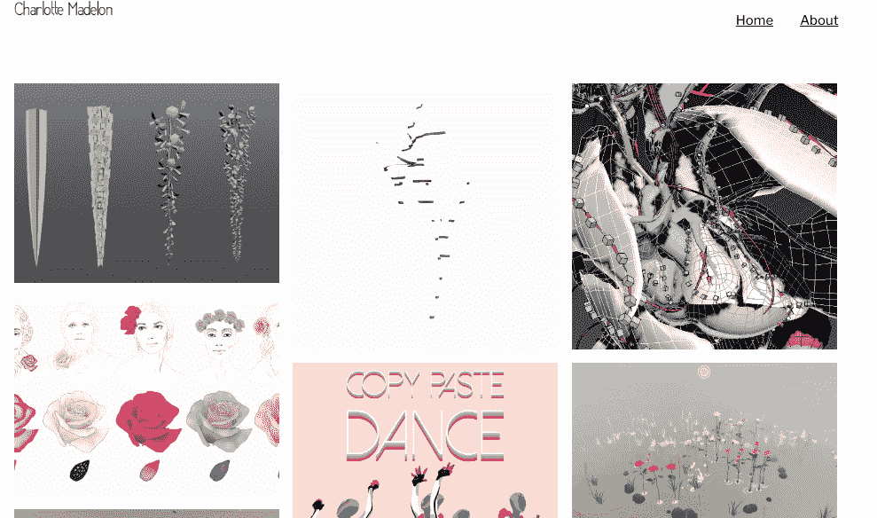
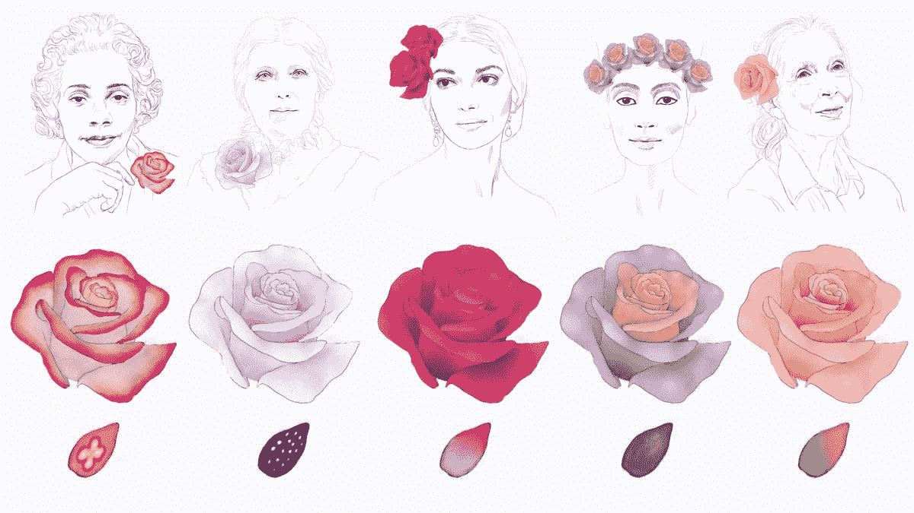
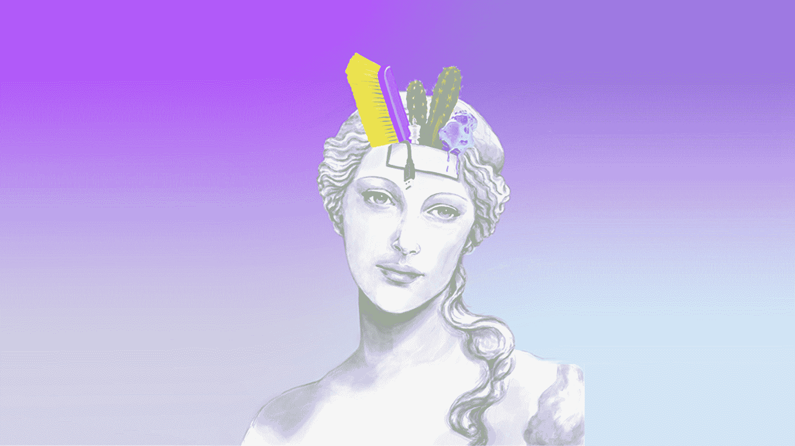
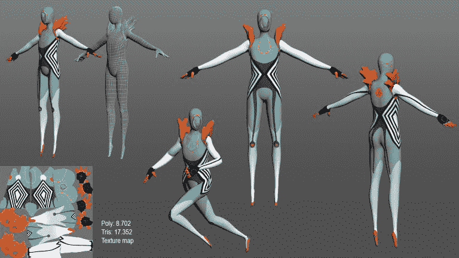

# 我最不畅销的游戏如何成为我最成功的病毒

> 原文：<https://www.indiehackers.com/interview/how-my-least-marketed-game-became-my-most-viral-success-7698e1b267>

## 你好。你的背景和工作是什么？

嗨，我是夏洛特·格伦斯文，我是一名游戏设计师。

我去了荷兰的乌特勒支艺术学院，我读了所谓的互动表演设计学士学位，这是戏剧和游戏的结合。当放在一起时，剧院变得互动，游戏变得更艺术。

我一直想做一些有意思的概念的游戏，而不是像主流游戏那样。所以我就这样做了，然后我毕业了，我有了一些其他的工作来养活自己，并且制作游戏。

两年前，我在 iOS 和 Android 上发布了我的游戏《罗莎的花园》。这是一个非常平静的关于玫瑰的园艺游戏。而且每一朵玫瑰都是以历史上一位著名的女性命名的，因为我想突出女性的历史，这是不常做的。

现在在一家叫 *Oooh* 的公司工作，真的很酷。我做游戏！

【T2

## 最初是什么激励你开始游戏设计的？

这不是什么大新闻！我当时 16 岁，一直很有创造力。我喜欢画画，我用自己的零花钱做衣服。

我给自己买了一个 Xbox，从第一个游戏开始，我就爱上了它。你能跑过世界上的每一个地方，穿过所有的建筑和东西，真是太神奇了。这个世界很大，有这么多的动画，整个游戏的环境和氛围都很棒。

16 岁的你已经上高中了，你知道你必须选择人生的下一步是什么。高中毕业后，我寻找可以选择的专业。所以我向下滚动到一些选项，我看到一个列表，上面写着*视频游戏*。

所以我最终获得了学士学位，教我如何制作电子游戏。然后我想，好吧，如果我能做一个游戏，我能在里面做*一切*。我可以创造世界，所有的艺术，动画和声音...我可以策划整个经历。我认为这是一个创造整个世界的机会。

这是一个非常天真的观点，从那以后我学到了很多，但这是让我进入游戏的原因！

## 你的游戏《罗莎的花园》是怎么建造的？

我用了一个月做了原型，并在网上发布了它。很多人都玩过，它在 Twitter 上也有很多粉丝。所以我意识到人们真的很喜欢这个游戏。我喜欢在上面工作，感觉很好，很平静。所以我继续工作了大约五个多月，粗略地说，完善了游戏，做了所有的营销工作。

我真的相信，如果你过得不好，它会在你的工作中表现出来。如果你从制作游戏中获得乐趣，游戏最终会变得更好。

TweetShare

在罗莎的花园之前，我做了很多原型。我做了很多未完成的项目。但我觉得这很正常。通常需要几年的时间才能理解什么是游戏设计，以及它是如何工作的。有很多关于它的文章，但这并不等同于实际制作它。然后你必须开发游戏设计的感觉。所以我要说，在一个突破性的游戏之前有未完成的项目是非常典型的。

## 吸引玩家了吗？你刚刚是不是把它放在 itch.io 上分享到 Twitter 上了？还是做了什么营销？

我没有做过很多市场营销，没有。实际上，这很有趣！我为我的其他项目做了更多的营销，这些项目很少受到关注，这主要是把它放在 Twitter 上，然后就结束了。当然，我做了一些采访。我制作了一个预告片和一个网站，还做了一个很好的新闻资料袋。

但对于我的其他游戏，例如，我投入更多的方式向记者推广它。但是对于罗莎的花园，我想我发出了三封电子邮件什么的，剩下的大部分是推特。

## 你能告诉我更多关于你为其他游戏做的市场营销吗？如果你在他们身上下了更大的功夫，但他们得到的关注却更少，你认为会发生什么？

我也不完全明白，因为这很奇怪，对吗？

我放了一个。Rosa 花园的 gif，成千上万的人都看到了。而我为我的其他项目向游戏记者发出了 300 封电子邮件，然后让两三个人发回了一些东西。

然而，罗莎的花园有人给我发邮件，而不是相反。很难定义是什么让一个项目成功。我希望我知道有什么区别，因为那会更容易！不仅仅是为了我的未来，也是为了行业里其他人的未来。

## 你的技术是什么？

Photoshop 和 [Unity](https://unity.com/) 。我开始在 Unity 工作，学会一种软件后，需要一段时间才能适应另一种软件。需要几个星期。

对于 Rosa 的花园来说，没有必要切换其他引擎或使用不同的插图软件，所以我很高兴继续使用我已经知道的工具。

## 你的游戏创作过程是怎样的，从构思到完成游戏？

一般都是从我想表达的一个想法或者一个概念开始，或者从一个图像开始。我真的从视觉灵感中得到很多。

然后我才开始在 Unity！我开始考虑实际的想法。通常好的游戏机制会在我进入 Unity 后出现。当我在玩的时候，一切都很自然。

## 在你制作游戏的过程中，有没有克服过什么重大的障碍或挑战？

是的。在我大学期间，以及之后的一段时间，我想变得非常熟练。我想让*成为最好的*游戏。我太想要这个了，以至于我忘记了最基本的东西，比如如何从中获得乐趣。我只是在磨砺，我对我的工作采取了非常斯巴达式的态度。

这是我再也不想做的事。在工作和制作游戏时享受乐趣是最重要的事情。我真的相信，如果你过得不好，它会在你的工作中体现出来。如果你从制作游戏中获得乐趣，游戏最终会变得更好。

## 什么样的游戏真正激发了你的灵感？

我真的还是很喜欢[反串](http://www.antichamber-game.com/)的开头。我认为这是一个非常非常好的游戏设计，尤其是在它发布的时候。

而我玩的最多的是比较经典的游戏，像[不饿](https://en.wikipedia.org/wiki/Don%27t_Starve)和[不含氧气](https://www.klei.com/games/oxygen-not-included)。我也很喜欢系统管理游戏。

## 有没有另一种类型的媒体让你觉得非常鼓舞人心，或者影响你的游戏？

我的很多作品都是受其他媒体的启发！我决定制作成游戏的概念通常不是来自其他游戏，而是来自我身边的事情，比如电影或艺术或与朋友的对话。所以它根据我当时感兴趣的东西而不同。

如果你玩得不开心，那么试着找出原因以及如何改变它。

TweetShare

也就是说，我确实会在其他游戏中寻找特定的 UI 选项，或者与特定类型的对象进行特定的交互。

## 你对刚刚起步的有抱负的游戏开发者或独立游戏制作者有什么建议？

这是一个棘手的问题，因为这是一个相当大的问题。

这真的取决于你想做什么，你想去哪里，因为如果你想在一家 AAA 级公司或那些大工作室之一工作，专业化更重要。但是，如果你想制作自己的游戏，或者在较小的工作室工作，更重要的是成为多面手。

我会说，不要犯我犯过的错误，太专注于记住如何享受乐趣。这才是最重要的。如果你玩得不开心，那么试着找出原因以及如何改变它。

## 我们可以去哪里了解更多？

你可以查看我的[网站](http://www.charlottemadelon.com/)，或者在[推特](https://twitter.com/CharlieMadelon)上找到我。

——[<picture id="ember8117489" class="user-avatar ember-view user-link__avatar"></picture>夏洛特·格伦斯文](/CharlotteMadelon?id=Ji6cCo9uqYdwXBXopAHJYOQoqBf2)，夏洛特·马德隆游戏创始人

## 想像夏洛特·马德伦游戏一样建立自己的事业吗？

你应该加入独立黑客社区！🤗

我们是几千名创始人，互相帮助建立有利可图的业务和副业。来分享你正在做的事情，并从你的同事那里获得反馈。

还没准备好开始使用你的产品吗？没问题。这个社区是一个认识人、学习和实践的好地方。随意[随便浏览](/)！

——[<picture id="ember8117494" class="user-avatar ember-view user-link__avatar"></picture>柯特兰艾伦](/csallen?id=ibTLPyjwVebnZjMGKvz6ztarnuV2)，独立黑客创始人

15votes