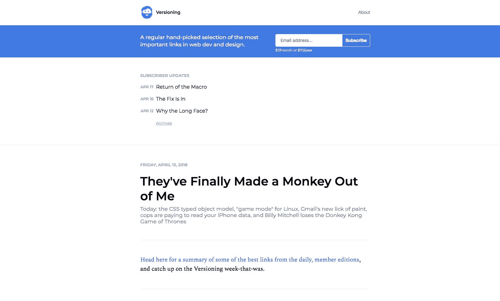
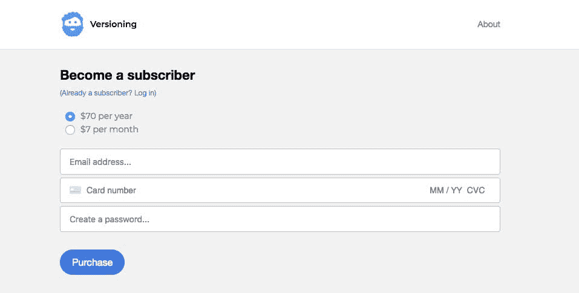
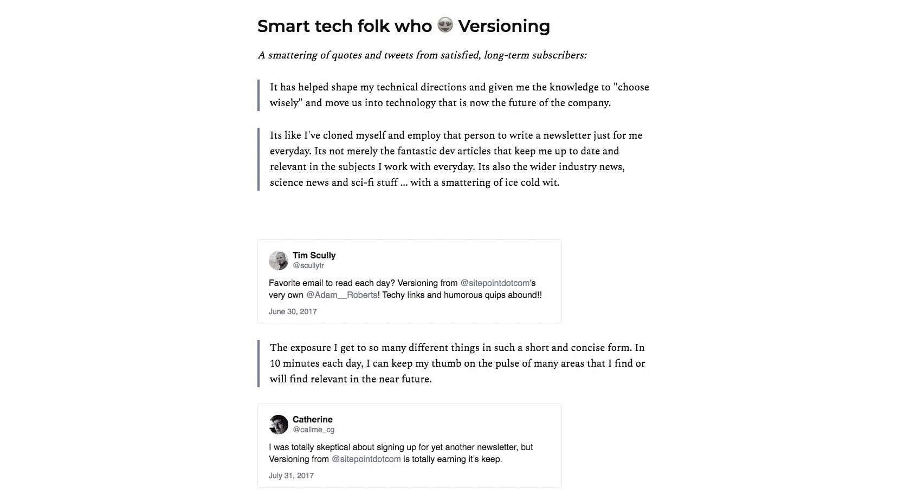

# 我的面向开发人员的新闻稿如何产生订阅收入

> 原文：<https://www.indiehackers.com/interview/how-my-newsletter-for-developers-generates-subscription-revenue-8fff929be1>

## 你好！你的背景是什么，你在做什么？

我是 Adam，我负责管理[版本管理](https://versioning.substack.com/)，这是一份每日时事通讯，旨在帮助 web 开发人员、设计人员和优秀的 web 人员了解最新动态并发展他们的技能。时事通讯是按月或按年付费订阅的，尽管有一个免费的内容层，免费会员每周至少会收到一份时事通讯。

我有新闻和内容方面的背景。我在新西兰的一家地区性日报工作，当我四年前搬到墨尔本时，我开始在 SitePoint 的内容团队工作。随着时间的推移，我开始担任编辑、执行编辑和内容负责人。我在公司工作后不久，就开始为 SitePoint 做一份免费的、有广告支持的时事通讯。除了我在 SitePoint 的主要角色之外，我还兼职做这个，随着时间的推移，我们的用户群增长到了 50，000 名。

但我想全身心地投入到这项工作中，为我们的用户提供更好的产品。我们没有加倍投放广告，而是决定选择付费会员模式，与一家名为 Substack 的新公司合作，我们是这家公司的早期合作伙伴。订阅者可以获得每日时事通讯，没有广告，还有其他更新，我认为这会让他们的生活更轻松，也让他们更了解自己的行业。在发布后的几个星期，我们已经走上了每月 2000 美元的轨道，包括每月和每年的会员资格，我们对版本控制的愿景远不止于此。我们有一个积极参与的会员群，包括免费订户，并希望随着我们的发展，让更多的人成为正式会员。

 

## 是什么促使你开始版本控制的？

我对技术和 web 开发有着浓厚的兴趣，在与我喜欢的人分享有趣的事情时，我找到了很多快乐和满足感。无论如何，我都会分享这些链接。我只是很高兴我以一种许多人认为有帮助和有价值的方式这样做。[版本](https://versioning.substack.com/)拥有强烈的用户兴趣和参与度。自从我们在 2014 年首次推出简讯以来，我看到了订户的强劲增长，我经常收到订户的感谢或支持消息。举一个极端的例子，2016 年，我有一个重大的健康问题，让我几个月没有行动，我收到了数百条来自订户的善意消息。

我还会定期调查观众，看看哪些有效，哪些无效。最近的一项调查针对的是长期会员，有些人是从一开始就这样做的，要求他们提供反馈，说明他们为什么一直订阅。这个反馈帮助我了解用户喜欢这个产品的什么。

当被问及他们喜欢时事通讯的哪一点时，我得到了 450 个正面回答！这里有一个例子:

“每天给我一些最好的链接，我喜欢它的分段方式(后端不是我喜欢的，所以我跳过了它)，而且它让我在工作中看起来很好，因为 a)我引用那些文章听起来很聪明，b)我对技术世界正在发生的事情有一个模糊的想法(即使只是浏览链接标题)，c)在松弛的渠道发布它们给我带来了荣誉(和温暖的模糊感觉)。”

另一个:

*“比起我订阅的其他任何一份时事通讯，我关注了更多的链接。一贯的有趣和有用。”*

尽可能多地了解你的听众和他们的喜好。

TweetShare

一旦我们决定这是我们想要尝试的一个方向，我们就向现有的观众发出了一份调查，试图了解他们是否有兴趣，以及每月的费用是否合理。自然会有一些担忧，但很多人表示对这个想法感兴趣。这项调查是我们用来改变我们的方法的信号之一，我们的方法是从拥有多个会员等级转变为更简单合理的方式。

我已经从之前的内容主管变成了全职。这实际上有多种原因。我想试着把版本化变成一个强大的产品，而不是在广告上双倍下注。一个全职的焦点将允许我进一步改进产品，并为订户制作更多的内容。另一方面，上面提到的健康问题正在产生影响，从内容负责人到较少监督(和管理)的角色转变实际上对我正在进行的恢复非常重要。所以有很多理由去尝试！

## 构建最初的产品需要什么？

我们讨论读者支持的模式至少有一年了。一旦我们决定实际尝试它，我们就为模型、各种层级以及成员将收到的额外内容的类型苦恼了很长时间。我们还花了很多时间来设计我们将使用的平台。后来，部分是因为新西兰很小，Substack 的创始人 Hamish McKenzie 和我有一个共同的朋友，他和我联系上了，在讨论了他们的产品和模型后，我们决定和他们一起去，用[版本](https://versioning.substack.com/)作为测试客户。

如果你相信市场/需求就在那里，不要害怕重新思考成功产品的方向。

TweetShare

我们继续与 Substack 的创始人密切合作，他们分享了帮助他人在该平台上推出付费简讯的经验和策略。他们还帮助我们微调我们的模型和公关策略。

一旦我们决定推出订阅者支持的产品，版本控制就从我大日子里的一个小任务变成了我唯一的关注点。

## 你是如何吸引用户和发展版本管理的？

直到最近，时事通讯还是免费的，这使得我们能够相对容易地建立起一个订户群。[版本管理](https://versioning.substack.com/)很幸运地获得了[网站](https://www.sitepoint.com/)的搜索引擎优化足迹，所以我们能够利用这一点将订户数量增加到 50，000 人。我们将版本控制集成到我们的高级学习平台 SitePoint Premium 的注册流程中。高级版和版本版解决了不同的需求:学习和新闻。

当我们决定改变这种模式时，我们首先必须仔细考虑如何与现有用户进行沟通。已经有一批忠实的、积极参与的观众了。OGs，我叫他们。他们中的一些人从 2014 年开始就已经注册了，所以我们决定给他们一个月的时间免费阅读该出版物的付费版本。付费版本的第一个月，用户还可以以优惠价格注册成为会员，该价格将永远有效。

## 你的商业模式是什么，你是如何增加收入的？

会员支付每月或每年的会员费来获取每日时事通讯和其他更新，因此商业模式相当简单。一旦 Substack 为平台增加了推荐功能，这将变得更加复杂，并且有望更加成功。

一旦我们决定让 OG 订阅者成为祖父，我们注意到他们中的许多人在免费月结束前就注册了，这表明了他们对出版物的重视，以及善待最积极、最忠诚的用户的重要性。

我们同时举办了一个介绍性的优惠活动，允许人们注册享受 30%左右的折扣，价格终身不变。这两种策略配合得很好，增加了新老用户锁定特价商品的紧迫性。在这个月的最后 10 天，我提醒订阅者即将到期的交易，这也有助于转换。

Substack 的模式是从你的收入中抽取一部分，这样他们就有动力与你合作来扩大出版物的会员基础。因为他们处理支持和基础设施，所以[版本控制](https://versioning.substack.com/)的唯一成本就是我的时间。

 

## 你未来的目标是什么？

将时事通讯进一步发展成为真正成功的付费出版物。我想证明这种模式既适用于企业，也适用于个人，或者作为一个附带项目。

就短期而言，我正试图尽可能多地了解为什么有些人热衷于付费模式，而有些人不喜欢，然后利用这些信息来改变产品的运作和营销方式。

## 你面临的最大挑战和克服的障碍是什么？如果你必须重新开始，你会做什么不同的事？

当我们决定采用付费模式时，我们的第一反应是创建许多定价层级(我想我们在某个阶段达到了大约六个层级...)每个都有自己的加入动机和奖励。很快就很明显这是站不住脚的。维护每个网站的内容和交易将是复杂且不值得的。

我认为这是一种冲动，源于对以前免费的东西收费的防御性感觉。给免费产品添加东西来证明价格合理很容易，但下注说:“这东西值点钱，这是我们认为它值的，你说呢？”也就是说，会员将获得更多的价值，因为我将有更多的时间和资源专注于提供有用的内容。

在宣布即将到来的变化时，我做的第一件事就是调查订户，看看他们关心什么主题。上线后我做的第一件事就是问新会员为什么要注册付费版。这是一种新型产品，很难知道用户流量是多少。

## 有没有发现什么特别有帮助或者有优势的？

多年来，我已经建立了一批忠实的追随者。许多善良、感兴趣和参与的人与我联系，给了我善意的话语、建议、想法，甚至是纠正。这意味着我可以将想法传递给他们。

多多求助。我总是就产品、营销、设计和财务决策咨询他人。

TweetShare

在我们决定实施这个想法的几个月前，我发出了一份调查，评估人们对一个无广告、受读者支持的产品的兴趣。确保你是开放的，尽可能多地接触用户群。

## 对于刚刚起步的独立黑客，你有什么建议？

多多求助。我总是就产品、营销、设计和财务决策咨询他人。因此，我挑选了一些我认为有助于增长的关键指标，并把重点放在这些指标上。

如果你相信市场/需求就在那里，不要害怕重新思考成功产品的方向。我们可以将产品作为广告支持的时事通讯，但是探索这个选项是值得的。这对读者更好，也希望对我们更好。

 

尽可能多地了解你的听众和他们的喜好。用数据，当然，还要问他们。如果你能与你的用户/订阅者建立融洽的关系，让他们参与到每一个阶段，那么你将会获得数据无法告诉你的有趣见解。你也会建立信任，他们会知道你做的任何决定都是经过深思熟虑的，并且考虑到了他们的利益。

## 我们可以去哪里了解更多？

前往[版本](https://versioning.substack.com/)查看免费帖子，并注册免费或付费会员。我也在[推特](https://twitter.com/Adam__Roberts)上。Twitter 上也有[网站](https://www.sitepoint.com/)和[网站](https://twitter.com/sitepointdotcom)。

请问我关于时事通讯、将免费产品转变为付费模式、策展、星球大战和塞尔达的问题。

——[<picture id="ember8088551" class="user-avatar ember-view user-link__avatar"></picture>【Adam Roberts】](/Adam_from_Versioning?id=zybjVALT6bNARABu7XNuBRZSs3G2)，版本化创始人

## 想要像版本控制一样建立自己的业务吗？

你应该加入独立黑客社区！🤗

我们是几千名创始人，互相帮助建立有利可图的业务和副业。来分享你正在做的事情，并从你的同事那里获得反馈。

还没准备好开始使用你的产品吗？没问题。这个社区是一个认识人、学习和实践的好地方。随意[随便浏览](/)！

——[<picture id="ember8088556" class="user-avatar ember-view user-link__avatar"></picture>柯特兰艾伦](/csallen?id=ibTLPyjwVebnZjMGKvz6ztarnuV2)，独立黑客创始人

32votes