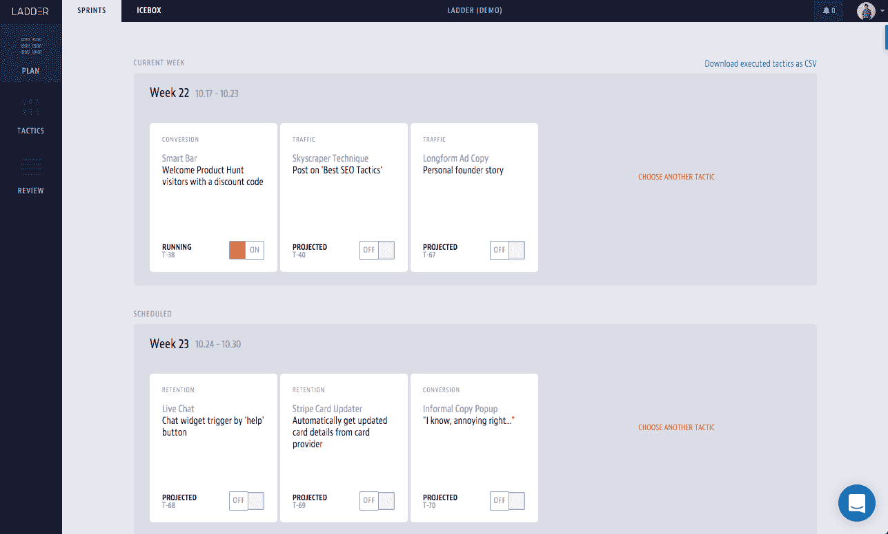

# 我的职业扑克技巧如何帮助我发展我的公司

> 原文：<https://www.indiehackers.com/interview/how-my-professional-poker-skills-helped-me-grow-my-agency-077dab1bfe>

## 你好！你的背景是什么，你在做什么？

我是乔恩·布罗迪，[阶梯](https://ladder.io)的首席执行官兼联合创始人。我们是一家增长机构，结合了机器学习和推荐引擎，为企业执行增长战略，提高投资回报率。

我的职业生涯始于一名职业扑克玩家，并在 Ladder 之前创办了两家初创公司。现在，我通过消除流程中的猜测来帮助公司解决增长问题。我们已经花费了 50，000，000 美元来发展数百家企业，从风险投资支持的初创企业到财富 500 强企业。

自 2014 年推出以来，我们每月的经常性收入已经增长到 20 万美元。

## 是什么促使你开始使用 Ladder？

在玩过扑克并建立了两家创业公司后，我很快发现增长被视为一门非常不精确的科学。传统的营销方式在 2014 年根本不起作用。营销人员更可能依赖于过去的工作或他们听到的二手工作，但这从来没有导致任何创造性和前瞻性的营销测试。

总是从“实际问题是什么？”这个问题开始

TweetShare

因此，我们的目标变成了建立一个流程、方法和技术套件，使我们作为营销人员能够科学地发展公司，甚至在我们手中没有完整数据的情况下运行假设驱动的测试。

[阶梯](https://ladder.io)的想法是在各种规模的企业中大规模复制这一过程，而我们的技术平台阶梯规划器使我们能够做到这一点。结合机器学习、策略和执行，我们可以使用规划器为任何商业案例找到正确的获胜策略组合。

## 构建最初的产品需要什么？

最初，构建我们的营销规划工具套件([阶梯规划器](https://ladder.io/planner))是一个 2.5 人的工作——一个首席技术官、我自己和一个自由设计师。我们花了 3 个月的时间构建了我们平台的初始版本，并开始在内部使用。

又过了 3 个月，我们测试了完整的 2.0 版本，并在内部继续使用。最终，我们开始和客户一起测试。接下来的一个季度，我们从客户、顾客和我们的策略师那里得到了所有的反馈，并对当时最基本的可行产品进行了迭代和扩展。

我的联合创始人迈克尔·泰勒(Michael Taylor)担任了 Ladder 的首席产品官，与我们的首席技术官一起工作，以我们从客户和 Ladder 的策略师那里获得的反馈为基础。我们最终招聘了一名额外的全栈工程师和一名 QA 工程师，将规划器带到下一个级别，这是我们使用 NodeJS 和 Angular 构建的。

[

阶梯计划者](https://ladder.io/planner) 

## 你们是如何吸引用户，壮大天梯的？

推荐->使用我们自己的方法和技术的不同在线渠道(内容+每次点击广告)。

我们最初的增长策略完全基于推荐。我们与 BBH 等大型营销机构以及希望与我们合作为客户增值的开发和设计商店建立了牢固的关系。我们的第一批客户是通过与 BBH 的关系进来的，在那里我们可以测试我们新设计的流程和方法。

早期你可能犯的最大错误之一就是不要立即充电。

TweetShare

起初，它工作得很好，但就像任何增长过程一样，随着时间的推移，它需要调整和适应不同的业务案例，因为我们增长并接受了更多的客户。我们改进了发展业务的方式，为新策略师创建了可重复和可扩展的招聘流程，现在正在美国和英国市场快速扩张。

我们利用推荐增长的成功聘请了一名内容营销人员(他现在是我们的营销总监),并开始自食其果。我们正在应用在发展我们的客户方面非常有效的流程、方法和技术平台，以发展[阶梯](https://ladder.io)，构建不同的数字渠道，从内容到 PPC(点击付费广告)到有机广告等等，以吸引更多的客户。

因此，我们最大的增长渠道是:

*   **PPC** :我们特别针对“增长黑客”和“B2B 营销”关键词
*   **内容**:我们的博客不仅推动了销售线索，还丰富了我们的销售流程
*   **伙伴关系**:与代理和加速器

我们定期在我们的博客上写关于我们营销计划执行工作的文章，并在整个过程中保持完全透明。

## 你的商业模式是什么，你是如何增加收入的？

我们的商业模式与 SaaS 公司非常相似，尽管我们是一家成长型公司。我们有固定的月聘，每月为客户提供固定数量的测试，与专门的策略师建立一对一的关系，以及来自内部设计和文案团队的支持。我们还通过我们的发展战略和客户服务总监提供高层支持和指导。

我们的收入增长(实际上对任何企业都是如此)在很大程度上依赖于带来新客户和增加现有客户的保留率。为此，我们组建了一个营销团队，为我们的战略团队提供了服务客户所需的技术、预算和支持，并聘请了一位客户服务总监来建立顺畅的客户关系。

我给寻求收入增长的企业家的一条信息是:不要忘记你当前的用户/客户/顾客。对增长的自然反应是向外寻找更新、更大、更好的交易。但这必须与留住人才的努力相平衡，因为否则你会以惊人的速度运转，损害你的增长潜力。

我们向客户提供 25%的性能保证——我们将保证我们运行的测试有 25%会成功，或者我们在这个月提供额外的测试。这种性能保证来自于我们对流程和方法的信心，这使我们的平均营销测试成功率[超过 40%](https://blog.ladder.io/growth-marketing) (而行业平均水平为 10-15%)。

## 你未来的目标是什么，你打算如何实现它们？

在产品方面，我们最近将工作机器学习算法引入了[阶梯规划器](https://ladder.io/planner)。他们帮助我们优先考虑和丰富我们的营销策略数据库，使我们的客户月度策略更加科学和投资回报率驱动。

对于未来，我们正在考虑发展这些机器学习算法，以便它们允许我们的策略团队在选择正确的策略时更加准确。我们目前的业绩与市场相比，我们希望在 2017 年增加增量。

在内部，我们将继续提高我们自身在需求挖掘和营销/销售漏斗增长方面的效率，就像我们为客户所做的那样。2017 年是我们像对待客户一样扩大最大赢家规模的时候了。

我们的规模在 2015 年至 2016 年间翻了两番，今年将翻一番以上，我们未来的计划是保持翻一番或更好的速度。

前进道路上最大的障碍将是我们的快速增长。当你增长如此之快时，最大的问题就出现在现金流方面，尤其是如果你没有筹集到大量资金的话。指数增长+资本资源需求是我们今年面临的最大挑战。

## 如果你必须重新开始，你会做什么不同的事？

我会从第一天就开始做，而不是等将近一年来建立我们自己的完整数字漏斗(营销和销售)。现在，好处是清晰而明显的，但在当时，这是关于优先顺序的——我们通过推荐快速增长，并不认为我们需要一段时间的营销和销售。

但是根据我们的模型，推荐是有限的。收取固定的月费而不是根据业绩收取高额费用，意味着我们每月只能获得固定的收入。我们的目标是更快地增长，每个月我们只能做到这一点，我们需要投资营销自己，这正是我们从 2016 年第三季度开始所做的。

我给寻求收入增长的企业家的一条信息是:不要忘记你当前的用户。

TweetShare

我也会更加无情地管理我们的高级团队和创始人的时间。这是我学到的一个重要教训:每次你和一个你没有充分信心会为你带来价值的人会面，都是浪费一个小时的时间和一个有信心的人交谈。作为独立黑客、创始人、CEO 等，时间是你最宝贵的资源...而时间是极其有限的。

## 你最大的优势是什么？有什么特别有用的吗？

我曾经是一名职业扑克玩家，这是我思考绩效营销的一个巨大优势。这两个学科彼此非常相似，因为你正在处理不完整的数据，但仍然需要做出明智的、数据驱动的决策，以增加你的底线。在扑克游戏中，你评估你的对手，收集他们的数据，并根据这些评估采取行动，根据什么战术最有效来重复你的方法。效果营销也是如此。

除了扑克之外，我以前还成功地用相对最少的资源推出了两个产品，一旦我们决定 [Ladder](https://ladder.io) 将建立自己的营销规划工具套件，我就有了推动项目从想法到执行的专业知识。因此，我们通过有效地组建核心团队来开发和设计阶梯规划器，从而非常迅速地进入市场。

## 对于刚刚起步的独立黑客，你有什么建议？

你在早期可能犯的最大的错误之一就是不立即对你正在构建和销售的东西收费。

我最大的建议是，在你开始构建或为此做任何事情之前，总是从“实际问题是什么？”确保你所做的一切都经得起考验。如果你把这个问题放在心上，你的事业就会有一颗指路的北极星。

## 我们可以去哪里了解更多？

*   天梯: [https://ladder.io](https://ladder.io)
*   天梯博客: [https://blog.ladder.io](https://blog.ladder.io)
*   推特: [@ThePokerCEO](https://twitter.com/ThePokerCEO)
*   LinkedIn: [/in/jonbrody](https://linkedin.com/in/jonbrody)

感谢阅读！如果你有任何问题，请在下面的评论区留言。

——[<picture id="ember8178978" class="user-avatar ember-view user-link__avatar"></picture>乔纳森·布罗迪](/JonathanBrody?id=ladder-owner)《天梯》的创作者

## 想像天梯一样自己创业？

你应该加入[独立黑客社区](/)！🤗

我们是几千名创始人，互相帮助建立有利可图的业务和副业。来分享你正在做的事情，并从你的同事那里获得反馈。

还没准备好开始使用你的产品吗？没问题。这个社区是一个认识人、学习和实践的好地方。随意[随便浏览](/)！

——[<picture id="ember8178983" class="user-avatar ember-view user-link__avatar"></picture>考特兰艾伦](/csallen?id=ibTLPyjwVebnZjMGKvz6ztarnuV2)，独立黑客创始人

10votes