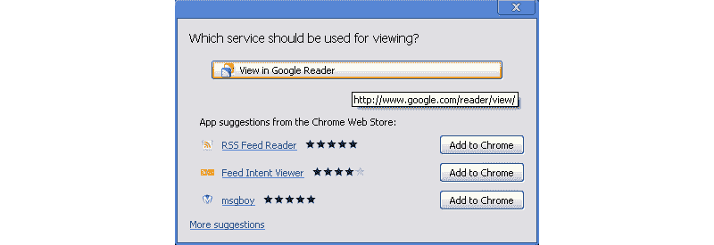
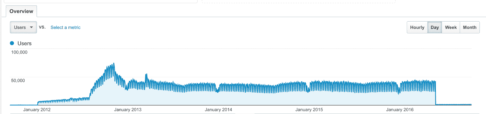
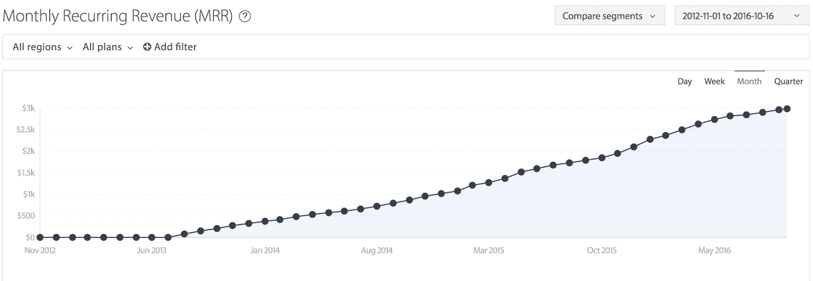
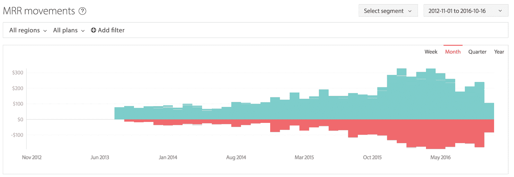
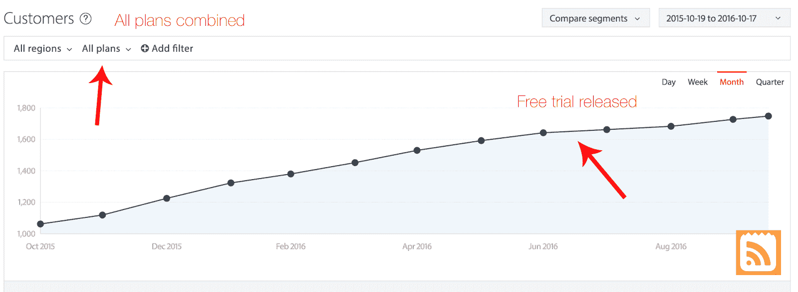
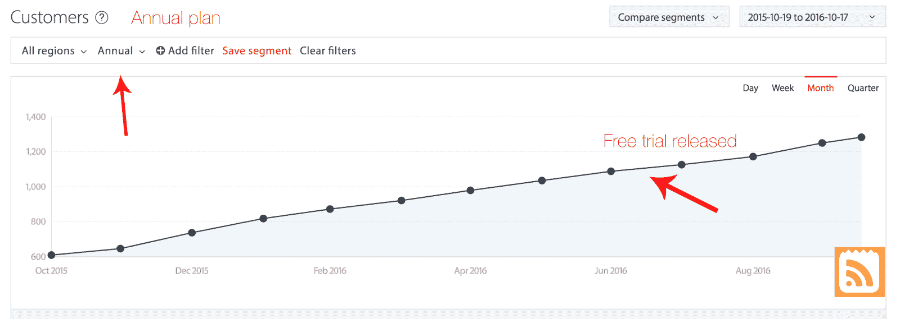
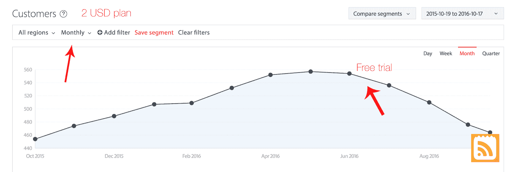
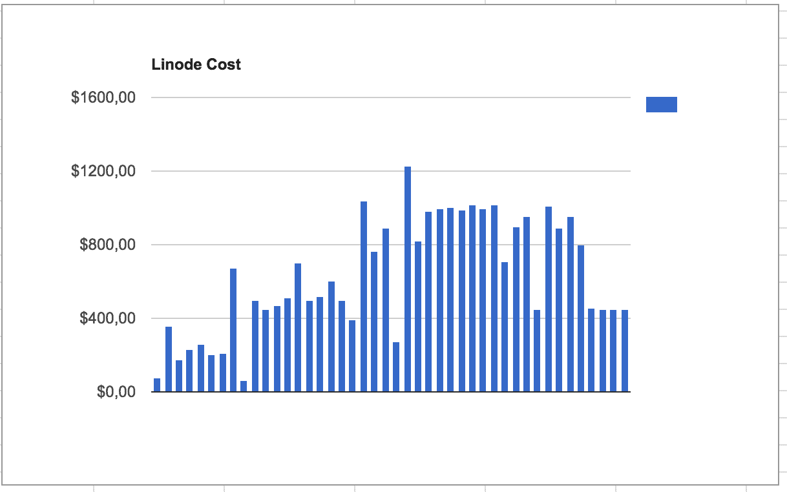
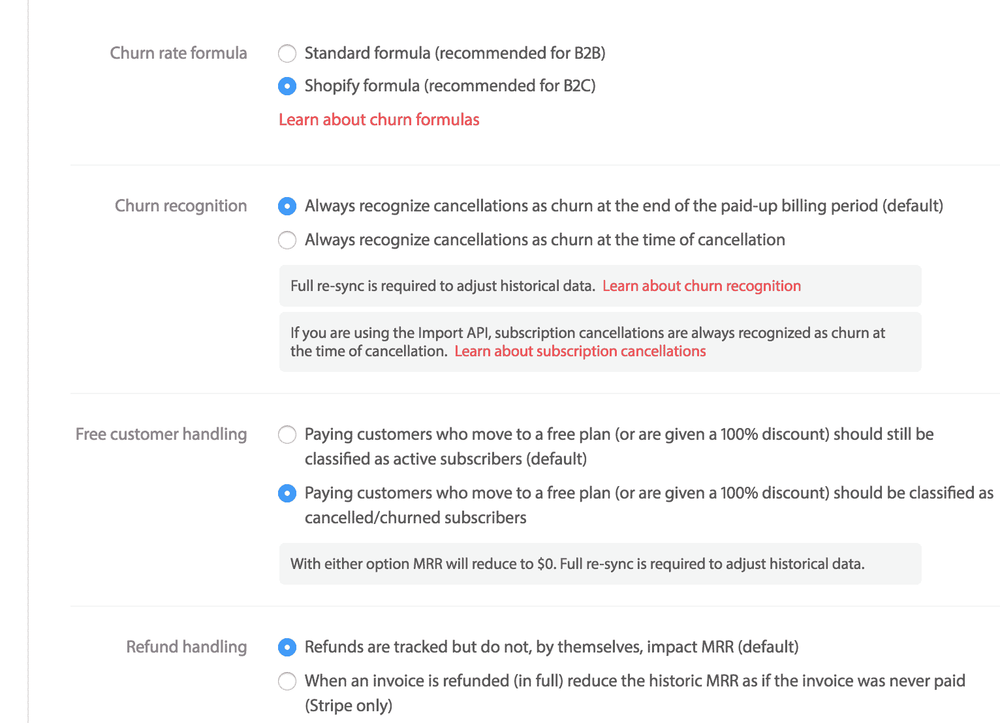

# 我的 RSS 阅读器如何从 500，000 多个用户中每月赚 3，000 美元

> 原文：<https://www.indiehackers.com/interview/how-my-rss-feed-reader-makes-3-000-mo-from-500-000-users-46ed43e8d5>

## 告诉我们关于你自己和你正在做的事情。

你好！我叫 Erik Rothoff，我和 Johan(我的双胞胎兄弟)和 Mattias 一起开发一个叫做 [feeder](http://feeder.co) 的 RSS 阅读器。Johan 做设计，Mattias 专注于用户体验，而我是程序员——我让一切正常运行。

[feeder](http://feeder.co) 允许人们关注 RSS 和 Atom 提要，并以不同的方式获得通知。我们有一个 Chrome 扩展，一个 iOS 应用，一个 web 应用，很快也会有一个 Android 应用。

我们的竞争优势在于我们总是试图以简单的方式做事。用户体验对我们来说很重要。一个非常受欢迎的功能是你可以设置更新快至 1 分钟。与其他人相比，我们的默认值仍然快得惊人:10 分钟。除了我们的用户像我们一样是技术高手，我们还有很多营销人员、律师和企业作为客户，对他们来说快速更新是至关重要的。

## 你是如何开始使用 feeder 的？

这要从 2010 年我第一次从火狐转到 Chrome 开始说起。我怀念浏览器中的 RSS 功能，所以在一家瑞典软件公司的暑期实习期间，我开始在业余时间开发 [feeder](http://feeder.co) 。

2011 年，我和哥哥高中毕业，决定做一名自由职业者。一年后，我们有了足够的积蓄，可以试着在父母的备用房间里全天工作。在 3 个月的时间里，我们完全重写和重新设计了 Chrome 扩展。我们当时所做的工作仍然是整个产品的基础。

3 个月后，我在一家令人兴奋的瑞典初创公司找到了一份全职工作，iZettle 和 feeder 再次成为我的全职爱好项目。在这一点上，我们开始尝试通过增加付费选项来赚钱。

## 你是如何找到时间和资金来开发 feeder 的？

由于 [feeder](http://feeder.co) 一直以来都是一个爱好项目，我们从来不需要任何资助。我们全职工作的 3 个月由我们的自由职业者资助。从那以后，我们将所有收入重新投入到业务中。

至于时间，我们喜欢编码和设计东西，所以在下班后工作对我们来说是很自然的。

## 你做了什么来吸引用户和增长 feeder？

迄今为止，我们从未做过任何广告或营销活动。 [feeder](http://feeder.co) 有机增长，也是因为威盛在正确的时间出现在正确的地点。Chrome 网上商店是增长的主要驱动力。

在几个月的时间里，我们以每天 1000-3000 个活跃安装的速度增长。这是因为谷歌正在 Chrome 中试验一项名为 Web Intents 的功能。每当用户访问一个带有 RSS 提要的网站时，就会出现一个小弹出窗口，询问“你想用哪个 Chrome 应用/扩展来打开这个提要？”feeder 位列第二，名为“RSS 阅读器”:

如果你看下面的图表，你可以看到 Web Intents 发布的地方:

大约在我们达到 500，000 次活跃安装的时候，谷歌停止了 Web Intents 功能，我们的增长停滞不前。我们保留了我们的用户群，但我们不再以那种疯狂的速度增长了。

很长一段时间，只有我和我哥哥在经营，我们对营销或让人们谈论产品一无所知。从外部来看，好的营销看起来就像一个好的产品发布了。人们很高兴，所以他们开始谈论它。这就是我们试图要做的:制造一个好的产品。随着时间的推移，我们知道这并不容易。人们不会只是“开始谈论”某件事。

## 你的营收背后有什么故事？

我们的扩展是免费的，为了赚钱，我们创建了一个托管版本，并试图将我们的免费用户群转化为付费用户。 [feeder](http://feeder.co) 已经随着时间的推移而发展，我们的目标是让它比免费版更有吸引力。这是我们收入的图表:

据 [Chartmogul](https://chartmogul.com) 称，我们的付费用户群每月产生 2982 美元的经常性收入。

我们开始从扩展区内部接受捐赠。令我们惊讶的是，我们实际上得到了一些，大概每月 100 美元左右。然而，正如任何想靠自己的生意生活的人可能会看到的那样，这是不可持续的。

2013 年，我们发布了名为 feeder pro 的产品。有了它，你可以在电脑之间同步你的订阅源。数据库托管在我们的服务器上。用户将为终身账户一次性支付 20 美元的费用。我们基本上对托管软件实行软件许可定价(一次性付款)，所以为了能够继续运营，我们需要依靠持续不断的新用户。对我们来说，这就像一个第 22 条军规:没有新用户，我们不可能永远托管它，而新用户的托管成本会更高。

一年后，我们转向了基于订阅的模式:每月 2 美元或每年 20 美元。我不禁想到，如果我们只收 5 美元而不是 2 美元，我们就能全职支持一个开发人员。如果我们向每个用户收取 10 美元，我们就可以拥有一间办公室了！这是一个诱人的想法。就在最近，我们还在考虑稍微提高价格的想法。如果和多少，我们还不知道。

如果我们决定改变价格，这将允许我们加快为 [feeder](http://feeder.co) 开发新的更好功能的速度。我们真的希望我们的用户明白，如果他们每月不得不支付更多的费用，这将对他们有什么好处。在产品生命周期中改变价格是很自然的事情，但是你需要让你的客户群成为这个过程的一部分，并且清楚地向他们解释你的理由。

[feeder](http://feeder.co) 自创建以来，订阅量每月都在增长。这并不意味着我们没有失去客户(用 SaaS 话说就是流失)；这只是意味着我们增加的比我们搅拌的多。我们的流失率相当高，因为产品的性质(激烈的竞争，产品的复杂性)和 RSS 的复杂性。在下图中，绿色代表新客户，红色代表流失客户:

今年 7 月，我们推出了为期 14 天的免费试用。所有关于这个主题的文献都说这是个好主意。下面我画出了我们的结果。总的来说，这并没有多大区别。增长有点停滞，但这可以用转向免费试用时新注册的滞后来解释:

年度计划讲述了一个类似的故事。现在下定论还为时过早，但增长看起来仍然不错:

这对我们的月度计划产生了巨大的影响。根据这个图表可以得出结论，每月计划的唯一作用是让人们尽可能便宜地试用它。随着免费试用，这完全消除了需要。哎呀:

收入不是利润。因此，不谈成本，只谈收入就没意思了。 [feeder](http://feeder.co) 主要托管在 Linode 上，但是最近我们把一些东西转移到了 AWS 上。下面是费用细目。

通过改用 Cassandra，并将帖子内容存储在亚马逊 S3 上，而不是 Linode 上的 MySQL 数据库，我们能够将成本削减近一半:

亚马逊 S3 是一个非常划算的大型物品键值存储。唯一真正让我们花钱的是写作。此外，在交易电子邮件方面，Amazon SES 的价格非常有竞争力:

## 你未来的目标是什么？

我们的目标是建造对我们有用的东西。如果我们成功地为我们的用户提供价值，收入将增长到在我们有生之年创造可持续发展的业务。我们现在正在制定未来的计划，我们都非常兴奋地开始实施[馈线](http://feeder.co)的“大计划”。

## 如果你必须重新开始，你会做什么不同的事？

没有两个支付提供商！回到 Paypal 收购 Braintree 的前一天，我们不得不为信用卡和 Paypal 交易手动整合这两者。让这两者协同工作一直是一件痛苦的事情。我想我已经花了 50%的时间来计算付款。它还限制了我们可以使用哪些第三方工具进行度量等。

## 到目前为止，对你的旅程真正有帮助的是什么？

运气和耐心。如果没有 Chrome 的网络意图，我们今天可能不会在这里。

感谢 Mattias 的加入，我们开始更好地了解我们的用户。在了解他们的同时，我们真的开始感激用户在过去几年中给予我们的支持。我们真的很感谢那些了不起的用户，现在我们正尽最大努力回馈他们。

## 你会和有抱负的独立黑客分享什么建议？

SaaS 指标很难。真的很难。如果你想自己卷，你会失败的。一个简单的问题，“你有多少活跃的订阅？”非常复杂。如果你认为这和计算系统中有效信用卡的数量一样简单，那你就错了。如果一个用户已经取消了他们的订阅，但支付了一个完整的时期，他们被算作活跃或搅动？答案是:看情况。你想忽悠谁，为什么？

对于读到这里的任何人:请删除你内部管理工具中的用户图表，并获得一个合适的工具，如 [ChartMogul](http://chartmogul.com/) 。([智能定价](http://www.priceintelligently.com/)有一个叫 [ProfitWell](http://home.profitwell.com/) 的服务，也真的很滑头。)我们曾经有自己的图表。大错特错！

这可能有点贵，但 Chartmogul 提供了很多很酷的数字。它同时适用于 Paypal 和 Braintree。加上马蒂亚斯是一个金融呆子，所以对我们来说这是值得的。我敢打赌您的 SQL 报告没有这样的设置:

## 我们可以从哪里了解更多信息？

我希望我们可以向你推荐一个关于这里发布的每个问题的详细博客帖子，但是我们还没有足够的能力来发布这些东西。我们已经开始在[blog.feeder.co](http://blog.feeder.co)发布博客。

我们希望你们都能在 feeder.co[免费试用一次，之后如果你们能对我们的产品提出反馈意见，我们将不胜感激，这样我们就能根据你们的想法进一步改进产品。Mattias 个人非常希望听到并讨论您的反馈。](http://feeder.co)

无论我们的用户在哪里，我们都在努力让自己更容易被看到。如果你有任何问题，我们总是在 [【电子邮件保护】](/cdn-cgi/l/email-protection#10636560607f6264507675757475623e737f) 收听。我们也有博客、推特和 Instagram。我们的独立黑客论坛账号是 [feederco](/user/feederco) ，我们将在下面的评论中回答更多的问题。

你也可以在下面留言，我会尽量回复你的！

—[<picture id="ember5298414" class="user-avatar ember-view user-link__avatar"></picture>feeder co](/feederco?id=xGVnUslB6ZOguplGuscePyYWYs72)，feeder 的创建者

## 想像 feeder 一样自己创业？

你应该加入独立黑客社区！🤗

我们是几千名创始人，互相帮助建立有利可图的业务和副业。来分享你正在做的事情，并从你的同事那里获得反馈。

还没准备好开始使用你的产品吗？没问题。这个社区是一个认识人、学习和实践的好地方。随意[随便浏览](/)！

——[<picture id="ember5298419" class="user-avatar ember-view user-link__avatar"></picture>柯特兰艾伦](/csallen?id=ibTLPyjwVebnZjMGKvz6ztarnuV2)，独立黑客创始人

9votes