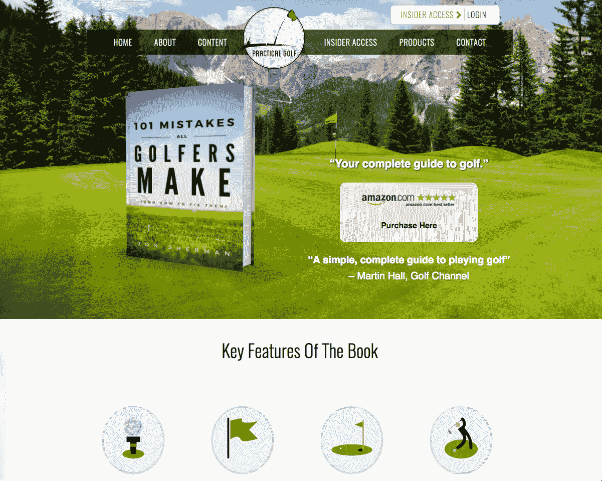
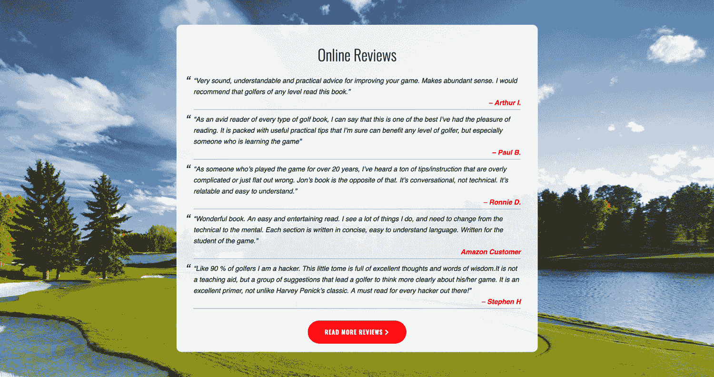

# 我自己出版的书是如何解决利基问题并在亚马逊网站上排名第一的

> 原文：<https://www.indiehackers.com/interview/how-my-self-published-book-solved-niche-problems-to-reach-1-on-amazon-6f809918c2>

## 你好！你的背景是什么，你在做什么？

我是乔恩·谢尔曼，一个狂热的高尔夫球手，前谷歌人，互联网营销呆子。

2015 年，我创建了[实用高尔夫](https://practical-golf.com/)，这是一个专注于为日常高尔夫球手提供诚实的教练建议的博客。我没有运营网站、专业写作、指导或建立在线受众的经验。在短短两年多的时间里，我已经成功地将读者人数增加到每年 50 万以上，并自己出版了一本畅销书:[所有高尔夫球手都会犯的 101 个错误](https://practical-golf.com/101-mistakes-golfers-make/)。

我的网站有多种收入来源(代销商收入、高级会员、我的书和咨询)，但在这篇文章中，我将专注于我是如何写这本书的，这本书产生了超过 25，000 美元的收入。

 

## 你写这本书的动机是什么？

在高中和大学期间，我一直是一个狂热的读者，喜欢写作。在我的内心深处，我认为出版一本书会很酷——我只是不知道会写些什么。

当我在 2015 年开始写博客时，我决定用我在 20 多年的高尔夫生涯中学到的一切来帮助其他人更好地享受这项运动并取得进步。我当时并不知道，但我写的前 30 篇左右的文章确实是我的书的概念证明。人们似乎很喜欢我的观点，有一天我半夜醒来，决定把我所有的想法写成一本书。

如果我出版了一本书而没有我的博客，我几乎可以肯定它不会做得这么好。

TweetShare

回想起来，这似乎有点牵强，因为我没有职业作家的经验。然而，我对我给高尔夫球手的信息充满热情，我相信无论我写什么都会帮助他们。总的来说，我认为这是我的主要动力。

## 写作过程是怎样的？

我最初对《T4》一书的想法与我最终创作的完全相反。我花了大约一个月的时间不断地写关于高尔夫的章节。当我完成一份草稿后，我把它发给了朋友和家人。他们的反应很友好，但我可以说他们没有被内容打动。

回想我写的东西，并没有那么好。但是如果你想成为一名作家，你必须写…很多。

然后我突然想到，我想做一个非正式的参考指南，它不遵循非小说类书籍的传统格式。我认为记录高尔夫球员犯的所有错误并提供合理的解决方案会很有趣。我的目标是写一些任何水平的高尔夫球手都能在一个下午读完的东西，并得到如何提高的真正建议。

101 似乎是一个听起来朗朗上口的数字，于是标题[“所有高尔夫球手都会犯的 101 个错误(以及如何改正)”](https://practical-golf.com/101-mistakes-golfers-make/)诞生了。一旦我做了这个决定，剩下的就很容易了。我绞尽脑汁想了几个月，写了一些小章节。我给自己设定了一个在年底前完成所有事情的最后期限，这最终成为激励自己完成工作的一个非常重要的方式。就我个人而言，我发现当你有无限的最后期限时，你就不会有那么大的紧迫感。

我还受益于我的网站是内容的试验场。我为这本书本身制作的内容是原创的，但潜在的想法与我知道做得很好的博客内容有关。

幸运的是，我的妻子是一名经验丰富的文字编辑，所以当我完成章节时，她会编辑它们，这样就省下了雇佣其他人的钱(如果你打算出版一本书，你绝对应该这么做)。我唯一真正的现金支出是大约 60 美元购买一个 Word 模板，该模板将转换为亚马逊的平装出版标准。

我用了一个叫做 [Canva](https://www.canva.com/) 的伟大网站来设计书的封面，总的来说，在整个过程中唯一真正的投资是我的时间，你永远不要把它当成没有价值的东西。

## 所以现在这本书完成了。你是如何出版并传播出去的？

说到自助出版，基本上你有两种选择。你可以直接销售给你自己的观众，并保留几乎所有的利润。或者你可以去亚马逊。(也有其他渠道，但老实说，亚马逊是镇上唯一真正的游戏。)

当你在亚马逊上出版一本书时，你是在向海滩上释放一粒沙子。

TweetShare

我为[的 101 个错误](https://practical-golf.com/101-mistakes-golfers-make/)选择了亚马逊，因为当时我的网站受众有限。这是一个简单的决定，因为这是把它推销给几千名高尔夫球手或几百万高尔夫球手的区别。代价是向亚马逊放弃 33%的收入，我认为这是值得的。

如果你搜索自助出版论坛，你会看到大量标题为“为什么没人买我的书？”虽然这个问题有几个答案，但我相信大多数作者不会成功，因为他们没有读者来帮助给这本书“打气”

当你在亚马逊上出版一本书时，你是在向海滩上释放一粒沙子。唯一的准入门槛是互联网连接和电脑，这就是为什么目前有数百万本独立书籍。

我的策略是利用我在高尔夫行业的关系和我的读者，在发行时获得积极的评价，并在开始时获得足够的销量，使其进入高尔夫书籍销量排行榜的前 20 名。我的想法是，如果它有积极的社会证明，并且排名靠前，那么希望那些从未听说过我或我的网站的人会被吸引去购买它。

## 那很有趣。你能更深入地谈谈这个策略吗？

当然可以。我的第一个行动是为我的书在[销售页面上获得一些官方报价。我联系了那些通过我的网站与我建立关系的人，问他们是否有兴趣阅读这本书并给出报价。幸运的是，他们都很乐意这样做，并给了我一些很棒的报价。](https://practical-golf.com/101-mistakes-golfers-make/)

任何亚马逊的顾客都知道评论是他们销售平台的核心。与 3 星相比，人们更有可能购买 4 星评价的商品。我列出了在社交媒体(主要是 Twitter)上最热心支持我的 50 个人。我逐个联系他们，告诉他们我写了一本书，简单地问他们是否有兴趣阅读，然后在亚马逊销售页面上提供诚实的评论。

几乎所有人都坚持了下来，当这本书上市销售时，它有一个很好的有机评论集。有时人们会尝试用付费服务来玩亚马逊系统；我不建议那样做。

 

所以现在这本书有了一个干净的销售页面——正面的官方引用和一堆来自真正读过它并喜欢它内容的人的五星评论。拼图的最后一块是成功发射。

这就是拥有一个现有的观众真正得到回报的地方。大约一年来，我通过博客向高尔夫球手提供每周建议，建立了一个电子邮件列表。在正式发布日，我写了一封电子邮件宣布这本书，点击发送，并希望一切顺利。

我紧张地看着第一天的销售数字，到了下午，事情开始变得活跃起来。当我第二天早上醒来时，这本书已经卖出了几百本，是亚马逊上排名第一的高尔夫电子书，也是该类别中排名第二的畅销书。

因为我能够给它最初的推动力，幸运的是事情从那里开始了。这本书能够在 2016 年的大部分时间里保持势头，并保持在前 20 名，销售了几千本。

## 对于想自己出版的独立黑客，你有什么建议？

我为写或推销我的[书](https://practical-golf.com/101-mistakes-golfers-make/)所做的一切都没有那么复杂。如果你想自己出版一本书，理论上很容易。

然而，获得销售才是真正的 X 因素。不言而喻，你应该知识渊博，充满激情，写一些人们会从阅读中获得价值的东西。如果你缺少了这些元素中的大部分，那么你的书将没有成功的机会。

回想我写的东西，并没有那么好。但是如果你想成为一名作家，你必须写…很多。

TweetShare

如果我出版了一本书而没有我的博客，我几乎可以肯定它不会做得这么好。我相信在网上建立一个读者群是任何作者能做的最有价值的事情。你需要一群支持者来帮助传播你的言论。竞争是激烈的，我真的相信这是我的王牌。

也有其他作家能够在没有读者的情况下推出书籍，但如果你采用这种策略，你的胜算将非常不利。

## 我们可以去哪里了解更多？

请随意查看我的博客[实用高尔夫](https://practical-golf.com/)，或者关注[脸书](https://www.facebook.com/practicalgolf/)或[推特](https://twitter.com/practicalgolf)。

你也可以在下面给我留言！

—[<picture id="ember8100487" class="user-avatar ember-view user-link__avatar"></picture>JD 1623](/jd1623?id=5sQLUiGBb6NRPemHyng3wIbmytx1)，实用高尔夫的创造者

## 想像实用高尔夫那样建立自己的事业？

你应该加入[独立黑客社区](/)！🤗

我们是几千名创始人，互相帮助建立有利可图的业务和副业。来分享你正在做的事情，并从你的同事那里获得反馈。

还没准备好开始使用你的产品吗？没问题。这个社区是一个认识人、学习和实践的好地方。随意[随便浏览](/)！

—[<picture id="ember8100492" class="user-avatar ember-view user-link__avatar"></picture>考特兰艾伦](/csallen?id=ibTLPyjwVebnZjMGKvz6ztarnuV2)，独立黑客创始人

5votes