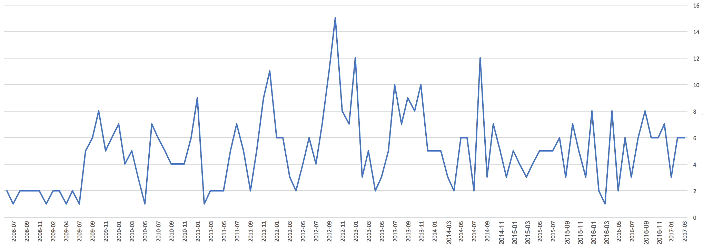
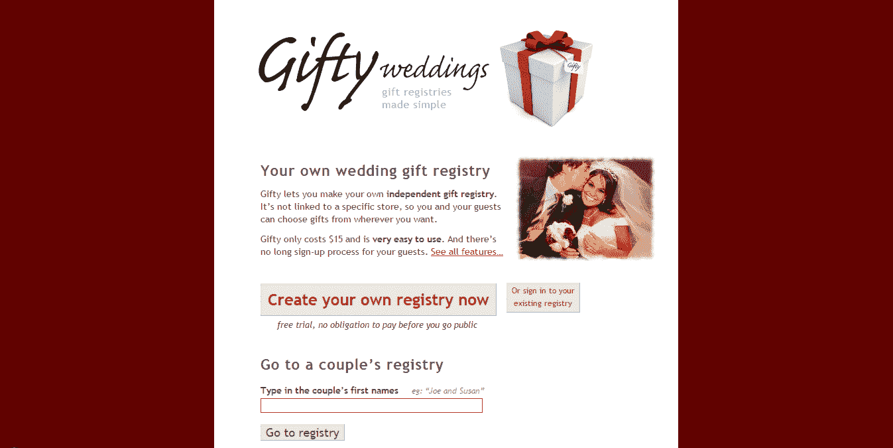

# 十年来，我的副业是如何帮助我支付账单的

> 原文：<https://www.indiehackers.com/interview/how-my-side-project-has-helped-me-pay-the-bills-for-10-years-411ce6dcc7>

## 你好！你的背景是什么，你在做什么？

我叫本·霍伊特，是一名新西兰软件工程师，目前住在新泽西州。在我每天去纽约上班的路上，我都在做一些个人项目。

我开发并运营 [Gifty Weddings](https://giftyweddings.com/) ，这是一个简单的结婚礼物登记处，不依赖于任何特定的商店。情侣们只需从任何地方添加礼物创意，客人来登记处选择礼物，并在购买后划掉。该网站主要由新西兰的夫妇使用——我们仍在努力争取美国市场的客户。

Gifty 不是典型的独立黑客的成功故事。在过去的几年里，我们每个月大约赚 150 美元，但这是一个有趣的、低维护的网站，它让我和我妻子的晚餐约会预算保持盈利。

## 是什么促使你开始参加礼物婚礼？

回到 2008 年，我哥哥要结婚了，我告诉他我会做一个简单的婚礼注册网站作为结婚礼物。添加一个支付系统并向其他人开放并不难——所以我做了。我在一个周末写了大部分代码，并在之后不久发布。

很多参加他婚礼的客人告诉我[礼物](https://giftyweddings.com/)有多好用。这证实了我的想法，我花了几周时间完善了一些东西，适当地整合了 PayPal，并使登陆页面变得更好。

让人们不用注册或付费就能很容易地试用演示。

TweetShare

Gifty 过去和现在都是我的副业。除了我自己的婚礼之外，我对婚礼或礼物登记没有真正的经验——我只是实现了我想要的，以及其他人随着时间的推移要求的一些功能。

## 构建最初的产品需要什么？

我在一个周末写了最初的原型，然后在接下来的几周内根据家人和朋友的反馈对它进行了完善。我使用我熟悉的工具(Python、PostgreSQL 和老派的 web 1.0 技术)开发它，这样我就不用花时间学习新系统了。

当时，我作为一名软件开发承包商和我的兄弟[一起工作，他们让我使用他们的一台服务器来托管网站。所以除了域名，我想我没有花一分钱去开发。](https://brush.co.nz/contact/)

我非常相信保持事情简单，这可以很好地解释为构建一个“最小可行产品”。我只把我认为我哥哥会想要的特性放在他的注册表中，这样有助于避免范围蔓延。肯定有从竞争中学习的地方，但对于 [Gifty](https://giftyweddings.com/) 来说，我基本上没有看其他任何东西，也没有试图复制功能。

## 你是如何吸引用户和发展礼物婚礼的？

关于结婚礼物注册的伟大之处在于你有很多人(婚礼宾客)来你的网站使用一对夫妇的注册。所以每一对注册的夫妇，你都会得到一堆免费的口头广告。这些年来，很多人都以这种方式注册了。

几年后(2012 年末)，我们在 AdWords 上花了几百美元，这并不是真正的收支平衡，但确实注入了一批新客户，并帮助口碑在这个基础上增长。

此外，我们还涉足线下和平面广告(婚礼杂志)。它很贵，也很难衡量，但我们看到了一些注册用户。直到今天，我们还是收到了一些新人的报名，他们在一份新西兰在线报纸上对一篇[五年前的婚礼文章](http://www.stuff.co.nz/life-style/weddings/blogs/ready-or-knot/6746035/The-gift-registry)的评论中提到了 [Gifty](https://giftyweddings.com/) 。

下面是自该服务开始以来每月 Gifty 注册的图表。由于广告支出，你可以看到 2012/2013 年的峰值。我们已经慢慢地但肯定地从非常小的规模发展到非常小的规模(现在平均每个月有 5 个注册用户):

2008 年至 2017 年间的 Gifty 注册。

今天，我们通过朋友推荐获得大约一半的客户，另一半通过谷歌获得。少数来自其他来源。我们的外卖是:*口碑最大化！*

## 你的商业模式是什么？

我们的商业模式非常简单:我们向使用我们网站举行婚礼的夫妇收取一次性费用(目前新西兰客户为 35 新西兰元，其他地方为 25 美元)。这对夫妇不必马上付钱——他们可以创建一个列表并尝试一下，他们只需在想让客人看到时付钱。

最初，我们收取 20 新西兰元，但我们发现，当我们将价格提高到 35 美元时，似乎对我们的注册人数没有太大影响。我们还没有足够的勇气将其推过 35 美元，但我们可能应该测试一下。

如上图所示，我们目前每个月有 5 到 6 个注册用户。钱不多，但能让我们保持动力！

关于 Gifty 的一个独特之处是我在其他地方没有真正看到过的，那就是尝试它是多么容易。只需点击“创建注册表”按钮，你就可以了。您可以在输入您的电子邮件地址之前尝试一下，看看它是什么样子的(当然，在您向我们支付任何费用之前)。

我们开始使用 PayPal，但在大改造期间(见下文)，我们改用 Stripe。我不能说 Stripe 有足够多的优点——它们的 UI、文档和 API 都很棒。

我们已经涉足代销商链接，但大多数客户不会利用我们可以从中获得代销商资金的网站，所以不值得。

## 九年是很长的时间。那段时间你更新过网站吗？

令人惊讶的是，我们用基本相同的代码和设计运行了近八年，只有很少的调整。我们每个月都会收到一些客户支持邮件，但除此之外，我们几乎没有做什么来维持网站的运行。

从小处着手——不要害怕继续小处着手！

TweetShare

然而，去年我们做了一次重大的整改——网站开始看起来非常过时，用户界面在手机上也不太好用(当客人在购物时想要划掉礼物时，这一点很重要)。所以我重新设计并改写了整个故事。这项技术是陌生的，所以它可能比 2008 年的初始版本花了更长的时间！

你可以[在这里阅读更多细节](http://benhoyt.com/writings/gifty/)——对注册表 UI 进行了大量改进，登录页面如下所示:

 

对此:

 

## 你未来的目标是什么，你打算如何实现它们？

多年来，只有我一个人在做[礼物](https://giftyweddings.com/)。今年晚些时候——在改造之后——我们希望在宣传方面投入更多，并试图打入美国市场。

我的妻子也加入进来，帮助推动我们的[脸书页面](https://www.facebook.com/GiftyWeddings/)，并帮助脸书和其他广告。一天之内我们的员工数量翻了一番！

我们的目标是在 2017 年使我们的收入翻一番，要么通过平均每月 10 次注册而不是 5 次，要么通过提高价格和寻找其他收入来源。

我们发现，当我们将价格提高到 35 美元时，我们获得的注册数量似乎没有太大变化。

TweetShare

旁注:美国市场似乎特别饱和。大牌商店都有自己的登记系统，来自美国的夫妇似乎不太倾向于使用像 Gifty 这样简单的东西。但是如果你喜欢灵活和简单，Gifty 就是为你准备的！

## 对于刚刚起步的独立黑客，你有什么建议？

从小处着手——不要害怕继续小处着手(就像 Gifty 已经做的那样)！我有一个家庭，有三个年轻的女儿，她们占用了我很多时间，所以我们不打算很快就把这推到“一夜成功”的水平。

我最好的具体建议来自我们已经取得成功的两件事:

*   让人们不用注册或付费就能很容易地试用演示。
*   想办法获得免费的口碑“广告”。

## 我们可以去哪里了解更多？

我在这里写了一篇关于[开发天赋的更详细的文章](http://benhoyt.com/writings/gifty/)——如果你对额外的数字和技术细节感兴趣，请阅读。我的个人网站住在 BenHoyt.com。

我还刚刚推出了一个小工具，将版本化的静态文件上传到 CDN——详情见[cdnupload.com](https://cdnupload.com/)。我们看看会不会有结果！

请在下面的评论区提出任何问题。

—[<picture id="ember5333370" class="user-avatar ember-view user-link__avatar"></picture>benhoyt](/benhoyt?id=zh3DginIe9VL7cTfjnUBdrVJYXG3)，送礼婚礼的创造者

## 想像 Gifty Weddings 一样建立自己的事业吗？

你应该加入独立黑客社区！🤗

我们是几千名创始人，互相帮助建立有利可图的业务和副业。来分享你正在做的事情，并从你的同事那里获得反馈。

还没准备好开始使用你的产品吗？没问题。这个社区是一个认识人、学习和实践的好地方。随意[随便浏览](/)！

——[<picture id="ember5333375" class="user-avatar ember-view user-link__avatar"></picture>柯特兰艾伦](/csallen?id=ibTLPyjwVebnZjMGKvz6ztarnuV2)，独立黑客创始人

3votes