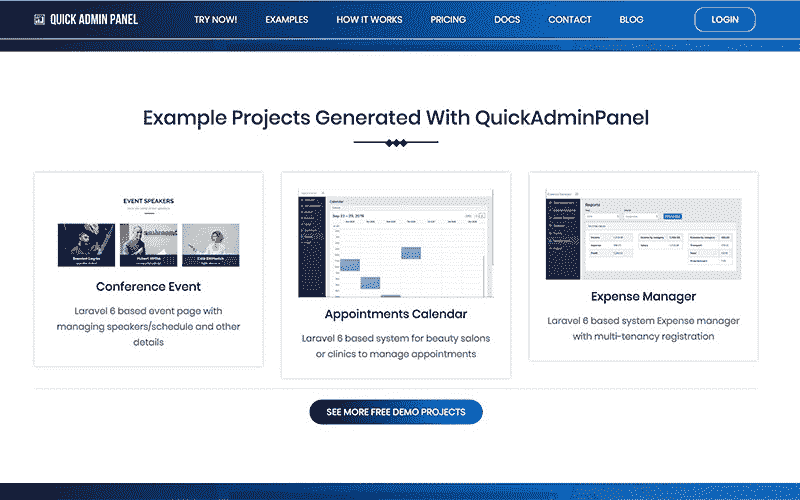

# 我们的个人项目几乎取代了我们的自由职业收入

> 原文：<https://www.indiehackers.com/interview/how-our-personal-project-has-almost-replaced-our-freelancing-income-7e57eead10>

## 你好！你的背景是什么，你在做什么？

我的名字是 Povilas Korop，我是来自立陶宛的后端 PHP 开发人员。我有 15 年的经验，最近五年专门研究了 Laravel 框架。我的产品 [QuickAdminPanel](https://quickadminpanel.com/) 是 Laravel 的管理面板生成器。

为自己打造一个产品，然后意识到这个产品有市场，这很酷。开始一个新的 Laravel 项目并快速预生成部分代码，节省时间并更快地交付项目的第一个版本，这是每个开发人员的梦想。

QuickAdminPanel 于 2016 年首次发布，慢慢成长为每月 3000-4000 美元的稳定收入(税前)。我们有大约 1000 名付费用户。

 

## 是什么促使你开始使用 QuickAdminPanel？

大约五年前，我和 Laravel 一起做了很多自由职业者的工作，后来他们和朋友一起发展成了一个小团队。几乎我们为客户构建的每个项目都有某种形式的管理面板来管理数据。当我们决定编写一个脚本来生成部分代码时，它节省了我们几个小时的时间。

我们认为它可能对其他人有用，所以下一阶段是在 Github 上以[开源项目的形式发布该项目，在那里它获得了一些人气。直到那时，我才决定试着把它用作在线生成器，就像 SaaS 版的生成器一样。Stripe 的第一笔付款甚至出现在正式发布之前，那时我意识到我们正在做一些事情。](https://github.com/LaravelDaily/quickadmin)

这些年来，[一直在积极撰写关于 Laravel 框架](https://laraveldaily.com/)的博客，并获得了一些关注和 5000 名 Twitter 追随者。每周四，我都会发一份时事通讯，刊登与 Laravel 相关的新文章。受众订阅者成为 QuickAdminPanel 的第一批潜在客户，它从那里慢慢成长起来。

那段时间，我们的主要收入来源仍然是客户工作。我们认为 QuickAdminPanel 主要是一种帮助更快交付项目并获得更大利润的方式。我个人不认为这是主要的收入来源。但从那以后，我们将价格提高了 3 倍(两次)，收入也大幅增长。目前，我的个人目标是从客户工作转向产品——如果不是全部，那么至少是少量的客户。

## 构建最初的产品需要什么？

在我们的三人团队中，我们将客户工作和 QuickAdminPanel 的时间对半分配。这完全取决于客户的需求和紧急程度。在我们的“停工期”,我们在产品上花费了更多的精力。

第一个版本是在六个月内创建的，但我们又打磨了三个月，才称之为“正式版 1.0”。起初，它是一个 [CRUD 菜单和字段生成器](https://quickadminpanel.com/blog/how-to-create-crud-menus/)。随着时间的推移，功能库逐渐由模块、表格和表单定制等组成。

我在这里的建议是尽可能早地发布——当工具真正提供价值的时候。在我们的例子中，它生成了简单的管理面板。

我们开始听取用户和客户的意见，他们告诉我们他们需要什么。我强烈建议在你的网站上安装一个实时聊天工具。这几天每个人都想要帮助*现在*；没有人会花时间给你发邮件或报告问题。如果他们得不到立即的答复，他们就会离开。

亲自回答这些问题是我们最忠实客户的最大驱动力之一。目前，我每天大约有 10 次实时聊天，目前还不打算把这项工作委托给其他人。客户的实时反馈是无价的。

当工具真正提供价值时，尽可能早地启动。

TweetShare

我们根据请求的受欢迎程度以及对我们有意义的内容来区分工作的优先级，因为我们仍然使用 QuickAdminPanel 来处理我们自己的客户端工作。

2018 年的某个时候，我们意识到该系统开始出现性能问题，变得更加漏洞百出，特别是当用户开始用它创建更大的项目时。所以我们不得不从头开始重建这个系统。这花了将近一年的时间，并在 2019 年夏天发布了一个全新的版本。以下是我从零开始重写大项目的 [15 课。TL；大卫:太贵了。](https://medium.com/successful-it-projects/15-lessons-from-re-writing-big-project-from-zero-5ddecad79fd9)

## 你的技术是什么？

这个很简单。我们使用了与生成代码相同的技术 PHP Laravel 框架，同时在需要的地方添加了一些 Vue.js。

我们在语言方面没有太多的技术挑战；我们遇到的最大问题实际上是磁盘空间。如果我们通过运行“composer install”命令生成一个管理面板及其所有依赖项，可能需要大约 100MB 的磁盘空间。乘以生成的面板数量，你就处在一个简单的[数字海洋水滴](https://en.wikipedia.org/wiki/DigitalOcean#Features)的危险区域。因此，我们必须创造性地清理未使用的面板，并为额外的磁盘空间支付更多费用。

## 你是如何吸引用户并发展 QuickAdminPanel 的？

正如我提到的，我自己的粉丝群帮了大忙——我只是在博客和推特上谈论产品的进展，在我的每周简讯中提到它，慢慢地获得了牵引力。

过了一段时间，我把我的 Laravel 博客换成了新的 QuickAdminPanel 博客，六个月后 SEO 结果开始增长。

我们没有做任何积极的广告，因为团队中没有一个人是营销人员或商人。

或许我们内容营销中最大的成功(尽管我们并不真的这样称呼它)是快速起飞的现场编码视频。在我的 [YouTube 频道“Laravel Business”](https://www.youtube.com/channel/UCTuplgOBi6tJIlesIboymGA)上，我拍摄了自己用 QuickAdminPanel 构建东西并在上面添加自定义 Laravel 代码的截屏。吸引了一群想学拉弗尔的观众。

仅这个视频就在 YouTube 上获得了 33k 的浏览量:[带有 Laravel + QuickAdminPanel](https://www.youtube.com/watch?v=k7mPaNfCHCE) 的日历项目。我给其他独立黑客的建议是:视频是描述你的产品的关键。人们喜欢视觉，他们理解视觉。

为自己打造一个产品，然后意识到这个产品有市场，这很酷。

TweetShare

我也尝试了一下谷歌和脸书的广告，但没有任何结果。也许是因为我不擅长选择所有那些目标关键字和其他参数。也许有一天我会回来再试一次，但对我来说这并不“自然”，因为我在自己的频道上有自己的 Laravel 观众，他们仍在积极增长。

## 你的商业模式是什么，你是如何增加收入的？

一开始我们做了很多实验。第一个定价模式是每个项目 9.99 美元。你可以在线生成代码，并在浏览器中查看，还可以免费复制粘贴，但下载完整的项目需要额外付费。

然后我们把价格提高到每块 29.99 美元。我们认为我们会失去客户，但实际上恰恰相反——它吸引了那些过去认为我们对这个项目不认真的人。

一年后，我们将这种模式转变为基于 SaaS 订阅的业务。稍有变化的是— *仅*年定价。因此，你可以以 99.99 美元或 199.99 美元的价格拥有一年的无限项目，这取决于我们决定分成更昂贵计划的一些模块。

我们实际上为这两个计划想出了合乎逻辑的名字:*开发商*和*代理*。它非常准确地反映了我们的客户角色。代理计划包含了更大团队实际需要的特性，比如白标代码、团队账户、与 Github 的集成等等。

然后在某个时候，我们被迫以单独计划的形式获得“每个项目”的价格——我们称之为“一个项目”,定价为 49.99 美元。有太多的潜在客户不想订阅，只想创建一个项目。具有讽刺意味的是，他们中相当多的人后来又回来订阅了代理计划。所以你可以称“一个项目”计划为“类固醇的高级试验”，我猜。

最终(目前)的转变是在 2019 年，当时我们发布了新版生成器，并决定通过放弃 99.99 美元的计划来消除开发者和代理机构之间的障碍。老实说，这主要是因为我厌倦了向人们解释所有计划之间的差异，因为它不是很清楚。

现在，客户可以选择一个项目，价格为 59.99 美元，也可以选择一年的*无限制*计划，价格为 199.99 美元。目前我对这个模型很满意，但我们可能会继续试验。

很难谈论典型的 SaaS MRR，因为我们的模型只是每年定价，而“一个项目”计划并没有使计算更容易。

| 年 | 收入 |
| --- | --- |
| 2016 | 415 |
| 2017 | 14000 |
| 2018 | 27000 |
| 2019 | 42000 |

费用方面，大部分是开发者的工作。我一个月花 1000 美元左右，所以利润率不高。我不能只靠 QuickAdminPanel 生活。还没有。

## 你未来的目标是什么？

正如我提到的，如果可能的话，我想把产品作为主要的收入来源。我只是更喜欢做一个产品；与客户工作相比，这是一种不同的压力。

为此，我们需要将收入增长至少 2 倍。为此，我认为“仅仅写关于产品的博客”是不够的就像他们说的，让你到这里的东西不会让你到那里。因此，我需要想出一些对外营销的想法，或者在我的内容中做一些调整，以吸引新的观众。

也就是说，由于我们 199.99 美元的定价，我们不需要那么多新客户。即使是 100 个新客户也会有很大的不同。

## 你面临的最大挑战和克服的障碍是什么？

可能最大的挑战是 Laravel 框架的创造者[泰勒·奥特威尔](https://twitter.com/taylorotwell)发布[Nova](https://nova.laravel.com/)—*官方* Laravel 管理面板的那一天。

我以为我们完蛋了。你怎么能和创造者自己支持的工具竞争呢？但是随着时间的推移，令人惊讶的是，我们的收入并没有下降。然后我们意识到我们只是在为不同类型的目标受众服务。Nova 是为那些想要深入定制代码的专业开发人员设计的，而 QuickAdminPanel 更像是为初级 Laravel 开发人员设计的拖放编辑器。所以我的建议是:如果你在你的领域和更大的玩家竞争，试着找到你自己的角度和你自己的子受众。

## 如果你必须重新开始，你会做什么不同的事？

老实说，如果我不得不重新开始，我不会做太多不同。迄今为止，无论是作为产品还是作为业务，它都是缓慢而稳定的增长。我不想筹集任何资金，也不想通过“伪造”数字来快速增长，所以这一切都很自然，而且到目前为止我很喜欢。

## 有没有发现什么特别有帮助或者有优势的？

我读了很多关于商业的书，也是播客的忠实粉丝；但是我得到的信息越多，就越能归结为几点建议。我甚至为此写了一篇文章。

如果非要我总结更多，三个字:做就是了。我知道这是老生常谈，但是再多的外部建议或激励实际上都不会为你做好这份工作。只有在工作和与客户交谈的时候，你才会发现自己对特定领域的洞察力。

回想起来，一个非常明智的决定是早点开始写博客。是的，这需要时间。但是，嘿，我喜欢它！我喜欢分享 Laravel 提示或任何其他我能提供的提示，并帮助人们。赢得观众甚至不是一种策略或战术，我只是一直做我喜欢的事情。

## 对于刚刚起步的独立黑客，你有什么建议？

我认为成功是努力、商业模式、时机和运气的奇怪组合。但是一开始没有努力，其他的都不重要。所以我的建议是开始真正的工作。我指的不是构建产品(对我们独立黑客来说是性感的部分)，我指的是与潜在客户交谈，做市场调查，发布一些文章来证明这个想法，并为 MVP 界定实际功能。*然后*开始建造。或者，你会发现这个想法不值得追求——节省时间也是一种胜利。

还有，别再看独立黑客了。奇怪的建议，对吧？:)

我的意思是，停止消费你发现的任何一条关于别人如何做事的内容。会给你一种虚假的成就感。例如，你可能觉得自己在做有意义的市场调查，但实际上你只是在拖延，从别人那里寻找某种证据或行动许可。你不需要任何许可。我个人允许你去做一些事情。包括在独立黑客上发帖。但不仅仅是读书。

## 我们可以去哪里了解更多？

您可以在 QuickAdminPanel.com 的[查看我们的产品。如果你对 Laravel 感兴趣，可以看看我的](https://quickadminpanel.com/)[博客](https://laraveldaily.com/)或者 [YouTube 频道](https://www.youtube.com/channel/UCTuplgOBi6tJIlesIboymGA)。

就个人而言，如果你喜欢我关于网络开发业务、生产力和独立黑客的想法，请在 Twitter 上关注我，或者在 LinkedIn 上联系我。

欢迎在下面提出任何问题或意见，我们将很乐意回答。

——[<picture id="ember8111179" class="user-avatar ember-view user-link__avatar"></picture>波维拉斯·科罗普](/PovilasKorop?id=xpnGjReIqkOM9rqv9dcCTX8Kq1I3)，QuickAdminPanel 创始人

## 想像 QuickAdminPanel 一样建立自己的企业？

你应该加入独立黑客社区！🤗

我们是几千名创始人，互相帮助建立有利可图的业务和副业。来分享你正在做的事情，并从你的同事那里获得反馈。

还没准备好开始使用你的产品吗？没问题。这个社区是一个认识人、学习和实践的好地方。随意[随便浏览](/)！

——[<picture id="ember8111184" class="user-avatar ember-view user-link__avatar"></picture>柯特兰艾伦](/csallen?id=ibTLPyjwVebnZjMGKvz6ztarnuV2)，独立黑客创始人

21votes