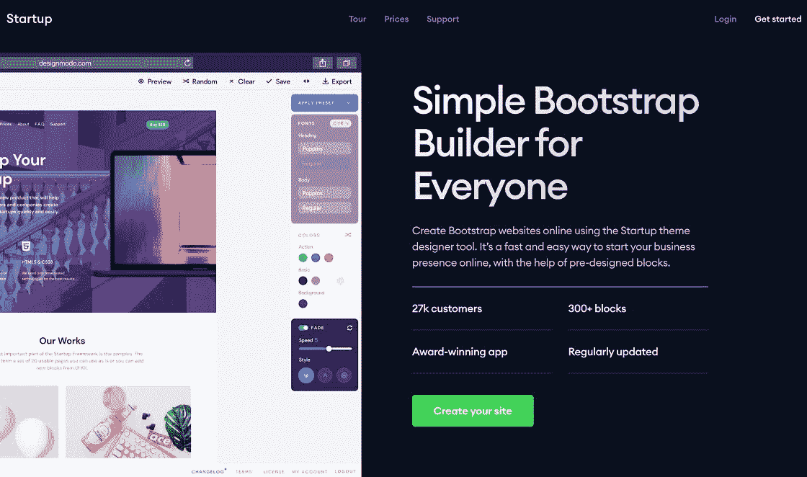
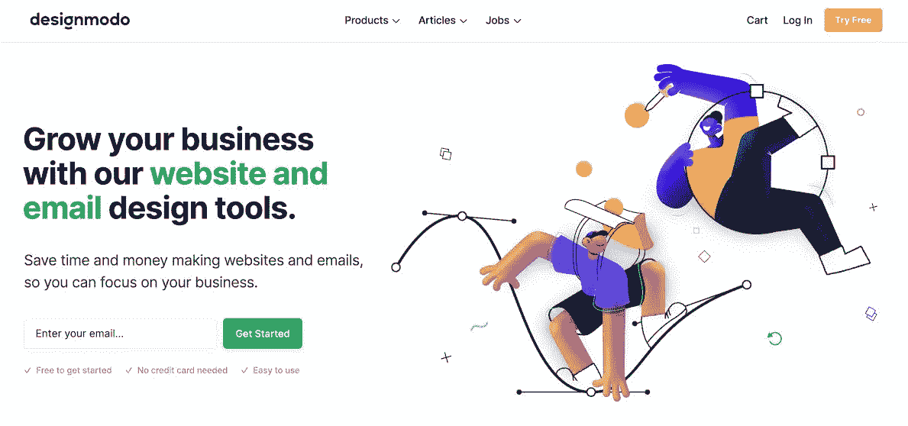
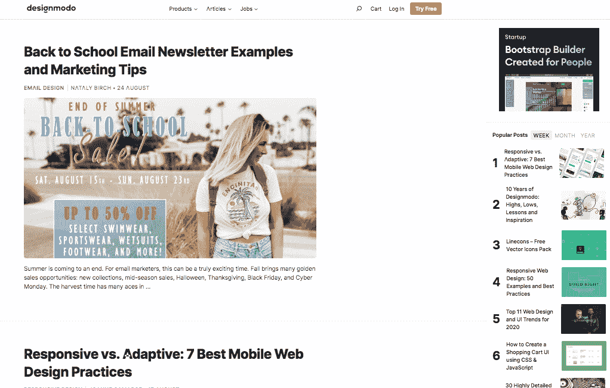

# 利润分享和再投资如何帮助我的业务增长到$40k MRR

> 原文：<https://www.indiehackers.com/interview/how-profit-sharing-and-reinvesting-helped-my-business-grow-to-40k-mrr-ebc98aab03>

## 你好！你的背景是什么，你在做什么？

嘿！我是 Andrian Valeanu，我是 Designmodo 的创始人。我还创立了一些其他成功的小型副业项目，以及一些失败的项目。

我没有受过任何技术教育，但我一直对技术和互联网有着浓厚的兴趣。十七年前通过看和看教程开始学习 SEO、设计、编码。大约在那个时候，我创建了我的第一个网站；这是我的祖国摩尔多瓦共和国的第一个金属和摇滚乐迷论坛和在线杂志。然后，大约四年前，我去了西班牙的巴塞罗那。

在 Designmodo，我们开发用于建立网站和电子邮件通讯的工具。到 2020 年，我们预计收入 50 万至 100 万美元，我们将继续开发我们的应用程序，扩大我们的业务。大部分收入来自订阅。

【T2

## 是什么促使你开始使用 Designmodo？

十年前，我有动力去创造一些东西，让我可以放下日常工作，把 100%的时间投入到自己的项目中。在我的国家，工资很低，我每月只挣 350 美元。所以当我开始从我的项目中每月赚到 350 美元时，我就离开了我的主要工作。

在那段时间里，我专注于扩大项目的用户群，测试不同的商业模式。我看到了 2012 年至 2016 年间的快速增长，但后来，当几个项目失败时，我们的收入出现了暴跌。谢天谢地，我们后来从那次事故中恢复过来了！

我们转向销售设计资产和网络模板，现在我们在 SaaS 有一家拥有数千名活跃订户的公司。这是我们的主要业务，我们正在与市场上获得投资和指导支持的大公司竞争。我们所有的工作都是在内部完成的，从未接受过任何外部支持，这让我们对自己的成功更加自豪！

## 构建最初的产品需要什么？

一开始我几乎没有预算，所以我开始寻找在收入分成基础上与我合作的合作伙伴。现在，我们几乎与团队所有成员共享收入。

最初的产品功能很少。一开始，让我们从竞争对手中脱颖而出的是我们的设计。我们在他们身上投入了大量的时间和精力。在产品开发阶段，我们保持了高设计质量，并且改进了代码和后端功能。

如果你真的对你的生意有信心，把你的利润和你的心一起投入进去。

TweetShare

我们是一家独立公司，我们所有的收入都来自销售。我们也把自己的钱投入到业务中，所以我们密切分析所有的支出，并试图尽快发布新功能...最好领先于我们的竞争对手！

我们的第一个产品仅用了一个月就完成了。现在，我们花了 6 到 9 个月的时间在他们第一次发布之前开发每个 MVP。

## 你的技术是什么？

我们从 WordPress 开始。后来我们整合了 WooCommerce(用于计费和 CRM)和订阅。

我们使用的应用程序包括 [Bootstrap](https://getbootstrap.com/) 、jQuery、Vue、React 和其他一些现代技术。为了设计我们的应用程序和网站，我们使用 [Figma](https://www.figma.com/) ，但我们过去使用的是 Sketch。

我们定制工作中使用的框架、插件和第三方服务。这些重大的技术变革为我们提供了灵活性。当创作者更新这些技术时，我们确保我们的定制与新版本兼容。

## 您如何处理这些定制？

首先，我们只使用允许我们做出改变的技术。然后我们经历标准的产品开发周期:

*   我们与开发人员一起规划所需的功能，开发人员进行更改。
*   测试功能后，我们将新代码发布到生产环境中。

当然，有很多时候，我们明白发布的特性是不够的，在这些情况下，我们回滚更改并致力于代码改进。

## 你是如何吸引用户和发展 Designmodo 的？

我们主要通过博客来吸引用户和发展 Designmodo，我们在博客上发表了 1000 多篇文章。一些最受欢迎的免费内容对我们的大部分增长做出了贡献。

我们还从非常受欢迎的资源中创建了产生大量链接和良好流量的设计资产。这些链接把我们的域名变成了一个高权威的网站，所以我们在搜索引擎上的排名也更高了。如果你检查我们域名的反向链接，你会对链接到我们的资源质量感到惊讶。

我们也尝试过付费广告，但还没有找到盈利的方法。有人能帮助我们吗？！😅所以我们现在不使用付费广告，尽管我们确信有办法做到这一点。

## 你尝试付费广告多长时间了，你什么时候知道是时候放弃它们了？

我们已经试过几次了。2014 年，我们在广告上花了很多预算，但毫无结果。2019 年，我们再次尝试在基于订阅的模式上测试付费广告。我们看到了一些投资回报，但不足以弥补成本。

所以我们决定最好的投资是我们的产品本身。现在我们把所有的钱都花在开发新产品和改进功能上，而不是花在广告上。

## 你的商业模式是什么，你是如何增加收入的？

我们的商业模式是 SaaS。我们提供月度、季度和年度订阅。我们使用 PayPal 和 [Stripe](https://stripe.com) 支付。条带处理 60%以上的收入。我们通过引入订阅增加了收入，而最初我们只提供一次性支付产品。

我们现在的费用与产品开发、组织和设计有关。我建议所有的数字创作者尝试订阅商业模式，因为它对你未来的收入给出了最清晰的估计，你可以用这些数据来规划对你产品的投资，并有可能吸引外部资金。

【T2

如今，我们使用*慢增长*方法。我们没有任何外部投资，我们的增长完全是有机的。我们预计今年秋天将继续这一增长，届时我们将发布大量应用程序更新。希望这些更新将有效地建立现有用户的忠诚度，并吸引新的用户。

## 你未来的目标是什么？

目前，我们的主要目标不是收入，而是继续我们所有应用的下一轮更新，让它们完全无代码化。例如，[明信片](https://designmodo.com/postcards/)应用程序已经是一个无代码的新闻通讯创作工具。我们现在需要更新[幻灯片](https://designmodo.com/slides/)和[启动](https://designmodo.com/startup/)应用，所以它们也是 100%无代码的。然后，我们将开始为我们的应用添加更多的集成和功能。

我们的第二个重要目标是提高搜索引擎的流量，因为它们是重要的收入来源。这意味着对我们的网站和内容的工作。

第三，考虑到我们的收入，当我们达到$2M ARR 时，我们会感到更舒适。这让我们有足够的资金投入到我们的人员和产品开发中。

关于我自己的个人目标，我正在进行其他项目，我希望今年发布三个。整个团队都在努力工作，争取在今年秋天实现这一目标。这些其他项目涉及:

*   面向设计师的无代码网站构建器
*   电子邮件营销
*   主办；主持

我将在我的另一篇关于独立黑客的文章中更多地谈论这些项目。

## 如果你必须重新开始，你会做什么不同的事？

正如我前面提到的，从项目一开始，我们就不断地将赚来的钱进行再投资。所以我们曾经尝试投资开发一个新产品，这次是为 WordPress。这是一个糟糕的决定，也是一个宝贵的教训。

在启动应用发布后，人们要求基于此的 WordPress 主题。听起来是个好主意，对吧？我们考虑了一下。“就这么办吧！”我们说。

我们雇佣了一些 WordPress 开发者，开始着手启动 WordPress 主题。该主题的第一次发布失败了，但我们仍然有来自以前产品的收入，所以我们决定继续致力于该主题并使其变得更好。

有几个月，我们用销售额弥补了所有的支出，但后来销售额开始下降。

我们拯救项目的解决方案？“我们再失败一次吧！”我们开始在 WordPress 上工作(再次！)名为 Qards 的插件。这个插件也不走运。

在 2016-2017 年，我们停止开发 WordPress 产品，并开始偿还我们与以前的开发者建立的债务。我们继续修复以前产品的缺陷，并为客户提供支持。在一年的时间里，我们每个月都在支付我们需要的一切。

我们继续发布文章和教程，提供支持，修复错误。我们不得不削减很大一部分项目预算，但我们继续发布新内容。

我们靠积蓄生活。我们失去了一部分队员。只剩下我们三个:谢尔盖、爱德华和我。

那么，我们做错了什么？

*   我们雇佣了一个太大的团队来快速完成工作。
*   我们瞄准了一个我们不熟悉也不了解的行业(WordPress)，在没有任何专业知识的情况下开始了这个项目。
*   我们的资金管理不善，没有分析过去和预期的销售情况。
*   我们开发了用户建议的每一个产品和功能，却没有考虑这样做的商业案例。
*   我们只考虑获得新用户，而不是长期留住他们。

## 经历了那样的失败后，你如何激励自己？

对我来说，失败后，我只需要几天就能恢复过来。通常情况下，我不会得出项目在发布当天就失败的结论。我试图提升它们，改进功能，但仅仅几个月或几年后，当我意识到失败时，我就停止了。

我说的停止是指:关闭项目或者卖掉它。如果卖不出去，我就关掉它。所以，我的动力就是把项目卖出去，如果卖不出去，我的动力就是有更多的时间投入到一个新的项目中去。没时间哭了。

## 你对独立黑客有什么建议？

我总的建议是尝试做*某事*，不要害怕失败。如果你试着去做，你不会失败。如果你根本不尝试，你就失败了。

还有，我可以建议一些其他的事情。如果你真的对你的生意有信心，把你的利润和你的心一起投入进去。

建立一个相互支持的社区会比你想象的有更高的回报。

TweetShare

无论情况看起来多么具有挑战性，如果你创造性地思考并有能力从失败中学习，总会有解决办法。也许这意味着发展一个新的想法或者放弃一个旧的想法。也许这意味着以新的方式与人合作。别让它打击你。

建立一个相互支持的社区会比你想象的有更高的回报。

专注于你所知道的。创新，当然，但是如果你不知道自己在做什么，就不要试图打开一个新市场。

不要急于将每一个建议变成现实；花点时间搞清楚哪些值得追求，哪些不值得。

建立一个稳固的团队是产品开发最重要的元素之一。你可以单飞起步，但如果你想成长，如果你想让你的想法快速变成现实，你需要一个有野心，有奉献精神的好团队。团队应该是具有良好组织和正确技能的专业人员。每个团队成员都应该帮助推动项目向前发展，而不需要被其他人推动。

## 我们可以去哪里了解更多？

你可以在这里了解更多关于 Designmodo [的信息。在社交媒体上，你可以在](https://designmodo.com/) [LinkedIn](https://www.linkedin.com/in/valeanu/) 、 [Twitter](https://twitter.com/andrianv) 和 [ProductHunt](https://www.producthunt.com/@andrianv) 上找到我。

如果任何人对我或团队有任何问题，请不要犹豫，在评论中提问。我会尽力回答你需要知道的任何事情。

谢谢独立黑客们！

——[<picture id="ember5266793" class="user-avatar ember-view user-link__avatar"></picture>安德里安](/AndrianV?id=NjDZSueYC0fBEY8gwefCIp5PFWo2)【design modo 创始人

## 想像 Designmodo 一样建立自己的事业？

你应该加入独立黑客社区！🤗

我们是几千名创始人，互相帮助建立有利可图的业务和副业。来分享你正在做的事情，并从你的同事那里获得反馈。

还没准备好开始使用你的产品吗？没问题。这个社区是一个认识人、学习和实践的好地方。随意[随便浏览](/)！

——[<picture id="ember5266798" class="user-avatar ember-view user-link__avatar"></picture>考特兰艾伦](/csallen?id=ibTLPyjwVebnZjMGKvz6ztarnuV2)，独立黑客创始人

73votes