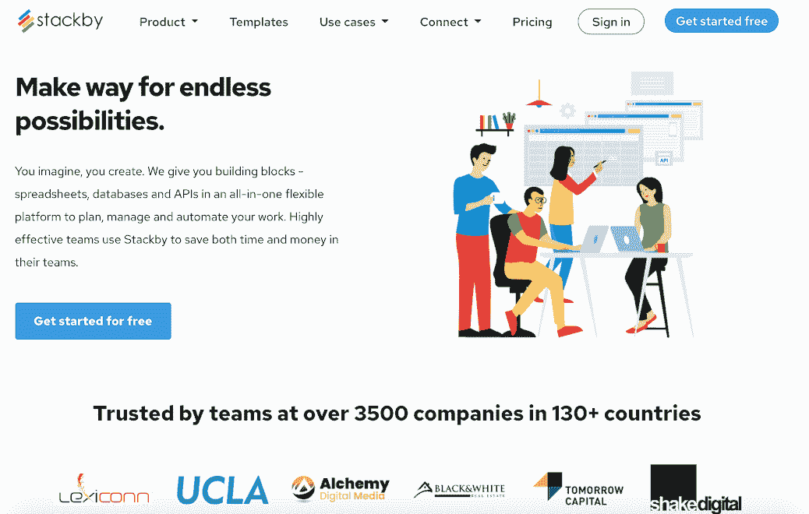
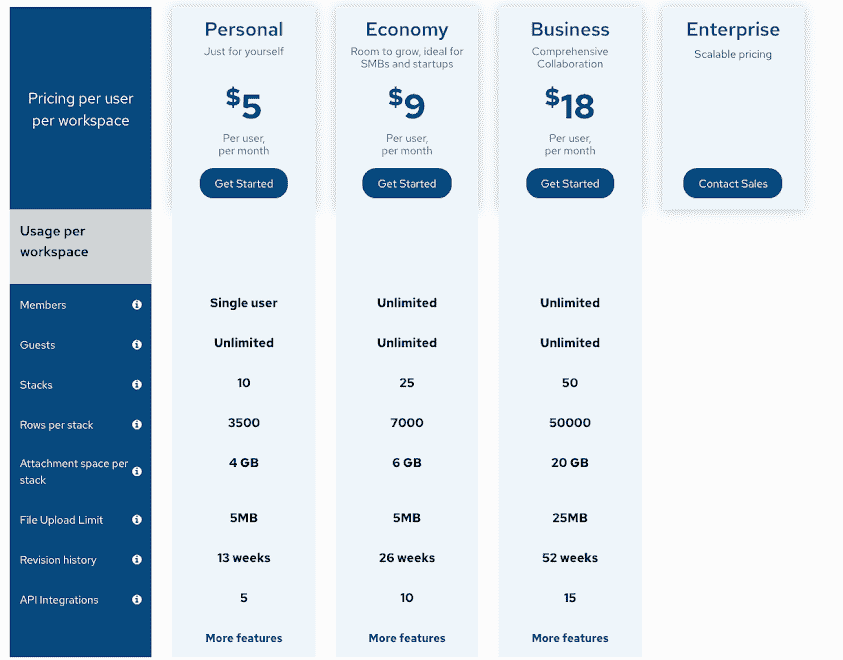

# 再造电子表格如何让我在不到一年的时间里接触到 4K 的客户

> 原文：<https://www.indiehackers.com/interview/how-reinventing-spreadsheets-got-me-to-4k-customers-in-under-1-year-a60bf20fdc>

## 你好！你的背景是什么，你在做什么？

大家好，我是 Stackby.com 公司的创始人兼首席执行官 Rachit Khator。Stackby 是下一代电子表格，专为创客和创作者打造自己的应用。

它将最好的电子表格、数据库和 API 结合在一个灵活的平台中，使非技术人员能够为他们的生活和工作构建自己的工具。它是实时的、协作的，并且能够将栏目连接到流行的第三方服务，以自动提取信息。

从个人到 SMB 团队，到营销机构，再到非营利组织，许多不同类型的用户都使用 Stackby 来组织他们的数据和工作。

在过去的 10 个月里，我们已经发展到拥有来自 150 多个国家的 3，500 多名付费客户。

【T2

## 一句话，人为什么要看这篇文章？

这是一个关于勇气和决心的故事，证明了你不一定要在硅谷才能建立一个全球性的创业公司...你可以来自发展中国家的二线城市。

## 是什么促使你开始接触 Stackby.com？

我在一家美国财富 500 强公司工作，是他们风险投资集团的一部分。我一直忙于处理电子表格来管理我们的工作流程，这在我们的团队中变得很麻烦。

当我在寻找工具时，我意识到要么有解决特定问题的垂直工具，要么有项目管理和 CRM 软件。这两者都不能让您根据自己的需求进行定制。

地点不重要。你的意图是。

TweetShare

在与我的网络中的 100 多名专业人士交谈后，一个主要的痛点出现了:大多数人依赖于电子表格，因为它们易于使用，而且他们很难在一个地方组织他们的数据。

因此，我做了一个快速的转变，从为投资专业人士开发交易管理软件，转变为为任何人开发自己的软件开发一个易于使用的平台。

带着这个雄心勃勃的想法和一些早期的验证，我在 2018 年辞去了美国的公司工作，回到印度创办了 Stackby。

## 构建最初的产品需要什么？

为大众制造一个简单的产品是一件非常困难的事情。

在搬回印度后，我们所拥有的只是纸上的计划、早期的建筑设计和不完整的原型。

第一个挑战是在没有科技生态系统的印度二线城市组建一支强大的产品团队。我们的城市苏拉特以钻石和纺织业闻名；在这座城市丰富的历史中，没有一家真正的产品技术创业公司诞生。

凭借耐心和毅力，我们让几个工程师开始开发产品，然后随着我们不断取得进展，慢慢建立起团队。尽管有各种不利因素，团队必须尽早实现产品愿景。

总而言之，我们花了两年多的时间埋头苦干，才制造出一款产品并推向市场。

在做这件事的时候，我从在美国公司工作的舒适的六位数薪水变成了几乎 0 美元的银行存款。

幸运的是，我们发现很少有导师和优秀的团队成员继续着我们的愿景。

## 你辞掉了高薪工作，全身心投入到 Stackby 身上。是什么让你这么想辞职？

实际上有几个事件。我一直想拥有一家科技创业公司。但事实是，我的公司工作责任越来越大，在我辞职的前一天，我甚至得到了更高的薪水和晋升。

这促使我采取行动。我想*如果不是现在，那就永远不要*。

辞去高薪工作，卖掉我拥有的一切(包括放弃我的第一辆车)，搬到其他国家去创业，这是一个艰难的决定。

## 对你来说赌注是什么？如果你失败了，那意味着什么？

赌注总是很高。我耗尽了几乎所有的积蓄(在支付了学生贷款之后)来创业。

在印度，失败是件大事，这一点也不像在美国，失败意味着经验。在印度，人们对此并不看好。所以失败是可怕的。

## 你的技术是什么？

我们在最先进的 Javascript 框架上，主要使用前端的 [React](https://reactjs.org/) 和后端的 [Node.js](https://nodejs.org/en/) 。

随着时间的推移，堆栈保持不变，因为我们从一开始就知道我们想要如何构建它。在性能和可伸缩性方面出现了一些挑战，需要花费大量的时间和精力来做好。这并不容易，所以花了我们几年的汗水和泪水。

我们会继续优化平台，并且随着时间的推移会变得越来越好。

## 你是如何吸引用户和发展 Stackby.com 的？

我们从第一天起就知道，鉴于我们是一个水平产品，我们需要大规模推出。

最初，我们在 2019 年 7 月在香港举行的 [RISE 会议](https://riseconf.com/)上试推出了我们的产品，该会议被誉为亚洲最大的技术会议。我们只通过口碑获得了第一批 10 个付费客户，并且真的在努力获得客户。

之后，我们与 AppSumo 合作，并于 2020 年 1 月在全球推出该产品。这是我们实现真正增长的地方。一路上，我们的旅程也被著名的媒体科技出版物 [YourStory](https://yourstory.com/) 所报道。

我们还建立了其他一些战略合作伙伴关系，比如与[初创公司 India](https://www.startupindia.gov.in/) 合作，并继续保持获得用户的势头。

2019 年 12 月，我们从不到 1000 名用户开始，到 2020 年 3 月增长到 5000 名用户，然后到 2020 年 9 月增长到超过 25000 名用户。在 9 个月的时间里，我们在脸书和 Slack groups 上的 Stackby 社区从不到 100 个增加到超过 1300 个。

鉴于我们是一个 API 优先的平台，我们继续发展我们的原生集成，并从 2020 年 1 月的 15 个应用增加到 2020 年 10 月的 40 多个应用。

2020 年，我们还在模板库中添加了 70 多个新的点击使用模板，现在已超过 120 个，并继续在我们的博客和 YouTube 频道上构建新内容。

我们在这个过程中学到的一件事是，我们试图一起做很多事情，并最终努力做到最好。我们艰难地认识到，衡量成功最重要的标准是专注。这就是我们前进的动力。

## 你的商业模式是什么，你是如何增加收入的？

我们的商业模式是典型的免费增值模式。用户来到网站，进行免费试用，然后在他们的工作区订阅我们的标准付费计划或我们的特别优惠。

随着时间的推移，团队获得了更多的价值，我们向他们追加销售更多的用户和更多的工作空间(更多的数据库)，并且这还在继续增长。

我们调整了我们的定价，从终身定价改为限时年度和定期定价。这是因为我们的产品越来越成熟，我们继续添加更多的功能、集成和用例。

我们跟踪所有产品指标，并通过实现无缝体验来继续改进我们的入职、激活和保留指标。

当你在建立一个产品至上的公司时，数据是很重要的。没有数据，你永远也找不到大海捞针，这是产品企业家最大的陷阱。

## 你未来的目标是什么？

我们的近期目标是在接下来的六个月到一年内达到 10 万用户和 100 万美元的年运营率(我们差不多已经完成了一半)。

我们继续在产品、工程、客户成功和增长等所有方面雇佣和建立一个可靠的分布式团队。我们现在都在远程工作，并且在不久的将来会继续这样做。

我们保持精简，目标是少花钱多办事。从第一天起它就存在于我们的 DNA 中。这种方法让我们专注于正确的事情，当我们获得牵引力时加倍下注。

## 你面临的最大挑战和克服的障碍是什么？

我面临的最大挑战是低估了我们的产品发布。

虽然我们的团队工作了无数个小时，度过了无数个不眠之夜，但我们低估了我们可以在六个月内发布的时间。正如我所说，好的东西需要时间来建造！

我们了解到耐心是每个创业者都需要具备的美德。不要让你对目标的低估束缚了你。低下头，继续工作，直到你到达第一个里程碑。

正如他们所说，一夜成名需要十年的努力。

## 有没有发现什么特别有帮助或者有优势的？

实际上，疫情对我们的生意很有利。越来越多的人开始寻找能够帮助他们远程工作、数字化流程、自动化工作以及与团队协作的软件。Stackby 就在其中！

另一个有帮助的趋势是制造商开始开发的无代码软件和工具的全新世界。我们很早就意识到了这一点，并发布了我们的开发人员 API，因此非技术人员可以利用该 API，并将 Stackby 用作轻量级后端数据库。

我们艰难地认识到，衡量成功最重要的标准是专注。

TweetShare

我们还集成了 Zapier 和 Integromat，因此 stackers 可以将 Stackby 连接到 2000 多个应用程序，以自动化其端到端工作流。我们的用户(我们亲切地称之为“堆叠者”)继续构建和共享令人惊叹的自动化工作流来推动他们的业务。

## 你提到疫情实际上对你有利。你能告诉我更多关于新冠肺炎如何影响你的生意吗？

我们是一款远程工作软件，因此 COVID 有助于加快各种企业的采用，现在愿意数字化他们的数据和流程。

事实上，我们也是一个无代码的工具，在过去的一年里也帮助了这项事业。越来越多的企业家变成了创造者，他们喜欢软件易于使用，并且可以高度定制。

## 对于刚刚起步的独立黑客，你有什么建议？

地点不重要。你的意图是。

许多企业家觉得他们周围没有合适的生态系统来起步，所以他们放弃了他们的梦想。但是如果我能在印度的二线城市建立一个全球性的创业公司，你也能做到。

一些对我的产品和个人历程都有帮助的书籍:

*   [零比一](https://www.penguinrandomhouse.com/books/234730/zero-to-one-by-peter-thiel-with-blake-masters/)被布莱克·马斯特斯和彼得·泰尔
*   被 Nir Eyal 钩住的
*   Paramhansa Yogananda 的《瑜伽士自传》
*   Khorshed Bhavnagri 著《灵界法则》
*   [薄伽梵歌，由圣帕布帕德所著](https://asitis.com/)(这对我来说是最重要的一首。)

## 我们可以去哪里了解更多？

你可以在 Stackby.com[试用一下 stack by](https://www.stackby.com/)，继续免费使用:)

当我们有关于生产力、远程工作、自动化和无代码的有趣事情要分享时，我们会将其发布在我们的博客上，并制作视频发布在 YouTube 上。

你也可以加入我们在脸书的全球堆垛机社区，并在 Twitter 上关注我们的广告。

我个人可以通过 [LinkedIn](https://www.linkedin.com/in/rachit-khator/) 联系。

如果任何人对我们的旅程有任何问题，请随时在评论中提问。我们将尽力以最好的方式回答任何问题。感谢哈尔登·英沃森鼓励我写作。

——[<picture id="ember8118714" class="user-avatar ember-view user-link__avatar"></picture>拉希特·卡托尔](/rk24?id=6CQPcmdaQPUUSCA0Z0a73c1Evhp1)，Stackby 创始人

## 想像 Stackby 一样建立自己的事业？

你应该加入[独立黑客社区](/)！🤗

我们是几千名创始人，互相帮助建立有利可图的业务和副业。来分享你正在做的事情，并从你的同事那里获得反馈。

还没准备好开始使用你的产品吗？没问题。这个社区是一个认识人、学习和实践的好地方。随意[随便浏览](/)！

—[<picture id="ember8118719" class="user-avatar ember-view user-link__avatar"></picture>考特兰艾伦](/csallen?id=ibTLPyjwVebnZjMGKvz6ztarnuV2)，独立黑客创始人

30votes