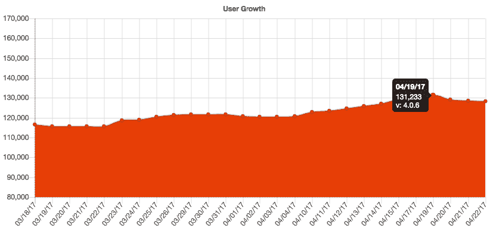
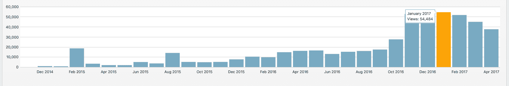

# 分享有用的知识如何帮助我增长到每月 2500 美元

> 原文：<https://www.indiehackers.com/interview/how-sharing-helpful-knowledge-helped-me-grow-to-2-500-month-ad9b94660e>

## 你好！你的背景是什么，你在做什么？

嗨，我叫蒂姆·利兰。我于 2010 年获得计算机科学学位，在过去的 7 年里，我一直从事软件开发工作。我也在空闲时间做兼职项目。

天气扩展是一个浏览器扩展(Chrome|Firefox|Opera ),我创建它是为了满足自己在浏览器中快速查看天气预报的愿望。

该扩展在全球拥有超过 133，000 名用户，并被翻译成 12 种语言。

目前，我每月收入超过 2500 美元，平均每天安装近 2000 个。我希望在未来几个月内每月收入增长并达到 20 万用户。

## 是什么促使你开始使用天气扩展？

回到 2015 年 7 月，我想到为 Chrome 创建一个简单的天气扩展。其他气象网站的广告和其他烦恼让我沮丧。我知道我可以创造一个更好的解决方案。我希望别人会喜欢，但我真的是为自己做的。我没有计划从扩展中赚钱。

我花了几个晚上写了《T2》天气的原始版本，并于 2015 年 7 月在 Chrome 商店发布。扩展很简单，由 HTML、CSS 和 JavaScript 组成。我用了一个免费的 [DarkSky](https://darksky.net/app/) 账户来记录天气数据。它包括 1000 个免费的每日请求，这是我从未想过会达到的。

随着时间的推移，我听取了我的[审查员](https://chrome.google.com/webstore/detail/weather/iolcbmjhmpdheggkocibajddahbeiglb/reviews)和我的用户的反馈，并对扩展进行了改进。我总是试图忠于我最初开始创造的东西。每当我有空的时候，我就在晚上和周末做天气预报。

最终，我超过了 1000 个免费 API 调用的门槛，必须想办法赚点钱。我决定从头开始重写天气，为专业版添加新功能。

## 你是如何吸引用户和扩大天气延伸的？

起初，我与我的朋友和家人在我的博客上分享天气。当我第一次有大突破的时候，我有大约 150 个用户。

我很幸运地在获得一篇特色博客文章的同时与一位生活黑客的作者建立了关系。我让他在 Lifehacker 上写了我的延期。这篇文章帮助我在一周内获得了 10，000 名用户！直到今天，这篇文章仍然带来了数百个安装。

我不能强调通过博客和其他社交媒体平台建立在线形象的重要性。

TweetShare

我最近吸引用户的策略是向任何分享我的[安装页面](https://weatherextension.com/)链接的人赠送[免费专业升级](https://timleland.com/free-weather-pro-upgrade/)。这非常成功，我的用户非常欣赏。我认为这比在脸书或推特上支付广告费用要便宜。

我用来吸引用户的其他策略:

*   与其他扩展合作
*   发布在黑客新闻和 [ProductHunt](https://www.producthunt.com/posts/weather)
*   在 [LaravelNews](https://laravel-news.com/behind-the-app-chrome-weather-extension) 上出现
*   制作了一个[演示视频](https://www.youtube.com/watch?v=X9V8Yo8ecGE)
*   使用[缓冲区](https://buffer.com/)处理我的社交媒体账户；它们很容易设置和忘记

如需更多提示，请查看我在[营销浏览器扩展](https://timleland.com/how-to-market-browser-extensions)上的帖子。

## 你的商业模式是什么，你是如何增加收入的？

我开始使用 PayPal 捐款，并对有多少人愿意向免费扩展捐款感到非常惊讶。在早期，这激励我继续致力于扩展。

目前，我的商业模式很简单。我收取 2 美元的专业升级，解锁所有的功能。我从 Stripe 开始，但最终添加了 Paypal 按钮，为用户提供不同的选择。

作为一个实验，回到 2016 年 12 月，我决定将 Google Adsense 添加到我的[博客](https://timleland.com/)中。起初，我不相信这会带来很多收入。令我惊讶的是，第一天我赚了大约 9 美元。我想这可以满足我每天喝咖啡的习惯。

我继续尝试广告投放。到 2017 年 1 月，我知道我有所发现。我连续几天赚了 100 多美元，甚至有几天我赚到了 160 美元。统计数据很清楚，我的大部分 Adsense 收入来自扩展的[介绍页面](https://timleland.com/weather-extension/)。

总而言之，我的大部分收入来自 Adsense。我每月的花费大约是 100 美元。我必须向 DarkSky 支付访问他们 API 的费用，我还要向 DigitalOcean 支付服务器费用。

## 你未来的目标是什么，你打算如何实现它们？

我 2017 年的目标是继续增加我的[博客](https://timleland.com/)的流量，让[天气](https://weatherextension.com/)的活跃用户超过 20 万，并增加月收入。

开博客的目的是用你已经掌握的知识帮助他人。说真的:从今天开始。

TweetShare

我还试图通过创建其他扩展来重现 Weather 的成功。目前，我有一个[步计数器](https://chrome.google.com/webstore/detail/step-tracker/mmehkkgdjeabomkpmpfkemcomagemjfn)和[链接保存](https://chrome.google.com/webstore/detail/read-later/hleifpgbhiladknmecmkpgbgfmlnjhoh)扩展，我正在努力增加。

我计划通过写博客，扩大我的社交媒体账户，告诉所有我能告诉的人我在做什么来实现这些目标。

## 你面临的最大挑战是什么？

到目前为止，我面临的最大挑战是扩展服务器。该扩展必须不断地访问我的服务器，以保持温度图标是最新的。随着延期的增加，[请求](https://timleland.com/nginx-real-time-metrics/)的数量也在增加。我相信我已经通过设置[数字海洋负载平衡器](https://timleland.com/digitalocean-load-balancers/)和添加额外的服务器解决了扩展问题。

扩展是大多数应用程序面临的挑战。你想保持低成本和你的应用程序运行顺畅。我现在使用 [NewRelic](https://newrelic.com/) 来监控我的服务器的性能。这样，当我需要添加额外的服务器时，我就有希望得到警告。

如果重新开始，我要做的一件事是监控服务器性能。回到 2017 年 2 月，当我的服务器超载时，我失去了数千名用户。硬件太多总比太少好。

## 你最大的优势是什么？有什么特别有用的吗？

我帮助 [Weather](https://weatherextension.com/) 成长的最大优势是我在 2014 年底开始写博客。我不能强调通过博客和其他社交媒体平台建立在线形象的重要性。

2014 年 12 月至 2017 年 4 月的博客流量。

这需要时间和努力，但一致性是关键。每个人都是从零关注者开始的。始终如一的人才是赢家。从外面看，这可能像是运气，但是每一个*【幸运】*时刻都有 100 个*【倒霉】*时刻。我相信你必须投入工作去创造你自己的运气。

## 对于刚刚起步的独立黑客，你有什么建议？

开博客的目的是用你已经掌握的知识帮助他人。说真的:从今天开始。

每天创造，分享你的经验。要持之以恒，不要指望一夜之间成千上万的用户。如果这是你相信的事情，坚持下去，不要放弃。向他人学习，但要尝试找出适合自己的方法。听听[播客](https://www.indiehackers.com/podcast/008-nathan-barry-of-convertkit)并在[indie hacker](https://www.indiehackers.com/businesses)上阅读关于其他创始人的信息。

## 我们可以去哪里了解更多？

你可以在 TimLeland.com 查看我的博客，在推特上关注我([@蒂姆·利兰](https://twitter.com/Tim_Leland))。我还开发了一个工具来[追踪 chrome 扩展](https://extensions.timleland.com/)。

我很想听听你对我如何在[天气](https://weatherextension.com/)下继续成长的想法。请随意问我下面的任何问题。

—[<picture id="ember5205104" class="user-avatar ember-view user-link__avatar"></picture>迪姆·利兰](/timleland?id=jhviZwgFeWR6cSz4WwfqrfnDeyj2)，天气扩展的创造者

## 想像天气延伸一样建立自己的事业？

你应该加入独立黑客社区！🤗

我们是几千名创始人，互相帮助建立有利可图的业务和副业。来分享你正在做的事情，并从你的同事那里获得反馈。

还没准备好开始使用你的产品吗？没问题。这个社区是一个认识人、学习和实践的好地方。随意[随便浏览](/)！

——[<picture id="ember5205109" class="user-avatar ember-view user-link__avatar"></picture>柯特兰](/csallen?id=ibTLPyjwVebnZjMGKvz6ztarnuV2)，独立黑客创始人

18votes