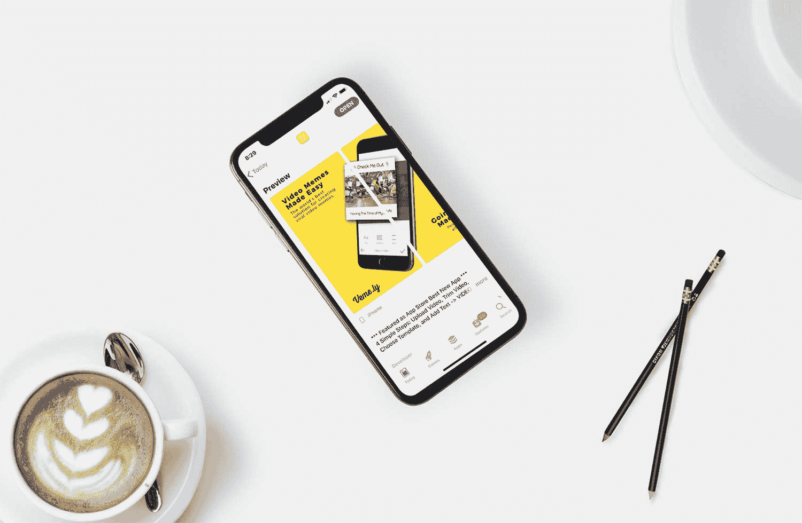
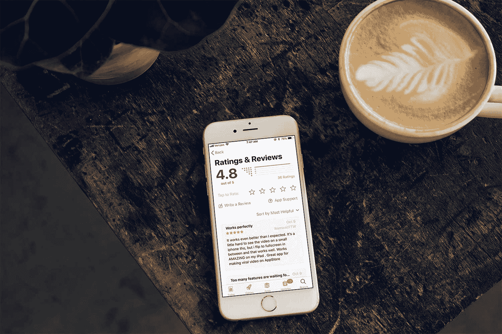

# 不断变化的市场需求如何激发我们开发第一款应用

> 原文：<https://www.indiehackers.com/interview/how-shifting-market-demands-inspired-us-to-build-our-first-app-5f20f371a3>

## [ 钱宁](https://twitter.com/channingallen)感谢您抽出时间接受联合采访！告诉我们你的背景和你在 Veme.ly 做什么

[ Maverick Eguia, co-founder of Veme.ly](https://twitter.com/maverickeguia) 

大家好，我的名字是 Maverick Eguia，我是 [Veme.ly](https://appvemely.com/) 的联合创始人，这是一款面向内容创作者、数字营销人员、企业家、公司和日常社交媒体参与者的视频编辑工具。我是一名退休的职业花样滑冰运动员，已经适应了现实世界，我是一名指导一些品牌、创业公司和公司的品牌、设计和创意的人。

Hassan 向我提出了在视频编辑和应用市场打开局面的想法，考虑到最近创意短片的流行。就在他演讲一个月后，我们在 App Store 上发布了我们的第一个版本。

我们完全基于用户反馈和不断发展的社交视频文化进行产品开发，并在短短 12 个月内积累了超过 10，000 次下载。Veme.ly 目前有 100 多名付费客户，平均每月经常性收入为 1500 美元，很少投入资金或精力进行营销。

 [ Hassan Ahmed, co-founder of Veme.ly](https://twitter.com/HassAb21) 

你好！我叫 Hassan Ahmed，和 Maverick Eguia 一起，我们已经建立 Veme.ly 一年多了。

在从多伦多水电公司到道明银行集团的六家公司实习后，我决定为我热爱的行业开发一个软件工具。

Veme.ly 是一个社交视频创建平台，面向希望创建时尚且能有效影响观众的视频内容的营销人员、影响者和小型企业。该平台提供了模板，可用于通过一系列字体、图标和各种样式选项来激发、构建和塑造视频内容。重要的是，该应用程序具有一个功能，可以快速轻松地合并字幕和视频，并能够定制和风格化字幕，以便将您的创意变为现实。

 

## [ 钱宁 ](https://twitter.com/channingallen) 是什么激励你开始使用 Veme.ly？

[ Hassan](https://twitter.com/HassAb21) 

2017 年冬天，我在大学最后一年报名参加了一门社交媒体课程。那门课程引发了对数字营销和社交媒体的迷恋，我开始注意到脸书和 Instagram 上的一种趋势。人们制作带有文字覆盖的视频，就像视频迷因一样。最初，我考虑创建一个专注于视频内容相关服务的社交媒体机构，但很快意识到我需要一种方法来跟上社交媒体趋势的飞速发展，于是我将重点转移到制作这些时髦的视频迷因(vemes)上。凭借我的软件开发背景和对社交媒体营销的热爱，我决定创建一个应用程序，简化创建带文本或字幕的视频的过程。

我想尝试构建一个 iOS 应用程序，并启动我的第一家创业公司，我认为这是一个学习移动技术和构建一个值得关注的产品的绝佳机会。通过我们最初的营销努力和发布后与潜在用户的交谈，我们了解到对 Veme.ly 这样的产品有实际需求。在鼓励下，我们分析了竞争对手，如 Viva Video、Videopleap 和 Ripl，以便了解情况，找出已经提供的产品，哪些有效，哪些无效，以及我们如何制定战略以取得成功。我们发现竞争对手的应用做得很好；他们每个月都有大量的收入，并且拥有大量的用户。我们查看了它们的功能和用户评论，以了解客户对各种应用程序的喜爱和厌恶之处，以及我们可以在哪些方面加以利用。

我们早期做的最好的事情之一是通过尽可能简单地交流 bug 和特性来获得活跃用户的反馈。我们通过集成第三方插件 [Instabug](https://instabug.com/) 来做到这一点，Instabug 是一款针对移动应用的应用内反馈和 bug 报告工具。这有助于我们保持领先，并响应用户的需求。

[ Maverick](https://twitter.com/maverickeguia) 

通过加里·维纳查克(又名加里·维)和他的社交内容制作的灵感，哈桑和我开始意识到，创建有意义的、视觉上有吸引力的、带有文本、字幕、图形和标志品牌的社交视频，并不像有影响力的人和媒体公司看起来那么容易。

当时，市场上没有一个移动应用程序具备无缝创建高质量、制作精良的社交视频或视频迷因所需的所有功能。通常情况下，一个应用程序只有一个笨重、通常有限的功能，旨在快速创建一个有趣的视频模因——有点像数量超过质量的问题。想要用动态视频而不是照片来分享信息的个人或公司必须有使用 Adobe Premiere 或 Final Cut Pro 等平台的视频编辑经验，或者找到有经验的人。如果一个人或一家公司想要坚持发布，这项任务就变得复杂而耗时。如果您可以录制或上传视频，选择一个适合任何社交媒体平台的视频帧，并使用您的徽标、自定义消息、字幕、图标、表情符号、gif、图像等来设计视频，会怎么样？输入 Veme.ly。

我在科技、商品、美容、大麻和消费品行业的初创公司和公司工作，积累了丰富的创意和设计经验，并且知道哈桑将自己强大的技能带到了这个过程中。在我们两个人之间，我有信心我们可以生产和营销一个强大的、成功的应用程序。

 

## [ 钱宁](https://twitter.com/channingallen)什么东西成了建筑最初的产品？

[ Maverick](https://twitter.com/maverickeguia) 

我通过自己的代理公司 [ConnexionLA](http://www.connexionla.com/) 为几个品牌和创业公司提供咨询和建议，这占据了我大部分的工作时间。当 Hassan 开始开发这个应用程序时，他还在上学，所以我们一直在利用我们能找到或创造的任何空闲时间，将 Veme.ly 作为一个副业来发展。

[ Hassan](https://twitter.com/HassAb21) 

为了开发这个应用，我必须学习 iOS 编程，以及移动应用的 UX 和用户界面，关键的 iOS 导航元素和当前的设计趋势。这是一个很大的挑战，所以我买了孟涛教授的[设计+代码](https://designcode.io/)课程。那门课程给了我坚实的工作基础，带我经历了从设计到功能产品的移动应用开发过程。这个课程花了两个星期完成，之后我能够在大约三个月内建立一个原型。这个过程包括在草图中构建一个高保真原型，并使用 inVision 与亲密的朋友和家人进行测试，然后在 Xcode 中构建产品，并使用 TestFlight 与用户进行 beta 测试。

当我开始开发这个应用程序时，我刚刚结束了大学的最后一个学期，所以我有整个夏天的空闲时间来开发它。我从过去的实习中攒了很多钱，这些钱帮助我支付了账单，并让我能够将全部精力放在维美莉上。

 

## [ 钱宁 ](https://twitter.com/channingallen) 你们是如何吸引用户，让 Veme.ly 成长起来的？

[ Maverick](https://twitter.com/maverickeguia) 

由于缺乏更好的术语，我们的发布是通过应用程序商店发布的公共测试版。我们希望收到尽可能多的个人反馈，并根据反馈快速更新和优化我们的产品。

我们推出了与应用程序同步的产品网站，包括定制和自制的宣传视频。

[https://www.youtube.com/embed/1wANgcTIAxw](https://www.youtube.com/embed/1wANgcTIAxw)

建立网站后，我们开始通过与社区互动，主要是在 Instagram 上，建立我们的社交媒体。我们一贯以经典视频迷因的风格发布使用我们的应用程序创建的娱乐和有趣的视频内容。除了这篇文章，我们还添加了大量相关和流行的标签，希望获得有机的观点。我们所有的努力得到了什么？大量不相关的和虚假的机器人帐户喜欢和关注我们的帐户！

我们慢慢意识到，我们的社交媒体战略并不像我们想象的那样有机，也没有带来我们希望的销售数字。为了提高我们的数字，我们决定在应用上执行一些应用商店优化(ASO)策略，这是一种在我们的博客上写作和发布的 SEO 策略，同时在脸书、Instagram、谷歌和 YouTube 上测试数字广告。

以下是我们过去一年的数据:

【2017 年 8 月-10 月

*   299，213 次展示
*   7，140 次产品页面浏览
*   3，214 次下载
*   540 美元的销售额

【2017 年 11 月-2018 年 1 月

*   20，063 次展示
*   1，484 次产品页面浏览
*   891 次下载
*   1816 美元的销售额

*2018 年 2 月-4 月*

*   39，849 次展示
*   5，269 次产品页面浏览
*   2，427 次下载
*   3197 美元的销售额

*2018 年 5 月-7 月*

*   25，681 次展示
*   3，027 次产品页面浏览
*   1，625 次下载
*   4834 美元的销售额

总之，在九个月的时间里，我们每天的营销预算大约是 10-15 美元，这对一个不知名的初创公司来说是相当昂贵的。前三个月，我们在脸书、Instagram 和 YouTube 上用我们的宣传视频调查了全球范围内的广泛受众，以培养他们对使用我们的应用制作视频模因的兴趣。尽管我们为应用程序带来了大量流量，但我们的下载量并没有转化为销售额。我们接触的人似乎只对免费产品感兴趣。最终，我们发现谷歌搜索广告是表现最好的付费广告策略。有道理。当有人需要某样东西时——因此最有可能为此付钱——他们会去寻找。通过广告，我们确保我们在那里捕捉这些搜索并满足需求，从而将浏览量转化为付费客户。

我们还接触了数千名我们认为会从该应用中受益的微影响力人士和博客作者。我们的目标是与他们接触并建立关系，这样我们就可以获得诚实的意见和反馈，以便继续开发产品。

尽你所能帮助你的目标受众找到你。

TweetShare

自从这款应用发布以来的一年里，我学到了很多东西，也就是说，你需要专注于让你的应用或服务或工具进入人们最有可能寻找它的地方。看似显而易见，实则辛苦。你需要不断发展和完善你的 ASO 和 SEO 策略。尽你所能帮助你的目标受众找到你。对于那些自力更生的人来说，专注于发展你的博客，与博客作者、记者和有影响力的人建立关系，制作 YouTube 视频，活跃在相关论坛上。参与任何会链接到你的网站的事情。如果你有一些钱可以花，用谷歌搜索广告测试一个确定的目标受众。

今年是专注和持续开发的一年，使产品达到了今天的水平。我们非常高兴能够将我们所学到的东西带给那些需要我们产品的人！

 

## [ 钱宁 ](https://twitter.com/channingallen) 你的商业模式是什么，你的收入是如何增长的？

[ Maverick](https://twitter.com/maverickeguia) 

除了过去一年的营销费用，我们实际上没花多少钱。

我们的产品在 app store 上面向大众免费下载。虽然大多数功能都可以免费下载，但我们有策略地限制了“专业”版应用程序的精选功能，用户可以通过支付月费或年费来访问。专业用户可以随时访问应用程序上的所有功能。订阅模式是我们创造大部分收入的方式。

我们的第二个模型基于潜在的现收现付用户。我们建立了一个视频信用系统，允许用户像专业用户一样一次性修改和设计社交视频。在这个支付系统中，用户可以在应用程序中创建一个没有 Veme.ly 水印的自定义视频。

目前，我们约 85%的收入来自订阅模式。

## [ 钱宁](https://twitter.com/channingallen)你未来的目标是什么？

[ Hassan](https://twitter.com/HassAb21) 

我们的总体目标是成为视频编辑和营销的头号平台，用户可以在一个空间内快速轻松地创建有效的病毒式视频并分析他们的视频表现。

对于公司和品牌来说，讲述你的故事变得比以往任何时候都更重要。

TweetShare

我们的首要目标是构建一个稳定、高效、用户友好的产品。我们希望创建和编辑视频内容的体验灵活、可定制且直观。一旦我们为创建和编辑过程奠定了坚实的基础，我们计划提供分析功能，为使用我们的平台创建的视频提供有意义的见解。

一个主要的障碍是上市速度，因为我们目前只有一个开发人员在 iOS 平台上工作。我们正在寻找更多的开发人员，可以帮助更快地构建产品。

[ Maverick](https://twitter.com/maverickeguia) 

在接下来的六个月中，我们希望将月收入提高到平均每月 15，000 美元，这意味着每月有大约 1，500 名订户。

我们计划将过去一年学到的一切付诸行动。我们需要在网络上树立良好的声誉，因此我们计划重点关注公关、我们的博客、在 YouTube 上发布指导视频，以及与微影响力人士和博客作者合作。

最终，我们希望 Veme.ly 在视频创作中变得无处不在，就像 Canva 在平面设计中一样。

 

## [ 钱宁 ](https://twitter.com/channingallen) 你遇到过的最大挑战和克服的障碍是什么？如果你必须重新开始，你会做什么不同的事？

[ Maverick](https://twitter.com/maverickeguia) 

如果今年我可以重来，我会把我们所有的营销努力和资金投入到我们的 SEO 战略中。我了解到，我们的付费用户受众需要能够信任我们，所以我们需要在网上被视为有信誉的。我们需要人们谈论我们，我们需要人们找到我们。为了做到这一点，我们必须在搜索引擎上有一个强大的，值得信赖的存在。

[ Hassan](https://twitter.com/HassAb21) 

由于这是我的第一个 iOS 应用程序，我只计划它是一个前端应用程序，并不认为我们会希望或需要用户创建帐户。然而，一旦我们看到一些用户增长，并开始引入更多的功能，让用户注册是有意义的，以便有一个与他们沟通的点。如果我们一开始就使用 Firebase 进行分析和用户注册，我们会有更多的用户数据要处理。这可能是一个严重的失误，表明我缺乏经验。

此外，由于这是我的第一个应用程序，我经常改变应用程序的架构，以便允许开发和集成更多的功能。如果我必须重新开始，我会更仔细地考虑应用程序的正确 IOS 架构，将功能性、可扩展性和长期增长考虑在内。我也肯定会使用 Firebase 作为分析的起点。

## [ 钱宁 ](https://twitter.com/channingallen) 有没有发现什么特别有帮助或者有利的事情？

[ Hassan](https://twitter.com/HassAb21) 

对于打造 iOS 产品，我发现 [Matteo Manferdini](https://matteomanferdini.com) 和[孟到](https://www.designcode.io)确实很有帮助。Matteo 的课程更适合那些已经牢牢掌握了 iOS 基础知识，并希望将其技能提升到专家级水平的高级用户。

选择一个与你的技能互补的联合创始人也是一个好主意，因为这有助于两个人充分利用他们的优势，发挥他们的最大潜力。我的强项是产品开发，我对软件开发原则有着深刻的理解，而我的联合创始人的强项是创意方向和营销。我们谁也不能单独完成这项工作——我们是一个伟大的团队。

我们都喜欢学习新技能，并定期寻求知识来帮助磨练我们的技能，让我们朝着最终目标前进。通过关注 iOS 博客，我不断学习新的 iOS 技巧来帮助加快这个过程。

[ Maverick](https://twitter.com/maverickeguia) 

我们正处于社交媒体内容消费从静态照片和图像转向动态视频的时代。我们认为我们已经对我们的产品进行了最佳的定时，使我们成为最好的、最用户友好的视频编辑工具。

## 对于刚刚起步的独立黑客，你有什么建议？

[ Maverick](https://twitter.com/maverickeguia) 

引用 Gary Vee 在他的书 [Jab，Jab，Jab，Right Hook:How to Tell Your Story in a noised Social World](http://a.co/d/4C3dpJ8)中的话，“你的首要工作是向消费者讲述你的故事，无论他们在哪里，最好是在他们决定购买的时候。”

对于公司和品牌来说，讲述你的故事变得比以往任何时候都重要，尤其是在视频媒体中。用有意义的内容来解决视频这个大问题。

[ Hassan](https://twitter.com/HassAb21) 

如果你正在开发一款 iOS 应用，并打算将其发展成一项业务，那么一定要设计出能够轻松容纳新功能的良好架构。参加一些教你最佳实践的好的在线课程，并把它们灌输到你的工作中。这会省去你以后的麻烦。

确保从一开始就进行分析，以便您可以了解用户行为，并利用 Firebase 等现有平台来加快开发过程。此外，确保包含 Instabug 或类似的工具，让用户可以轻松地与您交流他们对应用程序的任何问题或反馈。

## [ 钱宁 ](https://twitter.com/channingallen) 我们可以去哪里了解更多？

[ Maverick](https://twitter.com/maverickeguia) 

我们希望收到您的来信！我们的产品开发一直在进步，我们非常乐意听取建议和批评。

找到我们:

*   在[https://appvemely.com](https://appvemely.com)
*   在[应用商店](https://itunes.apple.com/us/app/veme-ly/id1249072419?ls=1&mt=8)
*   在 [Instagram 上](https://www.instagram.com/veme.ly/)

您也可以随时亲自联系我: [【电子邮件保护】](/cdn-cgi/l/email-protection#a6cbc7d0c3d4cfc5cde6c7d6d6d0c3cbc3cadf88c5c9cb)

 

——[<picture id="ember8042553" class="user-avatar ember-view user-link__avatar"></picture>特立独行的 Eguia](/mrtopgun?id=4S2njT2v7RWfn7GhXUl3tkkCDvs2)，Veme.ly 创始人

## 想像 Veme.ly 一样建立自己的事业？

你应该加入[独立黑客社区](/)！🤗

我们是几千名创始人，互相帮助建立有利可图的业务和副业。来分享你正在做的事情，并从你的同事那里获得反馈。

还没准备好开始使用你的产品吗？没问题。这个社区是一个认识人、学习和实践的好地方。随意[随便浏览](/)！

——[<picture id="ember8042558" class="user-avatar ember-view user-link__avatar"></picture>考特兰艾伦](/csallen?id=ibTLPyjwVebnZjMGKvz6ztarnuV2)，独立黑客创始人

14votes