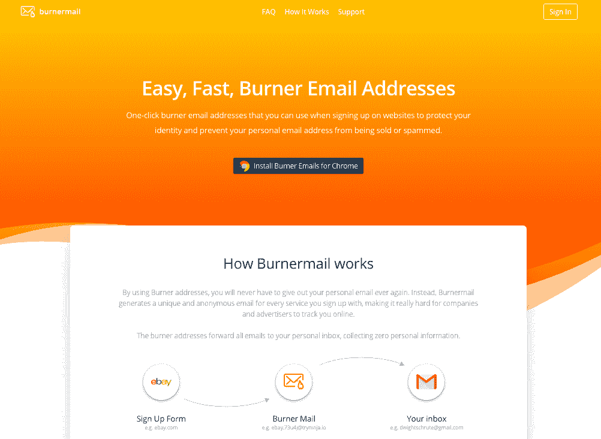
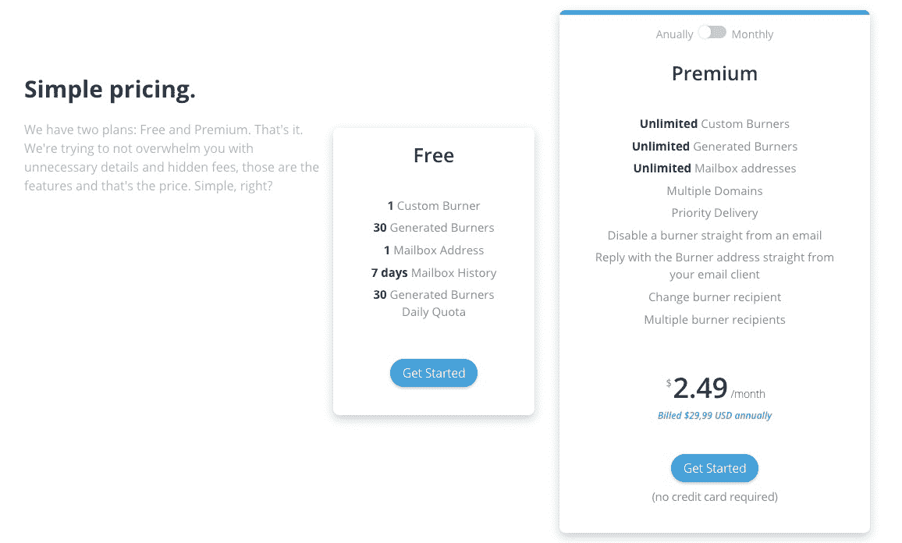
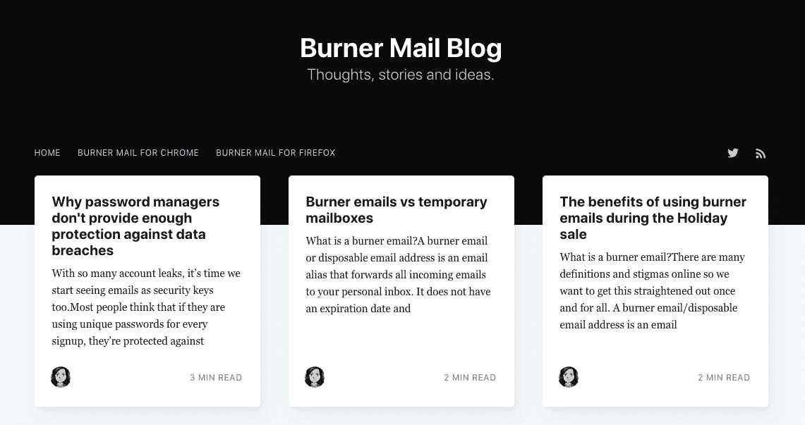

# “稳扎稳打”如何让我们实现拉面盈利的目标

> 原文：<https://www.indiehackers.com/interview/how-slow-and-steady-is-getting-us-to-our-goal-of-ramen-profitability-b836541931>

## 你好！你的背景是什么，你在做什么？

嗨！我叫 Alexandra Persea，今年 23 岁，是一名来自罗马尼亚克卢日的软件工程师。近一年来，我和我的联合创始人 Serge 一直在开发和运营一项名为 [Burner Mail](https://burnermail.io/) 的小型服务。

一次性邮件是一个生成一次性电子邮件地址的工具。Burner Mail 不会给出你的个人电子邮件地址，而是为你注册的每项服务生成一封独特的匿名邮件，这让公司和广告商很难在网上跟踪你。一次性地址会将所有电子邮件转发到您的个人收件箱，不会收集任何个人信息。与其他一次性电子邮件服务不同，Burner Mail 的电子邮件地址不会过期，可以长期使用，以保护您的个人电子邮件地址免受垃圾邮件、诈骗、数据泄露和身份盗窃的侵害。

七个月后，Burner Mail 的月经常性收入略高于 300 美元，月总收入超过 1000 美元，用户超过 12000 人。我们公开分享我们的指标，你可以在这里找到它们。

 

## 是什么促使你开始使用一次性邮件？

像许多软件开发人员一样，我喜欢从想法到产品的构建过程。我经常发现自己在做兼职项目，但是没有勇气把我的工作放在那里。我一直梦想打造自己的产品，经营自己的生意；然而，我不认为我有这样的知识和经验。

在与 Serge 见面并讨论了我们的人生目标和我们都想做的事情后，我们决定开始一起做一个兼职项目。我们进行了一些头脑风暴，并仔细检查了各自的想法列表，Serge 关于转发电子邮件应用程序的想法一直困扰着我。我对一次性电子邮件地址很熟悉，并一直在使用临时邮箱进行测试，但我不知道有任何流行的服务在做我们想做的事情。我们开始做一些研究，虽然我们确实找到了类似的服务，但我们都不喜欢。它们要么不可用，要么不便于使用。我们找不到可靠、注重隐私和易于使用的组合。我们也不知道其他服务是否盈利丰厚，甚至不知道这种工具是否有市场。考虑到所有这些，我们决定迈出这一步，开始开发我们的电子邮件转发应用程序。

## 构建最初的产品需要什么？

我们谈了很多关于我们的价值观和服务的长期愿景。我们希望确保我们从一开始就在同一页上，不要冒险在后来发生争执，特别是围绕着重要的问题，如服务代表什么，货币化方法，可能的融资/收购要约等。

我们认为这项服务的主要特点是安全性和隐私性，以及用户友好和易于使用的界面。我们决定尽可能公开透明，在业务方面，我们同意在决策中拥有平等的份额和一致的意见。

我们最初的大部分时间都花在了学习如何构建和配置电子邮件服务器上。关于这个主题的资源非常有限，所以我们主要通过测试和破坏东西来学习。一旦电子邮件服务器完成、安全并能够转发电子邮件，我就继续构建 web 应用程序，而 Serge 则开发浏览器扩展和登录页面。

其中大部分是在全职工作时完成的，在工作前和工作后花几个小时，大部分是在周末。长期这样做需要耐心、奉献和愿意在个人生活和职业生涯中做出牺牲。我们多次筋疲力尽，不得不偶尔休息一下。我不确定我们花了多长时间完成 MVP，因为我们遇到了生活的阻碍，我们暂停了应用程序的开发。

一次性邮件的第一个版本有一套相对基本的功能。用户可以通过 web 应用程序和浏览器扩展创建、禁用和删除一次性电子邮件。浏览器扩展将添加一个图标到电子邮件字段，如果按下，将生成一个随时可以使用的一次性电子邮件地址。一次性电子邮件地址将转发到您的个人收件箱，如果激活，阻止转发，如果禁用。

## 你是如何吸引用户和增加一次性邮件的？

我们在 reddit 上发布了该应用的测试版，在技术和隐私子编辑上发布了我们的工具，并征求人们的反馈。一开始我们有几百人注册，主要是那些愿意测试并给我们反馈的人。

几天后，我们启动了产品搜索，结果有点“失败”我们没有进入流行部分，更糟糕的是，人们没有留下任何评论，所以我们不知道是产品不好还是人们对这样的服务不感兴趣。然后，我们向独立黑客征求对产品和想法的反馈，得到了热烈的回应。当时感觉有点刺耳，但是很准确很诚实。

我们采纳了所有给我们的反馈，并在几天后重新推出，在当天的产品中排名第二。你可以在这里阅读我们的第一次发射失误[。那个月我们有超过 5000 的页面浏览量和超过 2000 的注册人数。几天后，我们甚至上了](https://www.indiehackers.com/forum/how-we-screwed-up-our-first-product-hunt-launch-500915ea55) [lifehacker](https://lifehacker.com/make-fake-email-accounts-for-website-signups-using-the-1826627262) ，并获得了另一个流量高峰。

在我们发布后不久，我们有机会购买了一个在搜索结果中排名靠前的相关域名。它帮助我们提高了排名，也为我们带来了一些用户。这里需要注意的是，当我们面对这个机会时，即使它包含风险和额外的工作，我们也没有想太多，而是一头扎了进去。

最便宜最有效的营销策略就是口碑。

TweetShare

像 Product Hunt 这样的渠道有利于让你的产品出现在人们面前，给你大量的曝光率和初始牵引力，但是，它们不是长期持续增长的好策略。我们很快了解到，推广和销售我们的服务必须是一项持续的努力。

我们尽可能在 Twitter、reddit 和 Quora 等渠道推广一次性邮件。我们参与了关于电子邮件安全、隐私和垃圾邮件的讨论，并试图教育人们使用一次性电子邮件的好处。我也注意到人们在网上有组织地建议和推荐我们的服务。最便宜最有效的营销策略就是口碑。

谈到增长，没有对错之分，但推广你的服务和争取新用户应该是一项持续的努力。当你没有资源进行营销活动或购买广告时，你最好的渠道是 reddit、Twitter、Quora、脸书集团、Instagram 或任何其他你的目标用户常去的地方。参与对话，回答问题，写有帮助的内容。

帮助我们增长的另一个方面是，在 2018 年数据泄露事件惊人增加后，人们开始倡导隐私。这使得一次性邮件等注重隐私的服务受到更多关注。

简而言之，这个领域，加上 2018 年隐私趋势的上升和一些媒体文章，给我们带来了稳定的有机增长。我们平均每月增长 30%左右，平均每月新增 1，400 名用户。

## 你的商业模式是什么，你是如何增加收入的？

当我们推出时，这项服务是免费的，我们只有一个[给我买咖啡](https://www.buymeacoffee.com/burneremails)的捐款链接，我们只收到了 114 美元。捐款的人给予了积极的反馈和良好的祝愿。

我们继续添加更多的功能，迭代产品，处理用户反馈，两个月后，我们有足够的信心推出高级包并对我们的服务收费。我们开始时的月费是 2.99 美元，几个月后增加到了 4.99 美元。

我们现在基于 SaaS 的免费增值模式运营。我们的免费套餐包括 30 个一次性地址和有限的功能，而我们的高级套餐包括无限的一切和一套额外的功能。我们的定价方案是每月 3.99 美元、每年 29.99 美元和三年 74.99 美元。

有些人可能会觉得我们的定价有点高，甚至离谱，因为他们习惯了免费应用程序；然而，我们试图教育和解释，我们没有一个大的风险投资资助我们，我们没有从出售他们的数据或向他们发送不需要的广告中获得任何额外的收入。现实很简单:没有适当的货币化，任何服务都无法持续。不得不向人们解释你的时间和工作应该和他们的一样有价值有时会有点令人沮丧，但我们实际上已经成功地将一些用户转化为快乐的客户，他们最初给我们发电子邮件说他们喜欢我们的服务，但不愿意为此支付那么多。

不是每个人都会一夜成名，没有其他服务成长的快并不代表你不配或者你没有提供价值。

TweetShare

在第一个月，我们有 19 个付费客户，MRR 为 56 美元，在过去的五个月里，我们已经增长到 300 多美元 MRR，平均每月有 20 个新客户。我们正努力实现稳定的线性增长，这样我们就能积累一些资本，并在为更大范围的用户服务之前解决任何可能出现的问题。我们将这一战略建立在这样一个概念上，即病毒式或指数式增长通常伴随着巨大的压力和更大的失败风险。

虽然与某些人相比，这个 MRR 可能看起来很小，而且我们不是“在六个月内达到$10k MRR”类型的故事，但我们仍然为我们的增长和旅程感到自豪。我觉得需要强调的是，不是每个人都会一夜成名，没有其他服务成长的快并不代表你不配，也不代表你没有提供价值。

虽然我们不能完全确定最终是什么帮助或损害了我们的发展，但我们相信我们做对了:

*   **透明和公开**:我已经为每个注册用户设置了一个自动电子邮件，向用户展示我自己，感谢他们试用我们的应用程序，并鼓励他们联系我们，以防他们有任何问题或反馈。我们也给出了我们的个人推特账号。通过这样做，我们让用户看到服务背后有一个真实的人，并表明我们是友好的，非常容易达到。我们还为对产品开发感兴趣的人创建了一个 Telegram 群组聊天，并公开了我们的增长和收入指标，以及我们的路线图。
*   **响应度**:我们在支持聊天和电子邮件方面的响应度非常高。我们已经回答了每一个问题、反馈和顾虑。我们还自动发送电子邮件请求反馈，我们已经回复了每一封电子邮件，无论反馈是积极的还是消极的。
*   **感恩**:我们总是花时间感谢用户的反馈，感谢他们对我们服务的信任，感谢他们报告问题，感谢他们通过购买我们的高级套餐来支持我们。我们很清楚人们都很忙，有人抽出时间给我们反馈对我们来说意义重大。我们还向不断给我们反馈的用户以及遇到问题但有耐心报告并等待我们解决的用户提供折扣。
*   **跟进**用户:我们会考虑每一条反馈和建议，要么实施，要么不予考虑。当我们这样做的时候，我们确保总是给用户一个跟进，要么把他们的建议添加到我们的路线图中，要么告诉他们为什么我们选择不实施它。我们也为用户遇到的任何问题道歉，并尽我们所能帮助他们。这向人们展示了我们的响应能力、责任感和彻底性，即使服务并不完美。

 

## 你未来的目标是什么？

我们的最终收入目标是让拉面盈利，并能够依靠一次性邮件的利润生存。

自从我们开始开发一次性邮件以来，我们的目标一直没有改变:让我们的业务盈利，总体来说，为我们的用户提供更多的价值。我们希望在 2019 年实现这一目标，围绕电子邮件隐私创建更多内容，改进我们的工具并添加新功能，同时保持其便利性和易用性。

我们希望开始把更多的时间和精力放在营销和增长上。我认为最有效的方法是创造有价值的内容。我们希望养成坚持在我们的博客上发帖的习惯，并创建一个推荐计划，奖励推荐我们服务的用户。

我们还计划在未来几个月推出一款移动应用，并扩展到支持更多浏览器，如 Safari 和 Opera。我们希望为我们的 web 应用程序添加更多功能，并尝试定价模型，以及添加一个企业包来提供对我们的 API 的访问。

## 你面临的最大挑战和克服的障碍是什么？如果你必须重新开始，你会做什么不同的事？

我们犯的最大错误之一是糟糕的品牌。Serge 和我都有技术背景，我们解释和宣传我们服务的方式对我们来说是有意义的。因此，当人们告诉我们他们不一定理解这个概念和好处时，我们感到很惊讶。他们不清楚我们到底在卖什么，以及它能如何帮助他们，这使得人们不愿意尝试一下。我们也未能解释价值主张。人们会留下这样的评论，“这不是和 X 一样吗，它们是免费的，”尽管一次性邮件的价值主张与他们提到的公司完全不同。另一件我们没有做好的事情是，用简单的语言解释潜在用户在访问登录页面时可能会有的最重要的问题:你的产品正在解决什么具体问题？

当我们面对这个机会时，即使它涉及到风险和额外的工作，我们也没有想太多，而是一头扎了进去。

TweetShare

我们犯的另一个错误是发布得不够快。当你的作品与你的名字联系在一起，而且你已经在上面投入了很多，把它放在那里是非常可怕的。回想起来，我相信对失败和被拒绝的恐惧以及冒名顶替综合症让我们在应该发射的时候没有发射。LinkedIn 的创始人雷德·霍夫曼说:“如果你对你产品的第一个版本不感到尴尬，那你就推出得太晚了”。你应该试着尽快发布，并尽早获得尽可能多的反馈。

我们也没有尽快实现盈利。这又是一个基于恐惧的决定。那时，我真的认为我们没有提供足够的价值来对服务进行收费，我们应该关注用户增长，并在以后将他们转化为客户。你应该尝试尽快将你的服务货币化，即使只有一美元。这一美元足以证明人们愿意支付。

我们克服了小的失败，学会了快速失败。我们第一次发布失败了，但我们征求了反馈意见并重新发布了。我们在品牌推广上失败了，但我们征求了反馈意见并进行改进。我们遇到了一些小问题，并因此失去了一些用户和客户。尽快解决问题，从中吸取教训，重新振作起来，这一点很重要。

我们很快认识到，拥有一个成功的 SaaS 不仅仅是制造一个好的产品。你需要知道如何营销，如何解读指标，如何推销自己和你的企业，如何处理不满意的客户和负面评论。作为一个创业者，你没有时间去阅读书籍，去学习所有你需要的技能，去开创和发展一个成功的企业。因此，最好的学习方法是“如何”谷歌搜索方法:“如何成功推出”，“如何赚钱”，“如何增加你的用户”，“如何增加你的 MRR”，“如何拥有一个好的登陆页面”，“如何获得用户的反馈”，“如何启动一个创业公司。”构建软件或业务的最大好处在于，你可以在网上找到几乎无限的资源。我们没有时间和资源来聘请设计师，所以我们阅读了关于有效的品牌和强大的登录页面的文章。我们研究了其他受欢迎的服务在做什么，并适应了它们。

我们从许多大型服务中获得了灵感和想法，如定价模型、如何正确解释好处和功能、写什么博客内容、如何让用户参与进来、自动电子邮件示例、反馈请求示例等。向其他大服务学习没有错。他们有时间和资源去试验，看看什么是有效的和坚持的。他们在服务的各个方面都有专门的团队。你不知道。看看成功的企业是怎么做的，并试着模仿，模仿的方式要符合你自己的业务，并与你的定位和服务相关。

 

## 对于刚刚起步的独立黑客，你有什么建议？

如果你有很多想法，但不确定要做什么，在开始一个想法之前，让你的想法浸泡一段时间。当它还在你的脑海中时，你可能会对此过于兴奋，而看不到它的负面影响。还有，试着把自己和你的想法分开，永远不要依附于它。不是所有的想法都是好的，有些甚至会失败。如果真的发生了，继续前进比继续在没有希望的事情上努力要好。

如果你正在把你的想法作为一个副业，试着养成一个不断开发你的产品的习惯。每周保持进步真的很重要，哪怕是很小的进步。每周花几个小时来计划和组织你的工作时间会有很大的帮助。

试着找一个支持你的朋友，为你的心理健康培养习惯。在创业和全职工作之间周旋需要很多牺牲和精力。你需要有精神和情感上的力量继续前进。会有这样的时刻，你会感到气馁，犯错误，甚至想退出。在这样的时刻，找一个能与你交流、鼓励你、给你建议的人交谈是非常有益的。拥有一个联合创始人的巨大好处就是:知道你并不孤单。

花时间和你的用户交流。向他们展示你的服务背后有一张友好的面孔，你关心他们。这有助于你建立信任，与他们建立关系。这使得获得反馈或评论变得更加容易，用户甚至可以通过口碑帮助你成长。

## 我们可以去哪里了解更多？

你可以在推特上的 [@sergeships](https://twitter.com/sergeships) 和 [@perseaalexandra](https://twitter.com/perseaalexandra) 找到我和 Serge。

你可以在[推特](https://twitter.com/burner_emails)或我们的网站[上找到一次性邮件](https://burnermail.io/)。我们还加入了我们的[电报](https://t.me/joinchat/EqcFOVf_xMCJHMqmD_H-FA)小组，我们刚刚推出了一个博客:[一次性邮件博客](https://blog.burnermail.io/)。

欢迎在下面问我们任何问题，或者通过 Twitter 或电子邮件给我们发消息。

—[<picture id="ember5205587" class="user-avatar ember-view user-link__avatar"></picture>亚历山德拉·珀西亚](/perseaalexandra?id=TEqHqLSuwvSzkmr0RCTVfF6tVKE2)【Burner Mail】联合创始人

## 想像一次性邮件一样建立自己的事业吗？

你应该加入[独立黑客社区](/)！🤗

我们是几千名创始人，互相帮助建立有利可图的业务和副业。来分享你正在做的事情，并从你的同事那里获得反馈。

还没准备好开始使用你的产品吗？没问题。这个社区是一个认识人、学习和实践的好地方。随意[随便浏览](/)！

—[<picture id="ember5205592" class="user-avatar ember-view user-link__avatar"></picture>考特兰艾伦](/csallen?id=ibTLPyjwVebnZjMGKvz6ztarnuV2)，独立黑客创始人

51votes