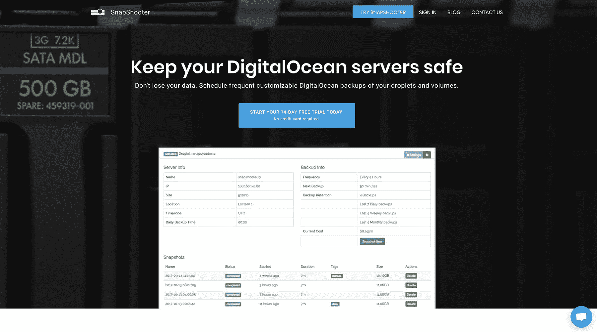
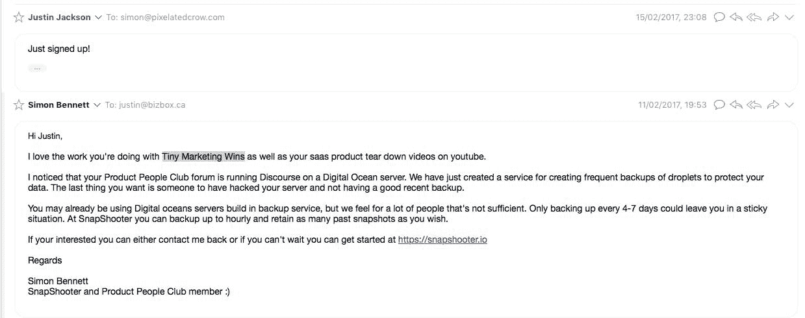
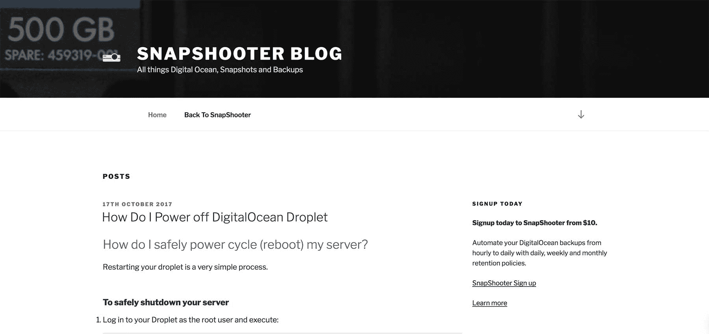

# 从小处着手如何帮助我建立了一家服务器备份公司

> 原文：<https://www.indiehackers.com/interview/how-starting-small-helped-me-build-a-server-backup-company-f89c5f29a0>

## 你好！你的背景是什么，你在做什么？

早上好！我叫西蒙·班尼特，25 岁，来自英国的软件工程师。我一直喜欢在业余时间为自己构建项目，并教授开发人员。当我不做咨询的时候，我就在我的 SaaS 上工作，[snapshot](https://snapshooter.io/)——一个数字海洋备份服务器。

SnapShooter 为 DigitalOcean 用户提供了一种安全而简单的方法来备份他们的液滴和卷。默认情况下，DigitalOcean 非常有限，仅提供每周备份和最后四次备份的保留。这对于我的工作来说还不够好，所以我建立了一个支持每小时备份的系统。SnapShooter 还提供卷备份——这是 DigitalOcean 没有提供的另一个功能。

自 2017 年 2 月推出以来，SnapShooter 已经进行了 15 万次备份，管理了 2000 个液滴和卷，并拥有 51 个付费客户，MRR 为 1076 美元。

 

## 是什么促使你开始使用 SnapShooter？

我曾为一家管理数百个微滴的公司提供咨询，其中大部分是 WordPress，当他们的一台 WordPress 服务器遭到黑客攻击后，他们需要一种更好的备份方式。DigitalOcean 提供的每周备份选项不够频繁。数据丢失耗费了每个人的时间和金钱。我对 DigitalOcean API 做了一些研究，意识到提供一个更好的备份系统是完全可能的。

[背后的创意 SnapShooter】诞生了。](https://snapshooter.io/)

在我兴奋地发布一个工作版本的时候，我采取的唯一的验证步骤是和其他认为这是一个好主意的开发者交流。这些最初感兴趣的开发者都没有成为客户。

构建原型的过程没有花费我任何东西，除了一个域名、一个数字海洋的水滴和我的时间。

## 构建最初的产品需要什么？

[snapshot](https://snapshooter.io/)是为了解决我们在工作中遇到的一个问题而打造的。我们正在处理数百个客户端小文件，需要一种简单的方法来备份它们。整个服务器快照的一个主要优点是恢复一个损坏的 WordPress 服务器变得轻而易举。

当我 6 个月大的女儿在喂食间隙睡觉，而我的伴侣早早上床休息时，我就开始了我的夜晚。总共花了 7 个晚上完成和测试备份系统的核心，又花了一个星期整合支付处理。

总共花了 7 个晚上完成和测试备份系统的核心，又花了一个星期整合支付处理。

TweetShare

我知道我的时间有限，所以我很高兴产品范围很简单。开始时，我跳过了构建大量功能。例如:没有时区，也没有每日、每周或每月的保留策略。我所包含的是设置备份频率的简单选项，以及保留多少备份的选项。

我充分利用了开发 Laravel 应用程序的速度，使用后台作业与 DigitalOcean API 进行通信，因为一旦快照被请求，可能需要一段时间才能完成备份。除了创建、监控和删除快照的脚本之外，它是一个基本的 CRUD 应用程序，使用 Stripe 进行支付处理。

## 你们是如何吸引用户，让 SnapShooter 成长起来的？

我的第一个客户是来自微型营销胜利和产品人俱乐部的贾斯廷·杰克逊，因为我知道他在用数字海洋主持他的社区的论坛。2017 年 2 月 11 日我一上线就给他发了邮件:

 

他马上就报名了！我开了个小派对，差点开了一瓶香槟。然后就什么都没有了——几乎两个星期都没有人报名。我担心我缺乏市场研究，这让我陷入了困境。

在 3 月初，我对[snapshot](https://snapshooter.io/)做了一些大的改进，主要是在用户界面上，然后我在 3 月 2 日在产品搜索上发布了自己的帖子。这可能是运气，也可能与 SnapChat 的 IPO 有关，但我最终在主页上获得了 88 次 upvotes 和我的下三位客户。

从小处着手——一条推文，一篇博客文章——如果你打算做软件，不要前期投资太多。

TweetShare

我吸引新客户最有效的渠道是数字海洋社区[产品页面](https://www.digitalocean.com/community/projects/snapshooter-daily-to-hourly-backups-of-droplets-volumes)。

SnapShooter 被列为第 15 个最受欢迎的项目。我也试着在社区中保持活跃，但不要太垃圾，只在与对话相关的时候提供自己的链接。

2017 年 11 月，我在 [Laravel 新闻播客](https://laravel-news.com/podcast)上投放了一则广告，获得了我最好的投资回报率结果，让 MRR 增加了 160 美元。这则广告花了我 300 美元，所以我只用了两个月就收回了收入。

## 你的商业模式是什么，你是如何增加收入的？

由于我主要是咨询，并没有停止或减少我的工作量，收入几乎可以是纯利润。我使用 Stripe 进行每月订阅收集，因为这是最容易设置的，我的用户似乎也很信任它。

我最大的支出是赞助播客和网站，这些已经慢慢收回了成本。当你把所有的 MMR 都花在一个广告上，必须等 2-3 个月才能收回投资，这就很困难了。我需要探索获得客户的不同来源。

| 月 | 收入 |
| --- | --- |
| 八月 | 226 |
| 九月 | 261 |
| 十月 | 321 |
| 十一月 | 481 |
| 十二月 | 561 |
| 一月 | 815 |
| 二月（February 的缩写） | 1076 |

## 你未来的目标是什么？

我的目标是让我目前的收入与我的 SaaS 项目相匹配。与一年前相比，我离这个目标更近了，但我还有很长的路要走。如果我能以月环比增长 20%为目标继续成长，那就太好了。实现这一点将是一个巨大的挑战:我将不得不尽我所能来推动针前进。

我想推出更多的产品，但当你已经有一个赚钱的产品时，这是很难的，而且似乎更好的是加倍投资已经在工作的产品。

## 如果你必须重新开始，你会做什么不同的事？

我会做的第一件事就是多收费。

我开始太便宜了。当时我想，如果我向顾客收取 1 美元，我就能让成千上万的用户注册并感兴趣。

实现我的收入目标将是一个巨大的挑战:我将不得不尽一切努力向前推进。

TweetShare

在过去的 12 个月里，提高价格是我最好的举措，那些支付原价的用户早就离开了。

## 有没有发现什么特别有帮助或者有优势的？

我周围有一些志同道合的人，他们也在从事独立项目，如产品化服务或 SaaS 模式的业务，这是一个巨大的动力。

正如吉米·罗恩曾经说过的，“你是和你相处时间最长的五个人的平均值。”

和与你同舟共济的人，以及在你前面和后面的人是学习和进步的好方法。

## 对于刚刚起步的独立黑客，你有什么建议？

我的简单建议是从小处着手——一条推文，一篇博客文章——如果你打算做软件，不要前期投资太多。保持你的想法小，尤其是如果这是你的第一次。

专注于商业目标，忘记其他的，比如退款过程或者发送欢迎邮件。如果可以手动完成，就不要编程了。改为船舶，当你厌倦了发送欢迎邮件时，再去担心这些细节。我仍然收集了 10 个 MySQL 查询，用于监控 SnapShooter。有一天，我可能会建立一个管理仪表板。

这是我看到的人们犯的最大的错误。在对你的业务目标影响不大的小决策上投入太多。

 

## 我们可以去哪里了解更多？

如果您在 DigitalOcean 上，请查看[snapshot](https://snapshooter.io)，并立即开始备份您的服务器！我们为只有一滴的用户提供免费等级，并为所有付费计划提供 14 天的试用期。

你也可以在推特[@ Mrs Simon Bennett](https://twitter.com/mrsimonbennett)上亲自查看我。

我很乐意听到你对这个应用程序的想法，如果你有任何问题，请在下面的评论中告诉我！

—[<picture id="ember5317398" class="user-avatar ember-view user-link__avatar"></picture>西蒙·贝内特](/mrsimonbennett?id=uD5bwmCSwXZjZbTCkvrsqjKMhBE2)【snapshoter】创始人

## 想像 SnapShooter 一样建立自己的事业？

你应该加入独立黑客社区！🤗

我们是几千名创始人，互相帮助建立有利可图的业务和副业。来分享你正在做的事情，并从你的同事那里获得反馈。

还没准备好开始使用你的产品吗？没问题。这个社区是一个认识人、学习和实践的好地方。随意[随便浏览](/)！

——[<picture id="ember5317403" class="user-avatar ember-view user-link__avatar"></picture>柯特兰艾伦](/csallen?id=ibTLPyjwVebnZjMGKvz6ztarnuV2)，独立黑客创始人

49votes