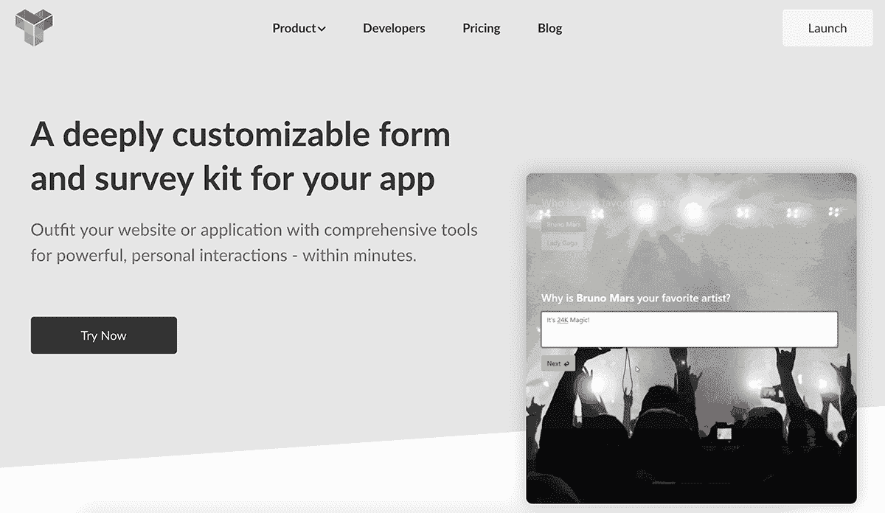
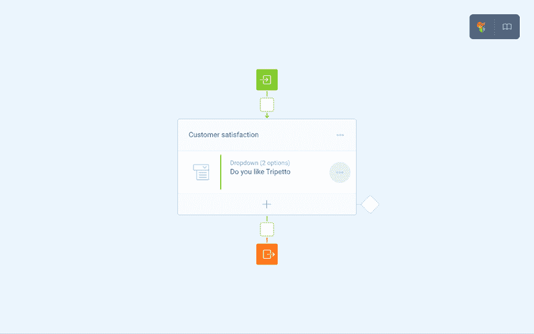
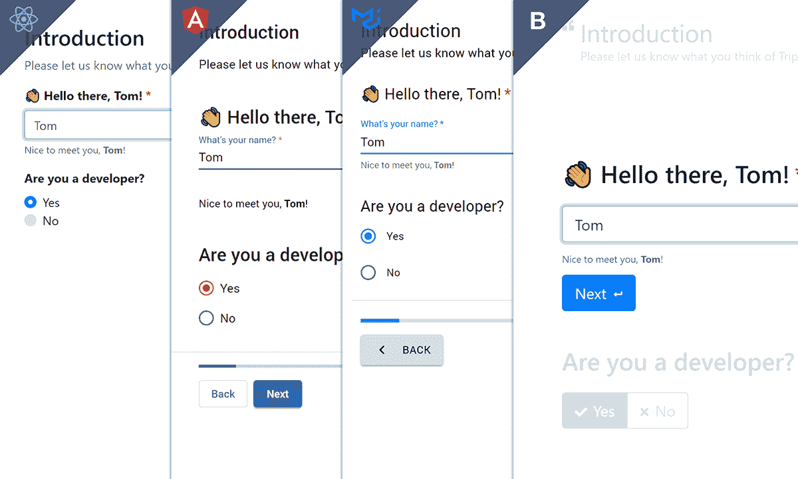

# 令人惊讶的反馈如何导致计划的改变和 55000 美元的 MRR

> 原文：<https://www.indiehackers.com/interview/how-surprising-feedback-led-to-a-change-of-plans-and-5-5k-mrr-a926d3edfe>

## 你好！你的背景是什么，你在做什么？

你好。我叫马丁·威特曼斯，我和我的联合创始人马克·范登·布林克在荷兰的阿姆斯特丹创办了[trietto](https://tripetto.com/)。我们为创建和部署逻辑繁重的表单和调查、对话式登录页面等提供解决方案。；本质上，自动化个性化交互的非人工智能解决方案。我们的解决方案主要由开发人员使用，特别是——但不仅限于——在医疗、创业和学术界。

我们并不孤单。您会发现相当多的工具在不同程度上适用于类似的目的；从用于普通表格和调查的 Typeform 和 SurveyMonkey 到用于真正酷的登陆的 Landbot，等等。我们渴望为这些类型的交互开发替代方案，而没有典型的 SaaS 缺点。因此，主要的 Tripetto 解决方案是可定制的，并意味着直接实施到我们用户的项目中。他们控制经验和收集的数据。

人们不断用牛肚给我们惊喜。我们的大多数工具都可以在网上免费获得，所以任何人都可以尝试一下。

 

## 是什么促使你开始使用 Tripetto？

我们第一次涉足调查领域是在 2006 年，当时我们被要求为一家医疗保健相关的客户开发定制解决方案，尽管我们的第一家初创公司(Solutior)根本不是专门从事调查的。那个项目最终变成了一种伙伴关系，这种关系一直延续到今天。长话短说，我们最终变得非常渴望从零开始，用我们一路上学到的一切。

*   首先，我们认为自动化和个性化的交互需要一种对话的感觉，如果没有先进的逻辑，你无法实现这一点。但是逻辑功能在现有工具中通常是受限制的和/或难以实现的。我们想让构建逻辑流成为一个核心特性，更像是在自组织绘图板上设计流程图。我们想让它变得更简单、更有趣。此外，先进的流程结构在白板上比在无尽的列表中更容易编辑和监督。

*   第二，建立*对话式*技术真的很难。我们赞赏并关注现任者和新来者的工作。但是他们的解决方案经常与隐私相关的问题相冲突(你好，GDPR！).为什么用户不得不接受这些工具的制造者将专门运行它们，并处理他们从信任的受众那里收集的数据？我们认为用户应该决定如何以及在哪里收集他们的数据。

*   最后，通过我们第一次创业的调查工具的开发和销售，我们了解到一般的问题类型在高级案例中往往会有所欠缺。用户告诉我们，他们希望能够开发自己的问题类型，并拥有更高级的模块来解锁 API 等。内部高级形式流动。为什么*我们*要决定什么有效，我们集成什么？我们意识到，别人往往知道并想要更好的。

因此，我们决定将这些概念(以及其他许多概念)捆绑到 Tripetto 中，并利用我们其他调查工作的资源自筹资金。这为我们赢得了彻底实验的时间，并防止我们不得不在质量上偷工减料。

 

## 构建最初的产品需要什么？

几乎所有的事情都花费了比我们几年前在项目开始时预期的更多的时间和精力。我们最终没有为大众商业化一个光滑的综合最终用户调查 SaaS，而是一套更加灵活的开源解决方案，让懂技术的人可以随意集成到自己的网站和应用程序中。这是一个相当大的转折。

然而，回过头来看，我们觉得我们不仅仅是遵守了最初的原则。我们设法(通过实验和迭代)获得正确的技术堆栈，并构建了现在处于 Tripetto 核心的组件:用于创建交互的自组织绘图板(即编辑器)，以及用于在网站或应用程序上运行这些组件的所谓独立收集器。

这并不是说削减雄心很容易。是的，我们随后的支点是从 2017 年早期组件的软发布中获得的见解的结果，以获得反馈，它们帮助我们找到了更多的方向。但是支点也是对我们工作范围的不可避免的修正。如果我们要在本世纪发布一些有用的东西，我们必须重新考虑第一个稳定版本，它定于 2018 年发布。

对我们帮助很大的是自筹资金。当我们想的时候，我们可以也确实决定停下来重新做一些事情。我们可以用我们的另一家公司来测试 Tripetto 技术的重要部分。在多家公司之间分配我们的资源被证明是一件有利于平衡的事情，即使这有时意味着进展缓慢。

## 你们是怎么吸引用户，种出牛肚的？

当我们在 2017 年末首次发布早期版本的 Tripetto 时，它并没有经过特别的打磨。它对最终用户来说也不够集成，并且缺少后端。但是对于开发者来说，这已经足够好了，他们可以尝试并开始向我们提供他们的意见。所以我们建立了一个基本的网站，在 HackerNews 上发布了一个帖子，并在 [Twitter](https://twitter.com/tripetto) 上尝试了一些东西。我们不知道会发生什么。

总的来说，反应是适度的，但真的很有用。我们发现人们认为这个版本不完美，他们很乐意告诉我们如何改进。但是我们惊讶地发现，开发人员希望自己使用 Tripetto 的核心组件来直接集成到他们自己的项目中，作为一种表单或调查工具。他们不需要另一个 SaaS 解决方案，他们想要完全控制。那真是令人大开眼界。

从这个角度来看，并考虑其他反馈，我们意识到我们可能会将核心组件的改进版本商业化，并在开发其他最终用户产品时使用这些产品。我们将在一个共享的技术平台上有多种主张。

快进一点。我们在 2018 年夏天重新推出了 Tripetto，作为开发人员在[产品搜索](https://www.producthunt.com/posts/tripetto)上的嵌入式表格和调查解决方案，以及一个专门的网站和一些[文档](https://docs.tripetto.com/)。这就是事情开始成形的时候。不久之后，我们签下了第一个付费客户。我们被一些开发者时事通讯选中——在我们事先不知道的情况下——并在 CodePen 上被特别报道。

最近，我们还发布了第一版的 Tripetto [网络应用](https://tripetto.app/)和 [WordPress 插件](https://tripetto.com/wordpress)。我们希望这有助于增加我们的知名度和雪球增长；通过简单地填写现有用户的表格和调查，回答者将被有机地介绍给 Tripetto。我们还会定期在[媒体](https://medium.com/tripetto)上发布博客文章，我们也会尝试赞助精选的开发者通讯。

我们现在仍在学习如何最有效地销售牛肚以及卖给谁。这本身就够难的了，也需要时间。

TweetShare

## 你的商业模式是什么，你是如何增加收入的？

在这个过程中，我们考虑了各种商业化的方法，并意识到很难选择任何一种方法，尤其是考虑到我们希望尽可能保持开源，希望建立一个强大的社区。因此，我们决定先从感觉合适的低挂水果开始，然后随着新提议的出现调整模型。

我们目前提供三种口味的牛肚:

1.  面向所有人的“交钥匙”网络应用(源代码[此处](https://gitlab.com/tripetto/app))；
2.  完整的 WordPress 插件(获取插件[此处](https://wordpress.org/plugins/tripetto))；
3.  开发人员将 Tripetto 组件集成到他们自己的应用程序中的表单和调查工具包(从这里的[开始](https://tripetto.com/))。

这个应用程序是免费的，可以让尽可能多的人尝试牛肚。WordPress 插件有免费和高级版本。开发人员的工具包大部分是免费的，但在特定的商业案例中需要付费许可。我们目前的收入来自这些许可证和偶尔的实施支持。

我们发现，将开发商提议的潜在客户转化为付费客户需要时间。开发人员正在愉快地用 Tripetto 进行实验和测试——要么在一些帮助下，要么完全独立于我们。他们需要的一切都可以在网上找到。但是他们可以这样免费玩，直到他们决定真正投入生产。有时会，有时不会。

这使得收入不可预测。但是它通常是实质性的，并且在每次转换时会重复出现，这在一定程度上取决于所销售的许可证类型。这是一个我们目前可以接受的折衷方案。当我们继续填充和改进管道时，它会自动整理出来。相对于对某些功能设置付费墙或不得不采用更严格的商业模式，我们绝对更喜欢这样。

 

## 你未来的目标是什么？

我们的大梦想是将表单和调查范式转向更加开源、平台无关、对话式的解决方案，人们可以将这些解决方案融入自己的项目并独立扩展。我们真的希望这成为一个广泛的社区努力，因为这激发了创造力和多功能性。

但要实现这一目标，我们认为短期内至少需要两件显而易见的事情:一个更大的用户群和更多的修饰。我们已经收集了大量有用的反馈，我们正在使用它来优先考虑我们把波兰。我们首先使用最精致的部分来吸引用户群。

在这里，钱是一个至关重要的因素。我们自筹资金。我们用牛肚做的东西会直接放进去。到目前为止，我们做得很好，但有时我们希望有更多的资金来防止偷工减料，帮助我们更快地进步，因为有人使用你的产品感觉棒极了。如果一开始增长缓慢，你真的需要这种推动才能继续下去。

## 你面临的最大挑战和克服的障碍是什么？如果你必须重新开始，你会做什么不同的事？

就像我提到的，钱是一个因素。到目前为止，我们已经足够幸运地拥有了自费的 Tripetto，这是一个非常有意识的决定。我们担心来自投资者的压力会迫使我们仓促行事，容忍核心技术的缺陷。从这个意义上说，我们不想用 MVP 来做“精益创业”。

然而，我确实认为我们有时在调整自己的步调上走得太远了。产品肯定是一次比一次好，我不会交易任何东西。但是，通过定期回到绘图板，我们也在早期扩展了我们的耐心和动力。

我们现在仍在学习如何最有效地销售牛肚以及卖给谁。这本身就够难的了，也需要时间。事后看来，我们应该更早更具体地找到解决销售角度的方法。在这方面，自筹资金有助于提高创造力和质量，但也减轻了健康的紧迫感。

出于正确的原因改变计划并不一定意味着改变梦想或愿景。

TweetShare

## 有没有发现什么特别有帮助或者有优势的？

我马上想到三件事:

1.  由于最初的部分发布，我们几乎是偶然地发现了 Tripetto 技术对于开发者(而不仅仅是终端用户)的潜力。因此，我很高兴我们决定分享我们工作的早期粗略部分以获得反馈。请注意，它甚至不是一个所谓的 MVP。
2.  大约在同一时间，GDPR 开始生效。事实证明，因为 GDPR，人们正在寻找 SaaS 数据收集解决方案的替代品，如表格和调查工具。我们很幸运，以这种方式推动了我们的信息的自托管和数据安全部分。
3.  在我们 2018 年首次推出产品搜索后不久，投资者和现任者就联系了我们。对我们来说，这是对 Tripetto 更不寻常的方面的一个很好的验证(我们知道表单和调查空间很大，本身不需要验证，但我们方法的一部分需要验证)。

## 对于刚刚起步的独立黑客，你有什么建议？

我常常在想，以我现在所知道的，我会给年轻时的自己一条最好的建议。我是想提前知道错误以便避免它们，还是想在前期低点时抓住即将到来的高点？

我可能会这么说:没关系，事实上强烈建议你在进行中改变计划——甚至是大幅度地改变。出于正确的原因改变计划并不一定意味着改变梦想或愿景。永远保持开放的心态，至少考虑其他前进的道路。这是对抗偏见或改变你的路线为时已晚的最佳疫苗。

## 我们可以去哪里了解更多？

访问[tripetto.com](https://tripetto.com)了解更多我们的产品。或者去[牛肚. app](https://tripetto.app) 马上开始创作。它是免费的。更多关于 WordPress 插件的信息可以在 tripetto.com/wordpress 的[找到。查看我们的](https://tripetto.com/wordpress)[博客](https://medium.com/tripetto)了解更多深度和背景。

特里佩托真的是一颗未经雕琢的钻石。我们渴望最终激发其他人使用 Tripetto，并用它做真正酷的东西。我们对任何能帮助我们实现这个梦想的建议和贡献都持开放态度。

—[<picture id="ember5204587" class="user-avatar ember-view user-link__avatar"></picture>马丁·威特曼斯](/martijnwijtmans?id=Ujle4WPDercpPl9sEq5Wmp2LEab2)【爆肚】联合创始人

## 想像牛肚一样建立自己的事业吗？

你应该加入独立黑客社区！🤗

我们是几千名创始人，互相帮助建立有利可图的业务和副业。来分享你正在做的事情，并从你的同事那里获得反馈。

还没准备好开始使用你的产品吗？没问题。这个社区是一个认识人、学习和实践的好地方。随意[随便浏览](/)！

——[<picture id="ember5204592" class="user-avatar ember-view user-link__avatar"></picture>柯特兰艾伦](/csallen?id=ibTLPyjwVebnZjMGKvz6ztarnuV2)，独立黑客创始人

13votes