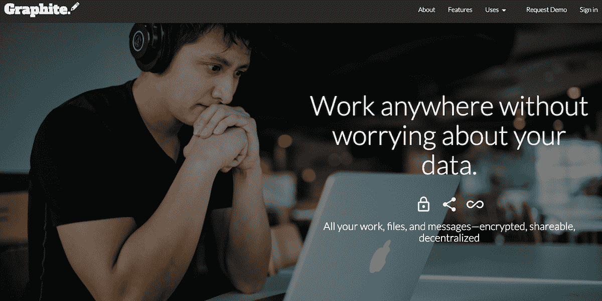
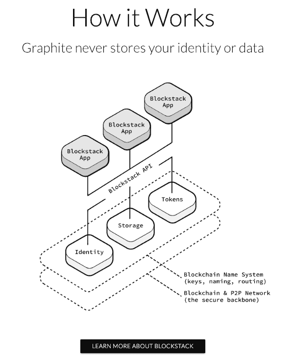
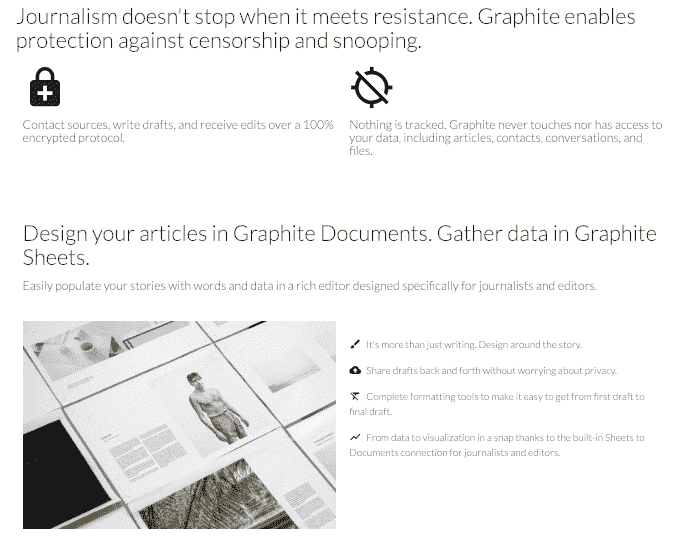

# 收回我的隐私是如何激发了一个产品成为一项商业

> 原文：<https://www.indiehackers.com/interview/how-taking-back-my-privacy-inspired-a-product-that-became-a-business-bd931dfc1d>

## 你好！你的背景是什么，你在做什么？

我叫贾斯汀·亨特。我是一名前客户经理，最近成为软件工程师，我是一名作家。最后一部分是石墨存在的原因。我想建立一些东西来支持我的写作，这正是我在完成我的 MFA 项目后所做的。

Graphite 是一个去中心化和加密的生产力套件。它包括文档编辑和协作、电子表格、文件存储和联系人管理。但它最初只是一个简单的文档编辑器，所以我可以将自己的写作从谷歌文档中移走。目前，Graphite 有超过 5000 名免费用户，但企业产品正在开发中，已经有很多企业和组织对此感兴趣，他们一直在寻找 Google Docs 和 Dropbox Paper 等产品的安全替代品。

得益于由 Graphite 使用的底层协议赞助的 [Blockstack](https://blockstack.org/) ，Graphite 每月获得 12500 美元的经常性收入。

 

## 是什么促使你开始使用石墨？

我一直是个作家。从我记事起，不管是短篇小说、漫画书、小说、博客还是新闻报道，只要是写出来的，我都喜欢。在我的创意写作 MFA 接近尾声时，我开始对我的每一篇重要作品都存储在谷歌上的想法感到很不舒服。那时，最终长成石墨的种子就被种下了。

当我第一次开始制造石墨时，我并没有打算让其他人使用它。我只是不想回到用微软 Word 写作的状态，不想被锁定在只有在电脑可用的情况下才能访问我的作品。基本上，我想要谷歌文档的便利，没有隐私的权衡。所以，我开始建造它。在开始研究 Graphite 之前不久，我发现了 Blockstack 的协议，我知道这将是完美的解决方案。Blockstack 的价值主张是数据所有权。如果每个应用程序只是从用户拥有和维护的存储位置向用户提供数据，而不是让应用程序维护所有用户数据的数据库，会怎么样？这正是我想要的，所以我开始在 Blockstack 上为自己制造石墨。

更好地了解这个世界，这样你就可以了解你的应用或产品在你的泡泡之外的生存能力。

TweetShare

当我开始构建 Graphite 时，他们的福音传播者和开发者社区得到了这个应用的消息，并积极响应，所以我决定让每个人都可以使用它。反应比我预期的要好，促使我考虑将石墨作为一种商业产品。就在那时，我决定开始评估它的市场潜力。在开发免费版本(我只打算供个人使用的版本)时，我开始安排与记者、律师、非政府组织等会面。我想知道他们如何管理工作场所的协作，特别是他们如何管理安全性。

他们中的大多数都没有好的解决方案。很明显，对于市场上现有的生产力套件，有一个可用的、安全的替代产品市场。因此，没有真正的技术知识，也没有这方面的经验，我一头扎进了膨胀石墨。从 2018 年 3 月首次推出到现在，Graphite 已经发展了很多，它已经扩展到小型到大型组织都可以使用它来安全地管理他们的工作。

当我想到 Graphite 现在的位置时，回头看看我开始构建应用程序时的位置，对我来说是非常神奇的。我在一家软件公司做客户经理，没有任何开发经验。我有 HTML 和 CSS 的经验，但是我从来没有克服学习 JavaScript 的困难。石墨推动我前进，给了我一个现实世界的学习理由。

## 构建最初的产品需要什么？

最初，Graphite 只是一个文档编辑器。我专注于构建一些像我这样的人(一个处理各种文档类型的作者)可以合理使用的东西，而不会让用户本能地想要回到 Google Docs。幸运的是，代码很便宜。构建第一代 Graphite 的唯一成本是时间。我边做边学，可能比经验丰富的开发人员花的时间要长得多。但是这段时间让我学到了更多的技能，最终，开发石墨成了我的第二份工作。

石墨的第一次迭代花了五个月的时间来构建。我在三个月内就有了一个工作产品，但那个版本没有包括最终在 2018 年 3 月向公众推出的所有功能。很难决定何时建造什么。作为一个从未被认为存在的项目的独立开发人员，想出最佳方案几乎是不可能的。所以我只是构建了我想要构建的东西，并验证了它的有用性。这是否导致了一些徒劳的努力？当然可以。我开发了一个聊天功能，它只是这个应用程序的一部分，持续了大约一个月。但是这个过程也教会了我很多关于验证想法、构建想法的小版本、测试用例等等。

当你看到另一家公司或产品的成功时，不要马上假设他们做了你应该做的事情。

TweetShare

在这个探索过程中，Graphite 是完全自筹资金的，尽管这有点误导。我不得不为域名付费，仅此而已。Netlify 为开源项目提供免费托管，因为 Graphite 不维护数据库或服务器，所以实际上没有其他成本。当然除了时间。

公开发布后，当需要扩大石墨规模时，一位朋友和前同事提供了早期资金。这笔资金让我在 2018 年夏天雇佣了承包商。其中一名承包商开发了一款手机应用，不幸的是，这款应用从未面世。另一个承包商在 Graphite 中构建了第一个实时协作迭代。他的贡献非常重要，因为它提供了人们期望从 Graphite 等应用程序中获得的必备功能之一。

除了资金和承包商，我还得到了很多帮助。Blockstack 的核心工程团队帮助我理解了解决问题的正确方法。Blockstack 的增长团队向我介绍了很多人，他们帮助我学习如何最好地营销石墨。一路上，我遇到了正在开发其他应用程序的朋友，当我有问题时，他们总是在我身边。从事开源软件的独立开发者从来都不是孤独的。

 

## 你们是如何吸引用户，壮大石墨的？

我非常幸运地发射了石墨。很多事情在正确的时间走到了一起。Blockstack 邀请我参加他们的大型活动，柏林 Blockstack。因此，我能够向一大群技术爱好者、媒体和投资者展示石墨。与此同时，我在[黑客新闻](https://news.ycombinator.com/item?id=16490595)上推出了石墨，有人在[产品狩猎](https://www.producthunt.com/posts/graphite)上猎杀了它。在这两种情况下，石墨得到了大量的能见度。

这些变量导致了最初的牵引石墨锯。从那时起，我开始通过参加活动来扩大用户群。我去了奥斯陆自由论坛，在那里，活动家、慈善家和技术专家聚集在一起，帮助讨论和解决独裁主义的问题。世界上许多人需要抗审查的产品，所以石墨在那里很受欢迎。那年晚些时候，我参加了在纽约举办的 Blockstack 活动[去中心化网络峰会](https://decentralizedweb.net/)，以及奥斯陆自由论坛在纽约举办的活动。所有这些都有助于保持石墨的势头。

我们不想承认运气起了多大的作用，但是一旦你承认了这一点，你就解放了自己，把注意力集中在你能控制的事情上。

TweetShare

分散式网络对待度量标准的方式与传统网络非常不同，但是仍然有一些数字可以帮助可视化 Graphite 的发展。也许最好的信息来源是 theblockstats.com。我还可以分享的是，Graphite 用户已经创建了超过 40，000 个文档。

除了参加活动，我唯一做过的其他营销就是积极使用 Twitter(你可以找到我 [@graphitedocs](https://twitter.com/graphitedocs) )和发布[博客帖子](https://medium.com/the-lead)。这两个对我来说都很自然，因为我既是一个推特迷，也是一个作家(正如我们已经确定的那样)。我想说，如果我觉得有资格给出任何类型的增长建议，那将是在 Twitter(或任何对你的应用有意义的社交媒体)上保持活跃，但不要让这种存在感觉像营销。我看到一些人关注很多其他用户，希望让他们也关注他们。这不是将社交追随者转化为用户的好方法。如果人们在社交媒体上与你互动，并有机地关注你，他们也更有可能使用你的产品。

## 你的商业模式是什么，你是如何增加收入的？

我大胆猜测，石墨的收入模式，至少在今天，可能是独立黑客遇到的更独特的模式之一。在构建企业功能的过程中，Graphite 尝试了许多定价模型。去年夏末，我找到了第一个付费客户，但这种定价模式不利于我的目标市场。因此，我重新将重点放在针对高预算企业客户的必要功能上，并将我的收入注意力转移到替代产品上。因为 Graphite 是建立在 Blockstack 之上的，我有资格获得一个令人兴奋的替代收入途径: [Blockstack App Mining](https://app.co/mining) 。

石墨是 10 月 App Mining 试运行的一部分，并在当月的投票中领先。现在，在 alpha 运行阶段，Graphite 已经在 12 月和 1 月的投票中领先。石墨是否会在接下来的几个月里继续领先还有待观察，但我毫不怀疑收入会继续通过这个项目。

Blockstack 受到激励来扩大他们的网络，而应用程序挖掘计划是实现这一目标的一种独特而聪明的方式。它鼓励应用程序开发人员在平台上构建，但也鼓励优质应用程序。虽然应用程序挖掘计划不是永久的收入来源，但它计划运营四年。因此，只要 Graphite 这样的应用表现出改进并参与其中，他们就有资金来源来帮助他们弥合从免费应用到付费应用或从创意到产品的差距。

这对 Graphite 的特殊意义在于，我可以在将产品推向付费市场之前，专注于打造更好的产品。这也让我能够专注于客户而不是融资，不像其他许多早期创业公司那样。

| 月 | 收入 |
| --- | --- |
| 2018 年 8 月 | 20 |
| 18 年 9 月 | 20 |
| 18 年 10 月 | 5000 |
| 18 年 11 月 | 0 |
| 2018 年 12 月 | 20000 |

开发新产品时，收入很重要，但同样重要的是考虑收入的其他来源。在构建去中心化的应用程序时尤其如此。这个市场仍然非常新，因此从产品到盈利可能比传统应用程序需要更长的时间。替代收入来源隔离了 Graphite 等应用。

## 你未来的目标是什么？

我计划向企业客户提供一个新版本的 Graphite，允许这些客户在他们喜欢的任何地方建立一个存储中心。这意味着如果必要的话，Graphite 可以在公司防火墙后运行。除了产品，该计划还为企业客户提供服务。这些服务可能包括为公司配置存储中心、定制中间件服务、支持协议等等。

实现 2019 年企业目标的很大一部分是扩大石墨团队。利用来自应用挖掘和早期客户合同的一些收入，我计划扩大工程团队，并希望雇用一些人进行业务开发。

现在，Graphite 在分散的 web 空间中运行，这些计划的最大障碍仅仅是采用和兴趣。我相信，在将 Graphite 定位为分散式应用程序之前，将它定位为安全解决方案对我来说非常重要，这有助于推动应用程序的采用。

## 你面临的最大挑战和克服的障碍是什么？如果你必须重新开始，你会做什么不同的事？

我想独立黑客社区中的许多人都会有同感，但我在 Graphite 遇到的最困难的事情之一是，作为一名独立创始人，我试图被认真对待。无论是在与潜在客户的大型会议上，还是在试图筹集资金时(我在这个过程中做得太早了)，没有一个合适的团队，不管是对是错，都会给人缺乏经验的印象。

如果我能重新开始，我可能会更加努力地寻找一位联合创始人。当然，这需要后知后觉，我将为自己打造一款产品，而不仅仅是一款应用。我也不会尝试开发一个移动应用程序。我犯了一个错误，没有彻底考虑就仓促行动。我正在构建一个每天都在变化的产品，并且使用的技术通常与移动 SDK 不兼容。而且坦白说，现阶段没这个必要。

## 有没有发现什么特别有帮助或者有优势的？

我强烈支持一周不工作一百万小时。那么，当你在日常工作之外还在做一些事情的时候，这意味着什么呢？这意味着找到一个工作的节奏和专门的时间，而不占用你和爱人在一起的时间。对我来说，那就是早起研究石墨。在我的午餐和其他休息时间做它，在晚上或者在我妻子休息的时候或者在她睡觉后做它。

我会推荐杰森·弗里德和大卫·海涅迈尔·汉森写的任何一本书。他们最近的一本书*不一定要在工作中疯狂*是不可思议的，但是 *Re/Work* 仍然是我认为最有影响力的书。

我认为理解运气在任何公司或产品中扮演重要角色也很重要。我在某些领域很幸运(黑客新闻、产品搜索)，但在其他领域就不太走运了。当你看到另一家公司或产品的成功时，不要马上假设他们做了你应该做的事情。很有可能，甚至有可能，他们的成功有一部分是运气的产物。我们不想承认运气起了多大的作用，但是一旦你承认了这一点，你就解放了自己，把注意力集中在你能控制的事情上。

 

## 对于刚刚起步的独立黑客，你有什么建议？

我能给你的最大建议就是打造你的产品。一个比我聪明得多的人在 Graphite 的早期告诉我，我还没有一家公司。我甚至还没有产品。我有一个应用。对于我来说，要有一个产品，我必须不断地建造。一旦我有了一个产品，我就可以有一个公司，因为我可以卖那个产品。但是没有建设就无法从 app 到公司。

至于学习，我建议人们少花时间听产品播客和阅读产品博客。独立黑客和其他类似网站提供了关于真实经历的有价值的信息，但我鼓励人们广泛阅读。听关于世界大事的播客。更好地了解这个世界，这样你就可以了解你的应用或产品在你的泡泡之外的生存能力。

## 我们可以去哪里了解更多？

你可以在[网站](https://graphitedocs.com)，在[博客](https://medium.com/the-lead)，或者在 Twitter [@graphitedocs](https://twitter.com/graphitedocs) 上了解更多关于石墨的信息。现在，用你最好的问题来回答我吧！

——[<picture id="ember8072966" class="user-avatar ember-view user-link__avatar"></picture>贾斯汀·亨特](/polluterofminds?id=Zcfuy2kNmDUbKKwgt7qa7YR11M23)，石墨创始人

## 想像石墨一样建立自己的事业？

你应该加入独立黑客社区！🤗

我们是几千名创始人，互相帮助建立有利可图的业务和副业。来分享你正在做的事情，并从你的同事那里获得反馈。

还没准备好开始使用你的产品吗？没问题。这个社区是一个认识人、学习和实践的好地方。随意[随便浏览](/)！

——[<picture id="ember8072971" class="user-avatar ember-view user-link__avatar"></picture>柯特兰艾伦](/csallen?id=ibTLPyjwVebnZjMGKvz6ztarnuV2)，独立黑客创始人

36votes