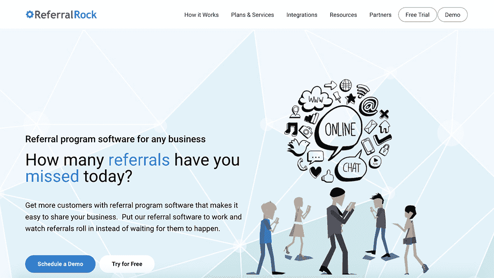
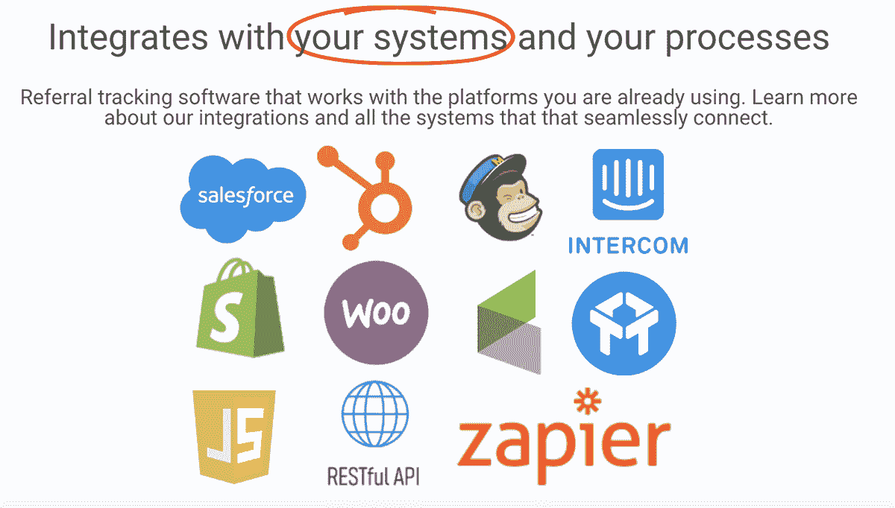

# 与客户交谈如何使我的业务增长到每月 7 万美元

> 原文：<https://www.indiehackers.com/interview/how-talking-to-customers-grew-my-business-to-70k-month-b46a87fe2a>

## 你好！你的背景是什么，你在做什么？

大家好，我是 Josh Ho，我是 [Referral Rock](https://referralrock.com/) 的创始人兼首席执行官。我和妻子及两个孩子住在马里兰州的银泉市。我的职业是工程师，但我认为自己是一名全栈企业家(不确定这算不算一件事)。我负责 Referral Rock 的产品和营销，但也负责销售和客户支持。

Referral Rock 位于 SaaS martech 空间，100%偏远。我们为任何类型的企业制作[推荐营销软件](https://referralrock.com/referral-marketing-software/)——不仅仅是电子商务。我们的大多数客户都是中小型企业，业务类型广泛，从汽车经销商和税务会计师到 SaaS，当然还有电子商务。

如今，Referral Rock 每月收入超过 7 万美元。一开始，它是独立黑客的梦想，是一个只有我一个人的经常性收入自助 SaaS 业务，但我抓住了呈现给我的发展机会。这促使我增加服务和内部销售，以加速我们的增长，并找到我们在市场中的定位。

 

## 是什么促使你开始做推荐摇滚？

推荐摇滚的想法是我在本田经销店等汽车服务时产生的。一位顾客走进来，径直走向一位销售人员。客户提到他们是被一个朋友推荐的，销售人员在他们振作起来进入销售模式之前，脸上有两秒钟的空白表情。

从那时起，我开始想知道汽车经销商或任何基于本地服务的企业是如何运作推荐项目的。后来在谷歌上快速搜索了一下，我只找到了专注于电子商务的“向朋友推荐”软件。我认为自己已经发现了市场的缺口，于是开始追求为非电子商务企业开发推荐程序软件的想法。

我首先通过接触我接触过的所有小企业来验证这个想法。这意味着家人、朋友和他们的朋友，以及我使用的任何当地商业服务，如我的会计师、房地产经纪人、屋顶承包商等等。我给他们发了一份调查，并为每 10 个人画了一张礼品卡。

我不得不承认，商业调查的结果并不是“拿钱走人”式的回答；但是有趣的结果来自参与推荐项目的消费者和他们感受到的痛苦。在那些日子里，最重要的要求是，该业务是一个 B2B SaaS 业务。在我过去创建的一家名为 [UberNote](https://ubernote.com/) 的初创企业中，我在试图让消费者为在线服务付费时遭受了痛苦，并发誓再也不这么做了。

## 构建最初的产品需要什么？

在最初的六个月里，我每周在 alpha 版本上工作大约 10 个小时，根据工作量有几个高峰和低谷。当时我是一名为自己工作的软件顾问，所以我的日程安排非常灵活。

我试图使用尽可能少的代码。第一个版本是 ASPX 页面和资源文件的超级基本框架，是我从一个旧项目中拼凑出来的。每个资源文件都代表给定客户的可配置元素。这甚至允许我在第一个版本中避免使用数据库。

对于管理界面，我使用了一个调查工具，允许客户填写他们的企业名称，上传一个徽标，他们的推荐报价，一些基本的企业描述，等等。然后我拿了。CSV 并将其转换成我的一个资源文件。

我的目标是花尽可能少的时间来验证最初的产品，看看 Referral Rock 是否有脚。

 

## 你是如何吸引用户和发展推荐业务的？

2014 年 6 月，我在 [Betalist](https://betalist.com/startups/referral-rock) 上发布了第一个版本，当时表现相当不错。我用促销代码跟踪 Betalist 用户，所以我知道谁注册了。我记得发布会吸引了大约 200 名注册者。然后，我发出调查问卷，让大约 20-30 人完成设置调查。

从那时起，我也活跃在 Twitter 上，与营销人员或任何提到“推荐项目”的人联系。我会评论或喜欢推荐摇滚 Twitter 账户上的推文，它列出了一个免费的推荐项目。在长达一年的测试中，在我开始收费之前，有超过 500 个人对免费推荐项目感兴趣。

在兼职做 Referral Rock 的时候，我继续改进服务并创建了一个实际的数据库和管理 UI。我经常通过聊天/电子邮件联系用户，看看什么能让产品变得更好。我不能说我认为该产品提供了足够的价值来收费，尽管缓慢但肯定的是，客户通过他们的推荐项目获得了一些真正的吸引力。

[最后，在一个朋友的挑战下，我建立了 Stripe 和一个结账服务。](https://mojoho.com/from-a-side-project-to-business-overnight/)

我从内容营销和 SEO 入手，继续新用户的流量。知道它对以前的业务是多么有效，我很早就开始写博客，这样我们就可以和任何寻找推荐软件的人交谈。我甚至在 Flippa 上购买了失败的竞争对手域名，这样我就可以把它们指向 Referral Rock。

| 月 | 游客 |
| --- | --- |
| 16 年 1 月 | 3400 |
| 17 年 1 月 | 6500 |
| 18 年 1 月 | 14000 |
| 19 年 1 月 | 22900 |

随着时间的推移，通过制作大量优秀的内容，我们在许多推荐营销相关术语上排名很好。我的目标是(现在仍然是)参与对话，将我们的差异化放在最前面和最中心。事实上，支持非电子商务的企业帮助我们在拥挤的市场中脱颖而出，这样我们的理想客户就能找到我们。我们在营销漏斗的底部和准备购买的受众身上也有严格的关注点。

## 你的商业模式是什么，你是如何增加收入的？

推荐摇滚是 SaaS 的一项业务，我们通过每月订阅和一次性服务费来赚钱。自 2015 年开始收费以来，经过近四年的时间，如今我们每月收入超过 7 万美元。

| 月 | 收入 |
| --- | --- |
| 16 年 1 月 | 5000 |
| 17 年 1 月 | 17000 |
| 18 年 1 月 | 38000 |
| 19 年 1 月 | 50000 |
| 19 年 4 月 | 70000 |

起初，Referral Rock 是一家低价自助服务企业。我从未想过我会收取每月 100 多美元的服务费，或者有几个以上的员工帮忙提供支持。我们的一个转折点是因为我在帮助客户聊天时遇到的挫折。

我发现帮助人们聊天非常痛苦，因为当我等待和看着他们输入回复时，我对对话的单线程性质非常不耐烦。所以我开始询问人们是否愿意分享屏幕或打电话，这样我就可以更快地帮助他们。你瞧，付费转化率开始上升。*道*起。我们将试用到付费的转化率提高了四倍。与用户直接对话帮助我建立了联系，并提高了我对他们在寻找什么的理解。它还把一个真实的人放在业务的背后，而不是某个人躲在不知从哪里来的聊天背后。

尽管它开始是为了[缓解我在聊天](https://www.indiehackers.com/product/referral-rock/-LZPWC7x2X2GlsDqCw0c)上与客户交谈的烦恼，但它以我现在所知的“内部销售”而结束我发现客户想听听我的意见，以及我的专业知识，比如为什么软件以某种方式工作，以及他们希望它如何工作。很多时候，我会对建议感到惊喜，并发现自己在说，“你是对的，产品应该这样工作。我可以在明天之前修好它。”

我相信，在你的产品还没有完全得到验证的早期，你作为一个创始人所提供的激情和洞察力会有很大帮助。我向所有创业者强调这一点，并尽可能利用这个机会。

在做了几个月的屏幕分享和通话后，我对客户的需求有了更好的了解，也了解了他们从这项服务中获得了多少价值。这促使我提高价格，并开始对帮助客户启动他们的程序所做的额外工作收取安装费。因为我的时间开始集中在这些演示上，所以开发和内容营销工作变慢了；我意识到我忽略了业务中有助于增长的其他部分。这是我知道我需要帮助来发展业务的时候，因此开始了围绕我建立一个团队的漫长道路。

当你的产品没有被完全证实时，你作为一个创始人所提供的激情和洞察力会有很大帮助。

TweetShare

一点一点地，我们通过招聘可以替代我的工作来扩大业务。我们现在是一家完全远程化的公司，有 12 名经理和跨市场营销、销售、客户成功和产品的团队。

## 你未来的目标是什么？

我们的目标是继续成为一家盈利的公司，并通过口碑传播进一步实现我们帮助企业发展的使命。

我们认为，目前的推荐空间存在碎片化；联盟营销的老卫士正在迎接推荐营销、客户支持和影响者营销的新卫士。在一天结束的时候，我们都把推荐归因于推荐者。我们认为所有这些细分市场都有一个美好的未来，并希望看到随着口碑营销的发展，认知度也随之提高。我们可以共同帮助我们的客户成长，减少对数字广告巨头的依赖。

对于 Referral Rock，我们希望继续成为一家远程优先的公司，无论他们住在美国的哪里，我们都可以找到合适的人才。建立一个可以支持人们及其家人的企业，同时给他们一个提升自己的空间，这是非常有益的。

与用户直接对话帮助我建立了联系，并提高了我对他们在寻找什么的理解。

TweetShare

## 你面临的最大挑战和克服的障碍是什么？如果你必须重新开始，你会做什么不同的事？

这一切都很艰难和痛苦，但最艰难的部分是招聘和组建团队。招聘中的失误代价很大。由于转介石是自筹资金，时间和金钱都是管理的关键资源，因为没有太多的错误空间。

我最大的招聘错误是过早招人。(只是澄清一下，我并不是说对*业务*来说为时过早，因为我确实感受到了痛苦，也有这种需要。)我犯的错误是，对*我来说*当领导和经理还为时过早。

我明白了从一个痛苦的职位上招聘不是一个好主意。这很像当你饿的时候去买食物——很有可能做出一个糟糕的决定。

如果我以不同的方式做这件事，我会告诉自己先停下来，自己做更多的工作，并确保有可重复的过程。我会花时间从各个角度更好地了解一个成功的招聘是什么样的——不仅仅是他们将实现什么，还有我如何在日常工作中与他们共事，他们如何把握方向，以及有效工作所需的流程和节奏。在你能有效地雇佣和管理一个角色之前，你应该知道来龙去脉。

仅仅通过几个电话和一个项目很难弄清楚这一点，但我们已经建立了一个流程来帮助我们避免错误并更快地发现危险信号。我仍在努力寻找一些特定角色的合适人选，但我也很幸运地找到了我觉得可以一起创建公司的人。

## 有没有发现什么特别有帮助或者有优势的？

我听了大量的播客(比如独立黑客),这些播客占据了我在健身房、乘车时以及在等待接孩子时的大量时间。主要是创始人访谈和创业故事，帮助我学习如何避免别人的错误，并听到他们的成功。

强烈的同理心可以加速学习，帮助你设身处地为他人着想。

TweetShare

通过获取尽可能多的样本来加速你的学习。不要纠结于具体的建议，而是要更好地理解他们的决策过程，并从自己的角度来看待这个过程。利用这些建议建立你自己的*决策模型。有时你会得到宝贵的见解或想法，但更多的时候，听到别人的经历会强化你的论点，并验证你自己对世界如何运转的看法。*

对我帮助最大的技能是我的同理心。它在许多方面都有帮助，比如销售、营销、招聘、管理和产品设计。我还认为，强烈的同理心可以加速学习，帮助你设身处地地为他人着想，站在他人的角度看问题。

另一个重要的技能是工程思维。显然是为了制造技术产品本身，但也是因为经营一家公司的大部分工作都涉及到制造。人员、流程、公司结构...不知道如果我没有将一切系统化并拥有可重复的过程，我会在哪里。

最近，我开始读更多的书，并与其他创始人建立联系。作为一名单独的创始人是一个孤独的旅程，但 Twitter 和独立黑客等社区帮助我与志同道合的人联系，分享经验，并获得支持。

## 对于刚刚起步的独立黑客，你有什么建议？

不要在意标签，甚至是你自己对自己的先入之见。保持开放的心态，你可能会对自己的能力感到惊讶。总的来说，我对自己有了很多以前不知道的了解。在我开始“推荐摇滚”之旅之前，我从未想过自己是一名销售人员，也没有任何愿望去成为销售人员。我陷入其中，真诚地喜欢它，并开始理解杀人的快感。如果我从未决定开始接听电话和演示，我不知道 Referral Rock 今天会在哪里。

我明白了诚实和乐于助人可以成为一名优秀的销售人员；你不必咄咄逼人或咄咄逼人。我坚信企业家需要学习如何销售，这不应该被外包出去。

我要给出的另一条建议是，给事情不按计划进行留有余地。对你和你的团队来说，把所有东西都塞得太紧，你就看不到那些能带来巨大变化的细微差别和小事。Referral Rock 的游戏规则改变者不是来自一个计划；它们来自于能够退一步看趋势和方向。愿意试探，看看他们怎么走。然后，当你取得一些成功时，开始练习，并使它们可重复。

## 我们可以去哪里了解更多？

你可以去[https://referralrock.com](https://referralrock.com/)看看我们如何让口碑成为增长的渠道，或者关注我在[twitter.com/jlogic](https://twitter.com/jlogic)的报道。我也发布了我在 https://mojoho.com[的创业历程。](https://mojoho.com)

为了支持我们的社区并帮助传播口碑，我们已经建立了一个新的网站和电子邮件简讯来分享关于企业的故事。叫做[口碑揭开](http://wordofmouthuncovered.com/)。我们试图通过研究有趣的企业来探究口碑传播的根源。如果你想[贡献](http://wordofmouthuncovered.com/contribute)或者有兴趣听听这些故事，请查阅。

我总是很乐意谈论创业、创始人销售、建立远程团队，或者你抛给我的任何东西。

—[<picture id="ember5204861" class="user-avatar ember-view user-link__avatar"></picture>何鸿燊](/jlogic?id=Rcos7Gro8UOumwuMbOvSlkFFN7C3)【引荐摇滚创始人

## 想像推荐摇滚一样建立自己的事业？

你应该加入独立黑客社区！🤗

我们是几千名创始人，互相帮助建立有利可图的业务和副业。来分享你正在做的事情，并从你的同事那里获得反馈。

还没准备好开始使用你的产品吗？没问题。这个社区是一个认识人、学习和实践的好地方。随意[随便浏览](/)！

——[<picture id="ember5204866" class="user-avatar ember-view user-link__avatar"></picture>柯特兰艾伦](/csallen?id=ibTLPyjwVebnZjMGKvz6ztarnuV2)，独立黑客创始人

39votes