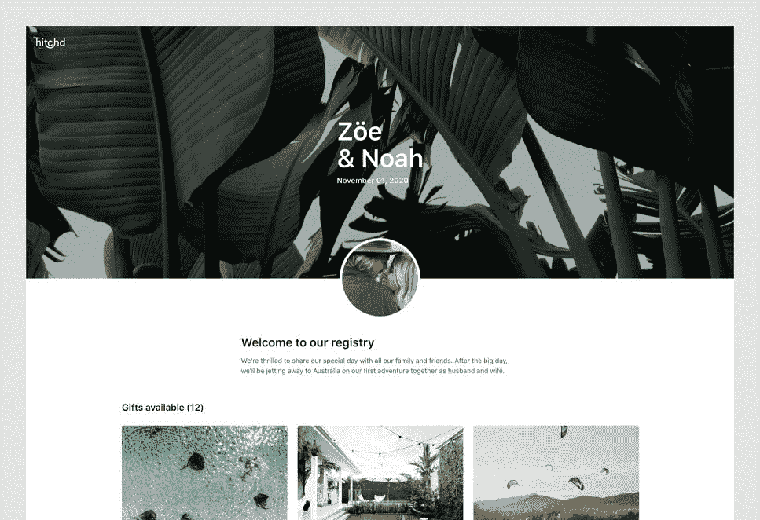

# 我为自己的婚礼开发的应用程序如何成长为每月 25000 英镑的业务

> 原文：<https://www.indiehackers.com/interview/how-the-app-i-built-for-my-own-wedding-grew-to-a-2-5k-mo-business-a413c2cda4>

## 你好！你的背景是什么，你在做什么？

大家好，我是奥利·罗兹达兹，一名生活在澳大利亚黄金海岸的产品设计师。我是现代情侣蜜月登记处 Hitchd T1 的联合创始人之一。你可以把 Hitchd 想象成一个许愿池、现金基金和 Kickstarter，所有这些都集于一身。我们的目标是让情侣们为他们一生的冒险创造和资助任何种类的礼物或经历变得超级简单。

我和我的联合创始人 Isuru 一起在 Hitchd 上工作了三年，他是一名工程经理。在 Hitchd 之前，我们每个人都在微软和埃森哲等公司担任过不同的角色，涉足从咨询到保险、初创企业到非营利组织的广泛行业。

【T2

如今，Hitchd 完全靠自己创业，目前每月收入约 2500 美元。

## 是什么促使你开始使用 Hitchd？

很像一个典型的 IndieHackers 创始人的故事，Hitchd 是为了解决我们自己的问题而创建的。当我在 2015 年订婚时，我的未婚夫让我负责计划我们的蜜月和组织婚礼登记处。

我们最近参加了一个朋友的婚礼，他使用了一个基本的蜜月登记系统，并喜欢这个想法，即能够要求我们的客人为我们的活动和体验提供资金，而不是接受传统的礼物。

你越早给你的网站带来流量，你就能向越多的人学习。

TweetShare

我开始在互联网上搜索可以使用的注册表，这样我们就可以灵活地创建自己独特的体验，同时以现代和个性化的方式展示我们的旅行。我的搜索没有结果。尽管自百货商店登记礼品的时代以来，婚礼行业已经取得了很大的进步，但选择却非常有限。

Isuru 和我之前已经一起工作了很多年，并且在空闲时间一起合作做项目。在告诉他我目前的困境后，我们决定只有一件事可做:建立我们自己的注册表。

## 构建最初的产品需要什么？

我们开始与朋友、家人和已婚熟人交谈，试图更多地了解他们自己的蜜月经历。幸运的是，在我们回顾的领域中，我们也有一些大的竞争对手，这有助于我们根据我们希望构建的东西来衡量我们的想法。

因为我的婚礼需要快速周转注册，我们决定了 MVP 需要什么，并把任何耗时的东西留到以后。当我们开始构建我们的原型时，我们很快就发现了什么是有效的，什么是无效的，然后进行迭代。这种快速迭代过程是一种有价值的方法，后来演变成我们如何衡量和改善夫妇今天如何使用该产品。

Hitchd 的最初原型花了大约四个月的时间来设计、建造和测试，尽管除了通过 Stripe 集成选择礼物和接收客人捐款之外，没有任何其他能力。

婚礼请柬发出后，没过多久，第一批宾客捐款就开始滚滚而来。在我们结婚的那天，客人们的反馈都非常积极，所以我们知道我们所做的一切都是正确的。

使用 Hitchd，我和妻子不仅成功地为我们的整个蜜月提供了资金，更重要的是，这意味着我们没有陷入金融债务。在什么是典型的最昂贵的时候，你的生活，这打开了我们的眼睛，作为最具决定性的因素，为什么有人会选择蜜月注册超过接受传统的礼物。

在我们旅行回来后的第二年，Isuru 和我利用空闲时间将 Hitchd 产品化，最终在 2017 年向公众发布了我们的测试版。

## 你是如何吸引用户并发展 Hitchd 的？

希契德一发布测试版，我们就开始投放脸书的广告。锁定与 Hitchd 兴趣相似的订婚夫妇的能力，对于获得早期用户并开始了解他们如何使用该产品非常有价值。在过去的一年里，我们也尝试在 Instagram 上运行不同类型的广告，但它们往往更贵，对我们来说效果更差。

关于 Hitchd 的一个有趣的事情是潜在的病毒式传播，因为在任何给定的婚礼上都有很多客人使用它。如果客人有积极的体验，他们可能会推荐给他们的另一个订婚的朋友。

我们一直在测试获取新用户的新渠道和方法，最近是通过谷歌广告和付费推荐，但我们 2020 年的主要重点是有机增长。Hitchd 的有机流量终于开始增加，这主要是由于一些技术上的 SEO 优化(我们使用 Lighthouse 进行监控)和谷歌 1 月份的算法变化。

## 你的商业模式是什么，你是如何增加收入的？

由于 Hitchd 是引导式的，我们决定从第一天开始收费。就像 Airbnb 或 Kickstarter 等公司一样，我们对每笔交易收取服务费，这意味着每当客人为礼物捐款时，我们就赚了钱。与典型的 SASS 模型不同，我们的回报通常要晚一些(平均三个月)，因为一对夫妇创建他们的注册和他们的婚礼日期之间的时间可以从几周到一年多不等。

在确定我们最终的费用结构时，我们花了很多时间将 Hitchd 与其他类似的产品和服务进行比较。支付处理(通过 Stripe Connect)在我们的决定中起了很大的作用，特别是运行国际支付，这会产生略高的费用。虽然有更便宜的竞争对手，但我们认为 Hitchd 是一个优质产品，想想 Squarespace 如何定位自己，所以我们不介意一开始收取稍高的服务费。

我们的商业模式很棒，因为如果一对夫妇在创建他们的注册方面更成功，平均总注册价值可以波动得更高，但我们仍然能够准确预测再投资到收购渠道的理想金额。随着我们收集更多的数据并与更多的增长伙伴合作，我认为我们将能够更清楚地了解未来的情况。

到目前为止，我们已经通过将时间投入到 SEO 中，并专注于消除我们的营销漏斗和核心用户旅程中的瓶颈，帮助我们增加了收入。在接下来的几个月里，我们还计划开始测试我们服务费的变化，并在我们的营销材料中重新定位，看看这是否会对注册和整体转化产生积极影响。

## 你的技术是什么？

Hitchd 最初是用[ASP.NET](https://dotnet.microsoft.com/apps/aspnet)和 [MVC](https://en.wikipedia.org/wiki/Model%E2%80%93view%E2%80%93controller) 构建的，因为我们对它很熟悉，它减少了我们创建 MVP 的时间。我们还利用了 Azure 和 [Azure SQL](https://azure.microsoft.com/en-us/services/sql-database/) ，因为我们获得了启动资金，这对我们能够以低成本快速前进至关重要。

我们很快发现，为了让 Hitchd 成为一个表现稳定的全球产品，我们需要转向一个更易于管理、财务上更具可扩展性的框架。

有成百上千的工具可供使用，你只需要在你旅程的正确阶段找到适合你的。

TweetShare

我们最终用前端的 [Angular](https://angular.io/) 和 [NodeJS](https://nodejs.org/en/) 和后端的 [Firebase](https://firebase.google.com/) (特别是 Firestore)重写了 Hitchd。我们知道 Angular 不是最流行的语言，但是它对我们来说确实很好，因为我们通常在应用程序的不同部分工作，很少遇到合并冲突。如果我们今天要重写 Hitchd，我们可能会使用 [React](https://reactjs.org/) ，但是由于我们的用户更喜欢新的特性而不是新的框架，我们会等到不得不这样做的时候。

由于 Firestore 的安全规则，使用 Firestore 为我们提供了一系列没有 API 的功能(尽管我们仍然对关键数据使用 API)。我们向其他 Indiehackers 强烈推荐它，因为它使您的原型代码尽可能接近生产代码。

迁移我们现有的已经建立了注册中心的用户群是一件棘手的事情，但是我们很早就做了一些艰难的决定，以确保我们能够在迁移发生时为他们提供最好的体验。

## 你未来的目标是什么？

我们有一个健康的 2020 年路线图，我们的重点一如既往地是不断改善我们用户的体验。对我们来说，这是为了确保我们有时间实施我们的计划，同时保持势头和增长，因此我们与一些外部专家合作，以确保我们有能力应对这些挑战。

今年到目前为止，我们已经扩展了 Hitchd，为更多国家的用户提供服务，并发布了一些已经工作了很长时间的更大的功能。随着蜜月登记市场越来越饱和，我们计划继续建设 Hitchd，为夫妇和他们的客人提供最佳的整体体验。

## 你面临的最大挑战和克服的障碍是什么？

我们最大的挑战之一是跳出我们的核心技能，深入到我们不熟悉的领域:如营销、SEO 和 PR。乐观主义可能让我相信，如果我们制造出足够好的产品，所有这些领域都会自己解决，你肯定听说过这种情况，但对我们来说不是这样。

长期坚持不懈是建立 Hitchd 的另一个重要因素。就像创业一样，也有极端的高潮和低谷，尤其是当你快速学习并试图快速适应的时候。

## 如果你必须重新开始，你会做什么不同的事？

如果我们能让时光倒流，做一些不同的事情，那就是更早地将产品推向市场。在发布之前，我们花了太长时间来完善 Hitchd，并且没有把重点放在拥有一个伟大的营销网站或博客上。你越早给你的网站带来流量，你就能向越多的人学习，这对于理解你所建立的东西是否真的有用是至关重要的。

## 有没有发现什么特别有帮助或者有优势的？

迄今为止，时间、经验和战争创伤是我们成功的重要因素。Hitchd 是我们共同发起的第二个项目，第一个项目是比特币市场(RIP ),远在比特币成为主流之前。迟早你会对自己的决定产生直觉，并学会相信自己的直觉。

我们还学会了通过使用诸如 [Trello](https://trello.com/) 之类的工具来简化我们的协作，这是一种管理我们的任务和路线图的轻量级方法，而诸如 [Sketch](https://www.sketch.com/) 和 [Invision](https://www.invisionapp.com/) 之类的设计工具让我们在编写代码之前快速原型化新的想法和功能。

我们都坚信每天多做百分之一的事情可以从复合效应中获益(我们都读过詹姆斯·克利尔的[原子习惯](https://jamesclear.com/atomic-habits)),自从实施了这些规则，我们已经注意到了产出的积极变化。作为一名设计师，我可以很容易地花所有的时间来润色 Hitchd 上的每个像素，但我已经慢慢地学会了把自己抽离出来，更早、更频繁地发货。

## 对于刚刚起步的独立黑客，你有什么建议？

我们的建议是永远不要放弃你的想法，永远保持积极的态度。在创造一个成功的产品的过程中会有很多起起落落(无论成功对你意味着什么)，重要的是驾驭情感的浪潮。

最后，试着不要过度思考你的决定，因为很少有第一次就做对的事情。我们发现使用像 [Fullstory](https://www.fullstory.com/) 这样的工具是成功的，当我们看到我们做出的决定没有按计划进行时，这些工具给了我们一个紧密的反馈循环，以快速重复。

有成百上千的工具可供使用，你只需要在你旅程的正确阶段找到适合你的。

## 我们可以去哪里了解更多？

如果你有兴趣使用 Hitchd 为你自己的蜜月注册，你可以在[www.hitchd.com](http://www.hitchd.com)找到我们。

此外，查看我们的[博客](https://www.hitchd.com/blog)中的提示和有趣的文章。

在 [【邮件受保护】](/cdn-cgi/l/email-protection#84ece1e8e8ebc4ecedf0e7ece0aae7ebe9) 处伸手问好，或者在 Twitter 上以@rozdarz 和@fonsekaisuru 的身份找到我们。

我们很乐意在下面的评论中回答问题！

—[<picture id="ember5204388" class="user-avatar ember-view user-link__avatar"></picture>奥利·罗兹达兹](/Hitchd?id=mCP8SZgR9iN96r4l3gGFUFoE2jk1)，Hitchd 联合创始人

## 想像 Hitchd 一样建立自己的事业？

你应该加入独立黑客社区！🤗

我们是几千名创始人，互相帮助建立有利可图的业务和副业。来分享你正在做的事情，并从你的同事那里获得反馈。

还没准备好开始使用你的产品吗？没问题。这个社区是一个认识人、学习和实践的好地方。随意[随便浏览](/)！

——[<picture id="ember5204393" class="user-avatar ember-view user-link__avatar"></picture>柯特兰艾伦](/csallen?id=ibTLPyjwVebnZjMGKvz6ztarnuV2)，独立黑客创始人

19votes