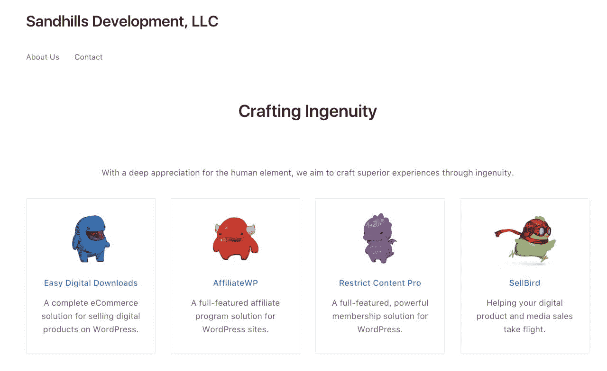
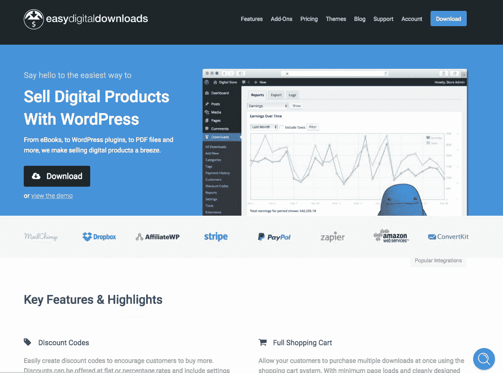
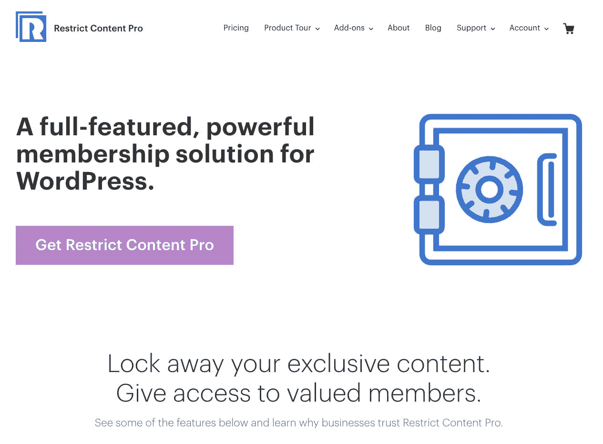
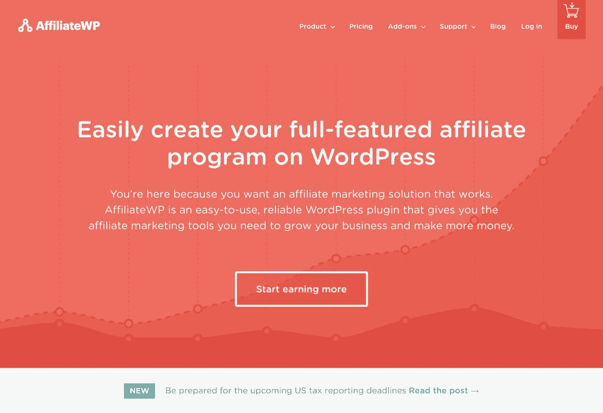
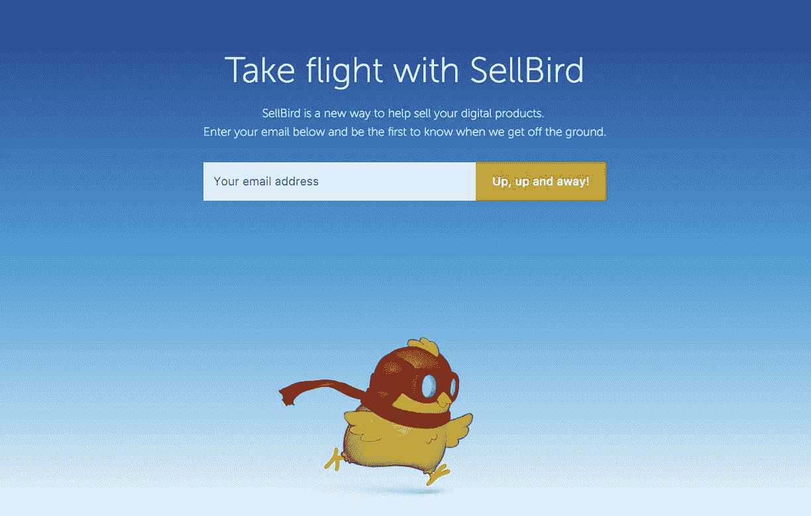

# 如何建立百万美元的 WordPress 插件业务

> 原文：<https://www.indiehackers.com/interview/how-to-build-a-million-dollar-wordpress-plugin-business-119ace6f42>

## 你好！你的背景是什么，你在做什么？

我叫皮聘·威廉森。我是一个热爱自然的农家男孩，经营着一家名为[沙丘开发](http://sandhillsdev.com/)的软件公司。我们使用 WordPress 为网站所有者建立电子商务、会员和联盟营销插件。

2010 年 6 月，作为一名大学生，我推出了我的第一款产品。不可思议的是，我的第一笔销售在产品发布后几个小时内就出现了，所以我穿过街道，买了一杯我通常买不起的拿铁咖啡。如今，我们是一家拥有 13 人以上的公司，每月收入 191，000 美元。

 

## 是什么促使你开始从事沙丘开发？

当我在 2010 年推出第一款产品时，我只是在为客户开发小产品和做自由网站开发。我没有期望创建一家公司或做任何超出我当时所做的事情。我大部分时间都在修补网页开发(主要是 WordPress 项目)，玩得很开心，并设法赚到足够支付账单的钱。为了贴补收入，我还在当地一家剧院兼职做舞台监督。

当我现在的妻子和我订婚时，我开始认真对待网络开发和销售产品，当她完成大学学位时，供养我们的责任变得非常现实。

在接下来的两年里，我构建了几十个小型 WordPress 产品插件，并继续为一些精选客户开发网站。这对我真的很有效。我的客户群和收入持续快速增长，从每月 100 美元或更少增长到每月 20，000-25，000 美元。大约就在这个时候，也就是 2013 年初，我意识到我需要更好地隔离自己和家人，组建一个有限责任公司，让业务更加“官方”。2013 年年中，我决定雇佣我的第一名员工，因为产品变得太大，我自己无法完全管理。

到 2013 年底，我、一名员工和几名兼职合同工每月收入超过 3 万美元。

该公司最初的注册名称是 Pippin's Pages，LLC(这是我主要构建定制网站时留下的)，后来更名为[沙丘发展有限责任公司](http://sandhillsdev.com/)。

## 构建最初的产品需要什么？

早期，我构建的产品没有任何韵律或理由；如果我有一个听起来很有趣的想法，我就建立它，推出它，希望能赚几美元。我制作了每个售价 5 美元的小部件、图像滑块插件、自定义字体工具、内容管理系统、FAQ 管理器等等。任何事情都是。

这种散弹枪式的方法在两年里对我非常有效，让我达到了每月 8000 美元的收入水平。考虑到我没有雇员和非常低的开支，我做得相当不错。然而，当我仅仅为了解决自己业务中的一个痛点而开发第一个产品时，我的关注点就变窄了。

执行。如果你不推出 MVP，什么也做不成。

TweetShare

我想经营一个销售 WordPress 高级开发教程的会员网站，当时我对任何可用的解决方案都不满意，所以我决定自己做一个。由此产生的产品叫做 [Restrict Content Pro](https://restrictcontentpro.com) ，现在是公司收入的三大支柱之一。

直到 2012 年初，我一直通过第三方市场销售我的所有产品。然而，我真的想变得更加独立，自己管理一切。我花了几周时间研究在我自己的网站上销售数字产品的现有选择，结果再次发现，我对现有的选择都不满意。所以这让我创造了另一个产品来解决我自己的问题。该产品是一个名为[简易数字下载](https://easydigitaldownloads.com)的纯数字电子商务插件。

简易数字下载的推出使我能够通过将产品转移到我自己的网站【https://pippinsplugins.com来控制我正在销售的产品。这是让我从 2012 年每月 6000-8000 美元飙升到 2013 年每月 30000 美元的举措之一。

 

随着 Easy Digital Downloads、Restrict Content Pro 和 Pippin 的插件继续增长，我想引入一个联盟系统来帮助进一步增长。这是一个我不太熟悉的领域，所以我没有对现有的选择做足够的研究。相反，我选择了第一个看起来不错的系统，并继续使用。这原来是塞翁失马，焉知非福。我选择的系统有一些严重的缺陷，花费了我大量的时间、金钱和精力，但令人欣慰的是，它激励我建立自己的联盟营销平台，我可以用它来推广我的产品。该系统名为 AffiliateWP，于 2014 年初推出。在不到 8 个月的时间里，它从每月 0 美元增长到 22，000 美元。

Restrict Content Pro、Easy Digital Downloads 和 AffiliateWP 是我们的三大支柱，但第四个和第五个可能会在 2018 年的某个时候加入它们。

## 你是如何吸引用户和促进沙丘发展的？

早期，我的客户有两个主要来源:

1.  CodeCanyon.net 现有的大量观众，我在这个市场上发布我的产品。
2.  我通过频繁的写作培养了一批自然成长的观众。

Code Canyon 提供的现有受众对我早期的成功至关重要。那时候我没有名声，没有追随者，也没有办法靠自己接触到潜在客户。利用 Envato(Code Canyon 的所有者)提供的受众，我可以在没有任何可销售受众的情况下建立早期客户群。

Code Canyon 很快帮助我建立了一个小的追随者群体，然后我能够通过我在个人网站上制作的内容 [Pippin 的插件](https://pippinsplugins.com)培养成一个更大的群体。我每周都会发布几次教程、技巧和其他博客文章。虽然我的观众一开始什么都没有，但我很快就让他们有了相当多的追随者。

 

通过我的产品和写作，我能够将我网站的流量从每月几百个页面增加到每月超过 85，000 个页面。这种流量对我的产品早期的成功至关重要。如今，pippinsplugins.com 的流量显著降低，但这仅仅是因为现在大部分流量都被直接发送到我们特定产品的网站。

我们现在继续通过持续的内容制作、电子邮件营销和社交拓展来增加我们的受众。我们开始在商业的这些更传统的方面变得相当好，但是那只是最近的发展。在公司的头五年，我的传统营销技巧糟糕得可笑。我只知道如何集中注意力，努力工作，写下我正在做的事情。这不会对每个人都有效，但对我有效。

在公司的头五年，我的传统营销技巧糟糕得可笑。

TweetShare

我写作中真正吸引很多人的一个方面是我的透明性。我一直很欣赏那些支持透明并帮助他人从自己的成就和失败中学习的公司和个人，所以我决定也支持这一点，并经常写下我公司的进展。

我分享了一切。收入，心理斗争，里程碑等等。这有助于与我的观众建立起高度的信任，然后让我的大部分观众成为付费客户、品牌传播者或两者兼而有之。

## 你的商业模式是什么，你是如何增加收入的？

我们通过他们自己的专用网站销售我们的每一种产品，每年都有自动续订的年度订阅。这目前为我们提供了 191，000.00 美元的平均月收入。

在过去五年中，我们对产品定价和销售模式进行了多项变革，这对我们的收入产生了重大影响。

当我第一次在 Code Canyon 上开始时，我的产品都是一次性购买出售的，并授予终身访问权。我很快意识到这是不可持续的，并努力在我自己的网站上销售产品，在那里我可以控制条款。一旦我完成了向我自己站点的产品迁移，我就开始了年度许可证更新，这有助于显著提高公司的收入，因为它提供了从现有客户获得持续收入的途径，而不是完全依赖新客户的收入。

几乎每一个成功的企业都这么说过，但我要再说一遍:提高价格是我们做出的最好的决定之一。

2013 年，我将 Restrict Content Pro 的价格从 24 美元上调至 42 美元。这极大地提高了平均客户价值，这是 Code Canyon 最初迁移后所急需的。因为我没有市场那么多的观众，所以我的顾客也少了。但提高价格使该产品的收入保持稳定，因为每次销售都比以前存入更多的钱。我还保留了每笔销售的 100%,而不是把 30%交给 Envato。

2013 年至 2015 年间，影响我们收入的唯一真正变化是新产品的推出和现有产品的持续开发。这足以帮助我们从 360，000 美元增长到 1，140，000.00 美元。

 

在 2016 年和 2017 年，我们进行了三项不同的变革，对我们的现金流产生了积极影响。

首先，我们大幅提高了简易数字下载产品套件的价格。价格变化非常显著，实际上降低了新客户的总数，但同时使我们的月收入增加了 10，000 美元到 20，000 美元。在这次价格上涨之前，Easy Digital Downloads 项目一直在努力应对收入与支出的比率，因为我们的收入远远不足以支付支持客户群的成本。通过减少客户数量，但提高平均客户价值，我们能够使项目恢复盈利。

我们做的第二个改变是实施自动年度续订。以前，我们对所有客户都依赖手动续订。当更新时间到来时，客户会收到一封电子邮件，要求他们更新许可证。虽然这确实很有效，但它并没有发挥它应有的作用。在 2016 年初为所有新购买的产品启用自动续订有助于在 2017 年大幅提高我们的月收入，因为我们开始看到第一批自动续订正在处理中。

第三，我们在 2017 年 3 月提高了 AffiliateWP 和 Restrict Content Pro 的价格(第二次)。这一价格变化成功地提高了平均客户价值，而没有减少我们每月带来的新客户数量。

这三个变化让我们几乎在一夜之间从每月 123，000.00 澳元变成了每月 191，000.00 澳元。当然没有一夜成功的事情。月复一月的工作导致了这一夜之间的增长。

我们成功地保持了每年的盈利，但利润非常微薄。然而，2016 年和 2017 年的变化使我们的利润率从 2-5%提高到 15-20%。

过去八年我们的年收入细分如下:

| 年 | 收入 |
| --- | --- |
| 2010 | 24326 |
| 2011 | 61666 |
| 2012 | 68500 |
| 2013 | 360000 |
| 2014 | 782000 |
| 2015 | 1140000 |
| 2016 | 1480000 |
| 2017 | 2268000 |

## 你未来的目标是什么？

在沙丘发展公司，我们最重要的理念是关心我们的员工。虽然我们只是一个小团队，但组成我们团队的人是公司最重要的组成部分。因此，我们的目标始终是围绕提高我们团队的生活质量和幸福来构建的。

当我们在工作中感到快乐时，我们的工作会做得更好。快乐和积极是确保我们能够帮助客户用我们的产品做一些了不起的事情的最好方法之一。

为了帮助确保我们保持促进个人成长和幸福的能力，我一直在追求可持续的盈利能力。我认为这是每月和每年的利润水平，使公司能够:

1.  财务稳定，能够度过收入下降期
2.  拥有足够的资源进行战略投资
3.  有能力在任何时候引入新的团队成员来填补需要的角色
4.  在经济上能够支付所有员工高于生活工资的工资
5.  财务足够稳定，允许不太喜欢或被忽视的收入流被移除
6.  有足够的现金储备，使公司在发生灾难时能够生存下来

由于 2016 年及之前几年的利润率为 2-5%，我们很难承受收入的大幅下滑。如果我们在财务上陷入困境，公司的方方面面都会陷入困境，所以我们的目标是*避免*陷入困境。这似乎过于简单，也许有点傻，但这是完全正确的。

虽然现金不是公司最重要的东西，但它允许公司追求*最重要的东西。所以，现金为王。*

我们在 2016 年和 2017 年对定价和销售模式进行的战略调整使我们在 2017 年实现了可持续盈利。

我未来的目标是在 2018 年、2019 年及以后保持并提高这一盈利水平。通过这样做，我可以确保我的团队获得所需的灵活性，以追求他们自己的个人成长和幸福。这反过来给了我们尽可能照顾好顾客的机会。

## 你面临的最大挑战和克服的障碍是什么？

大大小小的太多了。我认为最大的经历是为我们的 Easy Digital Downloads 产品推出了一个第三方附加产品市场，运行了四年，然后在 2017 年 10 月将其关闭。

Easy Digital Downloads 采用免费增值分销模式，这意味着核心产品是免费的，然后出售一些额外的附加产品。当 Easy Digital Downloads 首次推出时，我决定通过出售他们在 easydigitaldownloads.com 开发的插件来鼓励第三方开发者为我的平台开发插件。作为代表这些第三方开发者销售产品的交换，我从每笔销售中抽取 30%。

这实际上非常非常有效，并帮助轻松数字下载在早期显著增长。我不能肯定地说，但我怀疑这个项目早期的成功很大程度上要归功于第三方市场。

然而，随着时间的推移，市场上出现了许多重大挑战。这些挑战几乎导致我的团队中一半人离开，造成巨大的财务和情感压力，并最终成为导致我们关闭市场的催化剂。

首先，赡养负担几乎是不可逾越的。我们很早就决定，我们的团队将处理通过我们的市场(第一方和第三方)销售的附加产品的所有技术支持。这个决定纯粹是基于能够控制我们的品牌。顾客从我们这里购买产品，所以如果他们体验不佳，我们的品牌就会受到威胁。我仍然相信这是一个正确的选择，但它导致了高度的压力和低落的士气，因为团队努力在无尽的支持票浪潮中保持领先，其中许多都是针对我们几乎不知道如何使用的产品。

 

其次，审查、测试、更新和支持来自第三方开发者的数百个产品的管理负担*不堪重负*。新产品提交的审查队列经常会一次积压 3-6 个月。仅仅是管理与几十个产品创作者的交流就非常困难，更不用说将他们创造的产品推出去了。

第三，销售和支持第三方代码的财务影响是巨大的。从表面上看，Easy Digital Downloads 做得很好，但实际上，我们几年来几乎没有出过水面。例如，2016 年，轻松数字下载项目带来了 693，000.00 美元的总收入。其中，197 000.00 美元支付给了第三方供应商。2015 年，我们支付给供应商的佣金甚至更多，总计 213，000.00 美元，而总收入只有 562，000.00 美元。我们因为第三方佣金损失了 20-40%的收入，但是我们完成了 95%的工作，因为我们提供了所有的客户支持。

这些挑战都是我们自己造成的，很大程度上是我自己缺乏经验和固执的结果。尽管我知道市场正在伤害我们，但几年来我拒绝采取果断行动。2016 年，我们努力逐步减少市场的足迹，但我们做的还不够。

保持谦逊。相信自己是最好的，或者比别人更好，是跌入谷底的最快方法之一。

TweetShare

最后，在 2017 年 9 月，它来到了一个转折点，我决定完全关闭这个市场。做出决定后，我们执行了一项计划，从我们的网站上购买、停止或删除所有第三方插件。这包括接触每一个供应商，通知他们我们的决定，然后给他们一个报价。他们可以向我们出售他们的附加产品，停止销售，或者转移到其他地方。

最终，我们从网站上移除了 55 个附加组件。在这 55 家公司中，我们购买了其中 37 家的版权，在此过程中花费了近 15 万美元。值得庆幸的是，我们一直在努力实现可持续盈利，所以花那么多现金是可能的。

那些年经营市场充满了宝贵的学习经验，有些比其他的更痛苦，但也许对我来说最大的收获是完全拥有我们的品牌和产品的重要性。我们心甘情愿地允许其他人直接影响我们的品牌，影响我们的努力，这几乎终结了轻松数字下载产品。

我鼓励每个人接受第三方开发者提供的有价值的资产，但同时要非常谨慎地看待这种参与如何影响平台本身和团队在平台上工作的能力。

## 有没有发现什么特别有帮助或者有优势的？

从手动续订转为自动续订的决定无疑是我们做出的最佳决定之一。仅这一举措就为我们的月收入增加了 30，000-50，000 美元，而没有增加任何营销工作。

有意识地从我的日常工作中去除“噪音”帮助我更好地集中注意力和工作。我曾经积极关注所有的行业新闻，并经常在 Twitter 和各种网站上聊天。我不怀疑这样做在早期以许多看不见的方式帮助了我，但现在我试着限制我允许进入我工作的外部来源的噪音量。这造成的影响是非常非常明显的。

在大学里，我爱上了骑自行车，现在我试着每周至少骑 20-50 英里。有时候我成功了，但也经常失败，但我仍然努力让骑自行车成为我每周例行工作的一部分。我发现骑自行车不仅给了我一种追求更好的身体健康的愉快方式，它还极大地帮助了我自己的心理健康。在路上一至三个小时，除了风和周围世界的声音什么都没有，这给了我时间去思考，我发现这段时间非常重要。如果我在与一个难题作斗争，无论是我正在编写的代码的逻辑，还是解决财务或个人问题，骑上自行车，让我的大脑自由漫步，通常会帮助我解决问题。我很多最好的决定都是在骑自行车的时候做出的。

最后，努力建立一个由优秀员工组成的团队帮助我们取得了比其他任何事情都要快的进步。我犯了错误，雇佣(和解雇)了错误的人，但我也做了*的伟大*雇佣了*最好的*人。

## 对于刚刚起步的独立黑客，你有什么建议？

保持谦逊。相信自己是最好的，或者比别人更好，是跌入谷底的最快方法之一。

听着。伟大的建议无处不在，但是我们经常太盲目或者太忙而没有注意到它们。

阅读。书籍包含了数百年的集体知识。好好利用他们。我建议那些想要建立伟大公司的人选择小巨人。

执行。如果你不推出 MVP，什么也做不成。

分享一下。我们都从错误中学习，所以分享你自己的错误，这样别人就可以从中学习。

## 我们可以去哪里了解更多？

我们公司的网站是[http://sandhillsdev.com](http:sandhillsdev.com)。从那里你可以找到我们所有的产品，包括 [AffiliateWP](https://affiliatewp.com) 、[轻松数字下载](https://easydigitaldownloads.com)、[限制内容专业版](https://restrictcontentpro.com)，以及其他我们正在开发的产品。

你也可以在 Twitter[@ pippinsplugins](https://twitter.com/pippinsplugins)或者我在 Pippin.com[的个人博客上关注我。](http://pippin.com)

—[<picture id="ember8068024" class="user-avatar ember-view user-link__avatar"></picture>皮聘·威廉森](/pippin?id=0NwalYeZpieT6whRzXezXn5PXtj2)，沙丘发展有限责任公司创始人

## 想像 Sandhills Development，LLC 一样建立自己的企业吗？

你应该加入独立黑客社区！🤗

我们是几千名创始人，互相帮助建立有利可图的业务和副业。来分享你正在做的事情，并从你的同事那里获得反馈。

还没准备好开始使用你的产品吗？没问题。这个社区是一个认识人、学习和实践的好地方。随意[随便浏览](/)！

——[<picture id="ember8068029" class="user-avatar ember-view user-link__avatar"></picture>考特兰艾伦](/csallen?id=ibTLPyjwVebnZjMGKvz6ztarnuV2)，独立黑客创始人

27votes