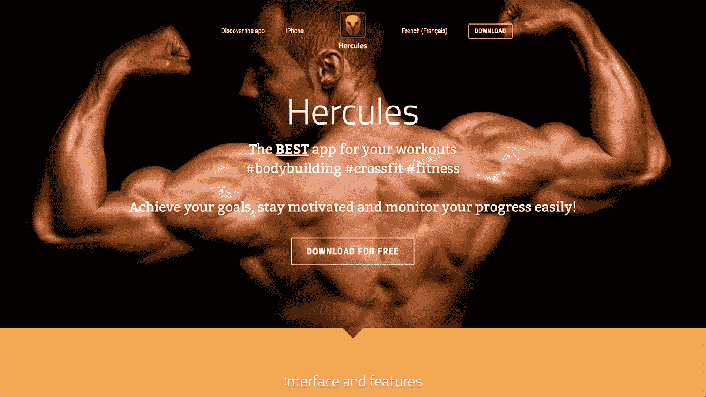
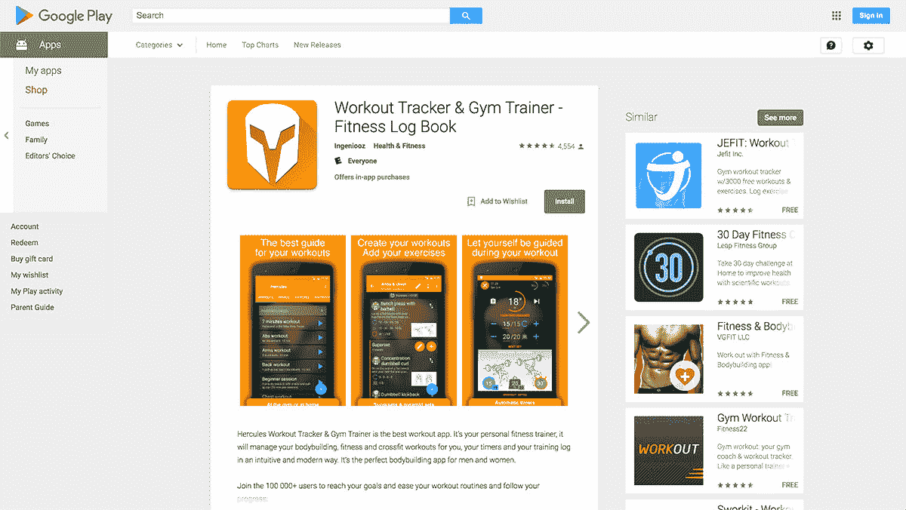

# 如何为移动设备构建和开发您自己的锻炼应用程序

> 原文：<https://www.indiehackers.com/interview/how-to-build-and-grow-your-own-workout-app-for-mobile-devices-2e882f294c>

## 你好！你的背景是什么，你在做什么？

你好。我叫热雷米·穆津。我是一名来自法国格勒诺布尔的软件工程师。毕业后，我在一家咨询机构工作了六年，然后决定辞职自己创业。

我已经在一款名为 [Hercules](https://play.google.com/store/apps/details?id=com.ingeniooz.hercule) 的 Android 应用上工作了四年，它可以帮助你轻松管理你的锻炼表现，并保持动力以实现你的健身目标。它被谷歌全球精选了两次，在法国 Play 商店排名第二。

扣除谷歌的提成(30%)和[增值税](https://en.wikipedia.org/wiki/Value-added_tax)，我每个月大约赚 3000 美元。

 

## 是什么促使你开始接触大力士？

辞职后，我想建立一个企业，赚取一些被动收入。我认为制作一个应用程序将是完美的。那时，我正在用一种在法国很流行的方法每周锻炼几次。我想要一个应用程序来跟踪我的进度，摆脱我的笔和纸。

不幸的是，在尝试了数百个之后，我没有找到任何可以添加我自己的练习、图片和锻炼的应用程序，然后点击播放并按照屏幕上的指示进行操作。所以我决定从头开始创建自己的应用程序。我对健美一无所知(只是我遵循的方法)，在这个过程中我还必须学习 Android 开发。

## 构建最初的产品需要什么？

我写第一行代码是在 2013 年，10 月 27 日。长话短说，我从我的咨询机构辞职后，和我最新的客户谈了一份六个月的兼职合同。这样我就可以在这个应用上度过我所有的夜晚，加上周末和周一。每周连续三天——完美完成工作！

我进展相当缓慢，因为我必须从头开始学习 Android 框架，再加上最佳实践。(我是一个完美主义者——这不是尽早发货的最佳品质。)我有一部装有 Android 2.1 Froyo 的旧手机，所以我开发了这个应用程序来兼容这个版本。但是那时候它已经很旧了，所以我不得不使用兼容性库，这使得开发更加痛苦和缓慢。

这是一个巨大的错误，我应该买一个更新的手机，并开始开发一个更新版本的 Android。这会更容易和更快。但我是个贪婪的白痴:我不想花钱买新手机。我痛苦地认识到，损失几个星期的开发成本远远超过一部 150 美元的手机！千万不要把时间花在挣钱上；花钱赚时间。

在我的兼职合同结束时，我创建了自己的公司，并开始全职从事这个项目。今天，我估计我用了大约九个月的时间，以正常工作的速度开发了这个应用的第一个版本。第一个版本很小，但是从第一天起就可以完全定制。这就是为什么它花了很长时间才建成。

我可以通过简单地复制我使用的锻炼方法来简化应用程序，但由于知识产权的原因，我不能这样做——这将是非法的。

有趣的是，在一开始，在应用程序中添加完全可定制的练习、图片和休息时间是一个极其痛苦的过程。但是今天，这个完全相同的功能让这个应用程序如此吸引我的用户。他们很高兴能够为每组设置不同的重复次数、重量和休息时间！许多训练现在使用这种技术来增加肌肉，所以[大力士](https://play.google.com/store/apps/details?id=com.ingeniooz.hercule)对他们来说是完美的。

## 你们是如何吸引用户，培养大力士的？

因为我在健身领域完全是个新手，所以我注册了法国排名第一的健身论坛，musculaction.com 的，向我未来的客户学习更多。我联系了管理员，他同意为 Hercules 添加一个特定的[主题，这样我就可以谈论它了。](http://www.musculaction.com/forum/application-android-hercule-t116357.html)

通过在论坛上回答问题，我吸引了更多的人关注这个帖子。我在我的签名中添加了一个链接，这样人们可以点击它来查看我的应用程序。此外，我在 [Hercules](https://play.google.com/store/apps/details?id=com.ingeniooz.hercule) 中添加了 phpBB 格式的*导出*功能，这样我就可以在论坛上用 Hercules 生成的让用户好奇的*标语分享我所有的每周表现。*

我的第一批用户都来自这里。我没有*推出*这款应用，因为我对建立社区、管理邮件列表或推出产品一无所知。所以在第一行代码完成一年后，我在论坛上发布了它。用户给出了反馈，并要求新的功能。他们很高兴能参与到他们日常使用的应用程序的后续功能中。

然而成功不是一夜之间就能到来的。即使人们在论坛上很满意，但我在 Play Store 上的排名并不好。我的应用程序被淹没在成千上万个该死的健身应用程序的海洋中。我不得不做些什么来穿过噪音。

我以为开发一个好的应用程序就足够了，但事实并非如此。这只是第一步。

TweetShare

## 那你做了什么？在 Play Store 上排名的最佳策略是什么？

这是我试过的几乎所有东西的清单。感谢[我的博客](http://blog.ingeniooz.com)(这是法语的——抱歉伙计们！)我记录了我做的每一件事，所以这个列表对任何应用开发者来说都是一座金矿。

在 Play Store 上排名的秘密是在它之外营销你的应用程序。在有机增长开始之前，你必须将流量从外部*转移到*游戏商店。

不过先说一下 ASO(应用商店优化)。这是做好排名的基础。不做就别想一秒排名好。每个人都这样做，所以你也必须做你的家庭作业。这是要知道的事情的总结。我在我的博客上发表了一篇关于这个主题的完整文章:

1.  为你的用户写你的应用描述*，而不是*(因为没人读它)，而是为搜索引擎写*。要知道使用什么关键字，请这样做:键入关键字的第一个字母，用户可以输入这些字母在 Play Store 中搜索您的应用程序。Play Store 的自动完成功能将为您提供几个查询。这些查询是人们最常搜索的查询。写下前三个查询的关键词和表达式，并反复这样做，直到你有很多关键词。*
2.  在你的应用描述中至少出现 5 次这些关键词和表达，并使用最常见的一个作为你的标题。写下你的应用描述的全文，这样人们就可以阅读并享受它；不要用关键词填充它，否则你会被扣分。只要确保以优雅的方式插入你所有的关键词和表达至少 5 次。
3.  如果你负担得起，把你的应用程序翻译成最重要的语言，英语，法语，德语，西班牙语，意大利语，俄语。我 40%的收入来自国外。不要忘记翻译你的截图，并进行本地化。例如，在法国我们默认使用千克单位，在美国是磅——这些小细节造成了差异。

现在来说说一个 app 的外的*营销。这里的中心点是问你自己这个问题:我如何在不使用 Play Store 的情况下驱动流量？我如何吸引不在 Play Store 上搜索的人被重定向到我的应用程序？*

 

在网上寻找新事物的方法不是成千上万种。当人们在寻找某样东西时，他们会用谷歌搜索。所以你可以这样做:

1.  建一个网站，做一些 SEO:我用[醒目的](http://www.strikingly.com)在几个小时内建了[矿](http://en.herculeapp.com)。有大量的网站建设者可以轻松快捷地做到这一点。不要在这上面浪费时间。订阅这些服务之一。
2.  内容营销:打开一个 WordPress 博客，写一篇文章，题目是“X 的最佳应用！”我这样做了，得到了大量的流量。在这篇博文[中，我比较了 5 款健身应用，当然也包括我的，并分析了利弊。](http://blog.ingeniooz.com/les-5-meilleures-applications-android-de-musculation/)
3.  *奖励提示*:在你的头衔中使用年份。因为我们想要新鲜的内容，所以我们经常写“2017 年最佳安卓锻炼应用”。哦！真巧，我这里正好有这种[的博文](http://blog.ingeniooz.com/la-meilleure-application-de-musculation-2017-app-android/)。我甚至进一步谈论了我的应用程序*。标题基本是“2017 年最佳安卓健身 app”，我是 2017 年 1 月 1 日贴的。我这样做也是因为新年决心的狂热是我销售的巨大助推器。所以我想尽快准备好。*
4.  阅读并运用你从谷歌书中学到的一切:[在 Google Play 上应用成功的秘诀](https://play.google.com/store/books/details?id=GJ0kBQAAQBAJ)
5.  用这个技巧增加你的评分:让人们在 it 中给你的应用*评分。如果他们给它打了 5 颗星，请将他们重定向到 Play Store，这样他们就可以真正给它评分了。否则，打开他们的电子邮件应用程序，让他们告诉你怎么做才能给它打 5 星。这样你可以过滤掉不好的评价*和*你可以得到有价值的反馈(这是让你的应用变得更好的最重要的事情)。用户不知道他们不能从内部给应用评分。*
6.  尝试被谷歌精选:我被谷歌精选过两次，问他们是怎么检测到我的应用的。他们有自动系统来监控平均下载次数和速度(你在短时间内下载了多少次)。如果你得到一个巨大的速度，这将触发他们的系统，他们会联系你。我使用了一个名为[app freet](http://bye.appgratis.com/)的服务——不幸的是现在已经关闭了——它让我可以 24 小时免费将 Hercules 推送到他们的社区。一天之内我就下载了 7500 次。几天后，谷歌的一个人联系我，让我出演大力士。请注意，您必须遵守他们的[材料设计指南](https://material.io/guidelines/material-design/introduction.html)中的规定。在他们推荐我的应用程序之前，我必须对它进行一些改进，但这是一次非常好的体验，它提高了我在全球的排名。
7.  应用图标:让它也遵循设计准则。让它变得现代，流畅。
8.  A/B 测试:开发者控制台允许你对你的标题、描述和图标进行一些 A/B 测试。所以用它来测试什么给你最好的转化率！
9.  博客:联系一些与你的市场相关的博客，提出一些客座博文来谈论这款应用。做一些免费合伙。谈论博客，他们就会谈论你。交换链接。这对 SEO 和长期排名有好处。
10.  在 [Quora](http://www.quora.com) 上回答与你的业务或应用相关的问题。例如，如果有人问你手机上最好的锻炼应用程序，你一定要回答这个问题！那是免费广告。
11.  脸书·佩吉:你必须去找到他们所在的地方。自从我为 Hercules 打开了我的 facebook 页面，我的网站和 play store 列表上每天都有更多的访问者。人们在脸书上分享有趣的东西，所以定期在任何地方发布。
12.  社交媒体:一般来说，你应该在网上发布有趣的东西，这样人们就可以分享了。但我不会谈论更多，因为我没有很好地管理我的 Twitter/Instagram 帐户……所以请尝试找到最佳的媒体渠道来接触您的用户，并让他们来到 Play Store。

我一路做了所有这些事情，并设法随着时间的推移排名更好。但是这需要很多时间。你在这里最好的朋友就是好口碑。事实上，发展任何*产品最有力的工具就是口碑。所以把你的产品做得很棒，人们就会为你推销它！*

在网上寻找新事物的方法不是成千上万种。当人们在寻找某样东西时，他们会用谷歌搜索。

TweetShare

## 你的商业模式是什么，你是如何增加收入的？

[大力神](https://play.google.com/store/apps/details?id=com.ingeniooz.hercule)全功能免费下载。你可以免费使用它七天。试用期过后，你就不能再使用这个应用程序了，你必须支付 9.99 美元才能解锁。

我的大部分收入来自解锁应用的人。但是我确实在应用程序的新“商店”部分赚了一些钱，在那里我出售电子书(通过 [Gumroad](http://www.gumroad.com) )和锻炼。(这仅在该应用程序的法语版本中可用，因为我用法语编写了电子书/健身程序。)我也做一些代销商营销，出售补充剂和蛋白质，但那只占我收入的很小一部分。通过 Gumroad 销售电子书的好处是，你不必欠谷歌 30%的钱。

我试着从广告中赚钱，但是一点也不奏效。人们使用该应用程序进行锻炼。他们很专注，所以在使用应用程序时没有时间点击广告。我有一些糟糕的转化率，没有通过广告赚很多钱。我几乎立刻停止了，因为它不起作用，也因为我讨厌广告。

无论如何，我从第一天开始对我的应用程序收费，因为我想以此谋生。我把第一个价格定为 0.99 美元。当时没有那么多功能，给一个产品贴上价格标签总是很困难，但人们会为此付费。有人说它便宜，有人说它贵。我很快意识到，从一个应用程序中赚很多钱是非常困难的。

此外，当我卖给法国客户时，谷歌抽取 30%，增值税抽取 20%。今天，我 60%的顾客是法国人。销售后我只得到 58.3%的利润。第一批购买我的应用程序的人是在论坛上关注我的用户。他们买它只是为了支持我的努力。这很好，但我知道我需要更多来做一个可持续的生意。

为了增加收入，我尝试在 Google Play 和脸书上做广告，但我无法获得正的投资回报，所以我在这里赔了一些钱。随着时间的推移，我不断添加新功能，人们抱怨它太贵了。我当时想，“*什么？！我为此工作了几年，而你却不想为此支付哪怕 1 美元！真的吗？你们这些人怎么了？*

所以我试着学习如何从一个产品中赚更多的钱，并阅读了一些关于这方面的博客文章。我偶然发现了一个关于价格弹性的帖子。所以我只是把我的价格从 0.99 美元提高到 1.99 美元，而没有改变这个应用程序的任何东西。发生了两件事。第一，人们不再抱怨价格，甚至告诉我太便宜了(！！).其次，我的收入增加了。

你需要找到一种方法来最大化你的利润，而不是销售的数量。

TweetShare

我以为提高价格会让更少的人购买应用程序，但它增加了销量。我不明白为什么。但是过了一段时间我想通了:价值是和价格联系在一起的。如果你卖便宜的东西，人们会认为它没有提供很多价值，因为价格太低了。提高价格，他们肯定会重新考虑他们的想法。于是我逐渐把价格从 1.99 美元提高到 2.99 美元，然后是 6.99 美元，现在是 9.99 美元！每次我发布一个大的功能，我就提高价格。

这是一个平衡的问题。你需要找到一种方法来最大化你的利润，而不是销售的数量。如果你以 5 美元的价格卖出 10 件，你可以赚 50 美元。但是如果你以 10 美元卖出 6 件，你就赚了 60 美元。即使你的销售数量减少了，那也要多得多。此外，你有更少的客户支持要做，你的客户质量更好，因为有人谁支付了高价格更从事于你的产品。

今天我平均每月卖出 570 把锁。以下是我今年的收入(仅用于解锁):

| 月 | 收入 |
| --- | --- |
| 2017 年 1 月 | 3232 |
| 2017 年 2 月 | 2592 |
| 2017 年 3 月 | 2778 |
| 2017 年 4 月 | 2712 |
| 2017 年 5 月 | 3331 |
| 2017 年 6 月 | 3468 |
| 2017 年 7 月 | 3198 |
| 2017 年 8 月 | 4152 |

2017 年收入。仅解锁。

这是我一生收入的一个更广泛的视角:

| 月 | 收入 |
| --- | --- |
| 14 年 10 月 | 8 |
| 2015 年 1 月 | 292 |
| 2015 年 4 月 | 266 |
| 2015 年 7 月 | 528 |
| 15 年 10 月 | 914 |
| 2016 年 1 月 | 2159 |
| 2016 年 4 月 | 1295 |
| 2016 年 7 月 | 972 |
| 16 年 10 月 | 2856 |
| 2017 年 1 月 | 3232 |
| 2017 年 4 月 | 2712 |
| 2017 年 7 月 | 3198 |

终身收入。季刊。

我的收入今年才真正开始增加。随着新年决心和一些人们想要的新功能，它开始到处传播。我收到用户的电子邮件告诉我，“我问健身房里的人哪些锻炼应用程序好，每个人都告诉我 Hercules 是最好的，所以我尝试了一下，并立即购买了它。”那种评论有多牛逼？我喜欢！

## 你未来的目标是什么？

现在[大力士](https://play.google.com/store/apps/details?id=com.ingeniooz.hercule)给我带来了一些被动收入(即使我需要每天做一些客户支持，继续修复 bug 和[增加新功能](http://idees.herculeapp.com))我想开始一项新的业务，没有应用程序的缺点。我已经为我的下一个项目设定了一些[具体目标](https://www.indiehackers.com/forum/post/-KuPcs-tzW4s5UBo_3Qn)。

我目前正在寻找最好的堆栈来快速尝试一个想法(购买一个域名，设置一个登陆页面，增加一些流量，看看会发生什么)，并且尽可能以最便宜的方式。我不会再犯无限期开发 MVP 的错误。我甚至应该尝试不用一行代码来测试我的想法。

我会每个月测试一个想法，直到我得到一些真实的结果。

## 你最大的挑战是什么？如果有机会，你会做什么不同的事情吗？

开发大力神在技术上很困难。我必须学习一切，从为 Android 开发到设计应用程序再到营销。我以为开发一个好的应用程序就足够了，但事实并非如此。这只是第一步。你需要拼命推销才能得到回报，我讨厌推销！

我对健身一无所知，在这个过程中我还必须学习 Android 开发。

TweetShare

还有，我犯了先在 Android 上开发(因为我懂 JAVA)而不是 iOS 的错误。但 iOS 用户更愿意为应用付费。他们有更多的购买力。当然，竞争也越来越激烈。但是每天都有人问我大力士什么时候上 iOS。我说，“永远不会。”我没有精力在 iOS 上把所有的事情再做一遍。

如果我不得不重新开始，下面是我会采取的具体步骤(这些步骤对应用程序或任何其他产品都很有用):

1.  首先，建立或加入一个潜在用户和客户的社区或邮件列表。非常了解他们，更重要的是，了解他们的痛苦
2.  找到解决方案，画一些你心目中的 app 或产品的截图；难道*没有*产生一行代码吗
3.  在建立任何东西之前，通过做一个登陆页面、patreon 页面、kickstarter 或其他任何东西来测试你的想法，让人们支付*。我指的是支付——他们必须在这里输入信用卡信息。告诉你他或她会购买你的产品的人并不是会在你的产品上市时购买它的真正顾客。*
4.  如果超过 10%的人付费，那么就生产这个产品，或者回到第一步

## 对于刚刚起步的独立黑客，你有什么建议？

*阅读！*很多！

有大量免费的博客文章和信息可以帮助你节省大量的时间和金钱。教育自己，从一个从头到尾不应该超过一个月的小项目开始启动。

阅读这本书:[它会飞吗](https://www.amazon.com/Will-Test-Business-Waste-Money/dp/0997082305)来自帕特·弗林。它几乎指出了我犯的每一个错误。每个人都应该在开始新的业务之前阅读它。

此外，学习设计，因为*设计会让你和你的竞争对手有所不同*。阅读史蒂夫·克鲁格的[不要让我思考](https://www.amazon.com/Dont-Make-Think-Revisited-Usability/dp/0321965515/ref=sr_1_1?s=books&ie=UTF8&qid=1505986590&sr=1-1&keywords=don%27t%20make%20me%20think)，这让我意识到我的第一个应用版本是多么的糟糕！我还在学习设计，但我在这方面取得了巨大的进步，用户也感受到了。

不要犹豫花钱参加在线培训，即使是几百美元。很值得！

千万不要把时间花在挣钱上；花钱赚时间。

TweetShare

最后但同样重要的是，如果你想把事情做完，设定一个期限。一直都是。否则你将一事无成。在前三年的开发中，我每周(周五)都会发布一个新版本的 Hercules。这个应用程序现在有 137 个文件和 42，000 行代码。如果没有这种严格的工作方式，我是不可能做到的。

## 我们可以去哪里了解更多？

*   [大力士网站](http://en.herculeapp.com)或[直接链接到游戏商店](https://play.google.com/store/apps/details?id=com.ingeniooz.hercule)
*   [@herculeapp](http://twitter.com/herculeapp)
*   我的博客(法语)

我希望你喜欢阅读我的旅程，我现在在哪里！谢谢你邀请我参加独立黑客，科特兰。如果你有任何问题或建议，请在评论中告诉我——我很乐意全部阅读！

——[<picture id="ember8056200" class="user-avatar ember-view user-link__avatar"></picture>热雷米·穆津](/Hercule?id=wMSY0xCPqCRqfmk5pe508YY2yTp2)，大力神的创始人

## 想像大力士一样建立自己的事业？

你应该加入[独立黑客社区](/)！🤗

我们是几千名创始人，互相帮助建立有利可图的业务和副业。来分享你正在做的事情，并从你的同事那里获得反馈。

还没准备好开始使用你的产品吗？没问题。这个社区是一个认识人、学习和实践的好地方。随便去[随便浏览](/)！

——[<picture id="ember8056205" class="user-avatar ember-view user-link__avatar"></picture>考特兰艾伦](/csallen?id=ibTLPyjwVebnZjMGKvz6ztarnuV2)，独立黑客创始人

14votes