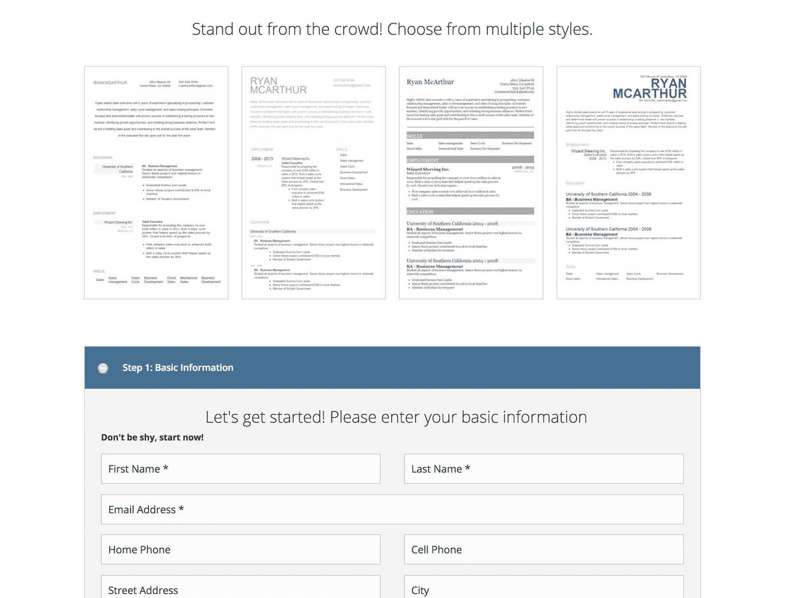

# 如何创建和营销简历制作服务

> 原文：<https://www.indiehackers.com/interview/how-to-create-and-market-a-resume-building-service-a0e1922fcb>

## 又见面了，保罗！请告诉我们你的背景和你正在从事的工作。

对于那些没有赶上我的 [JungleFlip 采访](https://www.indiehackers.com/businesses/jungleflip)的人，我的名字是 Paul Dessert，我设计、建立和发展互联网业务。我的全职工作是全栈开发人员和增长营销人员，我还在业余时间创建自己的项目。[简历灯塔](https://www.resumebeacon.com)就是我今天要说的。

简历信标是一个网络应用程序，帮助人们创建专业格式的简历。它还提供免费的简历模板、免费的求职信模板和免费的职业资源。而且接近 600 美元/月。

 

## 是什么促使你开始使用简历信标？

我有一个名为“5x2000”的目标，我希望建立五个产品，每个产品每月至少产生 2000 美元。去年早些时候，作为这个挑战的一部分，我想出了[简历信标](https://www.resumebeacon.com)。

朋友和家人一直让我帮他们格式化简历。因为我是一个“计算机迷”,所以我是最适合的人选。我注意到他们都有格式化简历的问题。这对他们来说是一个技术障碍。

我碰巧在寻找一个新的工作项目，所以我决定用一个工具来帮助人们格式化他们的简历，这是一个很好的开始。

对很多人来说(尤其是阅读这篇文章的人)，写简历是第二天性。但是有很大一部分人不会写一份好看的简历。这不是他们每天都会做的事情。一个简单易用的软件正是他们所寻找的。

## 构建最初的产品需要什么？

当我研究比赛时，我知道简单会赢。其他解决方案很复杂，设计过度，并且不能为用户的核心问题提供即时的解决方案。

能够编码是很棒的，尤其是当你建立和运营互联网公司的时候。但是发展事情的商业方面是至关重要的。

TweetShare

不幸的是，简单并不那么简单。我花了大约四个月的时间(断断续续地)建造。我发布了第一个版本，发现了很多 bug 和 UI/UX 问题。我一直在慢慢地开发新功能，并解决出现的问题。

构建简历信标最具挑战性的部分是设计模板，既灵活又严格，足以转换成 PDF。

## 你是如何吸引用户和发展简历灯塔的？

Reddit 已经很好了。在 Reddit 上营销很棘手，但如果你做得对，它会非常有益。关键是不要直接向 Reddit 用户营销。如果你在社区中获得足够的关注，你会吸引其他媒体。

我的策略之一是在几个相关的子栏目中推广我的免费简历模板和免费求职信模板。

有些人比其他人做得更好。但是那些成功的人最终得到了回报。由于我在 Reddit 上的推广，我最终得到了一篇关于 LifeHacker 的[专题文章。](https://lifehacker.com/resume-beacon-is-a-simple-free-non-flashy-online-resu-1789840011)

## 你的商业模式是什么，你是如何增加收入的？

该网站通过三种方式赚钱。广告空间、高级模板和合作伙伴关系。

每个用户都可以选择升级到高级模板。我免费赠送一个基本模板。其他的是高级套餐的一部分。不像其他网站，我只收取一次性的固定费用。不按月计费。

最后一个收入来源是与 ZipRecruiter 的合作。如果用户感兴趣，他们可以每天收到一封电子邮件，里面有新的相关工作列表。

当我第一次推出这个网站时，我尝试了定价。我试过 24.95 美元，19.95 美元，14.95 美元。总的来说，在目前 9.95 美元的价位上，我转化了更多的用户，创造了更多的收入。

有很多关于“收费更高”的讨论，但这完全取决于你的受众。如果你运行的是 B2B SaaS 应用程序，收取更多费用可能是个不错的选择。对我来说，降低收费提高了我的收入数字。

我的花费很少。我只支付大约 30 美元的托管费(数字海洋)，大约 40 美元的电子邮件营销订阅费(滴滴)。随着流量的增加，我预计我的托管费用会增加。

| 月 | 收入 |
| --- | --- |
| 六月 | 244 |
| 七月 | 318 |
| 八月 | 487 |
| 九月 | 522 |
| 十月 | 586 |

## 你未来的目标是什么？

我对[简历信标](https://www.resumebeacon.com)的目标是稳步增加流量，改善用户体验。我的转化率仍然比我想要的低很多，所以我在探索提高它的方法。

正如我在另一次采访中提到的，除非我能做更多的工作来增加 Resume Beacon 和[jungle flip interview](https://www.indiehackers.com/businesses/jungleflip)——我仅有的两个创收产品——否则我不会继续为我的 5x2000 目标开发其他产品。

## 你面临的最大挑战和克服的障碍是什么？

一个巨大的技术挑战是与 LinkedIn 的合作关系最终被撤销。

大约一年前，LinkedIn 改变了他们的政策，使得获得 API 访问资格变得更加困难。我构建了一些不错的功能，允许用户简单地导入他们的 LinkedIn 个人资料，他们的简历将基于这些信息创建。

这种整合深深地嵌入了我的代码中，以至于我花了大约一周的时间才解开。(亲提示:不要那样！)

 

我认为这对于独立黑客来说很常见，但是正如我提到的，我的心态是最大的挑战。能够编码是很棒的，尤其是当你建立和运营互联网公司的时候。但是因为我花了大部分时间营销和管理网站，所以我把重点放在开发业务方面是至关重要的。

## 有没有发现什么特别有帮助或者有优势的？

布伦南·邓恩、[贾斯廷·杰克逊](https://twitter.com/mijustin)和[内森·巴里](https://twitter.com/nathanbarry)。

他们都花了很多时间在这个领域学习有价值的课程，并记录他们的发现。所以跟着他们，看看他们要说什么。你不会失望的。

## 我们可以去哪里了解更多？

你可以在 www.ResumeBeacon.com 的[查看简历。](https://www.resumebeacon.com)

你也可以在 Twitter[@ Paul descent](https://www.twitter.com/pauldessert)上关注我，在我的网站[PaulDessert.com](http://www.pauldessert.com)上了解更多关于我的信息

我很乐意回答下面评论中的任何问题！

——[<picture id="ember5221346" class="user-avatar ember-view user-link__avatar"></picture>保罗甜品](/pauldessert?id=O5BDleop19aeDuSFZgfmU2ZIodn1)【创始人简历灯塔

## 想像简历灯塔一样建立自己的事业？

你应该加入[独立黑客社区](/)！🤗

我们是几千名创始人，互相帮助建立有利可图的业务和副业。来分享你正在做的事情，并从你的同事那里获得反馈。

还没准备好开始使用你的产品吗？没问题。这个社区是一个认识人、学习和实践的好地方。随意[随便浏览](/)！

—[<picture id="ember5221351" class="user-avatar ember-view user-link__avatar"></picture>考特兰艾伦](/csallen?id=ibTLPyjwVebnZjMGKvz6ztarnuV2)，独立黑客创始人

11votes