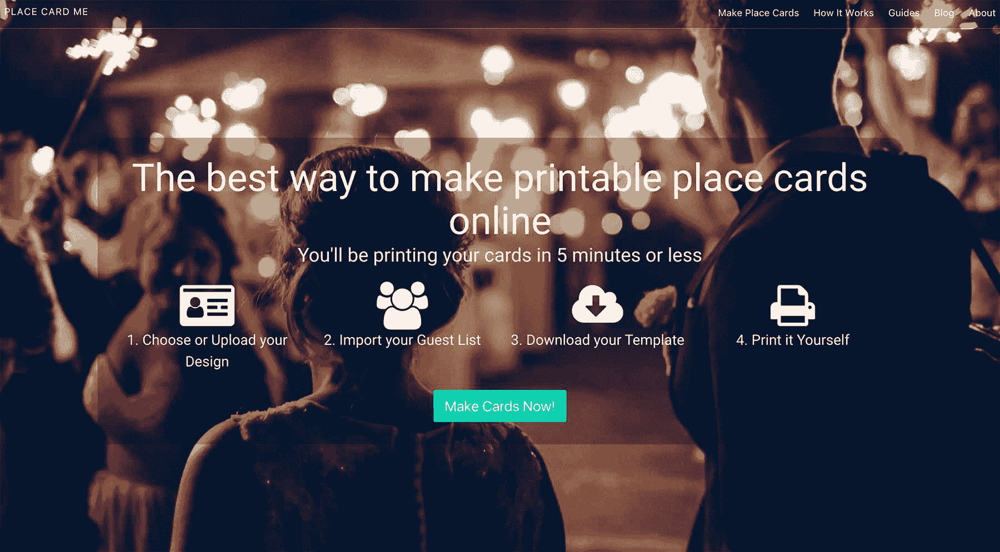
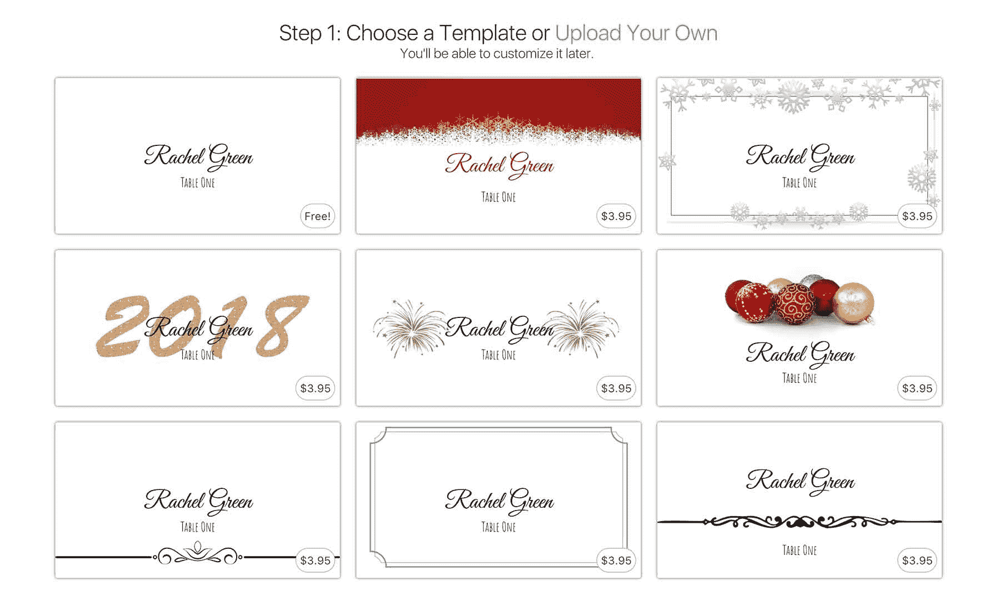
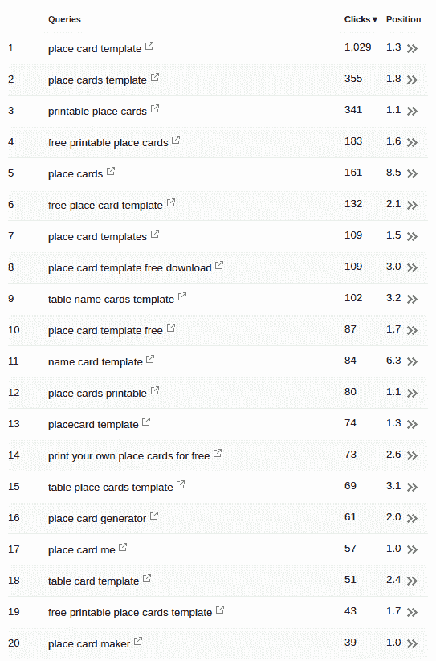
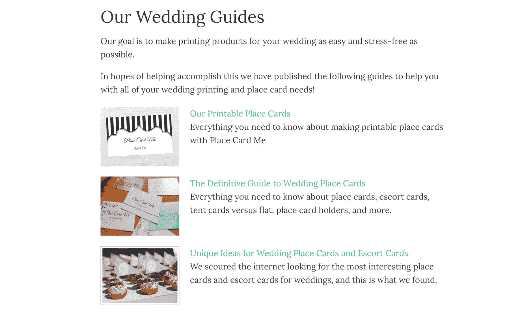
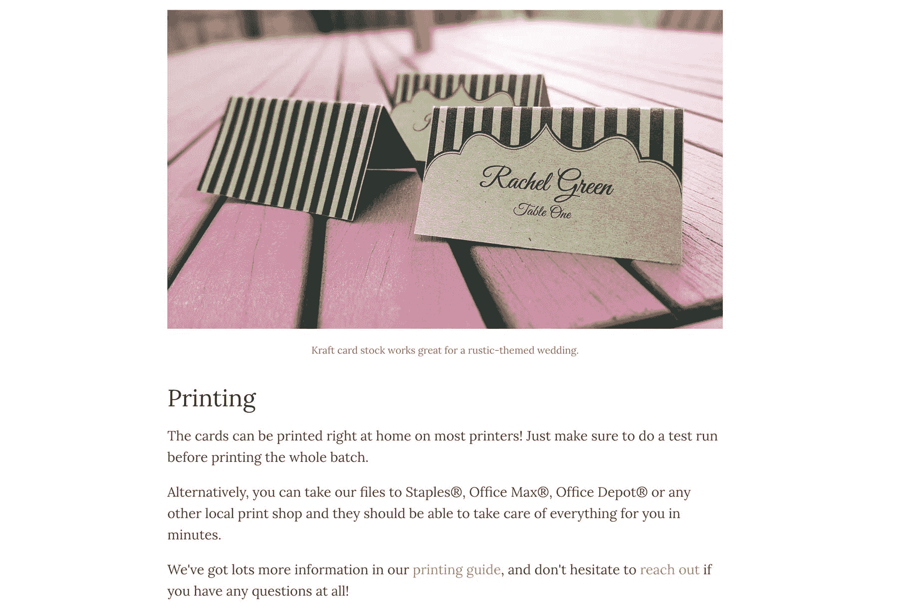

# 如何将婚礼贺卡业务发展到每月 400 美元

> 原文：<https://www.indiehackers.com/interview/how-to-grow-a-wedding-place-card-business-to-400-mo-ab93a89d5a>

## 你好！你的背景是什么，你在做什么？

嗨！我是 Cory，一个开发者，一个有抱负的企业家，一个 [Place Card Me](https://www.placecard.me/) 的制造者。

地方卡我是一个在线地方卡制造商。没错，放置卡片。那些你在婚礼或其他正式场合看到的东西。我知道——不是最性感的事情。尽管如此，自从我去年 5 月推出它以来，已经有大约 6000 人成功地使用了它，目前每月带来大约 400 美元的收入。

 

## 是什么促使你开始使用 Place Card Me？

2017 年 3 月，我离开了我的日常工作，没有太多的计划。我给自己定了一个六个月的时间表，让自己的行为有条不紊，谢天谢地，我的财务状况允许我在这段时间内不工作。

不到一个月，我决定这六个月的主要目标是从我推出的产品中赚 1 美元，因此诞生了“solopreneur sabbatical”(商标待定)。我想这么做的原因是 1)看看我是否可以，2)教育自己需要什么，3)开始赚取被动收入——大致如此。

停下你正在做的事情，把一些东西放到网上，发布在推特/脸书/Reddit 上——任何你想去的地方。现在就做。

TweetShare

一旦我决定推出一个产品， [Place Card Me](https://www.placecard.me/) 是我想到的所有坏主意中最不坏的。在我去年的婚礼之后，我想到了一种更好的制作座位卡的方法。我们的场地*要求*我们为所有的客人提供座位卡——这是我们在婚礼前几天才知道的。因此，在我们婚礼的前夜，我的妻子和她的朋友们围坐在一起，把我们客人的名字写在小卡片上。我觉得一定有更好的方法，于是决定创建一个网站，让从客人和桌子名称的电子表格中创建座位卡变得快速而简单。

## 构建最初的产品需要什么？

作为一名经验丰富的全栈开发人员，我能够自己构建整个系统。所以大部分时间都是我自己的时间。这里是一个大概的详细描述。

像任何优秀的独立黑客一样，我做的第一件事就是创建一个登陆页面。这花了大约 10 个小时，并于 4 月发货。前端和设计不是我的强项，营销文案对我来说是全新的，所以它比你想象的要长一点。

也像许多独立黑客一样——我很快决定，我宁愿构建产品，而不是在登录页面上获得反馈，所以我在真正正确地验证这个想法之前，就直接转向了 MVP。MVP 花了大约 50 个小时，历时三周——其中相当一部分时间是在教我自己 React 和现代 JavaScript——并于 5 月份发布。

那时，这个网站和今天差不多。你可以选择一个模板，上传你的客人名单，网站会自动为你生成一个 PDF 文件，你可以打印、剪切和折叠成名片。很简单。

 

MVP 一经推出，我就花了 5 月和 6 月的时间，通过运行谷歌、脸书和 Reddit 广告的付费测试来验证它，看看我是否能让人们用他们的电子邮件地址来换取可下载的座位卡。我最终花了大约 80 美元在广告上，并向自己证明了该产品足够有用，人们可以提供一封电子邮件。在那一点上，我决定实际上建立一个付费墙，并把东西挂在 Stripe 上。在那段时间的某个时候，我还添加了一些新的功能，比如改变字体、颜色和卡片布局。

总而言之，当我[赚到我的第一笔钱](https://www.indiehackers.com/@czue/what-actually-goes-into-making-your-first-dollar-from-a-saas-project-49d98f7d45)——几个月后才赚到——的时候，我已经在这个网站上工作了大约 110 个小时。

就技术而言，该网站是一个相当简单的 Django 应用程序，大量的复杂性发生在卡片制造商的前端，它使用 React 和[布尔玛](https://bulma.io/)来设计风格。我已经爱上了这三个框架，它们已经成为我默认的首选技术。

## 你是如何吸引用户并让 Place Card Me 成长的？

[Place Card Me](https://www.placecard.me/) 的增长绝大部分来自寻找在线制作 Place Card 的人们的有机搜索。我超过 60%的流量来自谷歌。

| 月 | 会议 |
| --- | --- |
| 四月 | 269 |
| 五月 | 779 |
| 六月 | 1690 |
| 七月 | 760 |
| 八月 | 2963 |
| 九月 | 2783 |
| 十月 | 7413 |
| 十一月 | 16381 |
| 十二月 | 16840 |

曾经有人给我描述 SEO 有以下公式: *SEO 成功=解决搜索者问题的内容+那个内容的链接*。这真的引起了我的共鸣，我相信我所取得的适度成功是由于在这两个方面投入了大量的努力。

就“解决搜索者的问题”而言，该产品在它所做的事情上无疑是最好的——尤其是在可用性方面——比现有的任何产品都要好。这是从第一天开始的优先事项。我认为我有机会在这个产品上取得成功的原因之一是，我知道我可以“制造一个比其他任何东西都更好的捕鼠器”。

在获取链接方面，我花了很多时间在不同的平台上撰写和发布文章，并生成返回网站的链接。我只是简单地记录了在这个过程的每个阶段我在网站上做了什么，并在相关的内容平台上交叉发布。我之前已经[写过很多](https://www.indiehackers.com/@czue/seo-for-developers-reaching-the-front-page-of-google-without-being-spammy-7bc350d171)关于独立黑客的这个策略。

由于很好地解决了搜索者的问题，并产生了一个不断增长的反向链接库，Place Card Me 已经能够接近谷歌的大量相关关键词的顶部，如下所示。

 

## 你的商业模式是什么，你是如何增加收入的？

当 [Place Card Me](https://www.placecard.me/) 刚推出时，它根本没办法赚钱。大约一个月后，我决定使用 Stripe 建立一个支付流程。

在考虑了各种不同的选项后，我最终选择了一个非常简单的东西:*网站上的一些设计将被支付。*今天，你仍然可以免费制作空白卡片，但如果你想使用内置的设计或上传自己的设计，你必须付费。大约 70%的网站用户选择免费卡，但也有少数人愿意为更好的东西付费。

迄今为止，我只有三个增加收入的基本策略:

1.  获得更多流量
2.  添加更多卡片设计/模板
3.  提高价格

上面我已经讲了我的流量策略，但是我会在另外两个上面补充一些细节。

我通常尝试每周添加三个设计。这个策略让我可以慢慢地增加网站上的设计数量，同时不会让自己疯狂地去做。我也学到了很多关于随着时间的推移变得流行的设计类型，因此变得更好，更有可能卖出去。

最近，我在不同的节日/季节设计上取得了很多成功——首先是美国的感恩节，然后是圣诞节/新年/节日季节。这些大概占了我总销售额的 50%以上。

我很难知道设计数量的增加对收入的确切影响，但我认为这使网站合法化，使人们更有可能找到他们正在寻找的东西。

至于价格，从 9 月份开始，到目前为止我每个月都在涨价。它们从 1 美元/模板开始，慢慢攀升到 2 美元、3 美元，现在徘徊在 4 美元左右。

从心理上来说，我和许多独立黑客一样，一直在努力提高价格。每次我这样做的时候，我都有一种恐惧和恐慌的感觉，人们会退缩，我会失去所有的客户，谷歌会开始惩罚我的排名。然后，如果 24 小时过去了还没有卖出去，我担心我犯了一个巨大的错误，并考虑把东西退回去。幸运的是，我已经训练自己抵制这些本能，相信平均数和大数法则。

| 月 | 收入 |
| --- | --- |
| 九月 | 8 |
| 十月 | 83 |
| 十一月 | 297 |
| 十二月 | 577 |

现在，我给每次价格变动一个月的时间来收集数据，然后再做进一步的变动。在月初，我建立我的基准转换率，让新价格运行 30 天。月底，我会评估价格变化对我收入的影响，并决定下一步该怎么做。我还没有一个月的价格上涨没有增加我的底线——尽管我怀疑我现在正在接近市场愿意支付的极限。

采用更长期的定价策略也有助于我避免经常检查收入/销售数字——尽管我仍然比我愿意承认的做得更多。我不断提醒自己，这个网站是健康的，从长远来看，不太可能在一个月内被我毁掉，这有助于我的日常心理。

与订阅模式相比，以这种方式操纵价格的能力实际上是单一销售产品的一个巨大优势。我可以随意改变我的价格，几乎没有人介意，因为没有人对价格应该是多少有任何预期；因为我的绝大多数客户都是第一次接触该产品。

也就是说，每个月的第一天收入为 0 美元是一个非常严重的不利因素。

 

## 你未来的目标是什么？

到目前为止，我从整个经历中获得的最重要的东西是，我有信心相信推出创收产品是我有能力做到的。既然已经确定了，我的目标是看看我是否能把它变成我收入的一大部分。所以我 2018 年的目标是:

1.  推出新的创收产品
2.  在年底前获得 2 万美元的被动收入。

我相当有信心能让 [Place Card Me](https://www.placecard.me/) 在年底前持续产生 1000 美元/月的收入，但我需要将这个数字翻一番，或者推出其他同样有利可图的东西来实现我的目标，这感觉像是来年适量的挑战/动力。我的大部分收入仍然来自在[迪马吉](https://www.dimagi.com/)的兼职和一些自由职业。

## 你面临的最大挑战和克服的障碍是什么？

我认为我所面临的最大挑战是我自己的自我怀疑。在我赚到第一笔 1 美元之前，有好几个月的时间，我尽我所能，试图让别人为座位卡买单，但这一切都没有发生。这是令人难以置信的消极，我觉得自己是一个巨大的失败。

我经历的最具变革性的一天是我决定我可能应该放弃这个项目的那一天。我觉得我已经做了我能做的一切，但它永远不会产生销售。在让自己放弃之前，我只有一个问题需要弄清楚:*为什么？为什么没有人愿意付费使用这个网站？*

问题是——我找不到答案。我看了产品。我观察了市场和其他可供选择的方案。我分析了*和*在同一领域销售的产品。*这些都没有提供任何合理的理由来解释为什么人们不愿意为我的产品付费。*我得出结论，唯一可能的答案是我还没能在足够多的人面前亮相，于是我下定决心要在牵引力上加倍努力。这被证明是预言，几个月后，该网站将每天进行多次销售。

## 如果你必须重新开始，你会做什么不同的事？

这个对我来说很有趣，因为我做了太多*错*的事情，但我不确定我会做任何*不同的事情*。根据传统的(而且大部分是正确的)建议，以下是我应该做而不是应该做的事情:

*   开始一个 B2C 产品，而不是 B2B
*   在一个我不了解的行业(婚礼)工作
*   围绕一次性销售而不是经常性收入建立商业模式
*   解决一个我并不热衷的问题
*   选择一个我不容易认同的客户群
*   在验证我的想法之前，先构建我的产品

我确信我可以继续下去。

真的，这些东西没有一个是“硬”的；这只是一堆废话，如果没有纪律，你可能不会投入你需要的时间来取得成功。

TweetShare

不幸的是，我有一个问题，就是在我亲身经历之前，我无法正确地将建议内化。所以，尽管我做了所有这些“糟糕”的决定，我不确定我会有不同的做法。我的目标一直是建造一些赚钱的东西，而这个目标的动机是我想在现代企业家精神方面给自己上一课。

如果我想优化收入，那么我会遵循上面的建议，但在优化教育方面，我认为我选择得很好。我能够做出比世界上其他任何东西都好的东西，我能够每周在成千上万的人面前展示它，我能够凑足足够的收入来买我每天的午餐。在这个过程中，我从书本或课程中学到的东西比我曾经希望的要多。在很大程度上，这非常有趣。

## 有没有发现什么特别有帮助或者有优势的？

是的，很多！我会试着把它分成几个部分。

**技能**

拥有一个基线编码能力当然加速了我的进步，但是可能对我受益最大的技能是*学科*。在我休假的整个过程中，我非常谨慎地跟踪我的时间去了哪里，设定每天、每周和每月的目标，并强迫自己坚持做我决定做的任何事情。真的，这些东西没有一个是*硬*；这只是一堆废话，如果没有纪律，你可能不会投入成功所需的时间。

**决定**

我做的最好的决定是公开工作。这提供了责任、动力，以及后来推广产品的重要渠道。我不知道如果我没有这样做，我会成功实现我的目标。

**资源**

我参加这个项目时，基本上没有商业和营销方面的经验，所以严重依赖他人来提供基础。以下三篇文章/书基本上是我从 0 到今天的地图。

*   [克利福德·奥拉维奇撰写的史诗般的自举指南](https://medium.com/@cliffordoravec/the-epic-guide-to-bootstrapping-a-saas-startup-from-scratch-by-yourself-part-1-4d834e1df8c1)提供了一个剧本，我在早期阶段遵循它，它帮助我弄清楚从哪里开始，首先做什么。
*   [Rob Fitzpatrick 的 Mom 测试](http://momtestbook.com/)真的帮助我找出了所有我错误地验证想法的方法，以及该怎么做。
*   Gabriel Weinberg 和 Justin Mares 的《牵引力》,在思考如何将我的产品展示在人们面前，以及提供执行该计划的框架、流程和资源方面，是无价的。

帕特里克·麦肯齐( [@patio11](http://twitter.com/patio11) )说的话，我也几乎都信以为真。

**社区**

独立黑客是一个获得反馈和灵感的好地方。我喜欢阅读人们的故事和经历，并从这些文章和采访中学到了很多。

我还想大声喊出克利福德·奥拉维奇在 Slack 上运营的一个自助社区。Clifford 非常慷慨地花时间为像我这样的白痴新手提供了大量的信息，Slack 社区的实时性和私密性也是对 IH 的一个很好的补充。我一直试图让科特兰和克利福德联手，但迄今为止没有运气(提示提示)。

## 对于刚刚起步的独立黑客，你有什么建议？

每个人都说“去做就是了”，所以我会提出我自己的看法。**没你想的那么恐怖。**

一年前，在网上发布/推广任何东西的想法把我吓坏了。我有一个匿名的博客，我从来没有告诉过任何人，还有几个兼职项目只存在我的电脑上，因为它们不够好，无法与世界分享。如果这是你，就停下你正在做的事情，把一些东西放到网上，然后发布到推特/脸书/红迪网上——任何你想去的地方。现在就做。

我做的最好的决定是公开工作。

TweetShare

当你这样做时，会发生两件事之一:

1.  你会得到一堆积极的支持。
2.  你会被忽视。

如果是第一，恭喜你！你刚刚经历了你第一次多巴胺冲击成功运送某物的感觉。你正在成为独立黑客的路上。

如果是第二名，恭喜你！你刚刚经历了对失败的第一次考验。你正在成为独立黑客的路上。

你知道什么不会发生吗？你不会被羞辱、嘲笑或评判(好吧，也许避开 HN)。你也不会失去成功的机会或信誉。

这样做一次，你会意识到它并没有那么糟糕，你会准备再试一次。这样做两次，你会意识到当你把事情公开时，你会学到更多。这样做五次，你会想为什么你一开始会如此害怕。达到十次，你几乎肯定会获得某种成功。

 

## 我们可以去哪里了解更多？

我已经在我的个人网站上记录了我的整个旅程，或者如果你喜欢的话，在 T2 媒体上记录。你也可以通过推特上的[@ czue](https://twitter.com/czue)打招呼。

感谢阅读，我很高兴回答任何人的任何问题！会关注下面的评论。

——[<picture id="ember5316267" class="user-avatar ember-view user-link__avatar"></picture>科里祖莪](/czue?id=mZLV14VHdgPh2ElpWXlqTYV0NFk2)【地方证我的创始人

## 想像 Place Card Me 一样建立自己的事业吗？

你应该加入[独立黑客社区](/)！🤗

我们是几千名创始人，互相帮助建立有利可图的业务和副业。来分享你正在做的事情，并从你的同事那里获得反馈。

还没准备好开始使用你的产品吗？没问题。这个社区是一个认识人、学习和实践的好地方。随意[随便浏览](/)！

—[<picture id="ember5316272" class="user-avatar ember-view user-link__avatar"></picture>考特兰艾伦](/csallen?id=ibTLPyjwVebnZjMGKvz6ztarnuV2)，独立黑客创始人

17votes