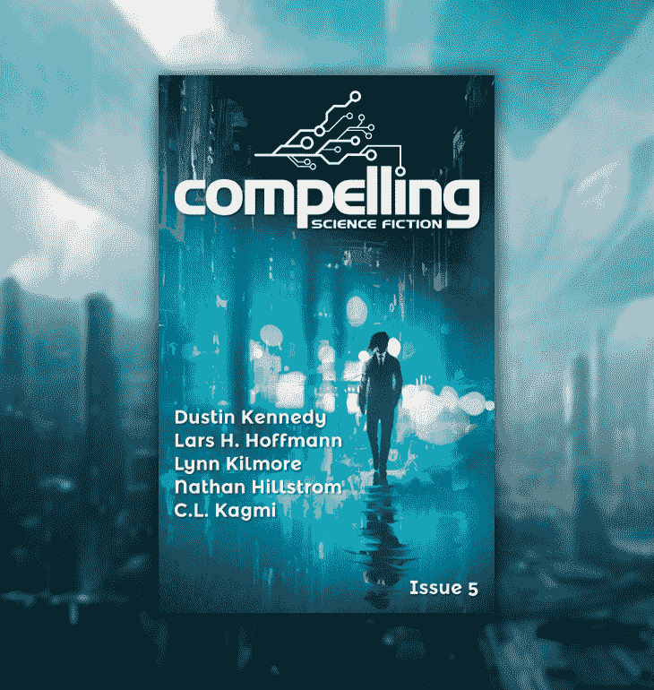
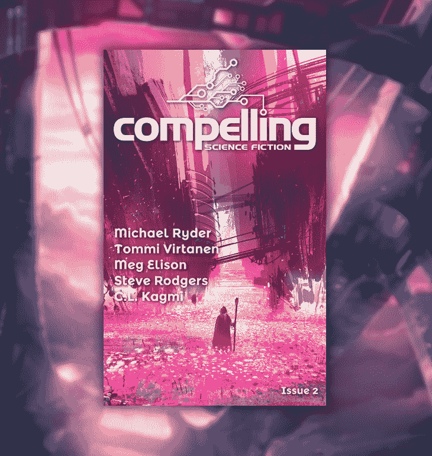

# 如何运营一本在线科幻杂志，每月赚 1000 美元

> 原文：<https://www.indiehackers.com/interview/how-to-make-1k-mo-running-an-online-science-fiction-magazine-7431cf52b0>

## 你好！你的背景是什么，你在做什么？

嗨，我是乔·斯特奇，我是引人入胜的科幻小说《T1》的出版商兼编辑。我的背景是软件工程，白天我在科罗拉多州的一家大型软件公司担任数据科学家。

引人注目的科幻小说是一本在线科幻小说杂志。该杂志的目标是发现和传播伟大的科幻故事，这些故事具有娱乐性、启发性和非常好的思考。我们的故事倾向于被称为“硬”科幻小说的东西，从这个意义上说，我们更喜欢自洽的、科学上合理的、必要时技术上详细的故事。对我来说同样重要的是，我们支持那些写出伟大科幻小说的作者，这也是我们支付专业费用的原因。我与之交谈过的读者分享了我的目标。

我每两个月出版一期。所有问题都可以在 compellingsciencefiction.com[免费阅读，也可以通过 Kindle 商店和我们](http://compellingsciencefiction.com) [Patreon](https://www.patreon.com/compelling) 页面上的无 DRM 的 epub/mobi 格式获得。目前，我们平均每月有 3000 名读者，每期收入约 1800 美元。

## 是什么促使你开始创作引人入胜的科幻小说？

我一直喜欢科幻小说，有一天我意识到我有办法鼓励我最喜欢的那种科幻小说。我认为推动文化朝着你希望的方向发展很重要，所以我创办了这本杂志。

我的计划是在六个月的时间里制作三期。我为每期做了 2000 美元的预算，并给自己定了一个硬性的限制——如果我在三期后没有达到收支平衡，我就退出。

老实说，我并不特别关心验证，因为这是一个我无论如何都要追求的激情项目。然而，我确实需要开始创建一个作者池，所以我创建了一个 MailChimp 列表和一个页面来收集对这个项目感兴趣的人的电子邮件。然后我把链接贴在了黑客新闻的首页上，它出现在了首页。这是一个幸运的突破，因为它给了我继续前进的信心。如果我没有那群等待发布的人，一开始会更困难。这绝对是一个动力。

## 构建最初的产品需要什么？

最初的产品由两部分组成:技术部分和故事部分。我保持技术方面超级简单:我通过亚马逊 S3 提供静态页面，并使用他们简单的电子邮件服务接受作者提交的故事。你可以在这篇博文中了解更多关于我的系统的信息。整个工程只用了一个周末就完成了。然而，故事方面的工作要多得多。

为了获得故事，我必须得到一堆提交的材料，然后筛选这些材料。这里的关键是两件事:我来自黑客新闻的邮件列表，以及一个名为[ralan.com](http://ralan.com)的网站。Ralan 是一个很酷的人，自从 90 年代以来，他一直在经营一个网站，列出所有形式的投机小说写作市场。我给他发了电子邮件(按照他在网站上列出的详细流程)，他同意将[引人入胜的科幻小说](http://compellingsciencefiction.com)列入他的专业市场版块。这帮了大忙。

最终，第一期我收到了 200 份投稿，我从头到尾读完了每一篇报道。(我通过这种方式学到了一些东西，但是很费时间。)从这些最初的故事中，我选择了五篇发表。整个过程花了两个月。

我仍然使用那个周末我最初建立的技术，但是我选择故事的过程已经发生了显著的变化。我现在一个月收到 300-400 个故事，当投稿开放时，我一般只需要读 1-2 页就可以拒绝。事实证明，如果一个故事的开始很糟糕，它总是很糟糕。读完 1300 个故事后，我可以肯定地说。

 

## 你用过哪些营销策略？你是如何吸引用户并开发出引人注目的科幻小说的？

在花了两个月的时间创作出第一期之后，我在《黑客新闻》上发帖，并向我的电子邮件列表发送了一封电子邮件。它再次运行良好，我暂时达到了顶峰。这使得该网站在最初几天获得了大约 12，000 个独特的链接。我也在其他几个地方发了帖子(Reddit 和脸书)，但是额外的流量可以忽略不计。

在第一次推送后，我尝试了一些其他策略来获得流量，但我发现没有什么比黑客新闻更有效。我尝试了一些 AdWords 和脸书的广告，但它们的每读者获取成本都太高了。我开了一个 Twitter 账户，但从未获得太多关注。它目前有大约 215 名追随者。相比之下，我的电子邮件列表只有大约 1500 名订户。

我上过几个播客，最著名的是 [Techzing](http://techzinglive.com/page/1609/302-tz-interview-joe-stech-compelling-science-fiction) 和 [Beyond the Trope](http://www.stitcher.com/podcast/beyond-the-trope/e/48983788) 。我在一些论坛上发帖，但是我还没有找到硬科幻爱好者密度非常高的地方——这是一个相当小众的类型。

最终，我决定我需要花更多的时间研究牵引渠道，因为我还没有发现任何对我特别有效的渠道。然而，尽管我缺乏成功的营销，但由于口口相传，读者数量仍在缓慢增长。

一路走来，我也获得了一些有趣的一次性营销机会。例如，去年年底，我与出版公司 Springer Nature(世界上最大的学术出版社之一)建立了合作关系。他们有一个新项目，他们出版由真正的科学家写的科幻小说，他们创建了一个不起眼的捆绑项目来推广他们的书籍。

我给了捆绑包 50 美元来支持他们的项目，这显然让我进入了他们的视线，因为同一天一位来自 Springer Nature 的营销总监联系了我。在接下来的几个月里，我们达成了一项协议，我将从他们的新选集里选择一个故事出版，他们将授予我这个故事的出版权，并推广我的杂志。这是一个有趣的小项目。

## 你的商业模式是如何运作的？你的营收背后有什么故事？

收入模式有三个主要方面:

1.  第[天](https://www.patreon.com/compelling)读者自愿投稿。支持我们的读者可以获得无 DRM 的 mobi 和 epub 版本的杂志。现在这个渠道的收入大约是每期 1200 美元。
2.  通过 Kindle 商店销售。这通常相当于每期约 300 美元，但变化很大。现在你可以从 Kindle 商店购买[第一期](http://amzn.to/2kMsdw7)、[第二期](http://amzn.to/2kMnZ86)、[第三期](http://amzn.to/2kBnMlU)、[第四期](http://amzn.to/2kMfkCr)，或者[第五期](http://amzn.to/2ldBDSJ)。感谢你支持引人入胜的科幻小说！
3.  公司和个人的赞助。这也是高度可变的，但在这一点上，我通常会得到至少 1-2 个赞助，每个 360 美元。

所有这些加起来大约是 1800 美元/月，但是正如你从上面的数字中看到的，这是一个非常粗略的估计，而且还在不断增长。

我们非常依赖 Patreon，因为这是我们唯一稳定的收入来源。如果没有 Patreon 提供的定期付款，我会非常紧张地承诺定期发布时间表，因为我永远不知道每期是否可以为作者的故事付费。正如你们中的许多人所知，基于订阅的收入是非常有用的业务基础。正是因为这个原因，我在网站上没有一次性捐款的选项——我宁愿人们每个月都进行小额捐款，这样我就能确切知道杂志能维持多少。

不过，赞助改变了游戏规则——第一个现金流为正的问题是第 4 个问题，这是我引入赞助的问题。赞助是在故事顶部的 1-2 句小注释，解释赞助故事的公司/个人。[这里有一个例子](http://compellingsciencefiction.com/stories/allthatissolid.html)。

我发现冷冰冰的电子邮件在获得企业和个人的赞助方面特别有效。每隔一段时间，我会给喜欢科幻小说的决策者发一批新的电子邮件。我通常先说，我从他们的博客/播客/等中了解到他们对科幻小说的热爱，然后继续解释他们如何既能帮助创作伟大的科幻小说，又能同时接触到更多的客户。我用这个策略有大约 20%的成功率。关键是要提前做好功课，而不是乱喷邮件。

虽然我们的流量目前不高(如我之前所说，大约 3000 个独立读者/月)，但赞助会继续与网站上的故事永远相关联，因此每个赞助都有一个非常长的潜在曝光/点击尾巴。此外，根据我进行的一项调查，我们拥有很高比例的软件开发人员读者——超过 60%。如果你们中的任何人想用赞助来支持[引人注目的科幻小说](http://compellingsciencefiction.com)，我很乐意给独立黑客读者打折——250 美元而不是 360 美元，直到我用完下一期的赞助。只需在 [【邮件保护】](/cdn-cgi/l/email-protection#1e74717b5e7d71736e7b72727770796d7d777b707d7b78777d6a777170307d7173) 给我发邮件。

由于我的主机费用很低，我认为我的成本大多是固定的。杂志的绝大部分费用来自于支付给作者的专业费用。报酬是基于字数的，所以我每期的费用从 1200 美元到 1800 美元不等，取决于我购买的字数。重印也可以降低成本——我为重印支付 1 美分/字，而为原创故事支付 6 美分/字。例如，第五期《故事会》花费了 1700 美元——四部原著和一部再版。

现在我基本上打破了每一个问题，看看接下来的几个月事情会如何发展会很有趣。如果收入持续增长，我计划用额外的收入来吸引更多的读者。

## 你未来的目标是什么，你打算如何实现它们？

增加读者是我的首要目标。虽然硬科幻相当小众，但我认为会有更多的人喜欢读我的杂志；我只需要联系到他们。

这在某种程度上也是意识形态上的——我认为，如果积极的科幻小说继续渗透流行文化，对整个社会来说是件好事。我希望人们对未来保持乐观，我希望激励人们帮助建设未来。

为了实现这一目标，我将继续寻找新的牵引渠道。我最近开始读加布里埃尔·温伯格的书《牵引力》，看起来很有希望。

 

## 你面临的最大挑战是什么？如果你必须重新开始，你会做什么不同的事？

最大的挑战都围绕着理解当前的出版生态系统。创办杂志大约四个月后，我停止接受投稿，因为《T2》第三期已经满了。我退回了提交队列中未读的剩余故事，解释说当我们重新开放提交时，作者可以再次提交。

这惹恼了一些作者，我实际上收到了一封电子邮件，解释说这是一个惯例，在提交结束后评估所有提交的故事，并为以后的问题购买可接受的故事。虽然绝大多数作者没有表示担心，但如果我有机会重新来过，我会在这种情况下更严格地遵循惯例。

我给一年前的自己的另一个建议是尽早寻找一些评论领域的主要参与者。一切都解决了，但我认为如果我有一些著名的评论渠道谈论前几期的话，事情会变得更顺利。

当你进入一个成熟的行业时，寻求最好的建议并认真对待久经考验的东西总是好的。我和编辑们一起这样做，从《克拉克世界》杂志的尼尔·克拉克那里得到了很好的建议，但我也应该在评论方面这样做。

## 你最大的优势是什么？到目前为止有什么特别有帮助的吗？

我最大的优势是帮助我完成这个项目的朋友们。大卫·鲍尔、艾米丽·古丁、德诺·斯特尔特、罗伊·默多克、希瑟·克里斯詹森和我的妻子琳达·麦卡特尼都给了我非常有价值的建议和帮助，并且还会继续这样做。

事实上，我在物理科学和计算方面有相当好的背景也很有帮助，我是一个超级科幻迷的事实也是一个巨大的加分。我是我自己的顾客，所以我必须为像我这样的人寻找故事。

挠自己的痒不是打造成功产品的唯一方法，但这是一个好方法，尤其是如果你正在做一个需要动力来维持的副业项目。我敢肯定，如果我没有真正享受最终的结果，我就不会继续在杂志上工作。我仍然期待着在队列中发现一个伟大故事的那一刻，这让我一期又一期地前进。

## 对于刚刚起步的独立黑客，你有什么建议？

通过明智的抽样做出快速决策是一项伟大的技能，几乎可以应用于任何行业。我开始将这一技能应用到故事选择中，这为我节省了大量时间。我很快认识到，如果有人提交了一个开头糟糕的故事，那么它的质量将一直很差。这意味着我可以在阅读前几页的同时做出正确的决定。在你自己的业务中留意类似的情况——这将让你节省大量时间，并且最终仍能获得同样高质量的结果。

联系你要进入的行业的人寻求建议。每个领域都有许多聪明的解决方案，这些方案已经积累了很长时间，你应该能够挑选出最适合你的情况的方案。

以上的推论是阅读大量关于创业公司和你所进入的行业的资料。对我来说，这是像《T0》这样的书和《T2》这样的年度最佳科幻小说。这本选集特别有用，因为编辑(加德纳·多佐伊斯)给了这个领域的大公司很多具体的订户号码，这对我调整自己的计划很有用。

正如大多数人所说的，总是谈论你的产品！

## 我们可以去哪里了解更多？

最好的地方是 compellingsciencefiction.com 的。也可以在 Twitter 上关注 [@CompellingSF](https://twitter.com/CompellingSF) ，或者发邮件到 [【邮箱保护】](/cdn-cgi/l/email-protection#7913161c391a1614091c151510171e0a1a101c171a1c1f101a0d101617571a1614) 给我。

如果你真的对科幻感兴趣，你可以在 [Patreon](https://www.patreon.com/compelling) 上支持引人入胜的科幻，或者从 Kindle 商店购买[第 1 期](http://amzn.to/2kMsdw7)、[第 2 期](http://amzn.to/2kMnZ86)、[第 3 期](http://amzn.to/2kBnMlU)、[第 4 期](http://amzn.to/2kMfkCr)或[第 5 期](http://amzn.to/2ldBDSJ)。

欢迎在下面的评论中提问。我会尽我所能回答。

——[<picture id="ember8044920" class="user-avatar ember-view user-link__avatar"></picture>乔·斯特奇](/joestech?id=xDXQ8SEkOkRduhSFbV7Q3tAtfx72)，引人注目的科幻小说创作者

## 想像引人入胜的科幻小说一样建立自己的事业吗？

你应该加入独立黑客社区！🤗

我们是几千名创始人，互相帮助建立有利可图的业务和副业。来分享你正在做的事情，并从你的同事那里获得反馈。

还没准备好开始使用你的产品吗？没问题。这个社区是一个认识人、学习和实践的好地方。随意[随便浏览](/)！

——[<picture id="ember8044925" class="user-avatar ember-view user-link__avatar"></picture>柯特兰艾伦](/csallen?id=ibTLPyjwVebnZjMGKvz6ztarnuV2)，独立黑客创始人

10votes