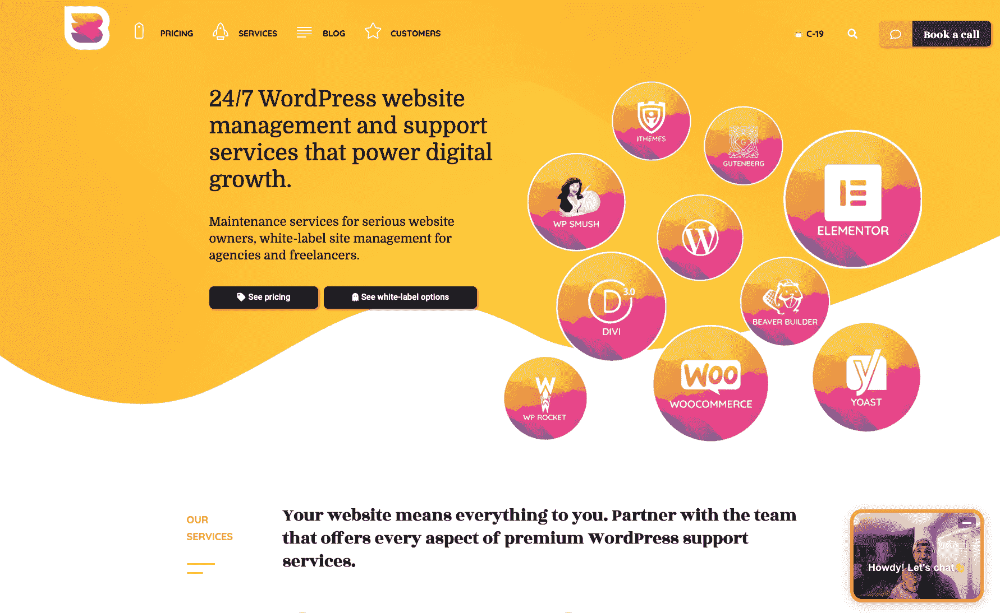
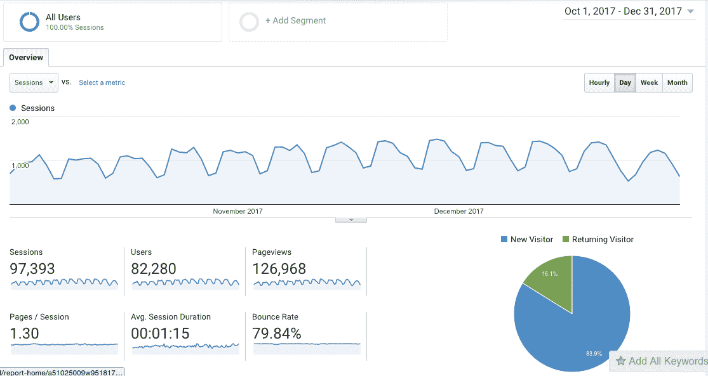
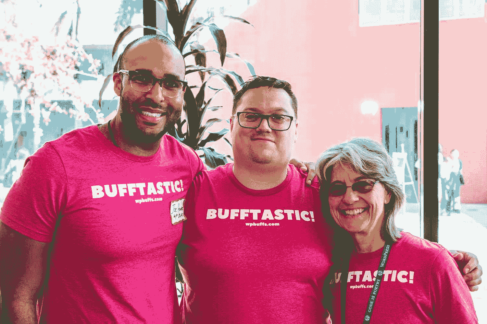

# 如何通过管理 WordPress 网站获得经常性收入

> 原文：<https://www.indiehackers.com/interview/how-to-make-recurring-revenue-managing-wordpress-sites-30eda898c9>

## 你好！你的背景是什么，你在做什么？

你好。我是乔·霍华德。我是[WP Buff](https://wpbuffs.com/)的头部 Buff。

你可能会从公司名称中的“WP”看出，我们专门从事内容管理系统 WordPress。我们希望成为任何拥有 WordPress 网站的个人、企业或组织的最佳技术支持伙伴。大多数企业家或企业主要么试图管理自己的网站，要么雇佣大量自由职业者来支持他们。大多数情况下，这意味着他们要花更多的时间在技术问题或人员管理上，而他们的宝贵时间应该花在发展业务上。

这正是我们想要解决的问题。一个 WordPress 技术合作伙伴，他将完全管理、保护和加速你的 WordPress 站点，按月订阅。

 

财务上，我们正在成长！2017 年第四季度，我们赚了 33，099.36 美元。这个数字实际上可能要高 1000 美元左右，因为我们有一些客户通过 PayPal 向我们付款，但这也差不多。

在为自由职业者、大型机构和 WordPress 企业全面管理网站时，我们发现相当一部分受众对让我们成为合作伙伴不感兴趣，因为他们实际上希望在内部实施持续的护理计划。我们已经成功地建立了一个通过持续维护获得可预测收入的业务，我们处于推出 [WPMRR](https://wpmrr.com/) 的最佳位置。

这个强大的视频课程教 WordPress 专业人士如何为他们的 WordPress 客户实施、销售和执行持续的护理计划，并增加他们每个月的收入。这基本上是我们如何构建和扩展 WP Buffs 并打包的蓝图，这样 WordPress 空间中的任何人都可以做同样的事情。我们喜欢把它看作是我们整个公司的开源！

这也让我们能够在视频课程的同时推出[WPMRR WordPress 播客](https://wpmrr.com/podcast/)。如果你一直在寻找一个 WP 播客，完全专注于发展成功的 WordPress 业务和每月的经常性收入，而不太把它自己当回事，我们会支持你的。

## 是什么促使你开始接触 WP 爱好者？

像 WordPress 世界中的许多人一样，我是在跳了几份不同的工作之后进入这个领域的。我本科时学的是数学和教育，所以我继续在 DC 华盛顿州的公立学校系统教了几年高中数学。

当我决定脱离这种模式时，我加入了一家早期的 SEO 代理公司。我被提升为运营总监。虽然这个头衔听起来令人印象深刻，但当你是公司的第一名员工时，它实际上只是意味着你在忙着做几乎所有的事情。

这是塞翁失马焉知非福！有；工作相当忙碌。但是我学到了很多关于 WordPress 和建立网站的知识！我们决定使用 WordPress 作为我们的内容管理系统，有几个主要原因:对于非技术人员(比如我)来说，托管、启动和建立网站非常简单，开源组件意味着一个充满活力的社区，当我们陷入困境时可以获得帮助。

这家初创公司只维持了几年，我找到了一份全职工作，成为国防部的政府顾问。但是我仍然在兼职做大量的 WordPress 自由撰稿人。像大多数人一样，我为客户建立网站，但我不知道如何扩展它。对每个客户来说，建立网站都是一种个性化的体验，而自由职业又太耗费时间。感觉好像我做了很多事情，但并没有真正移动到任何地方。

这就是 WP 发烧友的想法诞生的时候。我想退出建立 WordPress 网站的游戏，并找到一种商业模式，让我 1)每个月都有经常性收入，并有可预测的收入，2)扩大业务规模，实现自给自足。因此，我没有向一些客户收取很多钱来建立一个网站，而是向许多客户收取一点钱来管理他们的网站。我决定像 SaaS 公司一样运行我的定价结构；每个月支付一次费用，你就能得到一个技术 WordPress 合作伙伴——很简单。

最初，我以顾问的身份朝九晚五地工作，并在 WP Buffs 上兼职。这让我可以用我的薪水为公司的初期投资提供资金，所以这看起来很容易。

验证这个想法就像简单的谷歌搜索一样简单。我看到很多其他公司也在尝试做同样的事情，这实际上是个好消息，因为这意味着这是有市场的。更好的是，只有 2-3 家其他公司似乎对此很认真；在搜索、整体可见性和服务质量方面，大多数人似乎很容易被超越。

一旦时机成熟，我就把[变成了全职的 WP 爱好者](https://wpbuffs.com/going-all-in-on-wp-buffs/)。

## 构建最初的产品需要什么？

建立最初的网站很容易，因为我多年来有很多这方面的经验。我拼凑了一个又快又脏的 MVP，没几天就推到网上了。你现在在 wpbuffs.com[看到的网站是我们的第二次迭代，因为随着我们的发展，我们不得不改进一些东西。](https://wpbuffs.com/)

从最初的想法到发布可能需要几天时间。我是精益方法和在我们拥有完美产品之前发货的大力支持者，所以在我看来这似乎是正确的举措。

当我建立最初的网站时，我也在整合我们的内部系统。管理好一个网站比看起来要复杂得多——它包括定期更新插件、主题和核心文件、安全性、性能、备份、正常运行时间监控等等。最重要的是，我想提供实时的 24/7 支持，因此为此组建一个初始的远程团队并不容易。我最终与两位开发人员 AZ 和 Rifa 一起工作，他们同意与我一起开始之前的项目，尽管我们还没有任何客户。我欠他们很多！

## 你是如何吸引用户和培养 WP 爱好者的？

我们的发射实际上相当平淡无奇。我没有发布任何公告，也没有为此做太多准备；我刚刚推出了网站，并专注于我有经验的营销领域——入境游。

上线 3 天后，我就有了第一个付费客户。他们通过我们的联系表联系我们，并在当天就注册了。我还没有真正为公司做过多少营销，我认为这是一个好迹象。

无论你从事什么行业，结交朋友，寻找和你做同样事情的人。

TweetShare

自从推出 WP Buffs 以来，我一直坚持将集客营销作为我们主要的客户获取渠道。它看起来是这样的:

1.  我们写有用的内容，人们可以通过谷歌搜索找到。
2.  一旦他们登陆我们的网站，有些人会注册我们的电子邮件列表，或者要求我们给他们发一封免费的电子邮件，以帮助他们保护或加速他们的网站。其他人和我们聊天，并就他们遇到的 WordPress 问题寻求额外的帮助。
3.  这些人被添加到一个自动化的电子邮件系列中。我们在这里提供大量的价值和教育来帮助人们更有效地管理他们的网站。
4.  我们将此电子邮件列表进行了细分，以便更多参与的订户可以收到更多关于我们的服务和护理计划的电子邮件。
5.  愿意订阅的用户会继续收到我们的电子邮件，包括我们在博客上发布的新内容以及网上有价值的 WP 文章。

这种营销策略非常有效，因为我们在网站上获得的几乎所有流量都是有 WordPress 问题并在寻找解决方案的人。如果我们能够回答这个问题，并为他们找到解决方案，那就太好了。如果除此之外，我们成为他们解决 WordPress 问题的途径，并最终成为技术合作伙伴，那就更好了。

我们也向 WordPress 社区推销自己。为了成为开源环境的一部分，并帮助 WP 爱好者获得一些知名度，我在 [WordCamps](https://central.wordcamp.org/) 做了一些演讲，并赞助/参加了我们的公平分享会。许多公司在 WordPress 领域的声誉决定着他们的生死，所以我想确保我们在这方面是正确的。

这是 2017 年第四季度的流量情况。不算太寒酸！

 

随着时间的推移，我们已经获得了 54 个新客户。得分！

| 月 | 用户 |
| --- | --- |
| 2017 年 4 月 | 5008 |
| 2017 年 6 月 | 8517 |
| 2017 年 8 月 | 14646 |
| 17 年 9 月 | 20573 |
| 17 年 11 月 | 29749 |

## 你的商业模式是什么，你是如何增加收入的？

我们的护理计划受到 SaaS 定价结构的激励——一个技术 WordPress 合作伙伴的每月统一价格。

作为我们定价的一部分，我犯的最大错误是在 SAAS 领域走得太远；最初，我们提供 30 天免费试用我们的维护计划。这被证明是一个坏主意，因为它吸引了那种会注册我们的免费试用，要求网站编辑，然后在第 29 天离开的人。

不太好。我们的流失率大约是 65%。

所以我调换了一下。我的妻子实际上首先提出了这个想法，我们给人们第一个月 50%的折扣，而不是免费试用。

我应该多听听我妻子的意见。我们做出了改变，客户获得量没有下降，并开始吸引更高质量的客户。我们的流失率降到了个位数！

作为我们中端和高端计划的一部分，我们还提供无限制的编辑。

成长是艰难的，但我想我现在明白人们说你必须花钱才能赚钱是什么意思了。

TweetShare

如果我们所有的客户每天都要求 10 次网站编辑，这种商业模式可能不会奏效。但是我们发现，大多数人在第一个月要求更多的编辑，然后在接下来的几个月就少得多了。这意味着对于我们的 Perform Plan Pro(120 美元/月)的用户，我们通常会在他们的第一个月花费 150-200 美元来维护该帐户。但事实证明，他们对我们的护理计划非常满意，这增加了他们的“客户终身价值”,我们能够增加利润，并在长期内变得更加财务稳定。

此外，不对每个网站编辑收费可以减少大量的发票、客户沟通等成本。所以在我看来，这绝对是一个可扩展的商业模式，我们将继续使用。

当我们刚刚起步时，我还处于“概念验证”模式，我只是在网站上添加了贝宝按钮，这样人们就可以通过这种方式向我们付款。一旦我们有了大约 25 个客户，我意识到那个结账系统有多糟糕(把人们从网站上带走，然后又回来，PayPal 很难合作，等等)，我就转向了 [Stripe](https://stripe.com/) 。这是一个伟大的决定，因为一旦我们启动并运行，Stripe 就变得容易多了。

我们实际上计划再次升级我们的结账流程，通过 Stripe 和 PayPal 接受两种信用卡，所以请尽快与我们联系！

| 月 | 收入 |
| --- | --- |
| 2017 年 4 月 | 3220 |
| 2017 年 6 月 | 3970 |
| 2017 年 8 月 | 8183 |
| 17 年 9 月 | 7719 |
| 17 年 11 月 | 14819 |

## 你未来的目标是什么？

2018 年我有三个目标。

**管理 600 个网站**

没错。我要在 2018 年底前冲击 600 家管理的网站。

这似乎是一个雄心勃勃的数字，但我认为这是非常合理的。

1.  自从我开始 WP Buffs 以来，我们的流量每个月都在增长，所以这意味着随着我们完善销售和转化流程，会有更多的客户呈指数级增长。
2.  我们的白标合作伙伴计划已经成为我们发展的核心。我们帮助 25 家以上的营销机构、设计公司和 WordPress 自由职业者为他们的客户提供维护计划。我相信，2018 年我们将继续引进更多合作伙伴，包括一些更大的合作伙伴。

所以我觉得这是一个理想的目标。足够高，相当雄心勃勃，但根据我们的轨迹是可以实现的。

如果我们在 2018 年达到这些里程碑，我们将达到或超过 25 万美元的 ARR 和 2 万美元的 MRR。那是一个我会为之骄傲的里程碑。

**96 总体幸福等级**

客户满意度对我来说极其重要。这不仅仅是因为快乐的客户对 WP 爱好者来说有更高的终身价值，对我们的财务也有好处。我建立这家公司是为了帮助尽可能多的人使用他们的 WordPress 网站，让他们在网站上做出大胆的决定时不会因为技术限制而犹豫不决。

如果我们能把顾客满意度从 92/100 提高到 96/100，那就意味着给我们“差”或“好”评级的顾客数量会减半。

**在 10 个单词营演讲**

经营一家 WordPress 公司意味着回馈社区。2017 年，我在两个单词营上发表了演讲，今年我想继续下去。

这样做可以让我了解 WordPress 社区在不同领域的情况，也可以帮助 WP 爱好者获得更多的曝光时间。

## 如果你必须重新开始，你会做什么不同的事？

一路走来，我犯了很多错误，但一些最大的错误确实很突出。

**我不得不解雇三名开发人员**

我们有一些不适合我们的开发人员。主要原因是以下一个或多个原因:

1.  他们想单飞，不想成为团队的一员。
2.  他们犯了太多的错误。
3.  他们没有充分利用时间。

我学到的:我需要更好地审查我们的新员工。这包括他们在使用 WordPress 时的效率和效果，以及他们如何融入我们的远程团队合作文化。培养更多符合这种模式的人将是今年的一大焦点。

 

**我等了太久才整理好我们的财务状况**

不要误解我。我一直非常关注我们的财务状况。收入。利润率。工资单。所有这些。

但我犯了两个让我付出代价的大错误:

1.  我没有做财务预测。老实说，在衡量 WP 爱好者的财务状况方面，我做的很少。但是，看看我们的银行账户，猜测我们有多少金融带宽，不会再减少了。
2.  我没有足够早地雇用簿记和会计。是时候让专业人士接手了，给我一些基于最近业绩、流失率和潜在新客户的数据驱动的项目，这些项目可以告诉我我们可以轻松地进行什么样的投资。我大约一周前才这样做；尽管很难向不收费的员工支付大笔薪酬，但从长远来看，这是值得的。

**我想过花钱而不是投资**

回想起来，我觉得很长时间以来我都在考虑我们花的钱，而不是投资的真实情况。当我们刚开始的时候，我会在一个新的结账系统上看到 1000 美元的价格标签，并认为我们负担不起。

现在，这只是一项投资，如果它吸引了一个以前不会结账的新顾客，它就收回了成本。

成长是艰难的，但我想我现在明白人们说你必须花钱才能赚钱是什么意思了。

## 有没有发现什么特别有帮助或者有优势的？

伙计，有太多有用的东西支撑着我走到今天。我是 80/20 法则的忠实粉丝，所以让我列出对我们的成长有 80%影响的 20%的事情。

[收件箱暂停](https://www.boomeranggmail.com/inboxpause/):每天只允许两次电子邮件进入我的收件箱，这对我的工作效率创造了奇迹。现在，我不再每天查看 50 次电子邮件，而是在做更深入的工作，完成一些推动我业务发展的事情。

[番茄工作法杂志](https://www.amazon.com/Productivity-Planner-Daily-Non-Dated/dp/0991846222):25 分钟的冲刺和 5 分钟的休息对我的精神集中创造了奇迹。我并不真的相信生产力黑客，但这让我可以忘记其他发生的一切，一次专注于一项任务。最终，我有效地推动了事情的发展。

[埃隆·马斯克:特斯拉、SpaceX 和对美好未来的追求](https://www.amazon.com/Elon-Musk-SpaceX-Fantastic-Future/dp/006230125X/ref=sr_1_1):这本传记告诉了我很多关于埃隆的故事，以及他是如何毫无歉意地让他的公司存在并取得巨大成功的。我不认为我们有完全相同的 DNA，但知道努力工作和保持高期望可以推动事情向前发展是很疯狂的。

我们其他人的创业:这个播客专注于帮助人们发展他们在 SaaS 的业务；不完全是什么 WP 爱好者，但由于我们的定价结构，在这里听已经非常有益。他们会在任何阶段检查 SaaS 公司运营的每个方面，所以这是一次必听的课程。

这比 WP 迷们刚刚起步的时候更适用于去年的我。现在，我一天中的大部分时间都在管理人员而不是执行，个人发展已经成为我花费大量时间的地方。这个播客是我下午和我的狗马文散步时听的。

WordPress 社区:我在 WordPress 空间的朋友在帮助我培养 WP 爱好者方面发挥了重要作用。我收到的推荐、大声喊出来、链接到我的网站的数量对我们的成长至关重要。社区是我最初如此投入 WordPress 的原因之一，每天和这些伟大的人一起工作，我感到无比快乐。

## 对于刚刚起步的独立黑客，你有什么建议？

对成长中的 WP 爱好者有最大积极影响的一件事是与 WordPress 空间的人建立关系。构成空间的人简直太棒了，这就很容易了。无论你在哪个行业，结交朋友，寻找和你做同样事情的人；没有什么比和其他像你一样为成功奋斗的人在一起更能推动你前进的了。

## 我们可以去哪里了解更多？

*   网址:【https://wpbuffs.com/ T3
*   推特上的 WP 粉丝:https://twitter.com/thewpbuffs
*   我在推特上:[https://twitter.com/JosephHHoward](https://twitter.com/JosephHHoward)
*   https://www.facebook.com/wordpressbuffs/在脸书的 WP 发烧友:

有问题吗？请在下面的评论中提问，我会很快给你答案:)

——[<picture id="ember8160095" class="user-avatar ember-view user-link__avatar"></picture>乔霍华德](/joehhoward?id=REnCQF3bXaUGdU8fM4inKPzMeXS2)，WP Buffs 创始人

## 想像 WP 发烧友一样建立自己的事业？

你应该加入独立黑客社区！🤗

我们是几千名创始人，互相帮助建立有利可图的业务和副业。来分享你正在做的事情，并从你的同事那里获得反馈。

还没准备好开始使用你的产品吗？没问题。这个社区是一个认识人、学习和实践的好地方。随意[随便浏览](/)！

——[<picture id="ember8160100" class="user-avatar ember-view user-link__avatar"></picture>考特兰艾伦](/csallen?id=ibTLPyjwVebnZjMGKvz6ztarnuV2)，独立黑客创始人

21votes