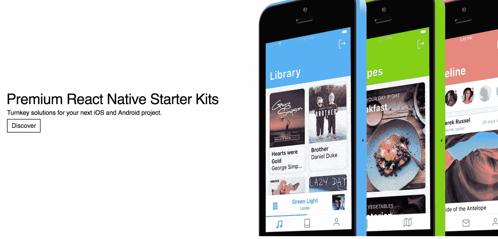
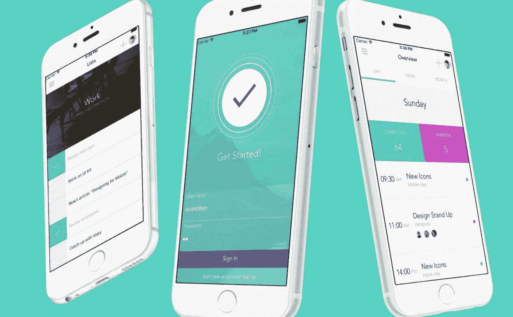
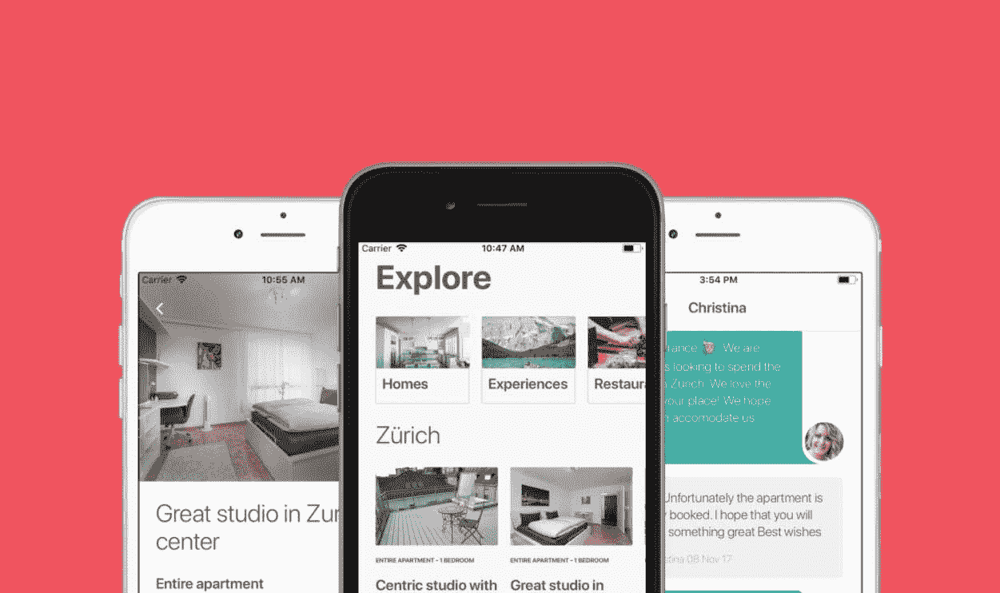

# 透明度和良好的时机如何帮助我利用新技术

> 原文：<https://www.indiehackers.com/interview/how-transparency-and-good-timing-helped-me-capitalize-on-new-tech-d8032b8929>

## 你好！你的背景是什么，你在做什么？

你好独立黑客社区！🙋我是威廉·坎迪隆，31 岁，来自法国的软件工程师。我目前住在美丽的瑞士苏黎世。去年，为了开发一些实验性的构建软件，我休假了一段时间，React Native Starter Kits 就是其中之一。

那是我开始加入独立黑客社区的时候:对于我考虑或进行的每个实验，我都可以向在这个领域有经验的人学习。在 React Native Starter Kits 的案例中，对 Creative Tim 创始人 Alexandru Paduraru 的采访是一个关键资源。

做事透明。从最小的一步开始，比如登录页面，并与社区分享您的目标。

TweetShare

React 原生初学者工具包是 iOS 和 Android 的高级 React 原生样板。目标是为开发者提供下一个应用所需的 80%的工作。这也可以包括与 Firebase 的后端集成。涵盖了很多用例，比如社交媒体应用、生产力应用、列表应用、音乐应用等等。

每个模板都与 React 本机开发中的最新最佳实践保持同步。作为一名软件工程师，我尽最大努力提供最好的代码质量。例如，对源代码使用大量的静态分析，以及严格的类型检查。

一个典型的例子就是 Airbnb 模板。我遇到过许多人，他们想要一个 Airbnb 式的平台，用于某个特定的垂直行业。也许是运动或者化妆品的 Airbnb。通过获得初学者工具包，他们可以获得 iOS 和 Android 的全功能原型。

主要客户是数字机构，他们将这些套件用作客户的千篇一律的解决方案。许多开发人员也在使用这些初学者工具包来构建辅助项目。事实上，假期期间销售总会有一个突增。我把这归因于人们利用休息时间来创造一些很酷的东西。

最初，这些套件是通过[一家 React 本地市场](http://market.nativebase.io)独家销售的。与此同时，我已经开始通过媒体故事建立自己的销售渠道，最近还通过 YouTube 频道。今天，一半的销售是直接完成的，对此我感到非常自豪。

 

## 是什么促使您开始使用 React 原生初学者工具包？

当我开始休假时，我与苏黎世[的健身教练合作开发了一个健身应用](https://hackernoon.com/building-a-fitness-app-with-react-native-1478f2dc68be)。对于这个项目，React Native 是一个显而易见的选择:它完全颠覆了构建和发布应用程序的经济性。这是我第一次使用 React Native，犯了很多错误。我决定反思所学到的经验，并将它们打包到一个优质的 React 原生初学者工具包中。

最初的前提很简单:不管有什么商业愿望，都需要这样做。即使没有人购买该产品，它对我在未来的项目中使用仍然非常有用。一个令人鼓舞的销售渠道已经存在:Native base React Native market place。

苏黎世是一个小城市，但它确实有一个充满活力的企业家和创客社区。通过在与创业社区有联系的咖啡馆工作，我能够遇到不可思议的人。这里的生活成本很高，但我认为这是一件好事:它促使你对自己的事业充满雄心。

## 构建最初的产品需要什么？

这个项目是通过构建一个包含成品截图的登录页面来启动的，尽管还没有编写一行代码。来自 InVision 的模板被用于此。人们可以留下他们的电子邮件，如果他们有兴趣在工具包准备好的时候得到它。

然后我把这个网页链接到一个关于我的第一个 React Native 项目的媒体故事上。十几个人留下了他们的电子邮件，这是一个小的验证。但是除了收到几封电子邮件之外，用清晰的术语描述我试图在登陆页面上提供的东西的价值也是有价值的。我强烈建议在开始构建任何东西之前做这个练习。

构建第一个工具包花费了大约三周的全职工作。对我来说，这是整个过程中最愉快的部分。之后，我在登录页面上设置了一个小条纹结账按钮，并通知了我的早期线索。但真正的销量是通过 NativeBase 市场实现的。

 

## 你是如何吸引用户并开发出 React 原生入门套件的？

第一个销售渠道是 NativeBase 市场。与此同时，我开始在媒体上写我在 React Native 的旅程。如果可能的话，我也会贡献开源包。把你的部分工作放在开源中更多的是改进它们而不是提升它们。我收到的贡献以及与社区的交流都是非常宝贵的。

我的媒体故事列表可以在[这里](https://medium.com/@wcandillon)找到。这是我的 [Github 简介](https://github.com/wcandillon)。

把你的部分工作放在开源中更多的是改进它们而不是提升它们。

TweetShare

最近，我开始在 YouTube 上现场编写初学者工具包[。对于这个新的实验，前提还是非常简单:即使没有人看视频，在一个专注的环境中编写代码，大声解释我的想法，而不是检查脸书，仍然会更有效率。这不仅是一个非常愉快的过程，来自社区的反馈也非常好，而且它真的让潜在客户了解了他们将要购买的东西。它还极大地帮助了客户支持。许多问题都可以通过指向正确的 YouTube 视频来回答。](https://www.youtube.com/channel/UC806fwFWpiLQV5y-qifzHnA)

下面，你会发现我的直销渠道每月用户的演变。

| 月 | 用户 |
| --- | --- |
| 2017 年 10 月 | 617 |
| 2017 年 11 月 | 700 |
| 2017 年 12 月 | 1965 |
| 2018 年 1 月 | 1374 |
| 2018 年 2 月 | 4056 |
| 2018 年 3 月 | 4700 |

## 你的商业模式是什么，你是如何增加收入的？

商业模式很简单。只需一次性付费即可获得入门套件，该套件可让您访问源代码、所有未来更新和六个月的支持。人们还可以访问构建初学者工具包的 git 存储库。以下是该产品的月总收入。

| 月 | 收入 |
| --- | --- |
| 2017 年 10 月 | 2176 |
| 2017 年 11 月 | 2358 |
| 2017 年 12 月 | 4725 |
| 2018 年 1 月 | 5151 |
| 2018 年 2 月 | 3808 |
| 2018 年 3 月 | 5750 |

这是不含市场佣金的收入情况:

| 月 | 收入 |
| --- | --- |
| 2017 年 10 月 | 1523 |
| 2017 年 11 月 | 1530 |
| 2017 年 12 月 | 3122 |
| 2018 年 1 月 | 3917 |
| 2018 年 2 月 | 2973 |
| 2018 年 3 月 | 4430 |

## 你未来的目标是什么？

从 React Native 的旅程中学到了许多技术经验，我计划在 Medium 和 YouTube 上与开发人员社区分享这些经验。

我应该从第一天开始就在 YouTube 上做现场编码。

TweetShare

我将很快向社区提供一个“免费”的 React 本地初学者工具包，这让我非常兴奋。

## 你面临的最大挑战和克服的障碍是什么？如果你必须重新开始，你会做什么不同的事？

我喜欢写这些[入门套件](https://react-native.shop/)，但是我对销售一窍不通。可能有一些机会，我应该调查像谷歌广告词或脸书广告。作为一个极客，很容易被吸引去做很酷的软件工程，而忘记了其他一切都同样重要，如果不是更重要的话。

React Native 社区的规模很大，但是在这些初学者工具包中有很多不信任，这是应该的！😅社区中的初学者可能没有足够的知识来理解这些工具包所提供的价值，而那些足够高级来理解这些价值的人可能会考虑自己动手，只是因为这样做很有趣。所以这个大社区里的目标细分人群比较小。

我应该从第一天开始就在 YouTube 上做现场编码。把自己放在那里是非常困难的，需要很多时间来获得信心。现在，视频的制作质量很低，为了给用户提供更好的体验，我想改进这一点。

 

## 有没有发现什么特别有帮助或者有优势的？

这种体验之所以可能，是因为恒星排成了一行。React 和 Expo 等技术进步，以及 Firebase 等后端即服务平台，使我能够创建这些初学者工具包。这些产品周围有活跃的社区，绝对改变了构建和发布移动应用的经济模式。

世博会就是一个很好的例子。多亏了这个库，潜在客户可以在自己的 iOS 或 Android 设备上使用初学者工具包，就像用手机扫描二维码一样简单。这些创新令人兴奋。

## 对于刚刚起步的独立黑客，你有什么建议？

我想提倡透明地做事。从最小的一步开始，比如登录页面，并与社区分享您的目标。透明到你甚至可以记录下你自己在做什么。在开阔的地方迈小步。

## 我们可以去哪里了解更多？

请随时通过 [【邮件保护】](/cdn-cgi/l/email-protection#205743414e44494c4c4f4e60474d41494c0e434f4d) 联系我。React 原生入门套件的网站可从[这里](https://react-native.shop)获得。

—[<picture id="ember5250368" class="user-avatar ember-view user-link__avatar"></picture>威廉·坎迪隆](/wcandillon?id=ThWJkyil8yZCgUHtrn83SmCvGL32)，开始反应原生的创始人

## 想像 Start React Native 一样建立自己的事业吗？

你应该加入[独立黑客社区](/)！🤗

我们是几千名创始人，互相帮助建立有利可图的业务和副业。来分享你正在做的事情，并从你的同事那里获得反馈。

还没准备好开始使用你的产品吗？没问题。这个社区是一个认识人、学习和实践的好地方。随意[随便浏览](/)！

—[<picture id="ember5250373" class="user-avatar ember-view user-link__avatar"></picture>考特兰艾伦](/csallen?id=ibTLPyjwVebnZjMGKvz6ztarnuV2)，独立黑客创始人

41votes