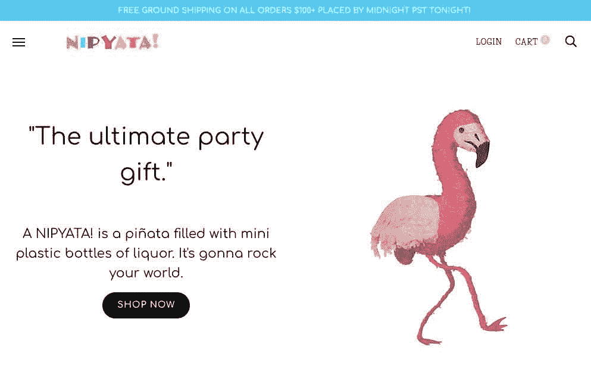
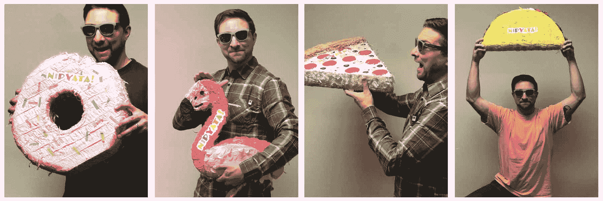
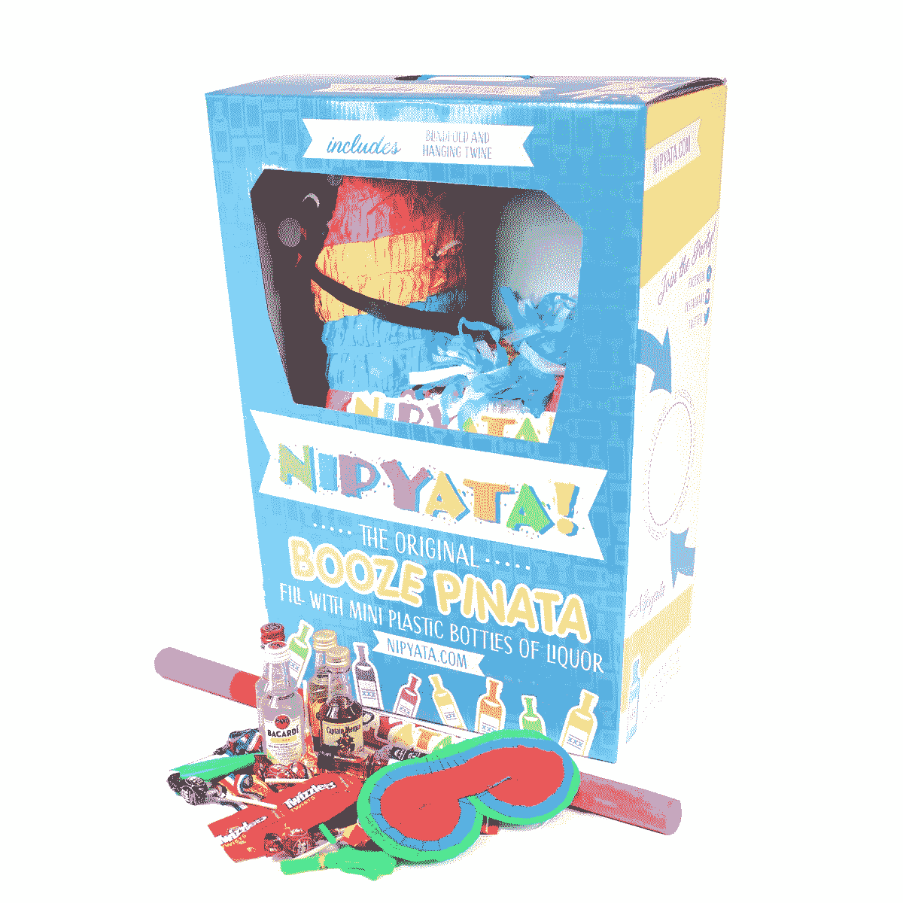
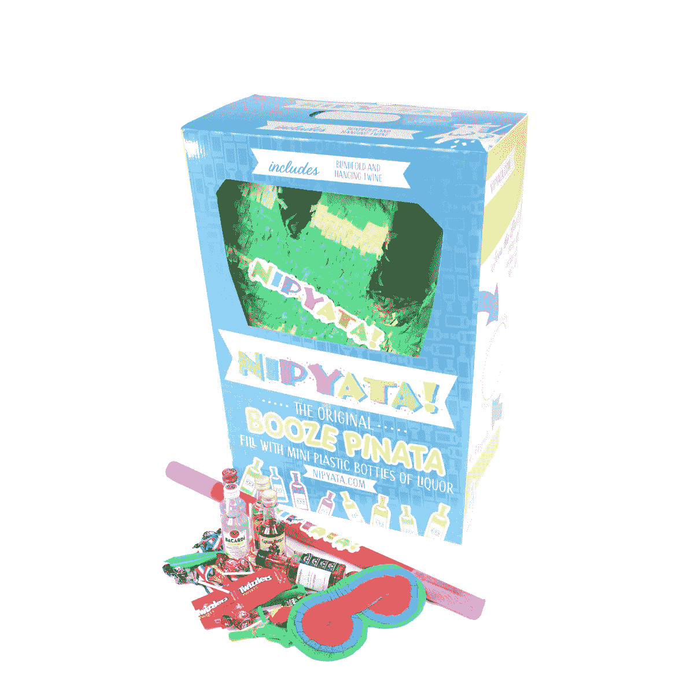

# 病毒式营销如何将我们的月收入提高到 53，000 美元

> 原文：<https://www.indiehackers.com/interview/how-viral-marketing-has-upped-our-monthly-revenue-to-53-000-ec343abb3d>

## 你好！你的背景是什么，你在做什么？

我叫威尔·亨奇，是 NIPYATA 的三位联合创始人之一！。我们是一个个性化的电子商务平台，用于设计和交付 Kickass 个性化的 Booze Piñ atas(以及其他有趣的派对礼物和饮酒游戏)。每个产品都(或将)与一个背后有积极使命的非营利组织相关联。我们正努力帮助提高人们对重要事业的认识，并为此而努力。

我和我的兄弟 Andrew 共同创立了这家公司，他负责我们在酒类商店的 B2B 销售，Dan Cedrone 负责我们的产品开发和运营。我专注于品牌和营销。我们的目标是让这个世界摆脱无聊的礼物，并帮助创建令人敬畏的使命驱动型组织的意识。

尼皮亚塔！最初是我们的一个朋友带到大学派对上的自制产品——装满迷你塑料瓶酒的 piata(在东北我们称之为“nips”)。

今天，尼皮亚塔！是一种可以在店内或网上购买的产品。我们在网上做了很多定制工作——我们可以在 NIPYATA 上叠加高分辨率图像！、个性化的形状、定制的酒类选择、葡萄酒品种、糖果追逐者和“NIPYATA！财富”(每个瓶子上定制的标签，带有受幸运饼干启发的信息)，使产品真正个性化，极具娱乐性。

该业务每月为消费者和零售酒类商店带来 55，000 美元的收入。我们现已发货超过 5000 台，并计划推出 NIPYATA！住在 2019 年五月五日节的 3000 多家商店。

 

## 是什么促使你开始使用 Nipyata？

当 nipyata.com 域名可用时，我们认为这是一个信号。然后，在新泽西州泽西城离我们不远的拐角处开了一家酒店。我们向商店的老板推销，他喜欢这个概念——他成了我们的第一个合作伙伴。

对产品的需求、媒体报道和社交媒体上的广告宣传都是最初推出的因素。

## 构建最初的产品需要什么？

我们的在线产品很简单——在线商店和我们的 iOS 应用程序使用了 TypeForm 和 Shopify。我们投入了大约 2500 美元来启动它。从一开始，我们就从调查和 A/B 测试中学到了一些东西:

1.  定制的酒是必须的。用户可以选择他们想要的任何类型的酒。
2.  只有塑料奶嘴，没有玻璃瓶:)在我们的第一次测试中，一瓶 Jagermeister 差点挖出了我们的联合创始人 Dan 的眼睛。
3.  咬口的大小和数量是每个人都想要的特征。
4.  定制游戏——我们有 NIPYATA！财富(像真理或冒险)，一个“黄金夹”(惊喜夹在每个 NIPYATA！)和品牌 NIPYATA！游戏规则，为我们的客户带来真正独特的体验。

我们将很快建立我们自己的应用程序和网站，看起来和感觉上都更加完美，使用起来也更有趣。

到目前为止，我们已经在这项业务上投资了大约 75，000 美元，主要用于库存、消费者包装和酒类许可。我们现在正在进行一轮更大的融资，这样我们就可以更快地扩展到销售烈酒、葡萄酒和啤酒的实体店，因为在线酒类运输法律禁止公司向许多州运输。

 

## 你们是如何吸引用户，让 NIPYATA 成长起来的！？

当我们第一次启动时，我们只是简单地给我们所有的朋友发电子邮件，请他们分享这个网站。我们没有一个病毒式的视频或任何“发布计划”。最初的订单缓慢且不稳定——我们会与附近的酒店合作来完成这些订单。

我们通过跟随 Ryan Holiday 的书*一步一步地相信我，我在说谎*获得了我们的第一个流量和订单流，我们在 2015/2016 年获得了一系列大型媒体的报道。但这导致了少量的流量峰值和一些残余的 SEO 流量。我们也没有重新定位、电子邮件捕获或线索培育自动化。吸取教训。

和你真正喜欢一起工作的人一起创造一些东西，因为很多天你会感到不安、沮丧或者想要放弃。拥有一两个能让事情每天都保持积极的联合创始人是至关重要的。

TweetShare

脸书和谷歌 AdWords 上的影响者营销和付费收购已经成功帮助我们扩大规模并获得一致的订单流。

竞赛和赠品对我们在脸书和 Instagram 上的品牌认知度非常有效。尼皮亚塔！是天生的病毒，我们看到大量参与我们的社交付费收购活动。

 

## 你的商业模式是什么，你是如何增加收入的？

我们开始时每件产品收费 69 美元，但在意识到制作每件 NIPYATA 花了多少时间和精力之后！我们现在对每件产品的定制收费高达 189 美元。

除了我们的在线 B2C 电子商务网站，我们还有一些渠道。我们在商店批发，这样顾客可以直接在商店购买，很快就能买到 NIPYATA！将在某些城市的 Minibar 和 Drizly 等酒水配送应用程序上提供。

我们还为希望进行赠品、客户礼品、员工礼品或影响者活动的公司提供品牌产品包。我们将创建 50-200 个定制的 NIPYATA！产品，并处理履行和社会媒体活动。

我们今年的收入有所波动:

| 月 | 收入 |
| --- | --- |
| 2018 年 1 月 | 9200 |
| 2018 年 2 月 | 12100 |
| 18 年 3 月 | 16500 |
| 2018 年 4 月 | 29300 |
| 2018 年 5 月 | 53700 |
| 2018 年 6 月 | 24200 |
| 2018 年 7 月 | 16200 |

增长的主要原因是 Cinco de Mayo 在 3 月、4 月和 5 月开展的公关活动，以及与摩根船长和 SVEDKA 等大型烈酒品牌合作的项目。

## 你未来的目标是什么？

我们的短期目标是筹集资金，让更多的团队成员全职工作，这样我们就可以扩大运营规模，处理销售到零售店的配送和物流。我们正在寻求银行贷款和天使投资来支持我们的增长。

## 你面临的最大挑战和克服的障碍是什么？如果你必须重新开始，你会做什么不同的事？

我们遇到的最大问题是高峰期间的履行和库存管理。我们犯了一个错误，雇佣了一些小时工(试图保持精简)来帮助运送订单，当我们的一些公关作品传播开来时，他们很快就落后了。

在你的房子或办公室之外经营一家实体商品公司(有大量库存需求)也是极其困难的——我们很快了解到装卸码头和仓库对于保持运营顺利进行至关重要——或者将一切外包给第三方物流公司。

TweetShare

我们已经决定，唯一的处理方式是让专业的全职团队或第三方履约公司来处理订单。在你的房子或办公室之外经营一家实体商品公司(有大量库存需求)也是极其困难的——我们很快了解到装卸码头和仓库对于保持运营顺利进行至关重要——或者将一切外包给第三方物流公司。我们接触过的大多数第三方物流公司都不运送酒，所以我们不得不自己经营。

 

## 对于刚刚起步的独立黑客，你有什么建议？

和你真正喜欢一起工作的人一起创造一些东西，因为很多天你会感到不安、沮丧或者想要放弃。拥有一两个能让事情每天都保持积极的联合创始人是至关重要的。

有一个小的集中的每周或每月目标和一个简单的共享仪表板来衡量它们。建立一个基本的 A/B 测试，一次只测试一件事。每一到两周做一次这些测试，并测量结果——一个大的改变可能会让你的月增长率提高 2 到 3 倍。

确保你的团队中有人监控现金支出，并更新收入与支出的每周报告。收取足够高的价格，这样你就可以在每笔订单上产生现金。随着规模的扩大，你最终会达到这样一个点，即你可以为企业提供资金或每月为自己支付一些收入。

## 我们可以去哪里了解更多？

请随时在 nipyata.com 查看我们的产品，或在 [【电子邮件保护】](/cdn-cgi/l/email-protection#bdd5d2d1dcfdd3d4cdc4dcc9dc93ded2d0) 给我们发电子邮件询问任何问题。

——[<picture id="ember8169357" class="user-avatar ember-view user-link__avatar"></picture>尼皮亚塔](/nipyata?id=Egbomuu1m1MpfZ98g4KbFDFITD43)，尼皮亚塔创始人！

## 想像尼皮亚塔一样建立自己的事业！？

你应该加入独立黑客社区！🤗

我们是几千名创始人，互相帮助建立有利可图的业务和副业。来分享你正在做的事情，并从你的同事那里获得反馈。

还没准备好开始使用你的产品吗？没问题。这个社区是一个认识人、学习和实践的好地方。随意[随便浏览](/)！

——[<picture id="ember8169362" class="user-avatar ember-view user-link__avatar"></picture>柯特兰艾伦](/csallen?id=ibTLPyjwVebnZjMGKvz6ztarnuV2)，独立黑客创始人

21votes