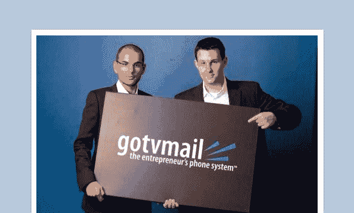
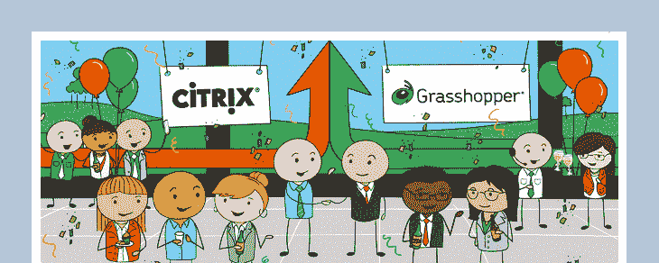

# 我们如何将 Grasshopper 的年收入提高到 3000 万美元

> 原文：<https://www.indiehackers.com/interview/how-we-bootrapped-grasshopper-to-30m-in-annual-revenue-d666c72b22>

## 你好！告诉我们你的背景和你从事的工作。

我是大卫·豪泽，我是一名连续创业者，创办过 [Return Path](https://returnpath.com) 、 [Grasshopper](http://grasshopper.com) 、 [Chargify](https://www.chargify.com) ，也创办过很多失败的企业。我也是一名天使投资人，几年来已经做了 50 多项投资。

Grasshopper 为企业家提供了一个虚拟电话系统，并在超过 12 年的时间里服务了成千上万的客户。在 2015 年将业务出售给 Citrix 之前，我们在不到 40 名员工的情况下将业务提升至每年超过 3000 万美元的收入。

卖掉了 Grasshopper 和 Chargify，花了一年时间给其他创业者提供建议，并思考下一步该怎么做，我决定找一家 SaaS 公司，至少要花 50 万至 100 万美元收购和扩大规模。

## 是什么促使你开始使用 Grasshopper？你最初的目标是什么？你是怎么想出这个主意的？

我们开始 [Grasshopper](http://grasshopper.com) 是因为我们无法找到一个解决方案，通过处理所有的呼入电话，让我们的业务听起来更专业，看起来更专业。

当然，也有 PBX 系统和其他做类似事情的系统，但没有一个是以完全虚拟的方式包装的，也没有一个是为四处走动或不在一个办公室的企业家设计的。我们几乎没有钱，但我们还是开始了，我们开发了软件并尽快开始销售。

销售永远是第一要务。一旦我们有了足够好的产品，我们就开始营销。我们没有后端或方法来访问客户信息，所以我们自己接听客户支持电话，需要实时编写 SQL 语句来查找客户。

很明显，我们所建立的东西是有需求的，但是这些年来，我们学到了很多，找到了更好的方法来锁定我们的客户。我们变得非常擅长的是向目标群体营销，留住客户，并通过一个非常高效的团队优化收入。

## 最初的产品是如何问世的？

我们几乎没有钱，但在 AWS 和云服务出现之前，我们成立了一家电信公司，当然也没有可用于手机相关应用的 API。因此，我们必须尽快获得收入。

为了筹集资金，我们把从其他投资中攒下的钱合在一起——我们都做过一些相对成功的小事情——所以有几十万美元。最重要的是，朋友和家人，实际上主要是家人，另外还有几十万美元。但总的来说，考虑到我们的花费，这并不算多。

在这一点上，是我自己，我在印度有一个外包开发人员，老实说，他真的很糟糕，所以我做了很多代码。不幸的是，它写于当时的 ASP.NET。我们开始时只有一条 T1 线路，没有备用的入站线路，后来很快增长到 2 条、3 条，然后是 4 条。从那里，我们发展到 ds3 和更大的冗余链路和备份数据中心，但我们必须建立一切。我们花了大约 3 个月的时间完成了一个有形的产品。

与此同时，我的联合创始人 Siamak，一点也不精通技术，却在营销和销售。到那 3 个月结束时，我们很快就开始盈利，这让我们得以扩大一个完全自举的业务。

Grasshopper 最初被称为“GotVMail”。

## 是什么营销策略帮助你把 Grasshopper 发展到这么多用户？

当我们在 12 年前开始时，没有社交媒体，PPC 或 AdWords 也不存在。我们从 Omniture 购买了几分钱的关键词流量，并尽可能地转换和使用有机 SEO。这就是我们如何获得第一批客户并开始增长的原因。虽然这些策略奏效了，但这些完全相同的策略在今天却不可能奏效。

然而，我们学到的知识确实适用于当今的任何业务，即尽可能多地查看渠道，快速测试它们，并获得关于哪些渠道可以随着您增加更多资金而扩展的方向性信息。

多年来，我们多次改变了我们的营销、信息传递，当然还有渠道组合。我们花了整整一年的时间学习并创造了一种使用早期 A/B 测试工具的测试文化。这扩展到包括印刷、展示、社交，然后是广播。在出售前的几年里，我们从单纯的卫星广播扩大到在地面广播上的大赌注。一个不变的事实是，我们总是在寻找新的渠道，以找到我们可以进一步扩展的地方。

另一个对任何 SaaS 企业至关重要的因素是口碑推荐。很多人谈论“病毒循环”和其他流行词，但我认为这主要是垃圾。你可以试着让你的软件具有这种病毒系数，但归根结底是做一些解决真正问题的东西，人们喜欢，所以他们会告诉他们的朋友和同事。随着时间的推移，我们能够以非常有意义的百分比保持甚至扩大这一渠道。

## Grasshopper 的商业模式是如何运作的？其营收背后有什么故事？

创业总是艰难的，当你每年的收入翻倍时，有足够的现金来做这件事是至关重要的。我们创造了一个积极的现金循环，在我们支付与这些支付相关的实际使用费用之前，我们通过信用卡支付从客户那里收集收入。我们延长了付款期限，并使用信用卡进一步延长这些期限，我们在付款前 60-90 天收款。

当你一个月增加几千个客户，并与几十万个客户打交道时，客户流失变得越来越明显。即使百分比很低，绝对数字也会越来越大。我们的团队花了很多时间监控客户流失，并寻找减少流失的方法。了解参与度和客户取消的原因只是第一步，随着时间的推移，我们的系统通过创建预测模型变得越来越先进。

随着时间的推移，减少流失涉及很多很多小事情，但大部分都集中在入职上。我们发现，说“我需要这个”的人很少付钱给我们，然后实际上在初始阶段之后就建立起来了。搅拌的人根本不使用它，原因是他们没有加入，因为最初我们没有加入。就像是，你注册了，这是你的登录名，就这样。

这些年来，我们越来越认识到，你真的必须一步一步地引导人们完成这个过程。你必须预先填充一些东西，等等。我们只是一点一点地测试。我们说，“好吧，如果我们自动为他们输入一个带有他们名字或其他什么的问候，会有帮助吗？”我们会对此进行 A/B 测试。我们就这样一次又一次地重复着。

此外，在超过 12 年的时间里，我们经历了如此多的价格变化，以至于我记不起其中的一半。当我们开始时，收取 10 美元/月的在线登录和管理系统的费用是可以接受的，当然这已经不可能了。我们 A/B 测试了几乎每一个可能的价格点，甚至功能集，以了解收入组合和优化的最佳选择，同时还考虑了客户流失。我们对价格上涨做了同样的事情，分组测试，找到最佳组合。

## 你最后卖了蚱蜢。那个过程是什么样的？

卖[蚂蚱](http://grasshopper.com)从第一次对话到成交是一年多的过程，经历了很多风风雨雨。这也是我第一次出售业务，所以这是一个真正的学习过程。每一步都有优秀的顾问和专业人士在身边，这并不便宜，但肯定是值得的。

我们从未想过要出售 Grasshopper，我们从未有过退出计划，我们也不打算出售。时机和与 Citrix 的契合很有意义，我们必须探索它。随着我们探索得越来越深入，事情变得越来越有意义。

## 你在开发 Grasshopper 时面临的最大挑战是什么？知道你现在所知道的，如果你必须重新开始，你会做什么不同的事？

这些年来，我们面临了许多大大小小的挑战，我相信我已经忘记了一些在当时看来巨大的挑战。从雇佣错误的人到太多的人，等待太久才发布产品的 v2，完全重写产品，没钱支付账单，以及你能想象到的其他一切。

一个挑战是，我们在公关上花了很多时间，我们发现大多数人用于公关的过程是破碎和昂贵的。典型的过程是雇佣昂贵的公司 X 或 Y，但这并不成功。我们创建了一个非常基于销售和人际关系的项目。

我写了一本关于这个的很长的书，只是没有时间把它放在那里，但是人们问我，我把它寄给他们。这个 buzz 过程让我们被数百种出版物和其他东西所覆盖。但首先我们经历了支付昂贵的公司的挑战，没有结果，从公共关系行业内部雇佣一些人，没有结果，直到我们找到一些有意义的东西。

我学到的最重要的经验可以应用到我做的任何其他事情上:从一开始就有明确而真实的核心目标和核心价值观来管理一种令人惊叹的文化，在正确的时间或业务阶段让正确的人上车。

## 对于刚刚起步的有抱负的独立黑客，你有什么建议？

我最大的一条建议很简单，多年来从未改变。去做点什么吧，什么都行。空谈毫无价值，行动胜过一切。有太多的企业家失败了，因为他们从来没有开始。

至于阅读，我认为一些更流行的书不一定是必读的，像《T2》、《精益创业》和诸如此类的东西。我认为*概念*很好，但是人们在上面花了太多时间，然后他们就陷入了沉迷于他们的 MVP 和其他流行词和术语的可怕道路。

请不要读这些书了。出去*做*一些事情。阅读能给你提供更高层次创业理念的书籍，你可以将这些理念应用到自己身上。这些年来，我通常推荐的书籍没有太大变化:

*   [吉姆·科林斯《从优秀到伟大》](http://amzn.to/2iV2Zvg)
*   [Verne har nish 的放大作品](http://amzn.to/2j3SCm4)
*   [彼得·泰尔零比一](http://amzn.to/2irgtvx)
*   彼得·迪亚曼迪斯的《富足》
*   马修·凯利的《梦想经理》

## 我们可以去哪里了解更多关于你在做什么？

*   [davidhauser.com](http://davidhauser.com/)
*   [twitter.com/dh](https://twitter.com/dh)
*   [facebook.com/dh.dhauser](https://www.facebook.com/dh.dhauser)

——[<picture id="ember5304280" class="user-avatar ember-view user-link__avatar"></picture>大卫·豪泽](/DavidHauser?id=grasshopper-owner)【蚱蜢的创造者

## 想像蚂蚱一样自己创业？

你应该加入独立黑客社区！🤗

我们是几千名创始人，互相帮助建立有利可图的业务和副业。来分享你正在做的事情，并从你的同事那里获得反馈。

还没准备好开始使用你的产品吗？没问题。这个社区是一个认识人、学习和实践的好地方。随意[随便浏览](/)！

——[<picture id="ember5304285" class="user-avatar ember-view user-link__avatar"></picture>柯特兰艾伦](/csallen?id=ibTLPyjwVebnZjMGKvz6ztarnuV2)，独立黑客创始人

19votes