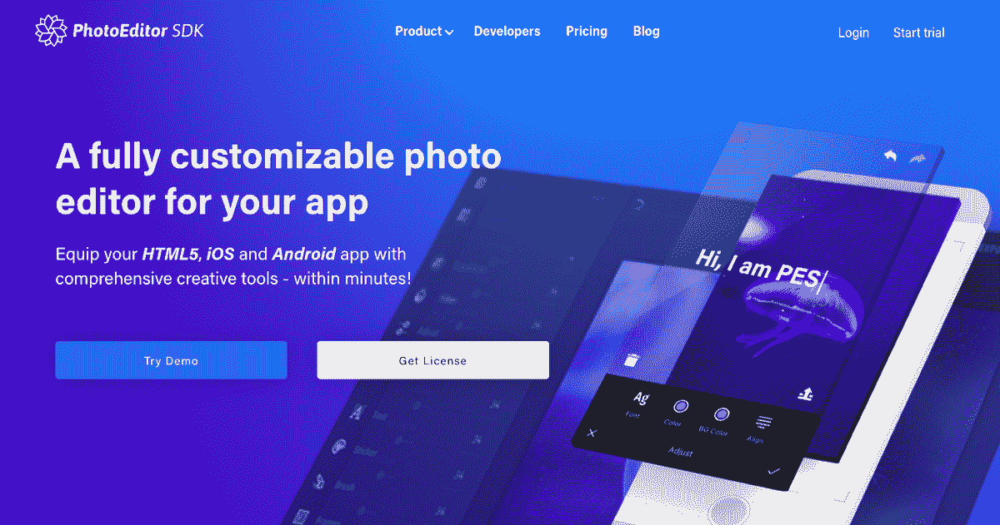
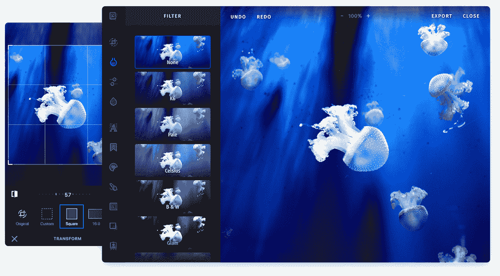
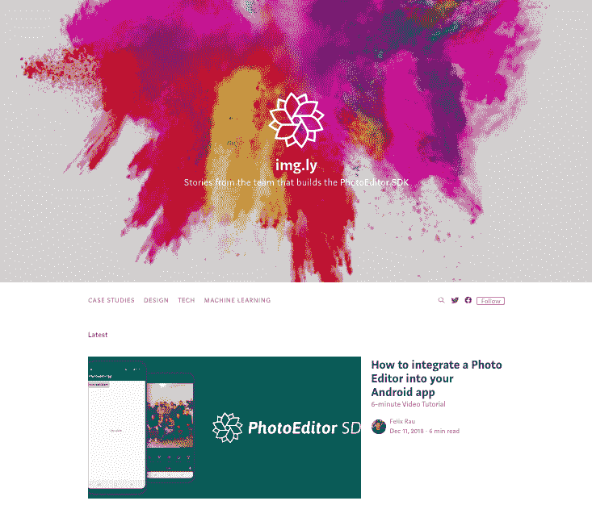

# 我们如何将一个开源项目提升到每月 12 万美元

> 原文：<https://www.indiehackers.com/interview/how-we-bootstrapped-an-open-source-project-to-120k-month-14bc230cb9>

## 你好！告诉我们关于你自己和你正在做的事情。

我叫 [Daniel Hauschildt](https://www.linkedin.com/in/danielhauschildt/) ，我是位于德国波鸿的 [img.ly](https://photoeditorsdk.com/?utm_source=indiehackers&utm_campaign=interview201904) 的首席技术官。在 img.ly 工作之前，我在学术界花了大量时间学习计算机科学，并最终获得了电子工程博士学位。这些天，我正与联合创始人 Eray Basar 合作开发 [PhotoEditor SDK](https://photoeditorsdk.com/?utm_source=indiehackers&utm_campaign=interview201904) ，这是一款完全可定制的照片编辑器，可以毫不费力地将各种照片编辑功能添加到任何应用程序中。

在撰写本文时，我们有超过 350 个客户，从初创公司到财富 100 强公司，我们每月从我们的产品和配套服务中赚取大约 120，000 美元。

 

## 是什么促使你开始使用 PhotoEditor SDK？

几年前，我们需要在不同的 web 项目中使用照片编辑功能，所以我们决定构建一个可以在所有这些项目中使用的照片编辑器。我们认为其他开发人员可能有类似的需求，因此，我们开源了第一个版本，并为编辑赢得了一些关注。

最终，一些公司开始寻求商业许可和合作，以进一步提高和扩展我们的照片编辑能力。那时，我们意识到这是一个创业的好机会。我们开始发布我们编辑器的新的改进版本，并开始与越来越多的客户签约，包括一些真正的大牌，这有助于进一步扩大我们的足迹。

## 构建最初的产品需要什么？

我们从 SDK 的网络版本开始。最终，我们开始关注 iOS 和 Android，这开启了从该机构吸引更多开发人员兼职 PhotoEditor SDK 的进程，并最终导致我们专门为其雇用员工。

我们很早就意识到，我们必须本地开发每个平台以获得最高性能，但这反过来也意味着我们不能在平台之间共享任何代码，这有时会使保持我们的 SDK 的内聚开发体验变得非常具有挑战性。但是，这也意味着我们几乎不使用外部库，并且拥有我们代码库的所有层。也就是说，渲染堆栈和所有的逻辑和算法都是为我们的目的而开发的。

那时，这个团队仍然是机构 [9elements](https://9elements.com) 的一部分，但是我们从一开始就努力确保我们自己的收入能够覆盖大部分成本。当我们意识到事情开始加速发展时，大多数利益相关者放弃了他们的部分工资，这样我们就可以将我们的每一分收入都用于建设我们的团队。除了人员，成本相对较低，因为我们的增长是有机的，没有在付费营销渠道上投入太多。我们在 [GitHub](https://github.com/imgly) 上有我们的 SDK，它给了我们大部分的流量，稍后我们创建了一个小的登陆页面来解决剩下的问题。

我们花了很多时间与我们的第一批客户交谈，以确定 SDK 的发展方向，决定客户可能缺少的功能，并为产品增加价值。

我们从 PhotoEditor SDK 的一个非常基础的版本开始，然后询问第一批用户他们会对哪些工具和功能感兴趣。这些都是非常私人的谈话，我们有了一个非常强大的想法，我们应该如何扩展 SDK，以便更多的人可以从使用它中受益。然而，重要的是，我们不仅仅是建造了他们要求的东西。如果用户向我们提出问题或建议，我们基本上是试图找出他们的使用案例，并针对该特定案例提出解决方案。幸运的是，对于我们引入的每一个新工具，我们都为我们的产品找到了额外的用例。

在我们开始开发 SDK 大约四年后，我们终于觉得它的功能已经完整了。目前，我们将大部分精力投入到改善开发者和用户体验上，因为我们希望我们的客户尽可能容易地集成我们的解决方案。

 

## 你们是如何吸引用户，壮大 PhotoEditor SDK 的？

当我们第一次发布 SDK 时，我们进行了一次无声的发布；没有人真正知道我们的存在，我们也没有做太多改变，比如向媒体报道或开展付费活动。人们在 [GitHub](https://github.com/imgly) 或通过谷歌找到我们，所以我们有一个适度但稳定的入站流。

大约两年后，在产品相当稳定后，我们决定要加大营销力度。我们修改了 PhotoEditor SDK 的每个列表，比如在 [CocoaPods](https://cocoapods.org/pods/PhotoEditorSDK) 、 [npm](https://www.npmjs.com/package/photoeditorsdk) 和 [GitHub](https://github.com/imgly) 上。特别是使用 GitHub，我们投入了大量的精力来制作 readmes，添加创意，更改命名，并为开发人员和算法优化我们的内容。此外，我们重新设计了我们的网站，并在搜索引擎优化方面投入了大量精力，研究了关键词，优化了文本和图像，你能想到的都有。

你是你想法的第一个也是唯一的传播者，所以你必须让人们相信它是值得的。如果可以，太好了。如果你不能，那也是很有价值的一课。

TweetShare

然而，我们也想做一些稍微华丽一点的事情，因此我们承诺在 [Product Hunt](https://www.producthunt.com/posts/photoeditor-sdk) 上发布 SDK。我们为这一天创建了一个完整的活动，并联系了朋友、家人和客户。我们策划了一场关于我们产品的初步讨论，并花了一整天时间挤在会议室里回答问题，试图让尽可能多的人参与进来。最后，对我们来说，这是一次相当成功的发布:我们获得了 500 多张赞成票，当天的排名介于第 3 和第 5 之间。这是一次很棒的经历，有助于建立团队精神，但尘埃落定后，我们的销售和流量并没有飙升。

在过去的一年里，除了我们的开发团队和设计团队，我们开始作为一个公司成长，并从其他领域引入了更多的技术人员。也许最重要的是，我们投资了我们的销售团队，这确实帮助我们提高了转化率和总体销售额。

在早期阶段，我们的销售团队主要由学生等兼职员工组成，由我的联合创始人的专业知识提供支持。这在一定程度上非常有效，但是，我们意识到，有一个全职销售人员可以极大地帮助协调销售团队的其他成员，简化整个流程，从而提高每月的成交率。我认为，对于一个企业家来说，了解将人力投资集中在哪里是至关重要的。我们一直在努力，所以在很长一段时间里，我们必须非常仔细地考虑将我们的时间、金钱和精力集中在哪里，才能产生最大的效益。在过去的四年里，建立我们的开发团队是我们最优先考虑的事情，现在我们正处于这样一个阶段，对设计和销售部门的投资对我们的发展至关重要。

## 你的商业模式是什么，你是如何增加收入的？

我们创建和维护 PhotoEditor SDK，并每月或每年向客户授权我们的软件。因为我们意识到不是每个客户都需要 SDK 中的每个工具，所以我们把它分成不同的模块。这使得我们的客户可以挑选并只为真正需要的东西付费。

我们选择了订阅模式，因为我们希望确保始终如一的高标准，并在产品不可避免地增长和变化时为我们的客户提供无缝体验。Web 平台、iOS 和 Android 都在不断发展，所以软件不是静态的，你也不会只集成一次代码就走开。确保您的客户不受这些变化和成长烦恼的影响非常重要，订阅模式有助于我们可靠地保持产品最新，同时还为我们提供一定程度的财务安全。我们始终保证每个平台的最大兼容性，并支持集成或更新我们的 SDK。

为我们的产品找到合适的价格是一个漫长的过程，需要大量的实验。对于软件，这可能很棘手。对我们来说，具有挑战性的部分是确定我们需要多少资金来保证产品稳定和持续更新，同时保持在合理和可承受的价格范围内。

我最终学到的是，软件定价很难预先计算——你必须找出你的解决方案对人们的价值，以及这个价格是否能持续支持一项业务。我们不得不在产品的每次迭代中处理这些数字。我们已经在一个甜蜜点休息了一段时间，在那里我们可以节约，而不会向任何人收取过高的费用。我们希望尽可能多的开发人员使用我们的解决方案，天价不会让我们如愿以偿。

| 月 | 收入 |
| --- | --- |
| 16 年 3 月 | 16861 |
| 2016 年 9 月 | 21305 |
| 17 年 3 月 | 35360 |
| 17 年 9 月 | 52692 |
| 18 年 3 月 | 67434 |
| 18 年 9 月 | 93679 |
| 19 年 3 月 | 133000 |

## 你未来的目标是什么？

我们的近期目标是通过简化安装、提供与其他框架的集成等，使 PhotoEditor SDK 更加易于访问。总的来说，我们希望尽可能地减少开发人员的麻烦。

除此之外，我们对视频和动画等相关主题非常感兴趣。但是，就像我们开始使用 PhotoEditor SDK 一样，我们希望确保我们创建的任何东西都能够帮助其他开发者构建他们的服务。

此外，两年多来，我们已经能够资助一个主要关注图像处理领域深度学习的研究部门。我们相信，专为图像分割、深度分析和图像识别而设计的算法将帮助我们简化和自动化图像编辑，从而使图像或照片编辑更容易、更容易。我们的用户体验对我们来说非常重要，它不仅包括一个构思良好的用户界面，还包括编辑体验本身。

对于那些感兴趣的人，我们在 2017 年根据我们研究团队的发现推出了一款演示应用程序 [Portrait](https://www.producthunt.com/posts/portrait-by-img-ly) 。肖像通过深度学习算法自动进行图像分割和遮罩，并创建风格化的电影海报般的肖像。

## 你面临的最大挑战和克服的障碍是什么？如果你必须重新开始，你会做什么不同的事？

就我个人而言，我面临的最大挑战之一是不能对我们一路上遇到的每一个小问题都无动于衷。事情每天都在发生——无论是在你的个人生活中还是在工作中——你必须能够在一个平衡的地方处理它们。如果你被抓到对生活中的每一件小事都做出反应，你将会处于一段充满压力的旅程中，你将会精疲力尽。

就产品而言，我希望我已经将功能分离到配套产品中，而不是将它们构建到完整的 PhotoEditor SDK 包中，这样每个产品的重点和范围就不言而喻了。正如我所说的，根据我们定义的用例，我们认为我们的 SDK 在近一年前已经是功能完整的了，但是我们屈服于开发几个额外工具的诱惑，这些工具最终并没有对我们大多数用例的产品改进有多大帮助。我不认为继续开发本身是错误的决定，但是产品和客户会从一些特性划分中受益。例如，像自动分段或风格图像识别这样的高级工具是否应该成为照片编辑器本身的一部分，或者作为一个配套产品更好地利用，这并不明显。

最后，我希望我坚持使用一个更小的工具集，并致力于完善它们，而不是添加一个又一个功能。这根本不意味着我们不会向我们的 SDK 添加更多功能，但我们会努力做到有意识，专注于构建现有功能，并确保在投入新功能之前有真正的需求。当我们不那么战略性的时候，我们开发了一些工具，我们认为这些工具将是 SDK 的一个很好的补充，并认为人们会使用它们，实现它们的价值，然后为它们支付额外的费用，但情况并不总是这样。

## 有没有发现什么特别有帮助或者有优势的？

找到合适的人对我们来说一直是最重要的。我们不会因为有空缺就雇人。即使我们不得不填补一个职位，我们也会慢慢来，仔细权衡我们的选择。作为一个小公司，找到合适的人往往归结为运气和努力的结合。一旦我们宣布了一个职位空缺，我们就没有收到数百份申请的奢侈。但我们在我们的领域有很好的关系，并帮助组织开发人员聚会和会议，这经常让我们面对一些很棒的人，我们最终可能会雇用他们或要求推荐。

如果你被抓到对生活中的每一件小事都做出反应，你将会处于一段充满压力的旅程中，你将会精疲力尽。

TweetShare

我要说的是，拥有一个小而强大的团队——人少，但真正擅长自己的工作并适合公司的人——比仅仅为了扩大团队而扩大团队要好。虽然技能是必要的，但承诺和热情也非常重要，尤其是在早期阶段。如果你有足够的热情，即使是在一个小团队里，你也可以取得很大的成就。

当你有资源，当你非常确定你雇佣的人将会产生真正的影响时，有机增长。人们似乎认为拥有大量工人就等同于高产出，但事实并非总是如此。有些事情需要时间，简单明了。再加上人越多越难组织起来。我们花了四年时间发展到 26 名员工，我们有耐心是件好事。组织结构的改变不会在一夜之间发生——事情必须不断发展，不断测试和尝试。当我们只有三个人在 PhotoEditor SDK 上工作时，我们的方法与我们当前的组织结构大相径庭，但今天我们仍然设法保持创新，重复我们的方法，并将它们融入我们管理业务的方式中。

## 对于刚刚起步的独立黑客，你有什么建议？

首先，我不相信在拥有一份朝九晚五的工作的同时，还能成功创业。最后，这是一项艰苦的工作，而且工作量很大，你必须能够在任何给定的时刻做出快速反应。

我学到的是，在开始时，你倾向于坚持你最初的想法，然后开始构建它。很容易迷失在技术细节中，而没有验证您的解决方案是否有真正的需求。我的建议是:不要建得太多。相反，想办法用最少的工作来表达你的想法。每个产品都是不同的，有时一支笔和一张纸就足够了，而其他产品需要一个工作原型。重要的是要知道你的独特卖点是什么，然后尽快想办法展示给人们。一个完美的产品几乎从来不需要提出一个想法。

一个完美的产品几乎从来不需要提出一个想法。

TweetShare

还有，多出去和人聊聊。不要担心你必须保守你的想法的秘密，因为有人可能会窃取它们。你是你想法的第一个也是唯一的传播者，所以你必须让人们相信它是值得的。如果可以，太好了。如果你不能，那也是很有价值的一课。当人们没有被你的第一次推销完全打动时，不要回避，这很正常。接受批评，用它来塑造和完善你的想法，然后再出去和别人交谈。从你认识和信任的人开始，然后慢慢扩大你的受众。当然，并不是所有的批评都是有效的或有益的，你必须确保你是在对你的目标受众说话。

同样有帮助的是倾听那些经历过类似情况，面临同样的障碍和困难，并从另一端走出来的人，无论成功与否。寻找播客和阅读书籍来获得灵感，但也要有所保留地接受所有建议。每个公司都不一样，每个创始人都不一样，每个挑战都是独一无二的。最终，你必须为自己的公司做出自己的决定。获得灵感固然很好，但也会让人分心。确保学习如何建立你的产品或业务不会取代实际建立你的产品或业务。能学多少就学多少，抽象，组合，付诸行动，找到自己的路。

 

## 我们可以去哪里了解更多？

在[photoeditorsdk.com](https://photoeditorsdk.com/?utm_source=indiehackers&utm_campaign=interview201904)参观 PhotoEditor SDK。另外，如果你想更多地了解我们的产品、技术、客户和公司，我会推荐我们的[博客](https://blog.photoeditorsdk.com)。

如果你有任何问题或想开始一段对话，请随时留下评论。我会尽我所能回答一切！

——[<picture id="ember5261116" class="user-avatar ember-view user-link__avatar"></picture>丹尼尔·豪斯蔡尔德](/DanielHauschildt?id=mXPVaWZqYRaobCaz4LP7CFoXwe72)【photo editor SDK 创始人

## 想像 PhotoEditor SDK 一样自己创业？

你应该加入[独立黑客社区](/)！🤗

我们是几千名创始人，互相帮助建立有利可图的业务和副业。来分享你正在做的事情，并从你的同事那里获得反馈。

还没准备好开始使用你的产品吗？没问题。这个社区是一个认识人、学习和实践的好地方。随意[随便浏览](/)！

—[<picture id="ember5261121" class="user-avatar ember-view user-link__avatar"></picture>考特兰艾伦](/csallen?id=ibTLPyjwVebnZjMGKvz6ztarnuV2)，独立黑客创始人

45votes