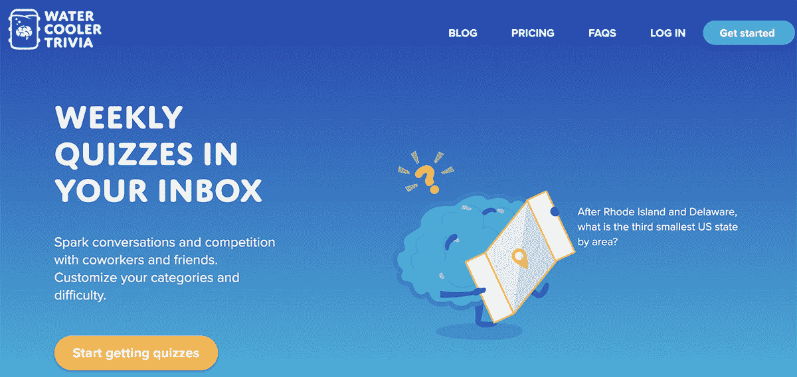
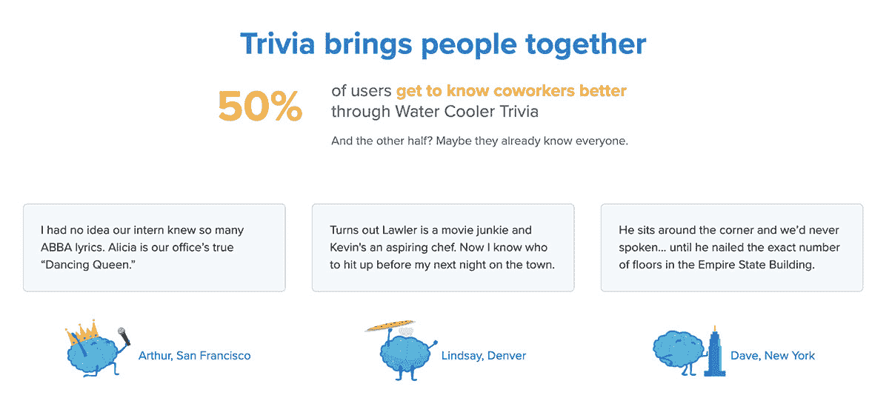
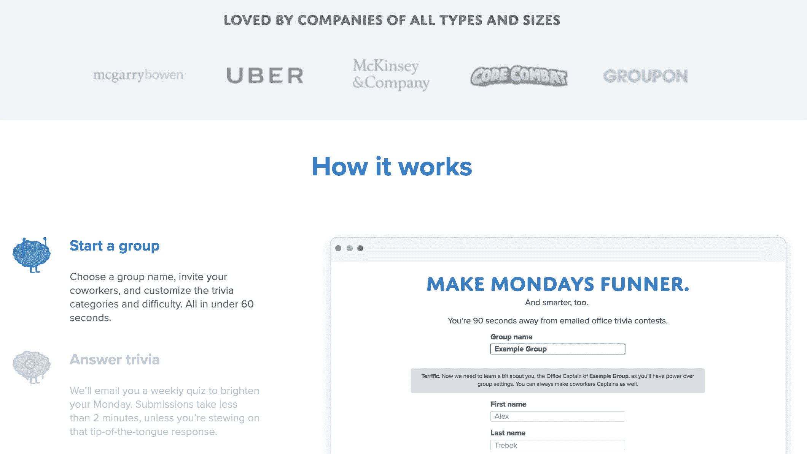

# 我们如何在全职工作的同时建立一个 1000 美元/月的激情项目

> 原文：<https://www.indiehackers.com/interview/how-we-built-a-1k-mo-passion-project-while-working-full-time-834fc7820a>

## 你好！你的背景是什么，你在做什么？

嗨！科林在这里，饮水机琐事的联合创始人。在过去的一年半时间里，我和两个密友一起建立了一个 B2B 激情项目。我们第一年的收入达到了 10，000 美元，同时还做着全职工作。

我在大学里学的是金融和经济学，做过管理顾问，现在在一家大型科技公司从事产品工作。在成长的过程中，我是一个超级网虫。我每天和我的五个兄弟姐妹一起看下午 3:30 播出的《危险边缘》节目，并在当地一家潜水酒吧主持大学里的酒吧琐事。

[饮水机琐事](http://watercoolertrivia.com/indie)包括每周通过电子邮件发送的职场琐事问答。我们的目标是激发员工之间的对话和竞争。我们希望给工作中的人们一些可以谈论的话题，以及一种不用讨论天气和周末计划的交流方式。:)

 

办公室“队长”注册并个性化类别、难度和时间安排。员工加入琐事小组，每周接受十个问题的琐事问答。我们自动评分，并在第二天发送获奖者和记分卡。还有空前的和特定类别的排行榜，所以你可以了解谁是办公室书虫，谁是卡戴珊姐妹。

我们从 2017 年秋天开始兼职做这个，2018 年 1 月做了第一笔销售。当我在 2019 年初写这篇文章时，我们的年经常性收入约为 13，000 美元，有 50 个团队为每周的琐事问答付费。

做一些你知道会迫使你不断学习的事情。

TweetShare

## 是什么促使你开始做饮水机琐事的？

当我 20 岁时，我开始了我的第一份“专业”工作(我以前修剪过草坪，也在百吉饼店工作过)。这份工作是在一家大型咨询公司实习。我比我想承认的更害怕，特别是当它涉及到与有几十年行业经验的公司合作伙伴互动时。

为了打破僵局，结识办公室里的新朋友，我决定分享我对琐事的热情。在得到人力资源团队的同意后，我收集了十个我最喜欢的琐事问题，把它们扔进谷歌表格，并在办公室里分发。

令我惊讶的是，几分钟内就有数十人提交了回复。那天晚上(以及随后的每个周一)我都呆到很晚，给每个人的回答打分，并笨拙地用 Photoshop 把我同事的脸印在奥运领奖台上。

这些测验很成功。办公室里的陌生人向每周获奖者表示祝贺，我听到周围有人窃窃私语，谈论“唯一的单身总统”或“奥斯卡史上获奖最多的电影”这让我觉得自己是团队的一员。

快进到我在一家运输技术公司的下一份工作。我又把测验发了出去。和以前一样,《琐事》大受欢迎。

我意识到琐事及其引发的对话有一些普遍性；它带来了友情，并具有酒吧琐事的吸引力，而不需要两个小时的承诺。我想把这些每周的话题带到更多的办公室。于是，饮水机琐事诞生了。

 

## 构建最初的产品需要什么？

在我考虑制作一个真正的产品的几年前，MVP 是一个谷歌形式的测验，有手工评分的回答。

2017 年 7 月，我的三个朋友同意在他们的办公室转发这个谷歌表单测试，我使用 MailChimp 发送电子邮件。在大约一个月的时间里，我继续为四家不同公司的几十个人手工批改试卷。那时，反应非常积极，我开始寻找共同创始人。

将这些测验带给更多人的完美伙伴？我的大学酒吧琐事联席主持人尼克，他就住在纽约东河对面。他的室友 Ryan 是一名软件工程师，渴望有一个新的兼职项目。

仅仅一次面对面的会面之后，我们三个人决定尽快建立并发布一个 v0。因为它主要是一个基于电子邮件的平台，我们不需要大量的设计或网络功能。

除了饮水机旁的琐事，我们三个人都在做全职工作，所以我们同意每周聚一两次，每人花大约 10 个小时在 WCT 上。

我们花了大约两个月的时间构建了第一个版本，它主要由排队的电子邮件作业和自动评分机制组成。Ryan 最近为他的日常工作建立了一个电子邮件服务，所以我们利用了他的经验。

## 你是如何吸引用户和增长饮水机琐事的？

我们三个人开始在我们的工作场所引入每周琐事问答，然后将这个阿尔法小组扩展到我们几个亲密朋友的雇主。这给了我们大约七个试点小组，帮助我们进入不断改进产品和编写问题的节奏。

一旦我们推出了一个实际的平台(不使用谷歌表单)，我们就在我们的社交档案上发帖，以获得更多关于饮水机琐事的关注。2017 年我们没有做任何其他营销。

2018 年，我们尝试了许多不同的营销渠道。以下是其中一些，按投资回报率降序排列:

*   **与朋友和家人交谈:**免费，这是我们(不可避免的)最高投资回报率的销售漏斗。我们交谈过的大多数人都有全职工作，我们经常会建议他们注册自己的琐事办公室。说服他们这样做只需要 2%到 5%的时间，但成本却是零。

*   播客广告:我们在相对小众的播客上取得了很多成功。没有很多关注琐事的播客，但当我们找到它们时，它们会为我们的产品带来非常合格的观众。一个很好的例子是[琐碎的战争](https://www.trivialwarfare.com/)。他们只有大约 5000 周的下载量，但这是一群琐事爱好者，他们在饮水机琐事上创建了几十个小组。许多人已经说服他们的办公室支付我们的产品。这里的教训是，观众越合格，结果越好。当我们扩展到推广其他不太受欢迎的播客时，尤其如此。

*   **电子邮件时事通讯广告:**我们已经在一些不同的时事通讯上投放了广告，比如丹·路易斯的“[现在我知道了](http://nowiknow.com/)”。再说一次，我们的目标是一个相当小众的受众群体，并且运气不错(尽管没有播客广告那么好)。

*   **赞助面对面的琐事活动:**我们付钱给一家全国性的酒吧琐事公司，让他们在全国各地的酒吧里喊我们，但这只吸引了两组人。当人们在一个禁止使用电话(因为害怕作弊)的琐事活动中听说我们时，他们在访问我们的网站之前有太多的滞后时间。我们在这个方法上损失了钱。

*   **有针对性的 LinkedIn 消息:**我们已经向办公室经理、人力资源总监和其他可以获得社交预算但没有成功的人发送了大量消息。冷消息很难。

*   **Growbots:** 我们试用了一个 lead-gen 软件，但没有为我们赢得任何销售，甚至没有任何热情的销售线索。令人失望，但很高兴知道，海外销售不会是我们的面包和黄油。

*   **内容营销:**我们已经写了一些博文，但是还没有能够以一种有意义的方式利用它们。我们仍然很高兴继续写更多，因为我们有一个非常有趣的数据收集。例如，用户在回答一个关于女飞行员的小问题时，用 20 种不同的方式拼写阿米莉亚·埃尔哈特的名字。

*   **社交媒体广告:**我们怀疑这仍然是我们的一个好机会，但我们没有投入时间或精力来获得回报。

我最好的建议？找到最窄的潜在受众群，并专注于这个利基市场。对我们来说，这一直是琐事式的播客，我们继续发现越来越多的类似模式的播客。

 

## 你的商业模式是什么，你是如何增加收入的？

我们最初的想法是瞄准办公室社交预算。根据我们自己的经验，我们知道这经常是一个“使用它或失去它”的消费类别。它通常也没有得到有效的利用。

从一开始，我们就根据办公室的大小设定了订阅模式，但我们仍然就何时/是否开始对我们的产品收费进行了一些讨论。

我们决定在 2017 年提供完全免费的产品(我们在 8 月推出)，然后在 2018 年 1 月开始收费。我们提供包月和包年服务，承诺一整年后有三个月免费。我们决定根据有多少参与者在玩游戏来给琐事组定价。

我们使用 Stripe 支付，并且有一些服务器和邮件开销。我们将所有剩余资金(50%以上)直接投入营销成本。

## 你未来的目标是什么？

好问题，也是我们团队想在 2019 年初直接集体回答的一个问题。我们太认真了，想出了一套 okr:

**WCT 2019 OKRs**

**1。通过持续增长验证产品的市场适应性**

*   ARR 下降时实现 0 个月
*   通过新功能和额外努力增加 1.5 万美元
*   通过新的销售渠道增加 1.5 万美元的收入，投资回收期为<12 months
*   Secure a meaningful (>(5 万美元)的合作伙伴关系

**2。用我们的产品取悦用户**

*   每季度部署一项以客户为中心的创新
*   不到 5%的流失机会显现
*   建立超级用户指导委员会

**3。释放我们的时间和精力用于发展**

*   停电频率下降
*   80%的回答都是写问题
*   更快地解决客户问题
*   与朋友和同事讨论这个想法可以激发新的功能和重要的反馈。

有没有发现什么特别有帮助或者有优势的？

TweetShare

## 我想到的三件事是每周的用户反馈，在社交场合谈论这个想法，以及设定每周的工作节奏。

**每周用户反馈:**并不适用于所有产品，但在我的工作场所使用水冷器琐事非常有帮助。这保证了我每周都能得到同事的反馈。这不是我们所有用户的代表性样本，但它是非常有帮助的定期反馈。

*   **社交思维:**我经常谈论饮水机旁的琐事，这非常有帮助，尽管我的上司可能认为(肯定认为)我谈论得太多了。与朋友和同事讨论这个想法可以激发新的功能和重要的反馈。举两个简单的例子:2017 年 7 月，我在午餐时与一位同事讨论将每周琐事问答游戏产品化的想法，当时他提出了饮水机琐事这个名字。我们从未回头。一年后，当我们准备重新设计我们的主页时，我们不知道如何找到一个负担得起的、高质量的设计师，直到一个大学朋友碰巧发短信给我，问我们是否需要任何设计工作(他正在寻找建立一个自由职业组合)。两周内我们有了一个新的主页。

*   最后但同样重要的是，我和我的联合创始人选择周一晚上作为每周面对面聚会的日子。当然，我们有几周会推到周二或周三，但有一个“默认”的晚上会让安排变得更容易，并极大地有助于重要的面对面讨论的正常节奏。

*   对于刚刚起步的独立黑客，你有什么建议？

## 我知道这很老套，但作为一名创始人，有共同创始人来抚平你的起伏是非常有帮助的。在你悲观的日子里，你的联合创始人之一会看涨；这对保持前进势头是必要的。此外，做一些你知道会迫使你不断学习的事情。有时这意味着新的语言和框架，有时意味着新的琐事事实和研究习惯。:)

我们可以去哪里了解更多？

## 请在 watercoolertrivia.com/indie[的](http://watercoolertrivia.com/indie)查看我们的延长免费试用。

有任何问题、想法或有趣的琐事吗？我们喜欢想法(和问题)。在[【电子邮件保护】](/cdn-cgi/l/email-protection)评论这篇文章或给我留言

或者在 LinkedIn 上找到团队，直接给我们发消息:[瑞安](https://www.linkedin.com/in/ryan-allen-bb40ab56/)、[科林](https://www.linkedin.com/in/cwaldoch/)、[尼克](https://www.linkedin.com/in/nicholas-jones-00770a30/)。

——[<picture id="ember8182141" class="user-avatar ember-view user-link__avatar"></picture>科林](/cowllin?id=co4RGR3gDlY3lzCPac05pADBn6B3)【饮水机琐事创始人

想像饮水机琐事一样建立自己的事业？

## 你应该加入[独立黑客社区](/)！🤗

我们是几千名创始人，互相帮助建立有利可图的业务和副业。来分享你正在做的事情，并从你的同事那里获得反馈。

还没准备好开始使用你的产品吗？没问题。这个社区是一个认识人、学习和实践的好地方。随意[随便浏览](/)！

——[<picture id="ember8182146" class="user-avatar ember-view user-link__avatar"></picture>考特兰艾伦](/csallen?id=ibTLPyjwVebnZjMGKvz6ztarnuV2)，独立黑客创始人

— [<picture id="ember8182146" class="user-avatar ember-view user-link__avatar"></picture>  Courtland Allen](/csallen?id=ibTLPyjwVebnZjMGKvz6ztarnuV2) , Indie Hackers founder

38votes