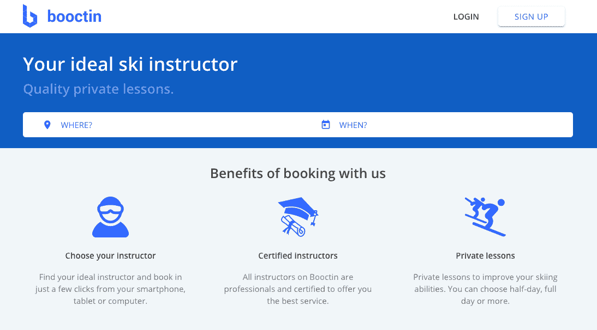
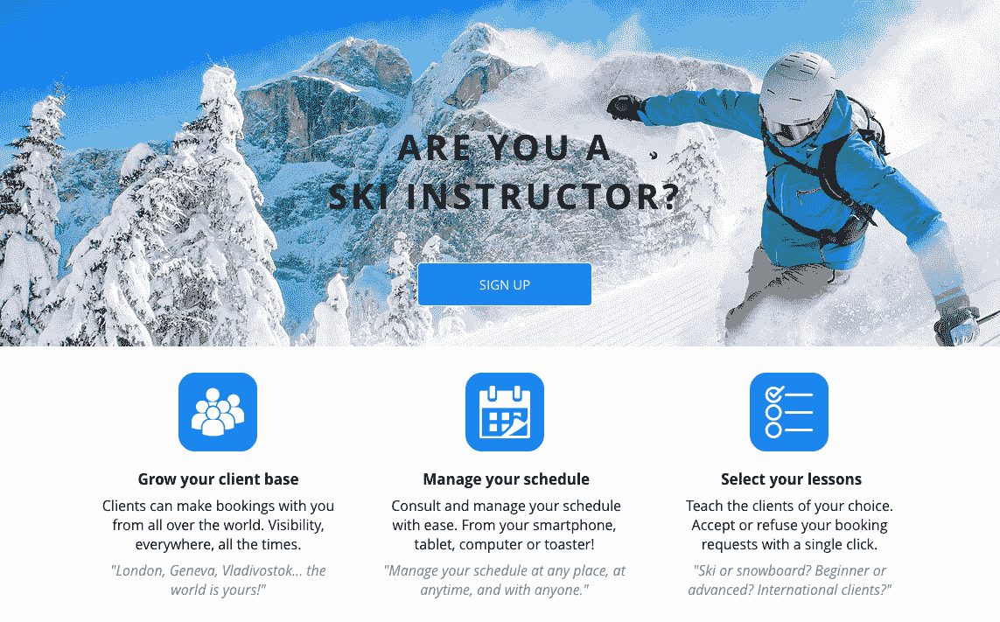

# 我们如何结合我们的技能和激情来建立一个企业

> 原文：<https://www.indiehackers.com/interview/how-we-combined-our-skills-and-passions-to-build-a-business-d4080707c0>

## 你好！你的背景是什么，你在做什么？

你好，我是瑟欧！在过去的八年里，我一直是一名软件工程师。我和一个朋友正在建立一个滑雪教练预订平台。我们在法国阿尔卑斯山出生和长大，所以我们一直在这个行业周围，并意识到它可以从一点数字化中受益。

我们以平均每月 5000€的预订量结束了上个冬季。

 

## 是什么促使你开始使用 Booctin？

2016 年，我在伦敦为一家名为 LifeWorks 的初创公司担任网络团队负责人。生活是美好的，但我觉得我花了太多时间审查代码，而不是写代码。

我在巴黎遇到了我的朋友，他向我推荐了一个滑雪教练在线预订平台的想法。作为一名教师，他亲身经历了现行制度的局限性。在客户端，几乎不可能在线选择和预订特定的讲师。你必须打电话给一所传统的滑雪学校，然后给你指派一名教练。从教练的角度来看，滑雪学校往往让人觉得太拘束，收费太高。有独立的导师，但他们更难找到客户和稳定的工作。

就这样，我的朋友休假了，我辞掉了工作，搬回了法国，开始打造 MVP。我们 7 月份开始时有一些积蓄，但不多。计划是快速行动，努力为即将到来的冬天准备好产品。

## 构建最初的产品需要什么？

当你的团队中有一个开发人员时，事情总是变得容易些:)。我们将开发和其他工作分开。我从 DNS 到 CSS(clo jure/ClojureScript < 3 的全栈)构建产品，而他处理内容、法务、收购、财务等。

从第一行代码到网站拥有我们想要的所有 MVP 功能，花了四到五个月的时间。设计相当粗糙，但我使用了 CSS 框架(物化)，所以没有太多的担心，我们有一个完全响应的 web 应用程序。

我们想要简单的东西，因为我们相信“简单是最复杂的”这就是为什么我们只将范围缩小到私人滑雪课——客户在网站上可以预订的最小单位是半天。

考虑到我们回到了父母在山里的小屋，我们在开发产品上花了很少的时间。然而，我们想筹集资金来支持我们未来的营销工作。谢天谢地，我们的一些朋友和家人认为我们的想法很简单，我们设法筹集了大约 6 万€来启动这个项目。

## 你是如何吸引用户并发展壮大的？

这是事情变得更困难的时候。

首先，我们听从了 Brian Chesky 的建议，首先找出我们平台的供应方，这意味着我们必须找到指导者。我们有独立导师的电子邮件列表(该产品主要是为他们设计的)，我们也通过我朋友的关系认识了一些人。我们认为简单地给他们发邮件，让他们注册就足够容易了。我们大错特错了。

让讲师注册这个平台变得非常困难。竞争对手同时推出，因此导师们被电话和电子邮件淹没。为了应对新的竞争，传统的滑雪学校决定禁止他们的教练在学校教学时在我们这样的平台上注册。事实证明，好的独立导师已经有很多客户，所以他们不像我们想象的那样需要我们。

在这个平台上找到导师是一件单调乏味的事情，我们的解决方案是提供一种签约奖金。我们刊登了脸书的广告，声明我们将在收到的第一笔预订款中增加 50 架€-100€。导师推荐根本没用。

在需求方面，我们非常幸运地找到了一个转换良好的渠道:谷歌搜索。以“滑雪教练+[度假胜地]”为格式的关键词搜索量似乎相当大。我们试图让网络应用程序对搜索引擎尽可能友好，但作为一个新平台与已经存在 70 年的滑雪学校竞争确实让我们的努力变得复杂。由于我们筹集了资金，我们能够为 Google Adwords 付费，这仍然是我们获取客户的主要渠道。

 

## 你的商业模式是什么，你是如何增加收入的？

我们对预订收取双倍费用(像 Airbnb 一样): 7%来自客户，3%来自讲师。我们希望讲师费用尽可能低，以吸引他们。鉴于我们的产品，我们能够从第一天开始收费。奇怪的是，我们的第一次预订是在佛罗里达州的朱庇特市进行的！我们开始用 Lemon Way 作为支付系统，因为它很便宜，而且似乎可以完成工作。大错特错。我们现在已经切换到条纹。虽然贵了点，但对我们来说还是值得的。

我们的第一个冬天是关于 MVP 测试的，我们的数字是我们认为卑微的。我们总共吸引了大约 1 万名€人(1 月 1 万名，2 月 4 万名，3 月 3 万名，4 月 2 万名)。第二个冬天稍微好一点，带来了大约 20k€总数(1 月 3k，2 月 9k，3 月 5k，4 月 3k)。这肯定不是指数增长，但我们看到了潜在的产品市场/适合度。

在创业世界里没有复制/粘贴这种东西。

TweetShare

只有一个季节的收入是一个挑战，所以我们试图扩展到其他山区活动(如登山，徒步旅行等。)但找不到与我们对滑雪平台相同的需求。我们现在将所有的努力都集中在滑雪平台上，但我们已经意识到我们需要非常精干和耐心，并有另一份工作来生存:)。

## 你未来的目标是什么？

我们的目标是实现盈利，并有望在 2020 年给自己一点回报。如果我们继续运行额外的精益运营，10 万€的目标似乎是合理的，这似乎是可行的。自己做产品开发省了不少钱。

如前所述，我们必须也确实有其他工作，所以主要的挑战将是找到时间让这个有趣的项目继续下去。

## 你面临的最大挑战和克服的障碍是什么？如果你必须重新开始，你会做什么不同的事？

我们完全弄错了教员。我们是公认的糟糕的业务开发人员，所以我们的创始团队中应该有一个销售人员。

搭建了整个山地活动平台却发现市场不够大，也有点打击。我们认为我们可以很容易地复制并转移到其他户外活动中，但事情从来没有这么简单。创业世界里没有复制/粘贴这种东西:d。

## 有没有发现什么特别有帮助或者有优势的？

作为负责构建产品的人，我需要非常专注。阅读[深度工作:在分心的世界里专注成功的规则](http://a.co/d/2uEATGY)帮助我找到了一个高效的日常工作。

## 对于刚刚起步的独立黑客，你有什么建议？

如果你正在开发一个技术产品，确保你的团队中有一个技术人员。这会帮你省下很多钱和压力。此外，请记住，市场是艰难的，因为你有两倍的工作量。你最好为此做好准备。

最重要的是，努力享受旅程；).

## 我们可以去哪里了解更多？

在推特上打我 [@teawaterwire](https://twitter.com/teawaterwire) 。还有一堆文章(法语，不好意思！)上我们的[中型](https://medium.com/booctin)。

—[<picture id="ember8046355" class="user-avatar ember-view user-link__avatar"></picture>泰奥菲尔·维拉德](/teawaterwire?id=M1WEl3K2jIQPmh0wLAuqcspwAQs1)，Booctin 创始人

## 想像 Booctin 一样建立自己的事业？

你应该加入[独立黑客社区](/)！🤗

我们是几千名创始人，互相帮助建立有利可图的业务和副业。来分享你正在做的事情，并从你的同事那里获得反馈。

还没准备好开始使用你的产品吗？没问题。这个社区是一个认识人、学习和实践的好地方。随意[随便浏览](/)！

——[<picture id="ember8046360" class="user-avatar ember-view user-link__avatar"></picture>考特兰艾伦](/csallen?id=ibTLPyjwVebnZjMGKvz6ztarnuV2)，独立黑客创始人

32votes