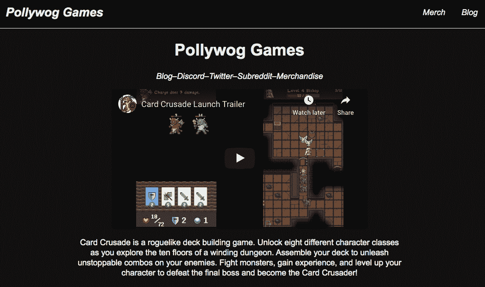
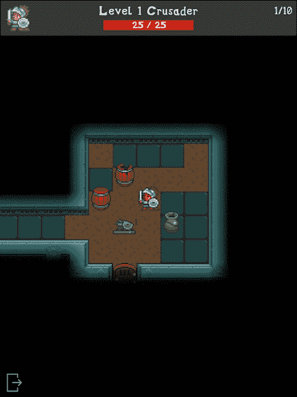
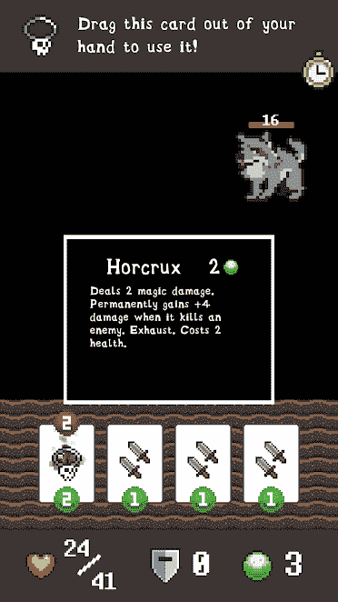

# 我们如何创造一个有利可图的游戏，只是为了证明我们可以

> 原文：<https://www.indiehackers.com/interview/how-we-created-a-profitable-game-just-to-prove-that-we-could-dbd661ee04>

## 你的背景是什么，你在做什么？

我叫林肯，是一名来自犹他州的程序员。我最近从杨百翰大学获得了计算机科学学位。我从 12 岁就开始编程，在那之前很久就开始玩游戏，所以制作游戏对我来说是一种自然的吸引。高中时，我因在物理课上用 TI-84+图形计算器制作和分发游戏而出名。

大约两年半前，我和我哥哥简决定做一个真实的游戏，并发布给我们所有的朋友玩。经过许多许多小时的计划和审议，我们决定制作一款手机游戏，它将结合我们最喜欢的两个游戏:[杀死尖塔](https://www.megacrit.com/)和[像素地牢](http://pixeldungeon.watabou.ru/)。这将是一个罗格似的甲板建设者所谓的卡十字军。简和我当时在同一家公司工作，所以我们会花很长时间午休，计划我们的游戏。

快进到今天，我们的游戏已经上市一年半了，在其生命周期中净赚了 10，000 多美元。在开发费用和 app store 削减后，今天看起来更像是 6000 美元。现在我们正在开发一些新的游戏，这笔钱让我们可以购买一些新的资产，并为我们目前的项目支付自由职业者。

## 是什么促使你开始玩《卡十字军》？

简和我从记事起就一直玩电子游戏，所以我们做一些我们都喜欢的东西是有意义的。我也一直想创业，制作游戏似乎是一个简单的方法。

我们想出了我们的特定游戏，卡十字军东征的想法，通过把我们最喜欢的游戏混合在一起，想象最终的结果可能会是什么样子。最终，我们制作了一个早期的原型来验证这个想法，它在 Reddit 上的 r/gamedev 上获得了很多支持，所以我们觉得足够好来继续构建它。随着开发的继续，我们继续在 Reddit 上发帖，并对每个对我们的帖子发表评论的人进行单独跟进。

有了这个想法后的三个月内，我们创建了一个早期的 alpha 版本，并分发给我们的追随者。在我们的测试开发阶段，我们有一个相对活跃的 Discord 服务器，我们用来与玩家交流并获得反馈。这也有助于我们在工作和上学的同时保持继续制作游戏的动力。

## 构建最初的产品需要什么？

当我们决定做这个项目的时候，我们都很忙——Jan 有一份全职工作，我有一份兼职工作和一份全职的学校课程。我们也没有预算，因为我们不知道手机游戏通常能赚多少钱。但是我们真的很想做，所以我们在晚上和周末找时间去做。

开发时间表大概是这样的:

*   决定制作一款游戏(2017 年 1 月)
*   想出了一个主意(2017 年 3 月)
*   创建初始原型并在线发布演示(2017 年 4 月)
*   分布式早期 alpha 版本(2017 年 5 月)
*   根据用户反馈每月发布测试版(2017 年 6 月至 11 月)
*   在两个应用商店都发布了早期访问版本(2017 年 12 月)
*   开发了新功能、错误修复和改进(2018 年 1 月-2018 年 2 月)
*   提前获取并在在线评论网站上推广(2018 年 3 月)
*   包含新内容的发布后更新(2018 年 5 月)
*   包含新内容的第二次发布后更新(2018 年 9 月)

## 你的技术是什么？

游戏本身是用 [Unity](https://unity.com/) 编写的，因为我们不想为每个平台编写单独的游戏版本。主要存储高分的服务器用 [Python](https://www.python.org/) 编写，有 [Flask](https://palletsprojects.com/p/flask/) 框架，还有一个 [SQLite](https://www.sqlite.org/index.html) 后端，运行在 [OVH 虚拟私有服务器](https://us.ovhcloud.com)上。

我们选择这些技术是因为它们足以满足我们的低扩展需求，易于部署，并且是我们熟悉的技术。

## 你为什么选择你的游戏平台？

我们选择开发一款手机游戏，因为它对我们的朋友来说是最容易上手的。在我看来，如果你只看像迪士尼这样的大工作室在做什么，手机游戏可能有点像一片荒地。这些工作室的每一款游戏都像是《部落冲突》、《皇家冲突》或《糖果粉碎》的翻版。另一方面，电脑游戏非常丰富，而且有很多很棒的游戏可以花钱玩。这感觉(现在仍然感觉)像是一个未开发的机会，将 PC 游戏的质量和趣味性带到了手机上。

你不需要每天花超过一个小时来构思你的想法。

TweetShare

另外，作为非艺术家，有更少的屏幕空间需要设计，我们可以用更简单的精灵:)

## 你是如何吸引用户和发展卡十字军的？

除了朋友和家人，我们最初吸引用户的主要方式是通过 Reddit 我们会发一个帖子，分享我们游戏中一些很酷的东西，然后单独给每个留下评论的人发消息，询问他们是否想成为 beta 测试者。

我们也做了很大的公关努力，当我们从早期访问中出来，并在 [Touch Arcade](https://toucharcade.com/2019/03/07/card-crusade-review) 、 [Pocket Gamer](https://www.pocketgamer.com/articles/080010/card-crusade-review/) 和其他一些知名评论网站上获得正面评论时。尤其是 Touch Arcade 对我们来说非常重要，占我们总收入的一半(大约。5000 美元)来自那些评论出来之后的 2019 年 3 月。

我们试验了脸书和 Reddit 的广告，但对于广告活动带来的用户销售的小幅提升来说，它们太贵了。你可以在我们的[博客](https://pollywog.games/facebook-ads/)上阅读我们脸书广告活动的细节，包括我们花了多少钱，卖了多少台。

我很虔诚地向我在 Twitter 上看到的任何询问游戏推荐的人推荐《卡十字军》,尤其是当他们询问类似于《流星陨落》、《卡爬》、《梦幻任务》、《杀死尖塔》等游戏时。

一些用户告诉我们，他们在 App Store 的“你可能喜欢的游戏”部分找到了我们的游戏，我相信这是每个用户的个人行为，并基于他们的购买历史。遗憾的是，我们从未收到任何来自 App Store 的直接促销。我相信头版促销至少会让我们的收入翻 5 倍。

## 还有哪些游戏启发了你的游戏？

很多游戏表面上看起来像卡十字军，但我们的灵感主要来自杀死塔尖和像素地牢。

我们在最初的应用商店列表中列出了我们的特定影响，但苹果告诉我们不能在应用描述中使用商标名称！

## 你的商业模式是什么，你是如何增加收入的？

我们有意选择了最简单的盈利模式:一次性付费下载游戏。游戏中不会出现任何应用内购买或广告。

这主要是因为易于实现。

## 为什么游戏胜过另一个行业？

据我所知，视频游戏是所有商业模式中门槛最低的(除了柠檬水摊)。你可以在 Unity 中快速制作一些东西，并在几分钟内将其列在游戏商店中。尤其是如果你像我们一样选择溢价定价模式。这样你就不必去想如何在应用购买中设置广告、订阅或其他任何东西。只需设置一个前期成本和连接您的银行账户。

最终，我们的工作量增加了一点，因为我们想成立一个有限责任公司，并建立一个单独的商业银行账户，但这些都不是开始的必要条件。我猜 app store 上的大多数独立游戏开发者都是独资经营者。

也就是说，作为我们开始创业的第一次尝试，选择一些容易的东西是有意义的，这样我们就可以为自己的成功做准备。游戏是一个艰难的行业，因为市场已经极度饱和，但我们的目标不是放弃我们的日常工作，只是想在网上赚点小钱，玩得开心。

## 你所受的教育在游戏创作中起到了怎样的作用？

简和我都只是普通的计算机程序员。我的学位是计算机科学，他的是计算机工程。我们都是日常工作的软件工程师，都没有任何图形方面的技术背景。这导致我们主要制作 2D/街机风格的游戏。

3D 图形管道对我来说非常有趣，但也非常令人生畏。对 3D 建模、索具、动画、渲染等一窍不通。所以我们的游戏简单而平淡(不幸的是，艺术通常有点乏味。)

## 你未来的目标是什么？

现在我们已经完成了卡牌远征的工作，Jan 和我正在开发新的游戏项目，将于今年晚些时候发布。

我正在开发一款类似 Jackbox Games 的休闲多人游戏，Jan 正在开发一款名为 Barnard's Star 的多人回合制策略游戏。想想星际争霸遇上象棋，你就有了巴纳德之星。

## 你面临的最大挑战和克服的障碍是什么？

到目前为止，最大的挑战是:a)首先找到完成项目的动机和时间 b)让人们下载游戏并尝试一下

我们克服了这些困难，主要靠的是毅力和一点小聪明，尽管我仍在想办法推广这个游戏，让更多的人看到它。

我不认为我会做任何不同的事情。这个项目的目标仅仅是得到一些东西，证明我可以开始和经营一个简单的企业，并从中获得乐趣，我们实现了这些目标！

## 有没有发现什么特别有帮助或者有优势的？

如今，网上有成千上万的游戏开发者资源。特别是，我被其他程序员的故事所激励，他们正在做与我们类似的事情。

我们不知道如何使用 Unity，所以我们非常感谢这个平台的无数在线教程和文档。

TweetShare

以下是一些网站和文章，它们在早期激励了我，并帮助我明白了应该期待什么:

*   阿米尔·拉詹辞职并让这款病毒游戏成为一间黑屋子的传奇故事

*   斯洛特沃克斯在 Medium 上的[博客中，他列举了他的项目的收入数字和开发时间表](https://medium.com/@slothwerks)

*   TiNYTOUCHTALES 的 Arnold Rauers 以制作小型高端游戏为生

*   瑞恩·克拉克的演讲，“如何持续制作盈利的独立游戏”，以及他在 YouTube 上的“Clark Tank”系列

*   杰克·伯基特，[“如何在 Gamedev 十一年不被击中的情况下生存”](https://www.youtube.com/watch?v=JmwbYl6f11c)

*   杰夫·沃格尔的[《失败归失败:蜘蛛网软件之路》](https://www.youtube.com/watch?v=stxVBJem3Rs)

在开始 Card Crusade 之前，我们都不知道如何使用 Unity，所以我们非常感谢这个平台的无数在线教程和文档。

我也经常访问 r/gamedev，阅读每一个帖子，并向其他有类似经历的开发者提问。除了互联网上的东西，我还去了一个游戏开发 meetup IRL，但结果是浪费了很多时间。

## 你崇拜哪些游戏开发商？

Slothwerks 和 TiNYTOUCHTALES 是我的两个榜样，因为他们正在做我正在做的事情，但要成功得多。

斯洛沃克斯在他的游戏《陨落》中赚了大约 10 万美元，阿诺德·劳厄斯(TiNYTOUCHTALES)在他的游戏《爬牌》、《奇迹商人》和其他游戏中取得了令人难以置信的成功。他们都写了很多博客，并在 Twitter 上谈论他们的游戏，在我们制作《卡片远征》时，他们给了我们很大的帮助。

## 你倾向于玩什么类型的游戏？

我在争吵大厅、核王座和杀戮塔尖的时间最多。Jan 在《英雄联盟》和《空心骑士》中的时间最多。除了英雄联盟，我们几乎只玩独立游戏。简可能会比我玩更多的 AAA 游戏。我只是觉得独立游戏最有趣，最独特(更不用说，最容易买得起)！

## 对于刚刚起步的独立黑客，你有什么建议？

你总能找到时间去做你真正想做的事情！当人们说他们“太忙”时，这几乎总是一个借口。你不需要每天花超过一个小时来构思你的想法。大多数人每天至少花一个小时在社交媒体或看电视上。

## 我们可以去哪里了解更多？

与我们交流并了解我们工作的最好方式是加入我们的 [Discord 服务器](https://discord.gg/h5C5wEx)。

我们在 Twitter 上也很活跃，有两个账号:[Pollywog Games](https://twitter.com/gamespollywog)[Barnard 的 Star(我们新的多人回合制策略游戏)](https://twitter.com/barnardsgame)

我们也很乐意回答下面的问题！

——[<picture id="ember5287553" class="user-avatar ember-view user-link__avatar"></picture>chalcidfly](/chalcidfly?id=EDzgy5AQDIU0ThWyS34MN7uOhnI3)，卡十字军的创始人

## 想像卡十字军一样建立自己的事业？

你应该加入独立黑客社区！🤗

我们是几千名创始人，互相帮助建立有利可图的业务和副业。来分享你正在做的事情，并从你的同事那里获得反馈。

还没准备好开始使用你的产品吗？没问题。这个社区是一个认识人、学习和实践的好地方。随意[随便浏览](/)！

——[<picture id="ember5287558" class="user-avatar ember-view user-link__avatar"></picture>柯特兰艾伦](/csallen?id=ibTLPyjwVebnZjMGKvz6ztarnuV2)，独立黑客创始人

19votes