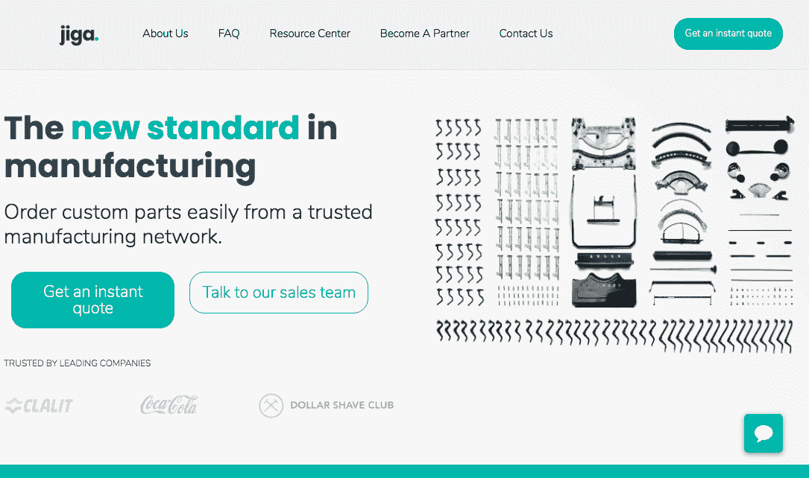
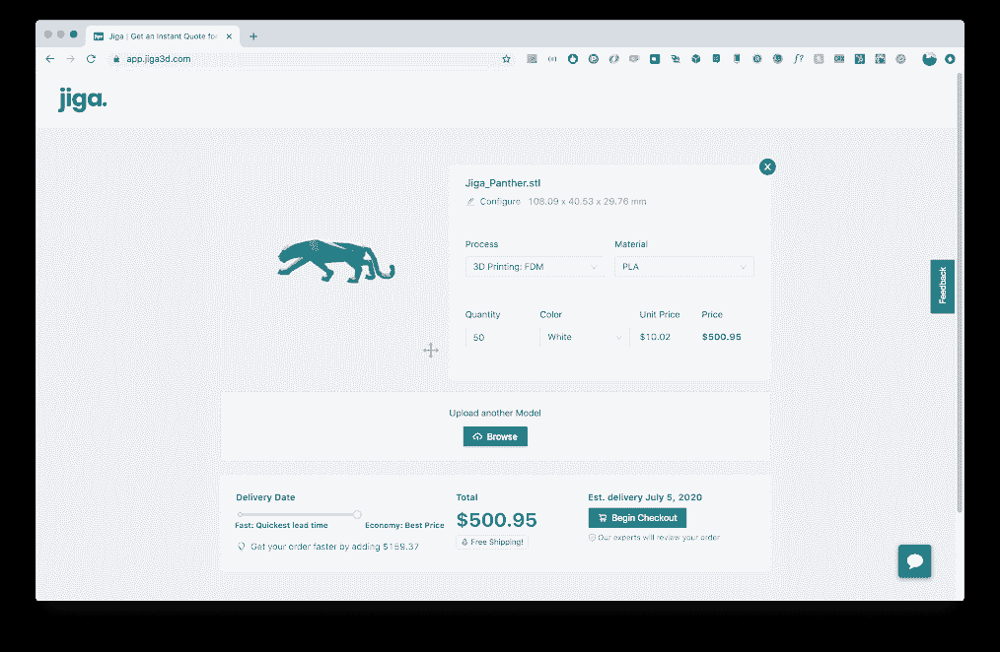
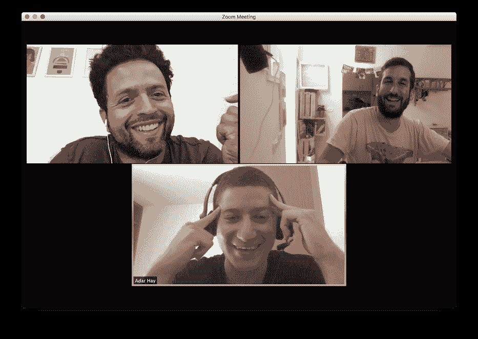

# 我们如何在一个非常特殊的领域中发现盈利能力

> 原文：<https://www.indiehackers.com/interview/how-we-found-profitability-in-an-ultra-specific-niche-d10b0dd604>

## 你好！你的背景是什么，你在做什么？

嘿！我叫约纳坦。我是一名全栈开发者，也是一名互联网企业家。在我意识到我最擅长的是开创事物之前，我作为一名开发人员和团队领导为很多科技公司工作过。

自 3 月以来，我一直在和我的两位联合创始人([阿萨夫](https://www.linkedin.com/in/assaf-geuz-73a43827/?originalSubdomain=il)和[阿达](https://www.linkedin.com/in/adarhay/))一起工作，创建一家名为 [Jiga](https://jiga3d.com) 的闪亮新公司。我们帮助 3D 打印、计算机数控(CNC)加工和钣金客户与值得信赖的制造商建立联系，同时消除沟通摩擦。

我们开发了一个非常酷的定价算法，可以在几秒钟内计算出打印和/或加工 3D 模型的价格。仅这一点就帮助许多消费者获得即时报价，并比较不同的制造商、技术和材料。由于我的联合创始人在这一领域的经验，我们在世界各地也有广泛的 3D 打印和数控加工制造商网络。

今天，我们每个月从大约 10 个订单中赚到大约 100 美元的 3K·MRR。我们有一些回头客，这是对我们来说最重要的指标。

## 是什么促使你开始使用 Jiga？

我的联合创始人之前在以色列管理几家 3D 打印公司，当时他想到了一个完全不同的创业想法。当他在研究另一个创业想法时，人们不停地给他打电话，问他是否知道哪里可以打印或制造他们的 3D 模型。他大概打了 10 到 15 次这样的电话，才明白这可以扩展成一项业务。

为了验证这一点，阿萨夫和阿达尔买下了域名[jiga3.com](https://jiga3d.com)，并添加了一个简单的表单，带有上传 3D 模型的选项，上面写着:“制造 3D 模型的即时报价。”当然，这都是手动的。阿萨夫在幕后回复电子邮件给任何上传模型和报价的人。在我看来，这是一个辉煌的初步产品验证。

在这一点上，我加入了团队，建立了平台和背后的算法，所以我们可以扩大我们的业务。

我们让真正的制造商加入系统，他们向我们提供他们的定价模型，我们对其进行调整，这样我们的系统就可以根据制造商的规格输出快速报价。如今，在我们的 web 应用程序上请求的每个报价都会触发对数十家制造商的查询，以找到最适合客户的报价(在价格、质量或交付时间方面)。

## 构建最初的产品需要什么？

我们在最初的 MVP 上工作了大约一个半月，从那时起，我们开始试运行，以不断验证我们的假设，并从用户那里获得反馈。我们从用户和客户那里获得了许多非常有价值的反馈，这使我们进入了另一个阶段，专注于修复我们的基础设施并做出新的假设。

我们都是第二次创业，这可能有助于我们在轻松有趣的氛围中工作，同时仍然快速工作，专注于相关的功能和任务。

如果你不花时间和精力去做点什么，你的想法一文不值。

TweetShare

对我们有重大影响的一件事是疫情疫情。这让我们呆在家里，专注于开发我们的产品，而不是去海滩。(当你住的地方离海滩只有五分钟的步行路程时，那是一个真正的诱惑，相信我！)

## 你的技术是什么？

我们用 [React/Next 构建应用程序。JS](https://reactjs.org/) ，当你可以在像 [Vercel](https://vercel.com/) 这样的静态网站平台上提供服务时，它可以节省大量的服务器成本。

我们的后端大部分是用 [NodeJS](https://nodejs.org/en/) 编写的，还有一些用 Python 编写的花哨的 3D 相关模块。对于数据库，我们在 S3 上有 [MongoDB](https://www.mongodb.com/) 和一堆被严重操纵的[JSON](https://www.json.org/json-en.html)。

我们的一些后端服务是在 [Render](https://render.com/) 上提供的，在我看来，这是 Heroku 友好、廉价、简单的版本。

## 你们是如何吸引用户，让 Jiga 成长起来的？

目前，我们主要集中在陌生电话和电子邮件，以验证和完善我们的产品。因为我们每月接的订单很少，所以我们学习和改进每一个订单的方法是很重要的。

对我们来说，另一个巨大的增长领域是社区创建。我们正在建立一个机械工程师社区，这个领域目前在以色列正在迅速发展。

虽然我们有一些搜索引擎优化技巧！我们有很多可以重点关注的关键词，你可以在我们的[网站](https://www.jiga3d.com/resource-center/)上看到，很多都是非常小众的，这在 SEO 上是有帮助的。

## 你的商业模式是什么，你是如何增加收入的？

目前，我们的商业模式是从通过该平台的每个订单中获取利润。这种利润确实因订单的范围和类型而异。

例如，我们宁愿不接真正的大订单，因为我们还没有现金来投保。当我们看到一个大订单进来时，我们会注意细节，然后把剩下的交给我们信任的制造商。这样我们就能为下一步建立更好的关系。

## 你未来的目标是什么？

我们的下一个重大里程碑是达到 2 万美元的 MRR，这样我们就可以离开我们的咨询业务，给自己支付微薄的薪水。我们的长期目标是成为按需制造领域的顶级在线平台。

在前进的每一步中，我们都看到这个市场是如何低效的，并可以使用我们的软件来改善全球数万名工程师和采购经理的工作，同时为数千家值得信赖的 CNC 加工、3D 打印和钣金制造商提供和组织工作。

我们希望处于这样一个位置，当世界各地的工程师想要为原型生产定制零件或计划大型机器时，他们会考虑 Jiga。例如，想想那些需要非常敏捷地进行生产的医疗设备初创公司。他们可以通过可信的在线平台即时订购定制零件，而不是手动为供应商采购、出错、协商和比较价格。

## 你面临的最大挑战和克服的障碍是什么？

我们面临的最大挑战之一是最初接触潜在客户，因为这是一个相当特殊的领域。然后我们需要让他们相信我们会实现目标。我们必须设法破解它。

在这些情况下，拥有领域专业知识会有所帮助。一旦你认识了这个领域的人，你就有了第一批可以交谈的潜在客户，你可以在早期得到很多反馈。

我们必须面对的另一个主要挑战是构建算法，以考虑许多我们并不总是知道的重要专业因素。为此，我们得到了在我们平台上注册的制造商的帮助。我认为理解我们独特的 USP 并加倍努力采用是我们应该关注的事情。当我们失去对回头客等关键指标的关注时，我们总是会后悔。

## 有没有发现什么特别有帮助或者有优势的？

有一件事我想提一下。作为一家在疫情期间起步的早期创业公司，我们注意到，说服人们尝试新事物和改变旧习惯对我们来说更容易。这对创业公司的成功至关重要，我不确定这对每个人都是显而易见的。

这尤其影响了我们，因为我们领域的几乎所有东西，从 3D 打印到 CNC 加工，再到钣金，都与供应链有关。我们希望在人们对创新更加开放的时候，我们能获得更多的关注。

另一个强大的是我们身边的人。我们交谈过的人都很好，在我们刚开始的时候都愿意帮忙。他们在完善我们的想法方面帮了我们很多！没有他们的反馈，我们就无法像以前那样前进。

## 对于刚刚起步的独立黑客，你有什么建议？

去他妈的做吧。每隔一天，我都会看到*want repreneurs*谈论他们的想法，但实际上什么也没做。如果你不花时间和精力去做点什么，你的想法一文不值。

做一些大的事情，但是要一步一步来，并且总是验证你做的每一个动作。

TweetShare

我看到人们经常犯的一个常见错误是试图从一开始就用大量的假设和没有适当的验证来创建大的东西。你知道最好的验证指标是什么吗？利润和回头客。

【T2

如果你能赚到哪怕一点点钱，让人们足够开心，他们会再来，即使是从一个非常简单的交易中。你手里有东西。现在去称一下。做一些大的事情，但是要一步一步来，并且总是验证你做的每一个动作。

## 我们可以去哪里了解更多？

你可以查看我们在 jiag3d.com 的网站，请关注我们在独立黑客和 LinkedIn 的进展。我们经常透明地分享我们的进步。

欢迎在此发表评论或亲自联系我们，我们非常乐意回答您的任何问题。尤其是那些与创业相关的——创业、早期营销和早期产品开发。

显然，如果你知道有兴趣了解 Jiga 的机械工程师或制造商，请告诉我们！

——[<picture id="ember5250155" class="user-avatar ember-view user-link__avatar"></picture>约纳丹·沃洛维斯基](/grmmph?id=7dKtSKT8NFNQ7pogd24pdL5bahq2)，吉加创始人

## 想像 Jiga 一样建立自己的事业？

你应该加入独立黑客社区！🤗

我们是几千名创始人，互相帮助建立有利可图的业务和副业。来分享你正在做的事情，并从你的同事那里获得反馈。

还没准备好开始使用你的产品吗？没问题。这个社区是一个认识人、学习和实践的好地方。随意[随便浏览](/)！

——[<picture id="ember5250160" class="user-avatar ember-view user-link__avatar"></picture>考特兰艾伦](/csallen?id=ibTLPyjwVebnZjMGKvz6ztarnuV2)，独立黑客创始人

20votes