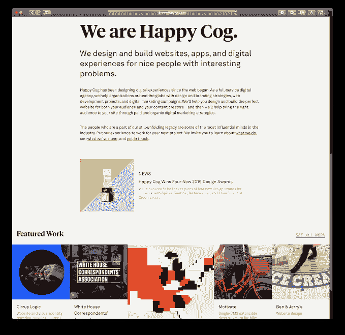
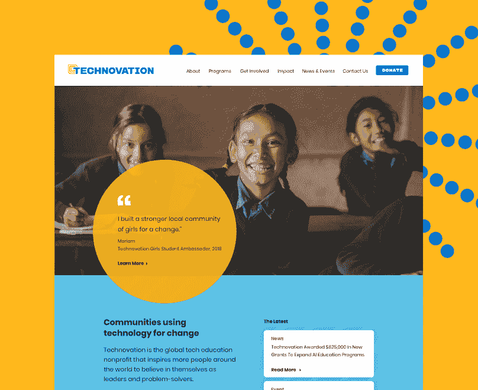
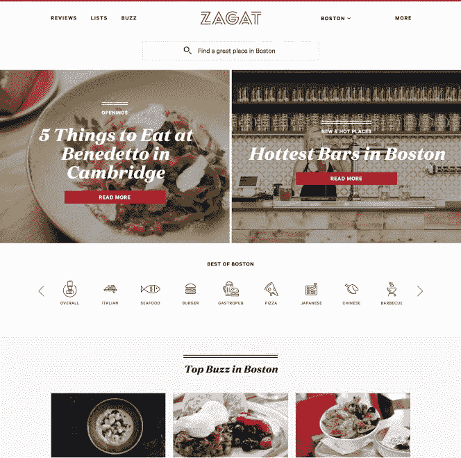
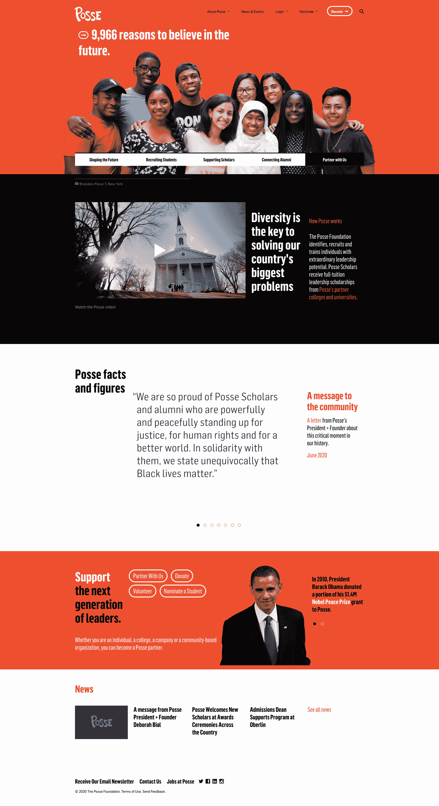

# 我们是如何将高中生涯发展成终身职业的

> 原文：<https://www.indiehackers.com/interview/how-we-grew-our-high-school-hustle-into-a-lifelong-career-1436fbde90>

## 你好！你的背景和工作是什么？

我叫 Matt，我在一家名为 Happy Cog 的交互式全方位服务数字机构工作。

我和一个朋友在高中时创立了这家公司，所以到目前为止，我已经做了大约 20 年了。我在纽约的长岛长大，在 NYU 上大学，多年来晚上和周末都在这家公司工作。

## 是什么促使你开始写《快乐齿轮》？

我的联合创始人[李·戈德堡](https://www.indiehackers.com/happycog)和我非常亲密。我们一起长大，从小学起就是朋友。

我们都非常喜欢电脑，在高中和初中的时候，我们有一个小生意，只是修理人们的电脑，只是个人，非常小的规模。这是在 90 年代末到 21 世纪初，在此期间，互联网开始成为小企业的一个更重要的东西。我们开始为企业提供电脑维修工作，而不仅仅是个人。我们的客户经常会问我们关于网站的问题，你知道，他们需要网站吗？网站是如何运作的？

再说一遍，这要追溯到 20 多年前。当时并不是每个小企业都想要一个网站。但我们是 IT 人员，所以我们成了他们询问的主要对象。面对大量的问题，我们意识到这将成为一件大事。

我已经对计算机编程很感兴趣了；我一直在家里学习 basic 和其他一些早期语言。我们决定对网站和编程做更多的事情感兴趣。我的意思是，很快变得很明显，网络是未来，计算机维修对我们来说不那么有趣了。

我想在某些时候，我们会说，你知道，我们真的必须探索这个问题，并试图了解我们可以提供什么服务。也许这是一个赚钱的好方法！再说一次，我们当时还在上高中，我们当时不一定想做什么大事。只是我们怎样才能赚些钱，做些有趣的事。

我对技术方面非常感兴趣。他对营销方面很感兴趣，所以做得很好。我当时学了 HTML 和 JavaScript。那时候它甚至还不是真正的 CSS。更像是桌子之类的东西。他真的学到了非常非常早期的网络营销策略。一旦我们做了第一个或第二个，就很容易进去展示给其他人看，因为当时很少有人做那种工作。所以我们知道我们有一些东西，所以我们停止了电脑维修和网络维修，这是我们的业务中心，只是专注于这一点。

## 你花了多长时间从开始到一个可行的业务？

我们花了几个月到一年左右的时间来理解我们在卖什么以及如何定价。我记得很清楚，我们都是高中生，所以我们现在可能不认为是很多钱的东西在当时对我们来说就是很多钱了。我们当时对一个网站收费几百美元。

我记得我们的一个客户让我们去找他的律师。我们坐在律师大厅里，感觉真好。所以我和李看着对方，好像在说，“我们得提高价格了。”所以我们说，“我们为什么不用一个可笑的数字进去呢？”

所以我们选择了 2000 美元，我们说，*是一个荒谬的数字。他们会说不，我们会协商到 1000，这对我们来说仍然是一个惊人的价格。当他们给我们回电时，客户说，那你怎么定价呢？我们说，嗯，2000 美元。我记得很清楚，他说，“好吧，我们开始吧。”*

 *我们就像，好吧，这是我们的模型！

## 从那时起，你是如何吸引用户的，你是如何发展快乐齿轮的？

有一点我想提一下，就是我们刚成立公司的时候。我们称自己为 *Vector* 和 *Vector Media Group* 是我们经营多年的名字。大约三年前，我们收购了另一家名为 *Happy Cog* 的公司，我们决定更名。所以现在整个公司都很开心。

回到我们开始的时候，我们是两个高中生。正如我所说的，我们上了大学，都在大学期间，晚上和周末工作，甚至可能在那之后，你知道，在课堂上工作。大学毕业后，我们都找到了不同的全职工作。但是我们仍然在这个晚上工作，我们自己的公司，晚上和周末。

我们不断地建立网站和营销网站。然后在某个时候我们说，*哇*，这是一个 *lot* 。即使在白天，我们也花了很多时间专注于此。所以是时候辞掉我们的工作，真正去做这件事了。

一开始，我不想这么说，但是我们为客户做了很多免费的工作。我们比应该做的要努力得多。我们想给每一个客户留下深刻印象，因为我们知道，我们的客户越多，他们就会告诉他们的朋友越多。我们的投资组合越大，就越容易获得更多的项目。我们希望在我们的网站上添加标识，在我们的投资组合中添加项目，让每个人都真正开心。我知道这听起来简单明了，但这是事实。

我们做的另一件事是尝试在会议上发言。例如，我在一次会议上谈到了电子商务和将电子商务集成到特定的内容管理系统中。这是 10 年前，11 年前，或者更久。你知道，接下来，我们得到了大量的线索，因为你获得了权威，人们会立即把你视为这个主题的专家，这是你需要解决的问题。因此，这是我们写文章、在会议上发言、展示我们是特定主题专家的策略的一大部分。

那大概是九到十年前的事了。现在我们是一个大约 70 人的公司。我们从第一天开始就盈利了。我们从未进行过任何外部债务投资，诸如此类；我们是完全自举的。我们在曼哈顿和费城各有一个办公室。在过去的七年里，我们一直在[Inc . 5000](https://www.inc.com/inc5000/2019/top-private-companies-2019-inc5000.html)增长最快的公司名单中。所以它肯定比两个高中生成长了很多。

## 你会如何描述你的商业模式？除了律师事务所里的高球人，你是如何增加收入的？

我们有三个收入级别。

一个是发展；你可以称之为编程或工程。这就是所有的编码，构建一个网站，构建一个内部应用程序，构建一个移动应用程序，创建集成，无论是什么都可以制作网站。这是我们收入的最大部分——根据月份的不同，大约占我们收入的 60%到 65%。就员工而言，它也是我们最大的部门。

我们还有数字营销部门。比如搜索引擎优化、点击付费广告、付费搜索、付费社交分析、咨询、转化率优化等等。这是我们收入的第二大部分。我们第二多的人！

然后我们有我们的设计和品牌和 UX 服务。从 UX 咨询，到网站整体设计，到品牌和标志，到应用程序设计，以及这之间的一切。

我们的许多客户雇佣我们做这三件事，但是我们的许多客户会雇佣我们做一两件事。老实说，我们的商业模式是为客户提供比我们收费更多的价值。所以，最后，如果我们要求他们投资我们，我们要求他们和我们一起花你的钱，我们希望向他们展示，这对他们来说是正的投资回报，他们给我们的每一块钱，他们都会拿出来。不管是直接的，因为我们在为他们做广告，还是只是做一个网站，帮助他们转化更多，或者更好地解决他们的业务问题。随着时间的推移，我们通过帮助更大更复杂的项目而成长。

如果你让你的客户高兴，那么他们会告诉他们的朋友关于你的事情，因为他们在他们的朋友眼里看起来很好，他们内在看起来也很好，你真的帮助他们从你的工作中赚钱。

TweetShare

如今，如果你在寻找一个两三页的超基础网站，我认为有很好的服务，比如 Squarespace 或 WordPress。但那不是我们的型号。这些天来，我们的平均项目将在六七位数的范围内开始。因此，我试图做得更多，我试图在我们可能有特殊能力解决的更复杂的领域提供更多价值，专注于特定的技术，我们只是试图让我们的客户满意。说实话。

如果你让你的客户高兴，那么他们会告诉他们的朋友关于你的事情，因为他们在他们的朋友眼里看起来很好，他们内在看起来也很好，你真的帮助他们从你的工作中赚钱。

## 你未来的目标是什么？你认为在实现这些目标的道路上有什么主要的障碍吗？

有趣的是，我们现在在和新冠肺炎谈话，对吗？而不是十周前还是什么？

我想我现在就开始我们在企业界的目标。老实说，我们最大的目标就是维持我们的团队。这种经济环境的一个特点是，我们客户的广告和营销预算通常甚至包括网站之类的东西。这些通常是最先被砍掉的。所以我们必须非常小心。我们仍然试图向我们的客户展示价值，因为我们认为我们仍然可以为他们做很多事情。另一方面，你知道，我们所看到的是许多行业向电子商务的巨大转变。

我们知道，在此之前已经有了向电子商务的巨大转变，但有些行业对电子商务不太感兴趣，或者进展缓慢，或者正在加速。因此，我们也想找到在这方面提供价值的方法，并努力帮助我们的客户实现长期目标。我们的目标是继续尝试做更大的项目，提供更多的价值。

如我所说，我们已经连续几年跻身 Inc. 5,000。我肯定想继续这样做，但我们肯定不会沉迷于收入本身。我们痴迷于收入，因为它帮助我们做我们想做的工作，帮助我们让员工开心，让我们善待他们。因此，我们将其排序为:客户快乐，然后是员工快乐，*然后是*利润。因此，这些将继续是我们的目标。

## 到目前为止，你面临的最大挑战和克服的障碍是什么？

我们已经喝了几杯了！

走进一个人的房子，做一些技术支持，帮助他们弄清楚如何使用他们的电脑是一回事。走进一家企业，说你将帮助他们建立整个内部服务器文件存储系统，这是另一回事。当我们开始时，说服潜在客户信任我们并不容易。我们是两个 16 岁的书呆子走进他们的办公室。所以我们试图通过成为专家来解决这个问题。

然后是大学和大学毕业后的工作。知道何时放弃我们的安全工作并全职做这件事是一件很有挑战性的事情。老实说，我认为我们做得有点太晚了。我是说，一切都解决了，现在很好。但是我们可以早一点做出决定。回过头来看，我们并不需要如此紧张，但我理解我们为什么会紧张。

当然，我们在招聘方面也犯了一些错误。我认为每个人都会犯一些招聘错误。任何时候你不得不让某人离开，即使这是他们的错，最终作为经理或老板，这是你的错。你不应该雇用那个人，或者你应该在雇佣他们方面做得更好。

最后，很难想象网页设计和网页开发市场的底部有多快脱离了代理商的圈子，流向了 Squarespace、Wix、Weebly 和 GoDaddy 等公司。因为包括我们在内的许多机构，他们过去做一个有联系表格的网页网站，收费几千美元，过得很好。你可以有一个非常简单的 CMS，这很好。但是现在做那种事越来越难了。因此，我们不得不大力转向更大、更复杂的项目，这是一个好的举措。回过头来看，这是一个非常好的决定，对我们来说肯定更好。但在那个时候，我认为这是非常困难的导航，并确保我们没有犯错误。

## 有没有发现什么特别有帮助或者有优势的？

绝对是书。我对商业书籍不感兴趣。我知道他们中的许多人都很棒，但我对他们中的许多人使用的华丽语言没有太多的耐心。我只想把这些课程浓缩成 20 分钟的快速概述。也就是说，很多年前我读过一本名为[获得肯定](https://www.penguinrandomhouse.com/books/324551/getting-to-yes-by-roger-fisher-and-william-ury/)的书，这是一本非常非常经典的谈判书籍。你知道，它谈论了很多关于*谈判*，以及有一个谈判协议的最佳替代方案，这被称为 *BATNA* ，就像是离开谈判，每个人都尽可能高兴。这对我影响很大。

克里斯·沃斯还有一本很棒的书，叫做[永远不要分割差异](https://info.blackswanltd.com/never-split-the-difference)，也很有趣。他有一些关于谈判的有趣的东西，对我帮助很大。我们希望确保我们与客户合作，确保客户得到他们需要的东西，并从我们帮助他们实现目标中获得价值。但归根结底，我们必须拥有一项业务，我们必须确保我们能够实现盈利和提供价值的业务目标。

我努力做好的一件事就是信守承诺。

TweetShare

我也一直喜欢阅读独立黑客网站！看到不同的人如何开始、经营和思考他们自己的事业总是令人鼓舞的。所以这总是好的。

就习惯而言，我最擅长的事情之一就是信守承诺。我知道这听起来很荒谬，但如果我说我要跟某人联系，我会记下来，然后跟他们联系。如果我说我要给某人一些东西，我就会去做。再说一次，这听起来很荒谬，但过去我们赢得了太多的机会，只是因为我们做了后续工作，我们证明了我们是可以依赖的。

在一天结束的时候，你要求你的客户信任你，把他们的大量资金和政治资本放在他们的企业里。所以他们想知道你是否可靠。同样，这听起来很明显，但我觉得没有多少人这样做。

我们非常幸运。我们对创业很感兴趣，因为互联网正在为小企业腾飞。所以这对我们来说也是一个很好的时机。老实说，我认为这跟运气有很大关系。

## 对刚起步的独立黑客有什么建议？

第一就是我刚才说的:靠谱。说你要做一件事，然后去做。如果有人给你发电子邮件，告诉你一些机会，那就跟进。时间是所有交易的敌人。

我觉得你应该明白自己擅长什么，不擅长什么。你经常听到这样的话。你总是从独立黑客上的人那里读到这一点，这是真的，如果你不擅长某件事，你会花很多机会成本去做它。如果有一个更便宜的方法来完成它，或者有人更擅长这个特定的任务，这意味着委派某些任务或者委派某些责任。做到这一点非常重要。

此外，我们过去从雇佣聪明人中受益匪浅。所以我们肯定可以雇佣有一定技能的人。但在过去的许多案例中，我们采访过非常非常聪明、有明确目标、知道自己在做什么的人，我们不确定他们是否适合，但我们知道我们需要和他们一起工作，而且总是能成功。所以我总是想雇佣 A 级的人。他们总能找到方法为你的组织做出贡献，让你的客户更开心。

## 我们可以去哪里了解更多？

你可以在我们的[网站](https://www.happycog.com)、[我们的行业博客](https://cognition.happycog.com)和[推特](https://twitter.com/happycog)了解更多信息。

你也可以通过我的[邮箱](matt@happycog.com)联系我，或者通过我的 [twitter](https://twitter.com/mrw) 关注我。

欢迎在下面的评论中提出任何问题！

——[<picture id="ember5263754" class="user-avatar ember-view user-link__avatar"></picture>马特温伯格](/MattWeinberg?id=ziRcN3SGYzRFvJkxBNRMxTr4SFK2)，联合创始人:快乐齿轮

## 想像快乐齿轮一样建立自己的事业吗？

你应该加入[独立黑客社区](/)！🤗

我们是几千名创始人，互相帮助建立有利可图的业务和副业。来分享你正在做的事情，并从你的同事那里获得反馈。

还没准备好开始使用你的产品吗？没问题。这个社区是一个认识人、学习和实践的好地方。随意[随便浏览](/)！

——[<picture id="ember5263759" class="user-avatar ember-view user-link__avatar"></picture>考特兰艾伦](/csallen?id=ibTLPyjwVebnZjMGKvz6ztarnuV2)，独立黑客创始人

25votes*