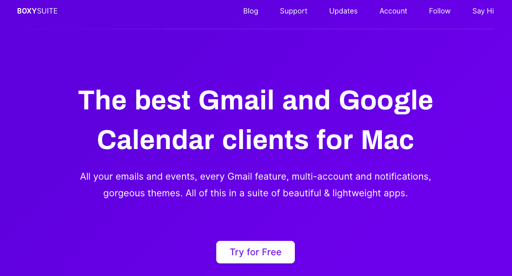
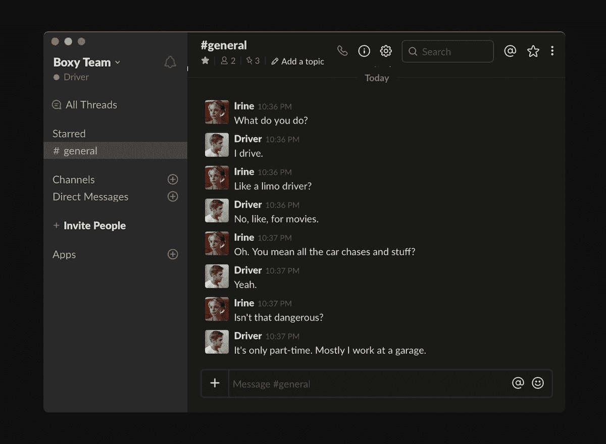
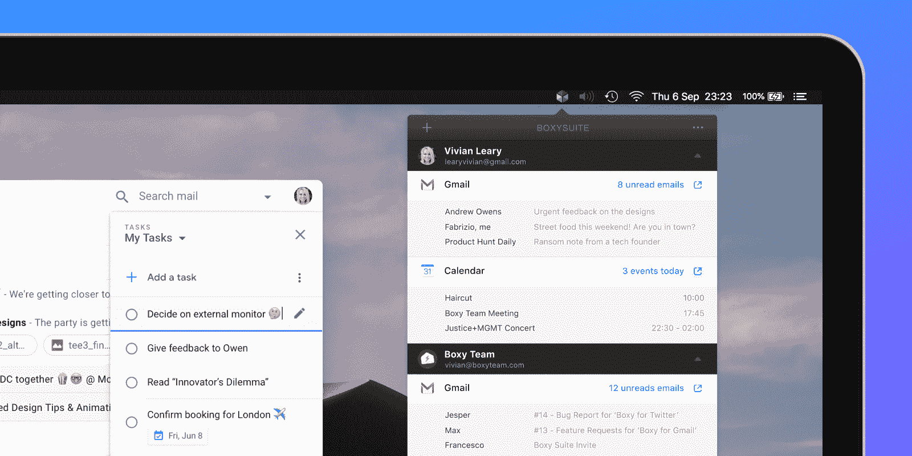
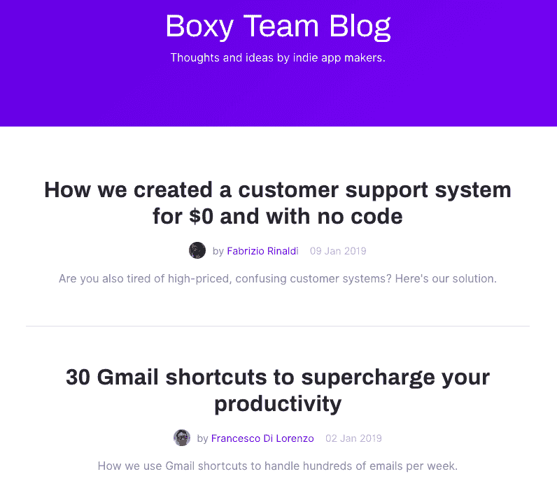

# 我们如何发展到$6K MRR，同时保持我们的健康和理智

> 原文：<https://www.indiehackers.com/interview/how-we-grew-to-6k-mrr-while-maintaining-our-health-and-sanity-d2506857ab>

## 你好！你的背景是什么，你在做什么？

嗨，我是法布里齐奥·里纳尔迪，28 岁，来自意大利的设计师和(慢慢成为)前端开发人员。我也是电影制作人，但那是另一个时代的另一个故事了。我与弗朗切斯科·迪·洛伦佐(Francesco Di Lorenzo)共同创建了一个四四方方的套件(T1 ),这位 26 岁的超级熟练的开发人员让我们的项目真正发挥作用，而不仅仅是在 Figma 中看起来很好。我们都很兴奋能接受独立黑客的采访！

弗朗西斯科和我是多年前在 Twitter 上认识的，但在我 2015 年在 Dribbble 上向[发布了一个展示 Gmail Mac 应用收件箱外观的模型后，我们开始合作。弗朗西斯科给了我一个非常粗糙的原型，只是为了好玩，但我喜欢这个想法，我们开始建造它。这就是最初的](https://dribbble.com/shots/2254468-Inbox-for-Mac-mockup)[盒子](https://boxyapp.co)如何变成一个小小的 Mac 应用程序，最终在 Mac 应用程序商店、Setapp 和直销之间赚取了超过 10 万美元的总收入。Boxy 与其他“包装器”的不同之处在于对设计和修饰的关注，这让它感觉像一个原生客户端，并让许多用户多年来一直使用它。

实际上，在推出 Boxy 整整一年后，我们见过面。弗朗西斯科当时在米兰生活和学习，他被一家很有前途的科技初创公司聘为软件工程师，几个月后我也以产品设计师的身份加入了这家公司。我很快开始设计公司所有应用程序的用户界面，我们看到公司从 30 名员工发展到 80 多名，成为世界上最顶尖的 iOS 开发者之一。这是一次有趣而疯狂的旅程；我个人从拍摄一些很酷的点滴照片到设计像 [30 天健身](https://itunes.apple.com/cv/app/30-day-fitness-challenge/id1099771240?mt=8)这样的应用程序，下载了数百万次，并在全球苹果商店展示。

当我们开始着手我们最雄心勃勃的副业项目时，事情发生了变化: [Boxy Suite](https://www.boxysuite.com) 。它被认为是 Gmail 和谷歌日历的瑞士军刀，是基于我们对 Boxy 的体验为这些服务开发的一套高级 Mac 客户端。我们在 2018 年初开始建造，同年 10 月推出。

 

在建造 Boxy Suite 的同时，我们仍然全职工作，我们慢慢接受了我们的创业态度，并意识到我们多么喜欢完全拥有我们所建造的东西，我们对全职从事这项工作越来越有信心。因此，在 2018 年末，经过多次讨论，我们决定辞去工作，全职从事 [Boxy Suite](https://www.boxysuite.com) 。

辞职是我们一生中最可怕的决定，尤其是在意大利的经济形势下。我们甚至拒绝了一位天使投资者的小额但有趣的提议，因为我们致力于将四四方方的 Suite 推向盈利，我们更愿意保持独立，用我们自己的力量来建造它。这将是艰难的，但我们真的致力于这项事业，并为此感到兴奋。

我们对事情的进展非常满意:我们有 700 多名付费用户，我们的平均 MRR 为 6k 美元(根据我们的年度订阅费计算)，我们的发布非常成功，在前 30 天获得了 15k 美元的总收入。

 

## 是什么促使你开始使用 Boxy Suite？

让我们满意的一个关键因素是意识到许多最初的 Boxy 用户绝对喜欢我们的产品。对我们来说，这是一个充满激情的项目，我们不认为除了维护应用程序之外，我们还能做什么。在对 Skype 上的一些选定用户进行采访后，我们意识到，通过将我们在 Boxy 上学到的所有东西应用到 Gmail 和 Google Calendar 上，有一个获得更多受众的巨大机会。

因此，我们决定为世界上最流行的电子邮件和日历服务构建单一用途、漂亮而强大的客户端。接受挑战。

我们在时间上相当幸运，因为 2018 年 Gmail 进行了一次很好的(但有争议的)重新设计，然后谷歌悲伤地宣布收件箱被 Gmail 淘汰。所以我们有成千上万的客户想要寻找新的东西，Gmail 的重新设计帮助我们为他们创造了一个漂亮的客户端。

我们为那些经常查看 Gmail 和谷歌日历，并可能在这些服务上运营业务的人制作了这个。他们中的许多人只是使用浏览器，这是一个不集中的环境，他们被无数的干扰轰炸；其他人使用与 Gmail 和谷歌日历无关的本地客户端，如果你喜欢这些服务，这是一个很大的转变。有其他应用程序包装了这些服务，但它们看起来像超级收费的浏览器，而我们正试图用[的四四方方的套件](https://www.boxysuite.com)做出一些不同的东西，让 Gmail 和 Calendar 感觉和行为像一流的 macOS 公民。

我们准备像往常一样推出产品搜索，但这一次我们也专注于转变我们最初的活跃用户群——仍然超过 7k MAU——所以我们调查了大约 1000 名活跃用户，以告知我们的路线图，并对市场规模和产品适合度进行粗略估计。

关于定价，我们从销售 6 美元的单个应用程序(旧的盒子)到销售 49 美元/年或一次性 149 美元的生产力套件。当然，我们不知道我们会得到什么样的反应，也不知道定价是否正确，但我们对压倒性的积极反应感到惊讶。这向我们展示了四四方方的套件真的可以作为一门生意，也让我们对全职工作的决定更有信心。

## 构建最初的产品需要什么？你面临的最大挑战和克服的障碍是什么？

自从我们在 2015 年底开始制作《盒子》以来，弗朗西斯科和我实际上从未停止过兼职项目。其中有[sb black](https://www.sblack.online/)，一个轻量级的 Slack 客户端，具有黑暗模式，在短短几周内被下载了超过 10k 次。

即使是在做一个小产品的时候，也要考虑长远。

TweetShare

我们开始把制作[四四方方的套房](https://www.boxysuite.com)作为一个兼职项目，在晚上和周末工作，在这个过程中几乎筋疲力尽——我不建议这么做，因为你的健康比任何项目都重要。你很容易觉得自己可以 150%地投入工作，而生活的其他方面仍然很好，但正如我亲身体会到的那样，我们都需要对工作和生活有一个专注和全面的态度。我认为“工作/生活平衡”的概念非常狭隘和模糊，无助于在这些问题上取得进展。

在此期间，我们遇到了一些挑战。最初，我们努力保持专注于正确的任务，同时保持一个现实的发布日期。因此，我们最终多次决定发布日期，每次都推迟几个月。我们知道了“激情计划”并不意味着“让我们想做什么就做什么，当我们想要的时候；现在，我们试图首先关注高层次的任务，对我们的决策更加务实，经常组织和优先安排待办事项，并投资于正确的工具来优化我们的工作流程。作为独立制作人，我们倾向于不花在工具和“后台”上，但是如果你每个月花 100 或 200 美元在合适的工具上，你就解放了时间和精力去完成任务，这是非常宝贵的。

在技术方面，我们一直以不使用电子为荣，这是一项伟大的技术，但也有众所周知的缺陷。相反，我们选择创建和发展我们自己的技术体系，这是基于本地 macOS 网络技术的。这就是为什么我们的应用程序体积如此之小，而且感觉比基于电子/Chrome 的包装器性能更好。

作为这方面的一个极端例子，我们上面提到的 Slack 客户端[sb black](https://sblack.online)仅仅花了几天时间就制作出来了，很多人更喜欢它而不是 Slack 的官方客户端，而且不仅仅是因为我们增加了一个黑暗模式。举例来说，在我们的应用程序中滚动有很好的惯性感和弹跳效果，这是你使用基于 Chrome 的解决方案时所没有的。

 

当然，这种方法有其自身的挑战。Chrome 似乎是新的互联网浏览器，许多大玩家，显然是最前沿的谷歌，都在为 Chrome 大量优化他们的应用程序，所以我们基于 Safari 的包装器引发了一些 Safari 特有的问题，我们必须以黑客的方式解决。

我们面临的另一个挑战是让人们相信这些应用程序不仅仅是“包装器”，而是它们实际上让你更有效率，并且在构建这种软件的背后有很多努力。仅仅是为了设计 web 应用程序的风格，使它们更简洁、反应更灵敏、对 macOS 更友好，我们写了*数千*行代码。幸运的是，对于每一个认为[四四方方的套房](https://www.boxysuite.com)不值这个价格的游客来说，有更多的人理解它的价值并喜欢这个产品。这是我们在推出 Boxy Suite 后不久收到的一条早期采用者的消息，这真的让我们觉得我们找到了一些东西:“我只想说你不知道这让我有多高兴——当 Inbox 停止使用时，我很难过，因为 Boxy 是我很长时间以来使用电子邮件的最佳体验。我非常高兴你已经发布了 Boxy Suite，并且已经爱上它了！”

## 在这个过程中，有哪些工具对你有所帮助？

如果我必须选择一个从一开始就帮助我们并且从未让我们失望的工具，那就是[收纳盒纸](https://www.dropbox.com/paper)。我正在纸上写这篇文章，我们的路线图在这里，我们的任务在这里，文档，想法，你能想到的。不过，我们在其他地方保留了一些东西；例如，[概念](https://www.notion.so/)有非常好的 Markdown 导出功能，所以我们用它来写一些博客文章，但是 Paper 仍然是我们的 todo 和文档中心。他们最近甚至引入了时间线功能，因此对制作者和小团队来说更好。

另一个可能不是你所期望的“工具”是[电报](https://telegram.org/)。当我们在最初的 Boxy 上工作时，我们大多使用 Slack，这可能很麻烦而且很慢。我们接触 Telegram 时，只有一个“四四方方的团队”小组，我们在那里写“工作”，在直接聊天中保持个人对话。然后，我们添加了一个“Boxy Team Stats”组，在那里我们接收关于我们希望保持监控的关键事件的通知:销售、订阅、我们网站上的每日访客、每日订阅数。我们甚至收到了用户在退订 Boxy Suite 时写给我们的消息，这令人惊讶地感受到了产品方面的情况。不过，一个改变游戏规则的东西是最近才加入的:“盒子团队提交。”这是我们在报告上做的实时提交流，包括快速跳转的链接，甚至可以从移动设备上对提交本身进行评论。这使得我们在保持异步的同时更加高效，我们甚至不需要告诉对方我们是否正在工作，因为在大多数情况下这是不言而喻的。

最后，我想提几个我们真的离不开的工具: [AirTable](https://airtable.com/) 和 [Zapier](https://zapier.com/app/home) 。我将它们放在一起是因为它们完美地集成在一起，它们让我们自动化并优化了工作流程的许多方面。我们的客户支持 100%依靠这些工具。门票在 AirTable 表单上提交，甚至预先填充了来自应用程序的数据，Zapier 从 AirTable 轮询新门票，并向我们发送精美的电子邮件(通过 [avatars.io](https://www.avatars.io/) 找到用户头像)，原始用户电子邮件作为“回复”地址。它很便宜，而且非常好用[(我们最近写了关于它的文章)](https://www.boxysuite.com/blog/free-customer-support)。

荣誉奖:我差点忘了把 [Figma](http://figma.com) 加到名单里，但那是因为我现在只是觉得理所当然。这是一个完美的设计工具，快速和协作的设计，我想不出有什么更好的小，远程团队。也就是说，我最近经常使用 [Framer](http://framer.com) ，作为一个现代设计工具，它确实令人印象深刻，模糊了设计和开发环境之间的界限。

 

## 你是如何吸引用户并开发出 Boxy Suite 的？

我仍然记得在 2015 年底首次推出 Boxy on Product Hunt 时，我们对一切都感到困惑。那时，我们有一个不断增长的电子邮件列表，上面有几千个对 Boxy 感兴趣的人，我们最终在产品搜索和[难以置信](http://www.theverge.com/2015/12/19/10624388/boxy-desktop-mac-app-for-gmail-inbox) [新闻](http://thenextweb.com/apps/2015/12/09/boxy-is-a-google-inbox-desktop-app-for-mac-that-doesnt-suck/) [报道](http://lifehacker.com/boxy-brings-inbox-by-gmail-to-the-mac-desktop-1747090438)上获得了 [1400+的投票。](https://www.producthunt.com/posts/boxy-3)

在最初推出后的几年里，我们的用户群增长了很多，现在我们向拥有近 2 万订户的时事通讯发送产品更新。这份邮件列表是推出和发展 Boxy 套件的重要资产。

有这么多平庸的产品推出...我相信用户*能够*分辨出产品背后的努力和用心。

TweetShare

即使这一次我们在产品搜索上没有获得很多支持票，PH 也为我们的网站带来了 1 万名观众，并肯定帮助我们在头 30 天赚到了 1.5 万美元，没有营销，很少自制 SEO，基本上没有新闻报道。对我们来说，这意味着一件事:产品起作用了，许多人从中发现了价值。没有比人们购买你的产品更好的验证了。

事后看来，在这个产品上投入了这么多之后，没有更多地关注媒体报道是一个错误。我们行动得太晚了(在离发布日期很近的时候发邮件),也没有对记者进行足够的跟进。一些好的文章会帮助产品接触到更多的人，网站在谷歌上排名更快。

另一方面，sb black[在产品搜索](https://www.producthunt.com/posts/sblack-2)上获得了很多关注，它为 Boxy Suite 带来了很多流量。这证实了我们的想法，即小而有趣的项目仍然是为你的主要产品带来流量的好方法。

## 你的商业模式是什么，你是如何增加收入的？

我还记得 2015 年我们推出最初的 Boxy 的第二天。我们醒来时，iTunes Connect 上报道的销售额是 1.2 万美元，这让我们大吃一惊。从那以后，我们的其他产品从一开始就收费，通过直接销售给客户来赚钱。

有了四四方方的套件，我们实现了从一次性付费到订阅的重要转变，现在看来时机已经成熟。客户越来越习惯于订阅，反响很好。另一方面，我们认为，对于客户来说，订阅是不可扩展的，在某些时候，有必要找到某种折衷方案。用户不可能真的为他们想要的所有应用支付几十元的订阅费。例如，Setapp 对 Mac 用户来说是一个很好的解决方案，所以市场已经在发展，我们将密切关注这些变化。

我们赚的钱 100%来自[四四方方的套房](https://www.boxysuite.com)销售。我们从一个 49 美元/年的计划开始，然后我们增加了一个 149 美元的终身许可证，这在黑色星期五期间取得了巨大的成功，当时两个计划都打折 30%。我们现在要添加团队许可选项，因为我们也收到了许多请求(令人兴奋！).

像往常产品发布一样，我们看到了一个巨大的收入高峰——第一个月的总收入为 1.5 万美元——然后销售额下降，稳定在 6 千美元 MRR 左右。我们真的很高兴选择 [Paddle](https://paddle.com/) 作为经销商:他们在准备我们的结账和准备成功推出 [Boxy Suite](https://www.boxysuite.com) 时帮了我们很大的忙。他们仍然支持我们，为我们提供有用的资源来改善我们的盈利战略。

我们很幸运有相当小的成本。能够用负担得起的工具来运营一家初创公司是很棒的；这让我们可以在不太担心成本上升的情况下扩大产品规模，这很神奇。这里有个要点:

*   我们通过[亚马逊 S3](https://aws.amazon.com/s3) 提供下载和应用程序更新，这要花费我们大约 10 美元/m
*   我们在 Heroku[上运行我们的服务器，并为数据库和电子邮件发送添加了附件——总的来说，我们的花费大约是 50 美元/米](https://www.heroku.com)
*   另一个必不可少的工具是 Zapier，我们用它来自动化客户支持、会计和其他小任务——它的价格是 20 美元/m
*   我们在数字海洋上也有几台服务器——一台用来托管我们用来发送时事通讯的邮件列车，另一台用来支持老式的盒子版本——价格大约是 10 美元/米
*   我们正在尝试一点脸书广告和类似的增长策略，所以每隔一个月有 40-50 美元的一次性付款

## 你未来的目标是什么？

我们的目标是达到$10k MRR。我们更喜欢保持简单，并且有一个清晰、简单的目标。这不是一个虚荣心指标，而是一个我们认为能够代表盈利能力和内心平静的数字。

我们如何努力达到这个目标？在这个过程中有两个基本的部分:改进产品，我们终于有足够的时间去做，以及寻找新的客户，这是更加关键和复杂的。

即使全球有超过 10 亿的 Gmail 用户，接触到合适的受众也不是小事。我们有强大的竞争对手，说实话，在营销和增长方面，我们绝对是新手。幸运的是，我们的努力开始得到回报，在谷歌上，像“Mac 版 Gmail”或“Mac 版最佳 Gmail 客户端”这样的关键搜索中， [Boxy Suite](https://www.boxysuite.com) 正在(非常)缓慢上升，它越靠前越好。然而，我们并没有把一切都押在有机流量上，所以我们正在努力建立一些伟大的合作伙伴关系、赞助、高质量的新闻报道，并通过不同的渠道吸引用户，比如[我们的博客](https://www.boxysuite.com/blog)。

 

有趣的是，我们发现添加功能并让人们对此感到兴奋是吸引新客户的好方法。我们正在开发一些令人惊叹的功能，这些功能将使我们在竞争中脱颖而出，并使 Boxy Suite 成为必备产品，而不是好东西。

另一个目标更有哲理性，也更与生活相关，那就是我们想工作只是因为我们想工作，并留出充足的时间放松、探索和个人成长。当我们有时间追求不同的想法、研究、休假并且没有工作压力时，我们是最有效率的。例如，我们最近开始了为期 1 或 2 周的“冲刺”工作，但“冲刺”这个词并不是字面上的意思:它的意思是，直到我们解决了一个高层次或大规模的任务(如修改我们的账户管理系统)，我们不会被其他事情分心，它将是我们的主要焦点，直到它完成。这并不意味着如果我不在这项任务上工作八小时，我就不会有成就感。这意味着我知道该把注意力放在哪里。

在冲刺阶段，我们通常会在一天当中说“我现在要去跑步，我稍后再工作”，通常我们会采取一种非常放松的方式来工作，这总是异步优先。这种方法的一个副作用是，与我在公司工作时相比，我现在感觉更加专注和投入。

## 对于刚刚起步的独立黑客，你有什么建议？

我觉得我们还有很多东西要学，所以我没有资格给任何人提建议，但回顾过去，我们发现了一些值得分享的事情。

我想到的一条建议是专注于产品，不要盲目采用如今许多人认可的“直接发货”的方法。有这么多平庸的产品推出，以超越“足够好”的产品质量为目标已经让你在竞争中脱颖而出。我相信用户*能够*分辨出产品背后的努力和用心。几个月前在 Product Hunt 上推出的许多很酷的产品现在都死了，这个事实很能说明问题。具有讽刺意味的是，我只是想，“嘿，我应该做一个产品搜索墓地或什么的”，所以我检查了一下，当然这个确切的东西是在产品搜索上推出的，但是你猜怎么着？看起来[已经死了](http://productgraveyard.com/?ref=producthunt)。

下一条建议:永远要考虑长远，即使是在做一个小产品的时候。这是一个小型的周末项目吗？也许它可以像病毒一样传播开来，带来很多用户，我应该让他们订阅我的时事通讯。这是一个更有雄心的产品，可以被团队使用吗？也许我应该有一个表格，对团队定价感兴趣的人可以从第一天开始填写。早点问自己这样的问题，你会少一些遗憾。

总体而言，更多的制造商可以从尝试长期思考中受益:我如何接触到许多用户？这真的有用吗，或者只是在产品搜索上看起来很酷，而我这样做是为了个人品牌？并不是说发布东西来增加你的 Twitter 存在有什么错，但我不认为如果你最终想让你的产品产生影响，这是一个伟大的长期战略。

我们都需要从整体上对工作和生活采取一种专注而全面的态度。

TweetShare

最后，我想强调的是，在推出[四四方方的套装](https://www.boxysuite.com)的前几个月，我有时没有听从自己的建议，在晚上 7 点下班回家后，也许只是停下来健身和吃饭，我又花了三四个小时在[四四方方的套装](https://www.boxysuite.com)上工作，即使我已经很累了。这慢慢地影响了我的睡眠质量和整体幸福感，最终推出这个套件后，我看起来真的不像我自己了。所以我会再做一次吗？可能吧，但我会阻止自己以任何方式损害自己的健康，并为其他人树立一个坏榜样——这就是为什么在许多公司这些不健康的行为会像疾病一样传播。现在终于有了一个更健康的工作方式的普遍趋势，我们很高兴在促进这一趋势方面发挥我们的微薄作用。

## 我们可以去哪里了解更多？

了解我们产品最新信息的最佳方式是[订阅我们的简讯](https://newsletter.boxysuite.com/subscription/e8USK7fIj)，我们只会发送有关产品发布和重大更新的电子邮件。

我们在 Twitter 上也很活跃:我是 [@linuz90](https://twitter.com/linuz90) ，弗朗西斯科是 [@frankdilo](https://twitter.com/frankdilo) 。你也可以关注我们的[方方正正的团队账户](https://twitter.com/getboxy)，在那里我们发布与产品相关的推文和发布。

—[<picture id="ember5222215" class="user-avatar ember-view user-link__avatar"></picture>法布里吉奥·里纳尔迪](/linuz90?id=yCwvDTDYBgQTG624uE2h3sRQscZ2)，四四四方方套件的联合创始人、设计师

## 想像 Boxy Suite 一样建立自己的事业？

你应该加入[独立黑客社区](/)！🤗

我们是几千名创始人，互相帮助建立有利可图的业务和副业。来分享你正在做的事情，并从你的同事那里获得反馈。

还没准备好开始使用你的产品吗？没问题。这个社区是一个认识人、学习和实践的好地方。随意[随便浏览](/)！

——[<picture id="ember5222220" class="user-avatar ember-view user-link__avatar"></picture>考特兰艾伦](/csallen?id=ibTLPyjwVebnZjMGKvz6ztarnuV2)，独立黑客创始人

31votes