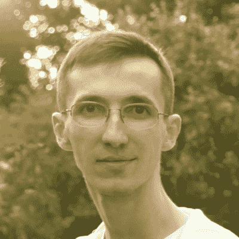
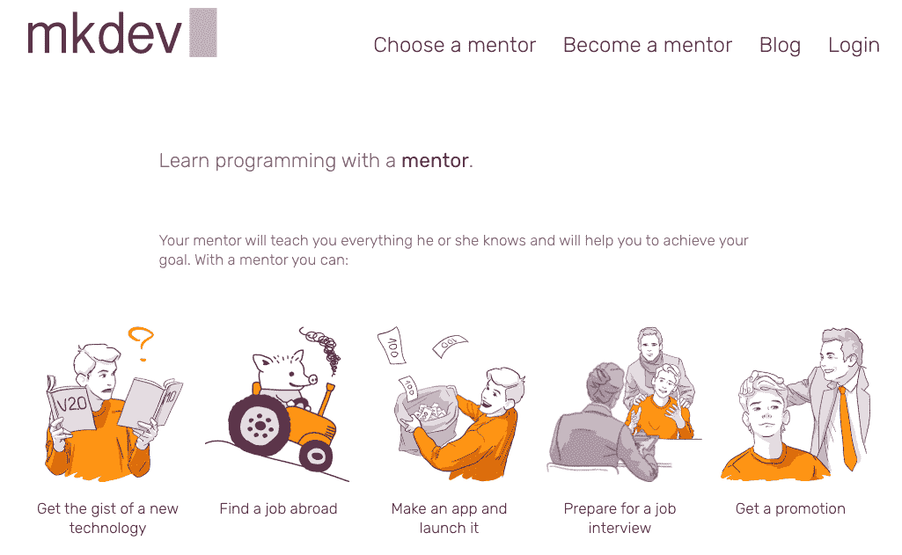
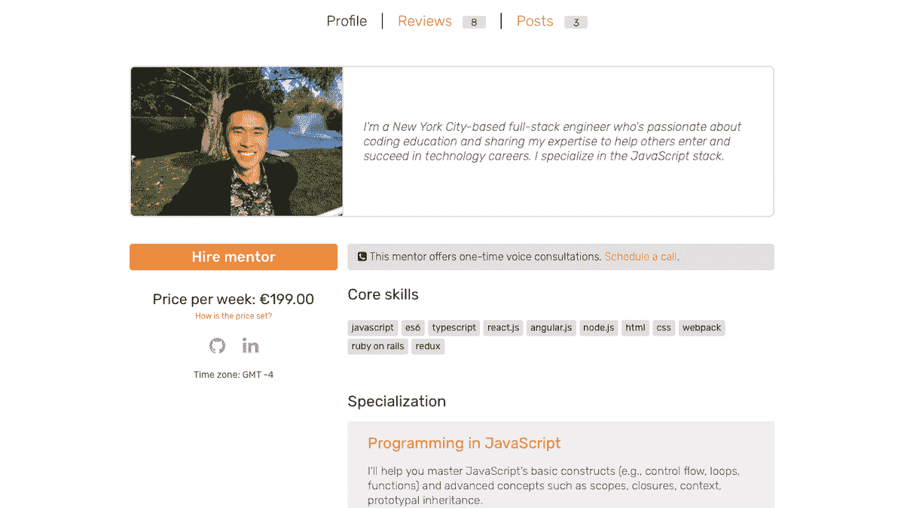
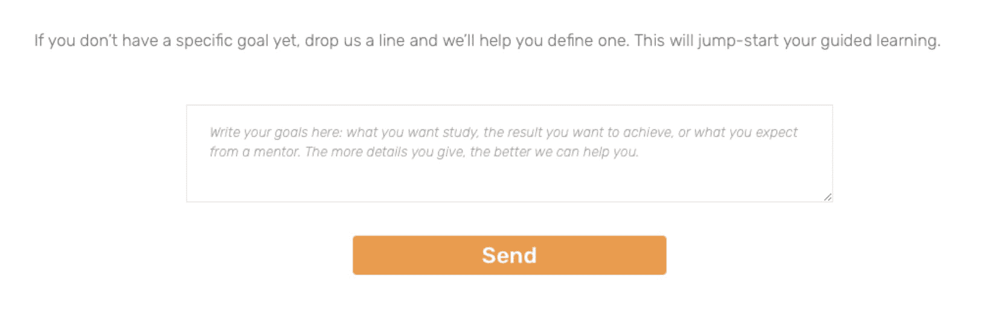
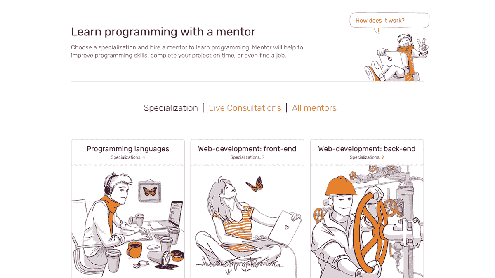

# 我们如何通过开始对话每月赚 12000 美元

> 原文：<https://www.indiehackers.com/interview/how-we-make-12k-month-by-starting-a-conversation-02d83c53e6>

## 感谢您抽出时间接受联合采访！你的背景和工作是什么？

[ Kirill Shirinkin, co-founder of mkdev.me](https://www.indiehackers.com/kshirinkin) 

嗨！我是 Kirill Shirinkin，自由开发人员和云基础设施顾问， [mkdev.me](https://mkdev.me/en) 的创始人兼首席技术官。

[ Leonid Suschev, co-founder of mkdev.me](https://www.indiehackers.com/3LiON) 

我是 Leonid Suschev，数字营销专家，mkdev.me 的联合创始人兼首席执行官，这是我的全职工作。

在 mkdev 上，你可以雇佣编程导师，从他们的经验中学习。mkdev 上的指导包括:

*   在私人聊天中无限制发送消息
*   个人学习计划
*   实际任务和专业代码审查
*   终身进入 mkdev 俱乐部

我们还销售一次性语音咨询，以获得更精确和快速的支持，我们计划围绕销售我们导师的专业知识添加更多功能。

从 mkdev 成立到现在已经有很多年了，现在我们有超过 40 位导师，涵盖了 It 领域的大部分领域，随时都有几十名学生，还有一个活跃的私人社区，我们称之为 mkdev 俱乐部。我们通过从平台上的每一笔交易中抽取费用来赚钱。

 

## 是什么促使你开始使用 mkdev？

[ Kirill](https://www.indiehackers.com/kshirinkin) 

早在 2014 年，我就已经准备好了，不仅要获得新技能，还要分享我迄今为止学到的一切。我自己也是一名软件开发人员，我的职业生涯之所以成功，要感谢我一直以来的导师。是时候回报了。

我做的第一件事就是写了一本关于如何学习 web 开发的免费书籍。这本书，是一个相对的成功，帮助了很多人开始他们的网页开发职业。这篇文章在网上发表后不久，我就收到了许多人的电子邮件，要求我教他们编程。我通过为向我学习设定一个适中的价格，过滤掉了那些并不真正认真的人，并开始指导那些付费的人(这在当时对我来说是一个相当大的惊喜)，主要是通过电子邮件和 Gitter。

联系我成为他们编程导师的人越来越多，同时对编程语言和我不太了解的领域感兴趣的人也越来越多。从那里，mkdev 作为一个产品很自然地出现了，没有太多关于大产品想法的思考。如果只有两个导师，你仅仅通过电子邮件所能做的事情将无法扩展，一旦我们能够提供来自不同编程领域的不同导师，销售他们专业知识的平台就会自然增长。

在 mkdev 启动一年后，我的老朋友 Leo 作为联合创始人加入了我，接管了市场营销和设计活动。我们博客上所有漂亮的插图，所有的设计——一切都是他做的，让我可以专注于产品和完善教学过程。

我们专注于提供真正响应用户需求的内容。本质上，我们在任何人付钱之前就开始了指导过程。

TweetShare[ Leonid](https://www.indiehackers.com/3LiON) 

对我来说，mkdev 最初是 Kirill 友好地要求为他的书做封面。设计和插画过去是，现在也是我喜欢做的事情，尤其是当我得到报酬的时候。我仍然偶尔做一些自由职业者的工作，以保持与该行业的联系。

在某个时候，我们决定创建一个登录页面——更多的是为了乐趣和利润，而不是可能的商业机会。这个想法最终发展成了一个成熟的网络应用，Kirill 将会参与其中。我加入团队的时间稍晚，有点文艺复兴的味道，主要是帮助寻找更多的学生，以及处理推广、设计和一般的想法和支持。作为回报，我得到了 mkdev 大约 15%的利润。

经历了业务发展的所有混乱，我开始意识到我喜欢在业余时间做 mkdev，而不是我的全职工作或自由插画。创造新的功能，向观众展示它们，并跟踪性能是有趣和具有挑战性的，我想要更多，Kirill 和我很沮丧，我没有更多的时间投入。我的想法越来越多，对更多特性的需求也越来越多，所以我们开始讨论我如何在 mkdev 中扮演一个更积极、更投入的角色。

[ Kirill](https://www.indiehackers.com/kshirinkin) 

最终，Leo 开始全职在 mkdev 上工作，2017 年我们又增加了一名全职员工来帮助我们进行客户支持。我只是兼职做这个工作，因为我的主要工作仍然是基础设施和 DevOps 顾问。

## 构建最初的产品需要什么？

[ Kirill](https://www.indiehackers.com/kshirinkin) 

我在 2014 年 6 月拿到了我的第一批三个编程的学生。我必须给他们一些事情做，所以我写了一份实际任务的清单。完成这些任务后，学生将构建自己真正有用的语言学习网络应用程序。我们将这种任务系列称为 mkdev.me 上的任务。我们最初的 Ruby on Rails 任务的改进和细化版本已经从零开始培养了许多新的 Ruby 开发人员。当我第一次和我初出茅庐的班级一起开始时，我花了大约 30 分钟写下这些任务的第一个版本，并通过电子邮件发送给我渴望的学生。

在接下来的几周里，请求不断地到来，所以我建立了一个简单的网页，描述我所提供的服务和价格。大约六周后，我发现自己通过电子邮件与几十名学生周旋，并意识到我需要快速自动化。我是一名 Ruby on Rails 开发人员，花了几周时间编写并推出了 mkdev 网站的第一个版本，它有助于简化订阅、支付、实际任务和其他我以前通过电子邮件做的事情。整个过程——从一名学生支付第一笔款项到 mkdev 的推出——耗时约四个月。

我不必过多考虑在我编写的 web 应用程序中包含什么。我做了生活创业圈大多数人做的事情:我给自己制造了一个问题，我通过创造一个产品，做一个 app，解决了这个问题。作为第一个用户，我对我需要解决的问题有非常清楚和深入的了解，比如如何在学生完成任务时获得通知，如何跟踪付费指导期何时到期，如何将所有学习内容存储在一个地方，等等。

一旦有太多的学生需要我自己管理，我找到了另一位导师，并从他收到的每一笔付款中收取费用，因为当时，所有的内容和营销，整个平台，事实上，都是由我提供的。因此，我在 mkdev 中编写了一个多导师设置，并开始跟踪导师的报酬，这样我就可以收取费用。正如经常发生的那样，我们的导师越多，需要解决的问题就越多，需要的功能也就越多。我们听取了学生和导师的意见，并根据他们的反馈不断改进平台。

 

## 你们是如何吸引用户，壮大 mkdev 的？

[ Kirill](https://www.indiehackers.com/kshirinkin) 

mkdev 最初的大部分增长来自电子邮件营销。要获得免费的电子书，你必须订阅我们的时事通讯，这是每个营销新手都会谈到的典型内容策略。订阅后，你会不时收到一些有用的内容，比如如何让你的工作变得更有趣的提示，或者学习编程的人的成功故事。

目前，我们的简讯拥有超过 10，000 名订户，并且仍然是我们赢得付费客户的主要途径之一。我们添加了更多的内容磁铁，如“修正简历的 22 个技巧”和一份关于通过 mkdev.me 学习的功效的报告。我们尽量不要过于频繁地发送宣传活动，而是专注于发送有用的内容。

虽然时事通讯是我们增长的主要来源之一，但我们已经努力寻找新的线索并确定新的客户来源。

[ Leonid](https://www.indiehackers.com/3LiON) 

正如 Kirill 所提到的，我们的营销策略是从时事通讯中自然发展出来的。想要阅读这本书的人必须订阅时事通讯才能得到它，所以我们必须想办法把这本书送到人们手中。幸运的是，这也是相对有机的。我们在谷歌小组的专业论坛上发布了一些帖子，这本书开始自然传播。

我们的社区是我们最强大的资产之一。

TweetShare

我们有一个完善的 Ruby on Rails 开发人员社区——每个人都互相认识。因此，开始向社区内的 RoR 开发者提供我们的教学服务是显而易见的，我们已经是社区的一部分，并得到了社区的大力支持。

我们也开始与我们的订户进行对话。几乎每一封时事通讯订阅者收到的电子邮件都包含一些激励他们回信的东西——一个问题，一个建议或反馈的呼吁，等等。为了得到实际的回应，重要的是要个性化，避免听起来或表现得像垃圾邮件。我们专注于提供真正响应用户需求的内容，并以这种方式建立信任和互利的关系。通过这样做，我们实际上是在任何人付钱之前就开始了指导过程。我们开始了解我们的订户，了解他们的目标和需求，并相应地给予建议和激励支持。反过来，我们从潜在的和实际的用户那里得到了有价值的反馈，这使我们能够改进服务，并找到具有所需知识的导师。这是双赢。

我们保持这些对话，直到订户变成客户，这有时需要几个月，但我们认为投资是值得的。所有后来吸引顾客的策略都是基于这个原则。我们在网站周围放置微妙的触发器来提示访问者开始对话。

 

一旦我们确定了这个策略，主要任务就是将漏斗从几个月缩短到几天。在一个充斥着编程课程的市场，这些课程承诺在一个月内让你从零到六位数的就业机会，许多消费者只是不太熟悉作为学习和成功途径的导师的概念，也不愿意为这项服务付费。克服这一障碍成为真正的挑战。

花了一些时间和一系列的网站改造来向观众解释什么是导师制，它与课程有何不同，以及它如何帮助你走向成功。我们有策略地避免在公共场合使用“课程”这个词，每次我们发表文章、评论或新闻稿时，我们都习惯于定义什么是导师制，以及它能提供的好处和优势。而且成功了。与我们开始时相比，在“编程”一词旁边包含“导师”一词的谷歌搜索数量急剧增加。我们现在收到的大多数请求都来自那些已经知道自己需要导师的人。

我们的成长很大一部分也可以归功于口碑。随着我们客户群的扩大和增长，以及当前客户在我们平台提供的指导下开始专业成长，对不同编程领域知识的需求不断增加，其中一些领域我们还没有接触过。到目前为止，我们已经扩展到涵盖各种编程语言、前端、DevOps、系统工程和移动应用程序开发。

随着我们的校友进入职场，并开始在他们的工作场所传播这一信息，需求不断增长。我们刚刚开始开发一个企业导师计划，这将把事情带到一个全新的水平。

## 你的商业模式是什么，你是如何增加收入的？

[ Kirill](https://www.indiehackers.com/kshirinkin) 

mkdev.me 完全是自举，我自己投钱进去的。我的主要工作是咨询，然后在需要的时候拿出一部分收入投资 mkdev.me。到现在，像服务主机、分包商、工资这些东西都是由平台的利润来覆盖的。

我们从每笔付款中收取费用，无论是导师订阅、语音咨询还是任何其他形式的参与。我们收取的费用随后被用于我们使用的各种网络服务、服务器成本和支付承包商。由于大部分收入都给了导师而不是 mkdev，我们总是很小心如何花钱。

我们的收入随着一年中的不同时间而波动。当然，黑色星期五总是会有一个巨大的高峰，而在 12 月份会有一个明显的下降——人们往往不会在假期前报名参加强化导师项目。

[ Leonid](https://www.indiehackers.com/3LiON) 

我了解到，大多数教育平台往往专注于如何留住或重新抓住那些购买了产品但从未开始学习(或在一两节课后放弃)的客户。他们围绕这一前提建立了自己的整个商业模式和营销策略。然而，我们 90%以上的客户在他们的订阅到期之前一直保持参与和不断学习，因此我们的目标是最大限度地延长每个客户的订阅期限。

我们正在以各种方式实现这一目标。从导师的角度来看，我们正在努力提高指导的质量，以便客户能够看到，与身边的导师一起学习和工作比单独通过自学课程要好得多。在服务方面，我们为购买长期订阅的用户提供折扣。与此同时，我们将继续教育社区，把导师制作为对未来的一种投资。统计数据显示，校友在获得工作或晋升后，只需 19 天就可以完全收回与导师一起学习的成本。

我们仍在试图找出理想的价格，以确保每个人都觉得他们从这个平台上获得了很好的价值。由于我们提高了对导师的要求和指导的质量，我们也提高了培训的最低建议成本。我们不像其他基于订阅的服务那样按月收费；每次订阅结束时，客户决定是否要重新订阅。我们希望这一过程是有意的，并涉及客户的不断选择。

虽然我们认为这总体上是一个好的做法，但它确实需要我们做更多的工作，并最终将成本推高到我们的基本订阅可能看起来相当昂贵的程度。我们的一些客户认为我们提供 VIP 服务，是一所精品大学。坦白说，我们不介意。从一开始，我们的目标就是为我们的客户提供尽可能个性化的学习过程。我们的导师也是如此。我们努力创造一个舒适和无压力的环境，在这里我们的导师可以做他们喜欢的事情(教学和编码)，而不会被他们讨厌的事情(吸引客户、营销、支持等)所困扰。

随着我们的不断发展，我们将继续调整和添加新功能，以满足客户不断变化的需求。我们最近增加了一个实时咨询功能，适用于那些只需要与导师进行一次简短会谈的客户，以获得针对其燃眉之急的任务的快速解决方案。我们还开始将导师服务分成更小的包，代码审查、简历审查和面试预演正在进行中。虽然所有这些服务都默认包含在导师制中，但人们一直要求将它们作为一个单独的包(包括拥有活跃会员的客户)，所以我们认为这是一个巨大的增长机会。

 

## 你未来的目标是什么？

[ Kirill](https://www.indiehackers.com/kshirinkin) 

如果我们在谈论个人目标，我希望能够在某个时候全职关注 mkdev，这需要我们在更大的规模上运营，并有更高和更稳定的收入。

作为一个产品，mkdev 没有特别的长期目标。它的目的是帮助人们向导师学习，我们认为这是最快最可靠的学习方式。关于如何最好地利用我们拥有的导师，如何扩大我们导师提供的专业知识的选择，以及如何最好地将我们导师的专业知识提供给需要它们的人和公司，我们有大量的想法尚未有机会探索。

作为一家公司，我更受 Basecamp 的启发，而不是那些背后有大量风险投资的标准的“要么增长要么失败”的初创公司。只要 mkdev 向使用它的人交付价值，我就满足于继续为它工作。

[ Leonid](https://www.indiehackers.com/3LiON) 

有了 mkdev，我已经实现了我的个人信条:[只做你喜欢做的事情，并找到愿意为此付钱的人](https://mkdev.me/en/posts/how-to-quit-your-job-and-become-a-freelancer-3-rules-on-the-way-to-your-independence)。不过，这份工作还是有一些地方我不太喜欢。这就是为什么我的主要目标是带领 mkdev 和团队在没有我监督的情况下工作、维持和成长，这样我就可以专注于 mkdev 中我真正热爱的事情。

至于 mkdev，我们有很多事情要做。如果不是那么明显的话，mkdev.me 代表“让我成为开发者”。这是导师们的主要目标，把他们的学生变成独立的开发者。在这方面，我们的客户面临着一长串具有挑战性的任务——设定目标、学习知识、获得聘用、获得晋升，等等。我们希望从各个方面涵盖所有这些步骤。我们希望帮助公司发现新的人才，正确确定开发人员的工资，并帮助改善工作环境。基本上，我们希望成为公司、人力资源机构、开发人员和希望成为程序员的人的一体化员工发展商店。

## 你面临的最大挑战和克服的障碍是什么？如果你必须重新开始，你会做什么不同的事？

[ Kirill](https://www.indiehackers.com/kshirinkin) 

我们刚刚一头扎进了迄今为止面临的最大挑战:进入英语市场。我们在俄语国家有一定的名气，但在独联体之外基本上是无名之辈。有了一些准备好并且能够用英语教学的导师，我们已经准备好打入一个更广阔的市场，并向英语世界展示我们的学习方法是多么优越:-)。

[ Leonid](https://www.indiehackers.com/3LiON) 

让人们相信指导是学习代码的一种可靠形式是相当具有挑战性的。当我在研究市场时，我了解到在西方国家，教练是一种众所周知的、需要的学习和发展形式。但在独联体，情况并非如此。不知道为什么，不管是文化原因还是政治原因，但是人们倾向于认为学习高等教育的基础知识更多的是浪费时间，而不是对自己未来的投资。这就是为什么你必须连续支付三个月、六个月或九个月的想法在我们的一些消费者心中遇到了障碍。

我们做得很好，突破了这堵墙，创造了皈依者。我很自豪 mkdev 是独联体地区第一家(如果不是第一家的话)推动个人消费者和公司自我教育指导和投资理念的公司。但是我不确定我会做什么不同的事情。我们从导师的课程开始，这帮助我们建立了一个强大的社区。只有当我们周围有一个强大的社区时，我们才能开始放弃这些课程，推广个性化学习计划指导的理念。我们的社区是我们最强大的资产之一。

## 有没有发现什么特别有帮助或者有优势的？

[ Kirill](https://www.indiehackers.com/kshirinkin) 

拥有一个技能与我完全不同的联合创始人是一个巨大的胜利。我对技术非常感兴趣，拥有 IT 领域所需的所有知识和技能，但我永远也不可能建立一个如此漂亮的网站。我的营销技巧足以向我的咨询客户推销自己，但不足以销售在线产品。此外，有一个我可以信任的人站在我这边，帮助我做好本职工作也是非常重要的。所以我很高兴 Leo 在很早的时候就加入了 mkdev！

## 对于刚刚起步的独立黑客，你有什么建议？

[ Kirill](https://www.indiehackers.com/kshirinkin) 

尽早收费——如果你提供有价值的东西，这是快速了解的唯一方法。

同样重要的是:做小的、不完美的发布。

我得到了这个教训。很多时候，Leo 和我会设想下一个会改变一切的大版本。但对我来说，它过去是，现在仍然是一个兼职项目，我每周只有大约 15-20 个小时的时间投入其中，我是构建所有这些潜在改变游戏规则的功能的技术人员。所以我们会花几周甚至几个月的时间来开发这些大版本，中间不部署任何东西，这是一种瀑布式的产品开发方式。对于一个白手起家的副业来说，这是死刑。

我开始将所有东西分解成非常小的、独特的功能，我可以在几个小时内完成并部署到生产中。如果 Leo 完成了导师档案的重新设计，我不会等到完成所有代码后再做。相反，我会选择设计的一部分(例如，顶部导航)，编码，然后推出。它不如我们心目中的完整设计好，但比我们以前拥有的要好，现在它已经为我们的用户提供了。

我认为那个著名的建议——做不可扩展的事情——在当时对 mkdev 非常有效，并且今天仍然有效。当我们想要添加一个新的大特性时，我们总是以最简单的、主要是手动的形式来做。这就是我们为语音咨询所做的——我们以带有联系表格的单一登录页面的形式发布它们，在您提交表格后，我们手动完成所有工作。它可以防止我们过度投资于一个可能行不通的想法，它还可以让我们看到我们应该如何准确地自动化这个过程，以方便所有相关方。

我花了很多时间来学习如何将所有的事情合理地分割成最小的可交付工作块，我还在学习如何做得更好。但是如果没有这种方法，产品就会像过去一样停滞不前。

尽早收费——如果你提供有价值的东西，这是快速了解的唯一方法。

TweetShare[ Leonid](https://www.indiehackers.com/3LiON) 

完成比完美更好。这基本上是我和基里尔一路走来学到的最重要的东西。

在人际关系层面上，找到与伴侣的平衡和制衡很重要。我更喜欢过程，而基里尔更喜欢执行和结果。让这两种类型的人都担任决策角色很重要，这样他们就能相互制衡。基里尔不让我花太多时间在创作上。作为回报，我不允许他发布过于原型化的东西。

## 我们可以去哪里了解更多？

[ Kirill](https://www.indiehackers.com/kshirinkin) 

查看我们的网站！即使你不是在寻找导师或专家的建议，我们的[博客](https://mkdev.me/en/posts)上仍然有许多关于各种编程相关主题的精彩内容，从非常深入的技术文章到如何让你的工作更有趣或如何完善你的简历的一般建议。

——[<picture id="ember5296415" class="user-avatar ember-view user-link__avatar"></picture>基里尔·希林金](/kshirinkin?id=SFQOxA1j09SH1o0MoY4Lna0WPfG2)，mkdev 创始人

## 想像 mkdev 一样建立自己的事业？

你应该加入[独立黑客社区](/)！🤗

我们是几千名创始人，互相帮助建立有利可图的业务和副业。来分享你正在做的事情，并从你的同事那里获得反馈。

还没准备好开始使用你的产品吗？没问题。这个社区是一个认识人、学习和实践的好地方。随意[随便浏览](/)！

—[<picture id="ember5296420" class="user-avatar ember-view user-link__avatar"></picture>考特兰艾伦](/csallen?id=ibTLPyjwVebnZjMGKvz6ztarnuV2)，独立黑客创始人

23votes