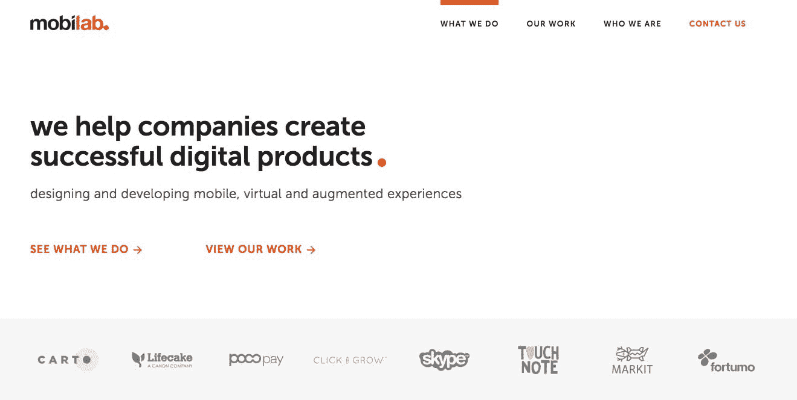
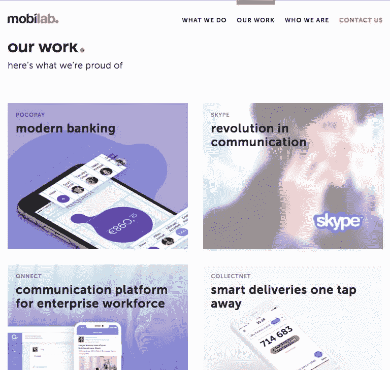
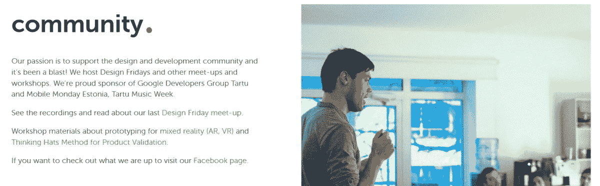

# 我们如何克服失败，带领一家公司创造了数百万的财富

> 原文：<https://www.indiehackers.com/interview/how-we-overcame-failure-to-bootstrap-a-company-generating-millions-a2aa2fad93>

## 你好！你的背景是什么，你在做什么？

我是 Veiko Raime， [Mobi Lab](https://lab.mobi/) 的创始人兼 CEO。我一直擅长数学和物理，但当我在大学选择学习什么时，我最终选择了经济学。我很快意识到这对我来说太普通了，于是我额外努力学习更多的信息技术。

我可以说，信息技术和商业研究的结合给了我在我热爱的领域建立自己的事业的极好背景。

Mobi Lab 是一家构建数字产品的机构。我们认为独一无二的是设计、技术和商业管理的强有力结合。

今天，我们是一个大约 40 人的团队，收入高达 20 万欧元。我们已经建立了自己的衍生产品，并正在与一些非常大的国际公司合作。

 

## 是什么激励你开始做 Mobi Lab？

如今，成为一家初创公司的创始人似乎很酷。我们从来不认为自己是一家初创公司。我们的故事始于一些想法，这些想法是我们通过长时间的免费工作和大量的能量饮料实现的。在很早的时候，这也不是钱的问题，因为我们能从公司得到一些东西的那一天似乎太遥远了。

我最初的工作是建立财务团队，开发票，发工资。这并不难，因为我有很好的背景。挑战在于使用商业智能和良好的流动性预测技能——并每天计算我们是否买得起东西。

探索事物，尽你所能去尝试。如果你不止一个，要鼓舞人心。

TweetShare

第二项工作是雇佣和建立工程团队。我花了一些时间来调整业务和技术投资。说到钱，我没有。我用学生贷款买了我的电脑，我们的家庭不能进行任何投资或帮助我们储蓄。

## 构建最初的产品需要什么？

我们启动得相当快。我们总是先卖东西，然后尽一切努力交付。当然，它包括许多不眠之夜和一些失败的项目。失败是重要的教训。

例如，因为我们没有一个好的测试环境，我们在半夜向成千上万的客户发送短信。这是一堂很好的公关课。

我们在飞行中学习技术，但是当我自己开发软件时，我成为了 Java 技术的专家。我们使用 J2EE 的服务器，J2ME 的移动客户端，等等。今天，我实际上不能过多地使用这种技能，但我也学到了很多关于 SQL 和数据库的知识。这让我能够自由地为自己制作商业智能数据，以供我作为首席执行官做出决策。

## 你们是如何吸引用户，壮大 Mobi Lab 的？

在观察增长时，我们遵循一些简单的规则:

*   首先，我们始终保持对技术的关注，不会追逐每一个承诺为你工作的新的酷的创业技术。
*   我们确实将内部没有的东西外包出去，并让我们信任的合作伙伴留在身边。
*   我们总是先增加价值再增加数量:我们一开始是一家开发公司，团队的大部分成员都是软件开发人员。

今天，我们有一个最好的 UX 和用户界面设计团队。我们有内部产品管理和业务咨询。这样，我们不创造软件，我们解决问题，制造产品。

 

## 你的商业模式是什么，你是如何增加收入的？

我们是不同企业的实验室，所以我们的商业模式也非常不同。作为代理，我们有两种主要的商业模式:

*   物有所值
*   为复杂性买单

对于产品管理咨询、UX 研究或简单范围的产品，我们按价值收费。这意味着固定预算或与 KPI 相关的发票。这里最重要的是要诚实地说明你做了什么，你的客户将获得多少价值。

我举个简单的例子。一个小餐馆可能会来要求一个带有预订系统的定制移动应用程序。也许餐馆的老板负担得起，但我们知道，它永远不会像设计和开发成本那样为餐馆带来更多的顾客。因此，在这种情况下，我们会提出一些东西，这些东西会带来客户，而不会将汽车的价值投资到软件中。

确保你知道如何使用 Excel 或 Numbers 或其他工具来计算你的业务进展如何。银行账户里的钱并不意味着你可以度过一个淡季或者给你的员工发假期工资。

TweetShare

大多数机构可能都使用复杂性付费模式。在大多数情况下，这意味着每日或每小时的速度。我们避免出租人员，通常管理设计和工程流程。我相信，将你的团队出租给每个人不仅对你有风险，对你的客户也有风险。你必须像一个团队一样工作，在需要的时候加入相关的角色。因此，我们可能会收取比平均水平高一点的费用，但我们只对产品的有效工作时间收费。

这意味着我们的毛利目标比较高。今天，我们的目标是平均 40%，但除此之外，间接成本至少占其余的一半。这是因为我们在团队发展上投入了大量与具体项目没有直接关联的资金。这是一项长期投资，有助于我们保持高利率和高质量的服务。

## 你未来的目标是什么？

我们看到设计创造了很多价值。我们认为工程是设计过程的一部分，并宣传自己是设计公司。我们的目标是成为欧洲领先的移动体验设计机构。当然，这意味着收入增长目标，但也意味着更多的内容营销，以及谈论我们如何做和做什么。

我自己学过很多设计，在大学里也学过课程。这并不是说我会成为一名优秀的设计师，而是我想了解设计过程。

## 你面临的最大挑战和克服的障碍是什么？如果你必须重新开始，你会做什么不同的事？

这是一个有争议的问题。我认为这次成功让我们保留了一些潜力。一旦你有了第一批大客户和不错的收入，我们就不再看数字，KPI 已经足够频繁了。你的决定更多是基于情绪。

幸运的是，在决定内部开发产品后，我们有 1-2 个大客户离开了我们。所以我们不得不回到指标上，看看我们的客户获取成本是多少，毛利润和招聘成本是多少。

## 有没有发现什么特别有帮助或者有优势的？

我是一个做很多事情的人。我经营一家酒吧，拥有一家咖啡店，工作之外有多种爱好。这意味着最有限的资源是时间。我认为每个企业家都应该能够把事情做好，并在他们宝贵的时间花在哪里的地方做出贡献。

除了时间管理，确保你知道如何使用 Excel 或数字或其他工具来计算你的业务进展如何。银行账户里的钱并不意味着你可以度过一个淡季或者给你的员工发假期工资。

## 对于刚刚起步的独立黑客，你有什么建议？

探索事物，尽你所能去尝试。

如果你不止一个，要鼓舞人心。还有，不要做独行侠。

## 我们可以去哪里了解更多？

在我们的网站上有关于我们做什么的信息。我们举办了一个周五设计聚会，你可以在我们的[脸书页面](https://www.facebook.com/lab.mobi/)上跟踪这些活动。

 

我最喜欢分享的地方是我们的 [Behance 组合](https://www.behance.net/mobi_lab)。它并不代表具有强大 NDA 的项目，但它有一个适当的案例研究格式可供学习。

最后，我们不时地分享我们在[媒体](https://medium.com/mobi-lab)上的经验。

我在给很多创业公司和孵化器做产品管理和产品设计方面的咨询。如果你在这些方面有挑战，请随时联系我。

——[<picture id="ember5203414" class="user-avatar ember-view user-link__avatar"></picture>Veiko Raime](/veikor?id=T5ZjuYJwIKVCzbWLic8TYnbccVU2)，Mobi Lab 创始人

## 想像摩比实验室一样自己创业？

你应该加入独立黑客社区！🤗

我们是几千名创始人，互相帮助建立有利可图的业务和副业。来分享你正在做的事情，并从你的同事那里获得反馈。

还没准备好开始使用你的产品吗？没问题。这个社区是一个认识人、学习和实践的好地方。随意[随便浏览](/)！

——[<picture id="ember5203419" class="user-avatar ember-view user-link__avatar"></picture>柯特兰艾伦](/csallen?id=ibTLPyjwVebnZjMGKvz6ztarnuV2)，独立黑客创始人

19votes