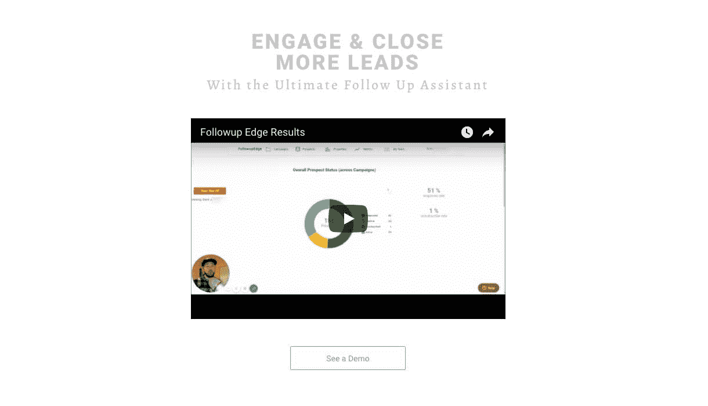

# 我们是如何辞掉工作来发展自己的事业的

> 原文：<https://www.indiehackers.com/interview/how-we-quit-our-jobs-to-bootstrap-and-grow-our-own-business-16bdf1de2b>

## 你好！你的背景是什么，你在做什么？

嗨！我是斯科蒂·施奈德。我是一名 fullstack 开发人员和前军官。从事产品开发的 Chris Davis 和我们的营销人员 Chris Goss 是另外两位联合创始人。

我们的 SaaS 平台 [Followup Edge](https://followupedge.com) ，通过自动排序的文本消息、电子邮件和无环语音邮件接收呼入的潜在客户，当潜在客户回复时，这些信息就会停止。广告公司的所有者和他们的客户使用我们的产品来增加每一分钱的价值，并获得超过 40%的潜在回应率。

我们的收入图表很好地表明了该产品的成功。自六个月前开始以来，我们每周的增长率都在 10%或以上，截至此次采访，我们每月的经常性收入将达到 3 万英镑。

 

## 是什么促使你开始使用 Followup Edge？

我们创建了 Followup Edge 来解决广告公司面临的一个问题——我们的客户没有跟进我们发送给他们的线索，这导致了广告公司和客户之间的紧张关系。如果客户没有拿起电话打给我们传递的潜在客户，他们通常会转过身来指责我们的“不良引导”，而不是对不良跟进负责。这种经常重复的场景最终降低了我们机构的保留率。Followup Edge 就是在这种挫败感中成长起来的。

我们最初的假设是，销售线索可能更喜欢以各种不同的方式接收和回应客户拓展，因此通过利用三种不同的沟通形式(文本、电子邮件、无环语音邮件),我们可以提高整体回应率。我们三个都有各种形式的营销和创业经验，这教会我们避免任何看起来自动化或感觉垃圾的东西。我们考虑通过 Zapier 和 Active Campaign 将各种通信组件串联在一起，但这种方法缺乏我们在产品中需要的一些关键功能，例如一旦他们做出响应，就停止向销售线索发送自动通信的能力。

当我们开始认真工作时，所有的创始人都在全职工作，但克里斯·戴维斯和我很快就放弃了其他一切，专注于产品的开发，而克里斯·戈斯则继续工作。

## 构建最初的产品需要什么？

我们一直在引导这东西。最初的构建是在[泡泡](https://bubble.is/)上完成的，因为它允许我们灵活地构建我们需要的东西，几乎是免费的，没有代码。我在三周内获得了 MVP，两周后我们获得了第一笔收入。进一步的产品开发和迭代一直持续到今天——构建 SaaS 产品永远不会真正结束。

没有人会像你一样了解你的业务，所以我们购买的解决方案永远没有我们自己能够拥有和应该拥有的解决方案好。

TweetShare

前一年我参加了一个 fullstack web 开发训练营，它真的帮助我理解了 web 应用程序是如何工作的。但是不要绝望！没有那样的背景，我做的事情当然是可能的。

*MVP 技术栈*:

*   [气泡](https://bubble.is/)(前端、数据库、逻辑)
*   [扎皮尔](https://zapier.com/)(整合)

*当前技术堆栈*:

*   [气泡](https://bubble.is/)(前端，数据库)
*   [web task](https://webtask.io/)/[node . js](https://nodejs.org/en/)(关键计时功能)
*   扎皮尔(整合)

*近期技术栈*:

*   Ember.js(前端，MVC 框架)
*   数据库
*   扎皮尔(整合)

要点:通过像 Bubble 这样的无代码工具，即使你不是开发人员，也没有理由不开始。

## 你是如何吸引用户和发展 Followup Edge 的？

我们最初的成功和增长很大程度上得益于与一位有影响力的广告公司老板 Bobby Stocks 的合作，他是我们过去的合作伙伴。克里斯·戈斯帮助我们走到了一起，这对每个人都是双赢的。Bobby 基本上获得了一个软件开发团队和一个为他的问题定制的解决方案，我们获得了一个非常积极的附属机构和无价的产品反馈。

早期，我们认为，允许广告代理商通过向他们的客户追加销售我们的服务来获取一部分利润，这对于我们的进一步发展至关重要。我们通过跟进解决了他们的问题，增加了客户的保留率，为他们赢得了额外的利润，并在这个过程中扩大了我们的用户群。从第一天起，在设计产品时就考虑到了这一点，从而推动了我们的发展。

了解谁是你真正的客户——有时不是最终用户——并为客户寻求双赢。

TweetShare

到目前为止，我们完全没有做过市场营销——我们的用户完全来自广告公司的客户推荐和他们团队的成长。你可以说我们是通过联盟营销成长起来的，但归根结底，这只是了解我们实际上在为谁服务:广告代理商。我们让他们的生活更轻松，作为回报，他们在平台上尽可能多地获得客户。这是一种美丽的共生关系。

| 月 | 用户 |
| --- | --- |
| 一月 | 7 |
| 二月 | 18 |
| 三月 | 35 |
| 四月 | 64 |
| 五月 | 101 |
| 六月 | 181 |
| 七月 | 236 |

关键要点:了解谁是你真正的客户——有时不是最终用户——并为客户寻求双赢。

## 你的商业模式是什么，你是如何增加收入的？

我们采用订阅模式，区分个人账户和团队账户。个人账户每月 200 美元，团队账户每位成员每月 100 美元，每个团队至少 10 人。我们的第一个客户是 Bobby Stocks，他的代理客户构成了我们的基础。我们使用 Stripe 作为我们的支付网关，因为它们对开发者友好，并且易于上手。

到目前为止，客户流失率非常低，因此收入每个月都在稳步增长。Followup Edge 的运营模式是利润第一——我们知道在任何给定的时间，我们可以在业务上花费多少收入，我们首先支付给自己。

| 月 | 收入 |
| --- | --- |
| 一月 | 970 |
| 二月 | 1170 |
| 三月 | 4170 |
| 四月 | 6754 |
| 五月 | 11950 |
| 六月 | 15689 |
| 七月 | 30000 |

关键要点:通过使用利润第一的模式，我们确保我们是盈利的(因此是稳定的)，这反过来允许我们继续增长。

## 你未来的目标是什么？

团队:我期待着雇佣一名开发人员——目前只有戴维斯和我在做日常工作和支持，这很累人。我们当然可以利用这种帮助——但在利润第一的模式下，在我们真正负担得起之前，我们会推迟。应该是在接下来的几个月。

*收入*:以这个速度增长，到今年年底我们将超过 20 万/月。我们当然需要不断提高我们的水平来实现这一目标，但这是我们的基准。

*产品*:我正在努力开发网络平台的 3.0 版本，这次完全编码了。随着规模的扩大，我们意识到我们的架构需要重建。一个应用程序也正在开发中，应该会在夏末发布。

[https://www.youtube.com/embed/LKJ4FXtywP0](https://www.youtube.com/embed/LKJ4FXtywP0)

## 你面临的最大挑战和克服的障碍是什么？如果你必须重新开始，你会做什么不同的事？

我早期犯的大多数错误都是因为我怀疑自己或团队的能力。我最初在我认为我们需要的解决方案上花费了数千美元(例如，我认为我不能编写的自定义代码)。我有能力做这件事，但没有承担这项任务。这最终耗费了我们的金钱和时间。没有人会像你一样了解你的业务，所以我们购买的解决方案永远没有我们自己能够拥有和应该拥有的解决方案好。

我早期犯的大多数错误都是因为我怀疑自己或团队的能力。

TweetShare

就我个人而言，我经历的压力比我遇到的任何事情都要大，我在西点军校呆了四年，然后去服兵役。当谈到压力管理时，正视自己的不足对我来说至关重要。作为一名创始人，有时处理事情不当会对我们的财务以及与商业伙伴的关系产生负面影响。两者对成功都至关重要。最后，我不得不承认自己的失败，并承认自己的不足，需要帮助或改进。正视我自己的一些缺点不仅有助于个人成长，也有助于我们团队的成长。

正如俗话所说:“如果你想走得快，就一个人走。想走远，就一起走。”

## 有没有发现什么特别有帮助或者有优势的？

我的联合创始人形容我是一个“工程师”。我是一个深度工作的怪胎，可以连续六个月每周七天每天工作 10 个小时。这是我多年来一直在培养的技能，从西点军校开始。

戴维斯是把我们团结在一起的坚定的“粘合剂”。他的建议和反馈继续让我感到踏实，他是那种会熬夜发布关键功能的人。如果没有他的生产力，我们可能会错过很多期限。

戈斯一直在幕后不断促成合适的交易，并从用户的角度指导产品。如果他没有支付账单，没有把需要的人聚集在一起，没有把我们的注意力从错误的事情上引开，我今天就不会写这篇文章。

没有我们大家的共同努力，这一切都不会发生。

## 对于刚刚起步的独立黑客，你有什么建议？

*   停止研究，去做点什么。
*   先构建，再担心可伸缩性。你不可能预测 10 个客户会带来的每一个问题，更别说 100 个了。
*   好的开发者对你的想法不感兴趣。去 Bubble 上建点东西，或者弄点现金/客户来给技术型的联合创始人买单。
*   我们对自己和他人撒谎，是为了解释为什么我们没有做/卖/生产/造出我们想要的东西。参加课程、寻找联合创始人、进行市场调查——这些都是必要的，但绝不是行动的替代品，即使我们希望如此。当有疑问时，做点什么！
*   犯错误，只是不要犯两次同样的错误。
*   每一点建议都有一个相反的同样有效的对位。找到适合你的方法。

## 我们可以去哪里了解更多？

https://followupedge.com

乐意尽我所能帮助你，所以请在下面提问吧！

——[<picture id="ember7997488" class="user-avatar ember-view user-link__avatar"></picture>史考特](/scottie_schneider?id=1c18koVCT8VkLcITmI5Wo9kE9PI3)，后续边缘的创始人

## 想像 Followup Edge 一样建立自己的企业吗？

你应该加入独立黑客社区！🤗

我们是几千名创始人，互相帮助建立有利可图的业务和副业。来分享你正在做的事情，并从你的同事那里获得反馈。

还没准备好开始使用你的产品吗？没问题。这个社区是一个认识人、学习和实践的好地方。随意[随便浏览](/)！

——[<picture id="ember7997493" class="user-avatar ember-view user-link__avatar"></picture>柯特兰艾伦](/csallen?id=ibTLPyjwVebnZjMGKvz6ztarnuV2)，独立黑客创始人

46votes