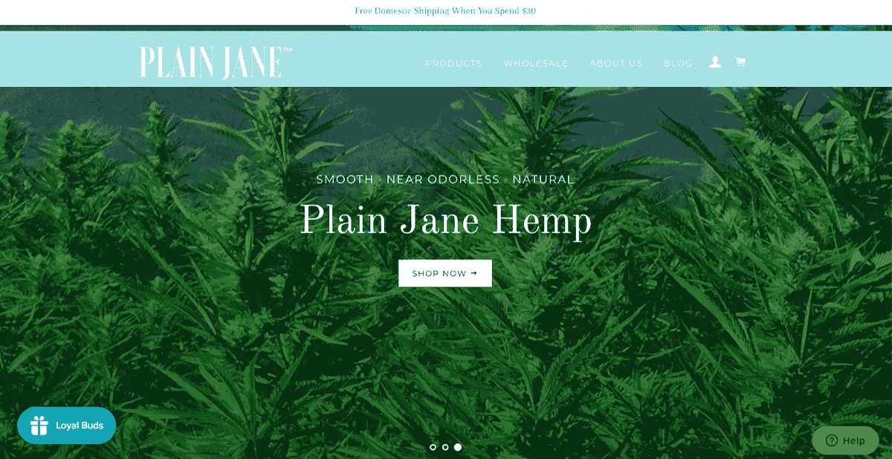
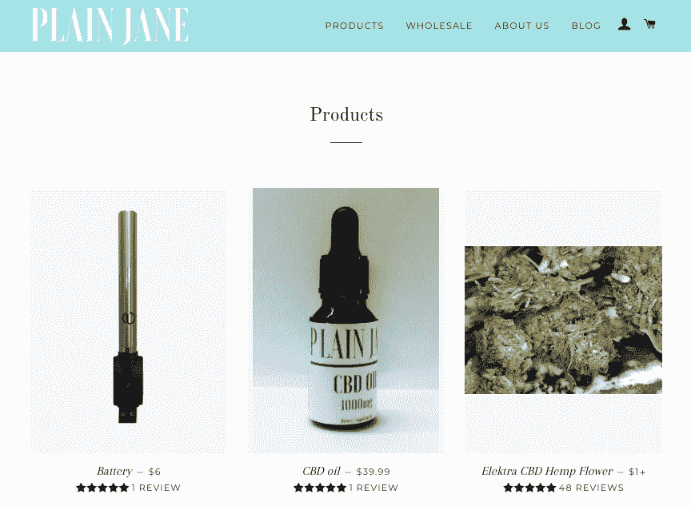

# 尽管在前进的道路上犯了一些大错误，我们是如何达到 50k/mo 的

> 原文：<https://www.indiehackers.com/interview/how-we-reached-50k-mo-despite-some-big-mistakes-along-the-way-70e6ca57fc>

## 你好！你的背景是什么，你在做什么？

我叫埃文，是一名软件工程师，后来成为了企业家。回到大学，我学习计算机科学，毕业后在旧金山的一家科技创业公司找了份工作。作为那份工作的一部分，我有机会领导一个新的垂直业务的工程，并爱上了创造和建设的实验和不确定性。由此，我知道我想成为一名企业家，但还没有准备好迈出这一步。工作几年后，我获得了去做的自信。

[素简](https://tryplainjane.com/)是 CBD 公司。像 THC 一样，CBD 是由大麻植物产生的，但 CBD 不会让你兴奋。一般来说，当人们提到大麻的药用特性时，他们谈论的是 CBD，而大多数人并不知道你可以在不中毒的情况下获得这些好处。我真的相信我们是最好的 CBD 公司，因为我们提供最好的价格和独特的产品。与绝大多数公司不同，我们没有中间商，而是直接与农场合作，为客户带来最优惠的价格。我们的旗舰产品是低气味和超级光滑的 CBD 香烟，它具有与其他 CBD 花卉产品相同的效力，但没有识别杂草的气味。当然，我们也在继续创新和创造新产品。

将我们的产品投放市场五个月后，我们每月创造了近 5 万美元的销售额。我们在所有 50 个州都有客户，我们在超过 25 个零售点。

 

## 是什么促使你开始做素颜简？

在麻省理工学院，杜恩和我在宿舍里种大麻。这是一个有趣的实验，我们学到了很多关于水培和植物本身的知识。我们从没想过这能成为一份工作。大学毕业后，杜安创办了一家保健品制造和品牌公司 Miramix，正如我提到的，我去了旧金山的一家科技初创公司工作。

我们谈论创办公司多年，但在 2018 年加州大麻合法化时，话题发生了变化。我们看到了潮流的转变，知道我们必须投身其中，否则就会错过一个潜在的世代机遇，所以我辞掉了工作，杜恩飞到了旧金山。

我们从来不喜欢抽烟后的味道，也不喜欢抽烟让我们咳嗽的程度。在大学，我们在一些在线论坛上读到了一种去除大麻气味和刺激性的方法，并认为实验一下并看看我们在哪里着陆会很有趣。对我们来说，最终产品一炮而红。我们可以在没有强烈的杂草气味的情况下吸烟，而且它对喉咙的刺激也小得多。我们真的没有看到任何提供这些创新的产品，并想，“为什么不是我们？”

我们的朋友 Lindsey 建议研究 CBD 产品，并帮助我们开发了我们的第一个产品。我们对 CBD 了解得越多，就越兴奋。CBD 提供了许多与大麻相关的身体益处，但没有麻醉作用。Lindsey 作为创始人加入了我们，并不断帮助我们开发新的 CBD 产品。

自从大学以来，我一直在与吸烟作斗争，对我来说，创造一种不会上瘾的替代品很重要。这就是我们如何得到我们的旗舰产品:低气味，超级光滑，富含 CBD 的大麻香烟。

## 构建最初的产品需要什么？

我认为一个产品必须有一些本质属性，使它不同于现有的产品。这可能是价格或独特的功能，但有些东西必须脱颖而出，需要你的注意。为此，营销和品牌是你的产品的滞后指标，所以简单地销售一些已经在那里贴上不同标签的东西并不能真正吸引我。销售产品的大部分工作应该由产品本身来完成，因此差异化对增长至关重要。

我们制作产品原型的第一个目标是弄清楚我们的识别属性——低气味和超级光滑的杂草——对任何人来说是否是一个有趣的概念。为了测试这个想法，我们从药房买了一些大麻，加工后去除气味，然后带到嬉皮山(旧金山金门公园的一个地方，因 4 月 20 日拥挤的大麻庆祝活动而臭名昭著)。我们打印了一堆调查问卷，挨个儿问他们要不要抽一碗，看他们喜欢不喜欢。在大约 50 次采访后，我们发现那些自认为是大麻鉴赏家的人讨厌大麻，但是更随便的吸烟者喜欢它。

这是一个非常积极的迹象，表明我们正朝着正确的方向前进。我们想变得两极分化。对于一个独特的产品，人们能说的最糟糕的事情就是他们有点喜欢它。

有很多人在做很多不同的产品，理解为什么还没有人创造你的产品是很重要的。业内大多数人认为自己是对复杂的味道和气味有鉴赏力的大麻专家——他们抽得太多了，从来没有真正咳嗽过，他们不在乎气味。我们的产品不适合他们，他们构成了这个行业的大部分。

不要想多了。弄清楚是什么让你的产品与众不同，然后复制其他的。

TweetShare

在打造我们的第一个 CBD 香烟产品时，我们花了一个多月的时间设计和完善盒子。我们打印出许多原型，折叠起来，并确定了一个我们喜欢的外形。我们也希望我们的 CBD 香烟的一切都是独一无二的，所以我们采取了一些创造性的自由。

我们增加了一个存放火柴的隔间，在纸箱底部还配有一根火柴杆。这被证明是一个巨大的错误。直到今天，我在世界上找不到一个配有火柴的香烟盒。因此，在过去的几个月里，我们完全去掉了火柴，添加了人们真正想要的东西:更多的大麻香烟。同样，我们盒子的定制形状也成了一个大问题。它很难制造，我们正在为更传统的香烟盒设计废弃它。

在设计我们的产品时，我们陷入了对用户体验应该如何的思考，而不是采访人们并复制市场已经成功做的事情。你必须知道你的与众不同之处是什么，不要试图让一切都变得特别和独特，尤其是如果已经有很好的相似之处可以借鉴的话。无论这种特殊的东西是什么，它都不能成为任何其他流程的巨大负担，因为这些流程可以让你的产品带着利润出去。我们现在已经花了几个月来撤销我们花了几个月创造的设计决策。不要想多了。弄清楚是什么让你的产品与众不同，然后复制其他的。

 

## 你们是如何吸引用户，让素珍成长起来的？

我们在 2018 年 4 月以 60K 美元起步，并在 2018 年 6 月开始销售第一款产品。最初，我们的销售非常困难。我们上市的第一个月销售额甚至没有达到 1000 美元。我们花了三个多月的时间才达到每月 5000 美元的销售额。我们的策略非常简单，但最难的部分总是细节。我们已经发现微影响者、影响者以及最近的 SEO 取得了成功。

任何社交媒体影响者策略的难点在于找到正确锁定你的目标人群的人。起初，我们付钱给任何愿意提拔我们的人。大错特错。一旦我们越过了显而易见的僵尸网络账户的陷阱，我们仍然不总是从我们的影响者身上赚钱。在 Instagram 上，如果你的品牌没有与有影响力的人很好地结合，一个拥有 10 万粉丝的账户通常不如 10K 粉丝值钱。在几个月的时间里，我们花时间去真正了解我们的目标人群，以及如何找到能够很好地与我们的品牌合作的影响者。

我们还发现，通过与专注于创建优质内容并限制其评论产品数量的有影响力的人合作，我们取得了成功。如果你去某人的页面，他们只有产品评论，要小心了。我倾向于那些账户中至少有三分之二是教育和有趣内容的人。一旦你确认了这是一个优质客户，接下来就是定价了。你预计会有多少人观看？点击率如何？你们网站的转化率是多少？通常你不得不花一些钱来回答这些问题，但没关系。销售就是进行小规模、廉价的实验，然后扩大成功的规模。做你的研究，找到在其他和你自己的公司相似的公司中奏效的方法。

在我们了解如何增加销售额后，我们找到了在减少花费时间的同时扩大销售额的方法。影响者策略的好处在于，你可以通过与更大的影响者合作来扩展它。这使我们不必投入太多时间来增加销售额，同时仍然能够实现每月 35%的增长率。

如果人们不能谷歌到你，你的口碑就没什么用了。

TweetShare

最近，我们已经开始收获我们的搜索引擎优化努力的好处。SEO 是一个长尾游戏，你通常几个月都不会注意到任何事情。起初它只是涓涓细流，但现在它已经超过了我们在销售方面的社会努力。SEO 的很大一部分就是确保当人们搜索你的名字时，你会出现。如果人们不能谷歌到你，你的口碑就没什么用了。我们已经注意到，特定的关键词定位并不意味着仅仅让人们能够搜索“Plain Jane CBD”这样的内容，并首先在那里看到我们。有一天，我们有望通过 youtube 上一个价值 100 美元的 FERG 音乐视频取代相貌平平的简。

## 你的商业模式是什么，你是如何增加收入的？

我们的商业模式很简单:我们制造产品，然后销售。像所有事情一样，表面下有一整座冰山。一开始，你什么都答应。如果一位顾客要求在 Safeway 停车场与你见面并取走他们的订单，你要答应(这确实发生了)。如果他们想要一个你永远无法大规模定制的产品，你可以答应。当你刚刚起步的时候，没有人愿意理你，这是完全公平的。你是谁？你为什么值得他们关注？老实说，你可能不知道。你必须非常努力地与早期的关系合作，开始验证你的想法，并从基础层面了解市场。

在这一点上，一切都是为了专注。对我们来说，一个尚未回答的公司问题是白色标签，这是一种用其他经销商的品牌重新包装你的产品的做法。我们有零售和分销商客户要求我们创造白色标签产品，但在某些时候，你必须开始说不，这是说起来容易做起来难。你必须决定是否值得去维持从你对所有事情都说“是”的时候就存在的耗时的关系。我的信念是，你应该永远珍惜和重视那些早期客户和合作伙伴，但同时，限制你愿意接受新客户的要求。当你不能提供太多的时候，奖励那些和你一起工作的人，但是不要让你的精力分散在一百万个不同的方向上。如果你知道你的基础产品适用于很多人，那就让更多人看到它，而不是试图通过新产品或新功能吸引更多人。

| 月 | 收入 |
| --- | --- |
| 2018 年 8 月 | 7000 |
| 18 年 9 月 | 5000 |
| 18 年 10 月 | 21000 |
| 18 年 11 月 | 22000 |
| 2018 年 12 月 | 36000 |
| 19 年 1 月 | 49000 |

## 你未来的目标是什么？

我们未来的目标很简单:烟草产品到处都有卖，大麻产品也应该有。尼古丁的非成瘾性替代品已经存在，让我们到处都有它。尼古丁上瘾的解决方案不是稍微安全一点的尼古丁。

增长的最大限制是资本。当扩展软件服务时，您会考虑数量级。对于产品公司，你关注的是 30%左右的增量。当自举一家公司时，在你真正开始销售之前，你必须支付劳动力、零件、机械、包装、产品的费用。成长越快，问题越大。我们已经与农民合作，他们在采购鲜花方面给我们慷慨的净条款，但我们必须提前六周支付包装费用。你用今天销售的钱支付明天的销售。我们正在与大型烟草制造商合作，以大幅提高产量并降低成本。

尤其是在大麻市场，你不能依赖投资。我很高兴我们在没有外部资本预期的情况下建造了朴素的简。我们从未亏本出售产品，因为我们认为最终会降低成本。相反，我们从高价格开始，随着时间的推移，在我们能够承受的范围内逐渐降低价格。例如，我们的大麻香烟最初是 8 支装，每支 20 美元。现在我们以 11 美元的价格出售 10 个装的。最终，我们希望能与每包 7 美元左右的香烟竞争。现在，我们不能这么做。当你给产品定价时，你必须仔细考虑整个结构的含义。如果你把直接面向消费者的价格定得太低，你就无法批发销售。如果你定价过高，你的批发商会开始抢走你的生意。

## 你所面临的最大挑战和克服的挑战是什么？如果你必须重新开始，你会做什么不同的事？

如果我不得不重新开始，我不知道我会做什么不同。显然，如果我能回到过去，我就不会犯任何错误。但在创业时，犯错是不可避免的。错误=学习。有些人不喜欢说他们正在学习，因为这意味着你承认你不知道如何做某事。但是没关系。

创业时，犯错是必要的。错误=学习

TweetShare

如果有的话，我会尽量让我的课程更便宜。我在体验教育上花了太多钱。比如我们花了几千在公关人员上。公关需要很多时间，回报也不是立竿见影的。对于一个早期的小公司来说，漫长的销售周期是致命的。在我们真正给他们一个成功的机会之前，我们不得不停止与我们的公关人员合作，因为我们负担不起。

网上销售很棒，因为回报是立竿见影的。付费广告，你为点击付费。一次点击会很快变成一次销售。考虑到支付处理器的时间，你应该可以在不到一周的时间内周转资金。随着我们的扩张，我们能够投资于利润更高、交付周期更长的销售。关键是在经济合理的范围内扩大规模。

## 有没有发现什么特别有帮助或者有优势的？

我喜欢 reddit，/r/entrepreneur，/r/startups，/r/shopify 都很棒。在成为创业者之前，我看了很多创业的书，幻想着有一天能开一家公司。我不再读那些种类的书了。我倾向于关注短小精悍的博客文章和播客，它们能帮助我实现一些眼前的目标。不过，我还是很高兴我读过它们。

许多企业家不谈论的是他们的支持网络。我身边有一个可爱的女朋友、家人和一群朋友。做企业家是很孤独的。没有像季度评估或与老板一对一那样的验证结构。业务要么增长，要么不增长。糟糕的销售日可能会让我的整个心情一塌糊涂。如果有什么是我绝对推荐的，那就是你生活中好人的大力支持。有了这个，一切都清楚了。即使现在面临着所有的业务压力，我还是每天抽时间给我的女朋友打电话，这样我们就可以一起玩纽约时报的益智游戏。在初创公司的起起落落中管理自己的心理已经够有挑战性了，没必要一个人去。

## 对于刚刚起步的独立黑客，你有什么建议？

我对其他软件工程师创办公司的一个建议是，你应该为调整做好准备。还记得学习编码的感觉吗？最初的几个月，试图让最基本的事情发生是乏味和痛苦的缓慢。学习创办一家公司就像那样，只是你同时担心钱会用完。

 

## 我们可以去哪里了解更多？

如果你有任何问题，我很乐意给你我最接近的答案。

我最喜欢的几篇素颜简博客文章:[大麻为什么这么贵？](https://tryplainjane.com/blogs/news/why-is-hemp-so-expensive)和[古麻史](https://tryplainjane.com/blogs/news/the-ancient-history-of-hemp)

我们在@tryplainjane 上的 [Instagram](https://www.instagram.com/tryplainjane/) 、 [Twitter](https://twitter.com/tryplainjane) 和[脸书](https://www.facebook.com/tryplainjane/)网站:[https://tryplainjane.com](https://tryplainjane.com)联系人: [【电子邮件保护】](/cdn-cgi/l/email-protection#3d55547d494f444d515c5453575c5358135e5250)

——[<picture id="ember8165872" class="user-avatar ember-view user-link__avatar"></picture>埃文·马歇尔](/evanmarshall?id=qXQGzelLrIUTkH9rJywmCYg2rCB3)【朴素的创始人简

## 想像素颜简一样建立自己的事业？

你应该加入[独立黑客社区](/)！🤗

我们是几千名创始人，互相帮助建立有利可图的业务和副业。来分享你正在做的事情，并从你的同事那里获得反馈。

还没准备好开始使用你的产品吗？没问题。这个社区是一个认识人、学习和实践的好地方。随意[随便浏览](/)！

—[<picture id="ember8165877" class="user-avatar ember-view user-link__avatar"></picture>考特兰艾伦](/csallen?id=ibTLPyjwVebnZjMGKvz6ztarnuV2)，独立黑客创始人

25votes