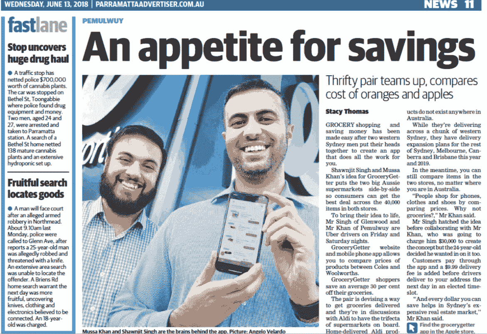
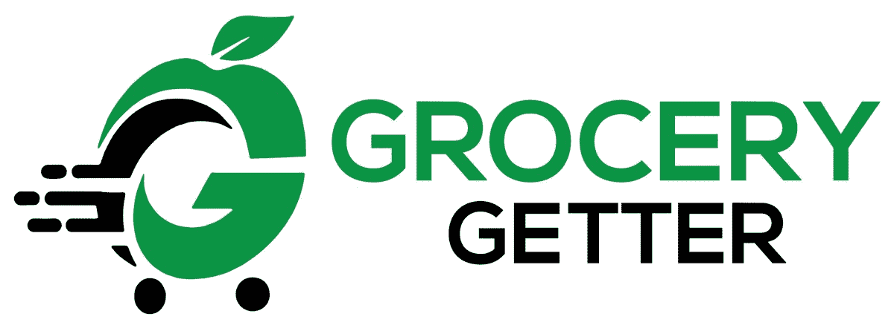

# 我们如何通过连续三个月晚上工作为澳大利亚人节省了 10 万美元

> 原文：<https://www.indiehackers.com/interview/how-we-saved-australians-100k-by-working-evenings-for-three-months-105d177bce>

## 你好！你的背景是什么，你在做什么？

你好。我是肖恩吉特·辛格。我是 GroceryGetter(T1)的联合创始人，这是一个应用程序，可以让你比较杂货价格和你需要的从单个超市送货上门的最便宜的杂货，费用很低。

当我们刚开始创业时，我在技术领域毫无经验，必须一路学习和适应。

我在金融服务行业工作，并在汽车行业开始了另外两项业务，其中一项还获得了全国性的电视报道。

GroceryGetter 现在在澳大利亚拥有超过 20，000 名用户，在我们推出后仅 5 个月，就帮助澳大利亚人节省了超过 100，000 美元。七月下旬，我们还上了*全国新闻*的专题节目。

[https://player.vimeo.com/video/282766905](https://player.vimeo.com/video/282766905)

## 是什么促使你开始使用 GroceryGetter？

在当地超市购物时，我买了一盒零售价为 7.40 美元的麦片。模糊地意识到超市的广告，我想知道这盒麦片是否在竞争对手的商店打折。

回家后，我径直走到电脑前，在一家竞争对手那里搜索麦片的价格，结果是 3.75 美元。如果我比较价格的话，我可以在一件商品上省下 3 美元。

然后我开始建立你的平均家庭清单。肉类，谷物，食谱基础，酱料，以及其他许多项目，都包括在这个篮子里的 30 个项目。通过对两家大型连锁超市进行一篮子比较，我意识到从最便宜的超市购买每件商品可以节省 30%的费用。

此时，我需要弄清楚这是否是人们想要的产品。所以我抓起纸、笔和写字板，径直走进离我最近的杂货店。我开始调查顾客的购物行为，询问他们是否愿意使用一项服务，向他们展示附近超市里最便宜的商品价格。

有了惊人的店内反馈，我开始使用 SurveyMonkey 来交叉引用我在规模上获得的定性结果。许多人再次表示，他们希望看到这样的产品上市，30%的人愿意每周支付 1 美元来使用这样的应用程序。

有了这些信息，我知道我必须找到一个能够帮助实现这个梦想的联合创始人。

## 构建最初的产品需要什么？

当你有了一个想法，构建最初的产品一开始似乎并不困难。然而，你开始挖掘得越深，你就越意识到它的困难。

我找到了一位联合创始人，他同意加入这场革命。我们从建立一个登陆页面开始，然后在脸书到处发垃圾邮件。这导致了 3000 名有兴趣成为我们 MVP 一员的人的参与。

从那里，我们开始获取在任何一家连锁超市销售的所有单个产品，但是为了让客户了解类似产品的价格，我们必须匹配它们。

将 40，000 种产品相互匹配的累人过程非常痛苦。幸运的是，对于大部分超市产品来说，这个任务只需要执行一次。我们每天晚饭后花 3-4 个小时来完成它，我们只用了不到 3 个月的时间就完成了。

下一步是构建一个用户可以与之交互的前端。在我的脑海中，我设想了一个建议购物清单的概念，通过这个概念，用户将开始输入商品名称，建议将在下面弹出。

虽然这在理论上听起来不错，但在执行中却没有那么好。用户似乎不喜欢它，我们的搜索算法出现正确结果的几率不到 10%。

两位联合创始人花了 3-4 个月的时间保持一致，并花了大约 1000 美元利用离岸人才让我们获得了 MVP。

## 你是如何吸引用户并获得更大增长的？

在发布 MVP 之前，我们建立了一个登录页面，吸引了 3000 多封电子邮件。在发布日，我们向名单上的所有人发送了一封电子邮件，让他们知道 GroceryGetter 已经上线。这使我们能够在我们的产品上领先一步，在最初的 24 小时内有超过 1000 次下载。

从那时起，我们开始快速获得用户反馈。我们意识到，在进一步扩展应用程序之前，我们必须进行大量的可用性更改。

我们暂停了广告业务，让应用程序商店自行其是。在此期间，很难看到增长速度从每天 100 次下降到 50 次，然后又下降到 11 次。幸运的是，我们只用了 2 个月的时间就让应用体验达到了用户的预期。

2018 年 6 月 1 日，我们发布了 GroceryGetter 的第二版。这是结合专业用户界面/UX 设计师和客户反馈创建的。为了准备这次发布，我联系了当地的报纸，他们接受了我们的邀请，写了一篇关于 GroceryGetter 的文章。

一周后，当地报纸上的这篇文章发表了。这带来了微不足道的下载量，但接下来会更好。

 

白天，我们接到了澳大利亚最大的电视网之一第九频道的电话。他们在将在全国播放的时事节目中给我们安排了一个黄金时段。当时，我们觉得我们还没有准备好，要求他们再等一个月。

那个月是我们一生中压力最大的时刻之一。我们在争分夺秒地建立客户体验，我们准备好向*的一百万观众展示一个时事*。整整 4 周后，我们上了电视直播。

我们的网站在 15 分钟内就有大量用户涌入。这对我们的 Android 应用程序来说太重了，它崩溃了。不久之后，它又恢复了，但不幸的是，用户的涌入速度稳步放缓。

除了上面的体验，下面是我们做的一些小事情，它们带来了持续的下载量:

1.  脸书垃圾邮件:不要低估脸书本地买卖页面和其他形式的社区的力量。我用我妈妈的账号注册了该地区的妈妈团体，并在这些团体上发布了 GroceryGetter。
2.  合作关系:我接触了一个应用程序的开发者，这个应用程序允许你在超市看到特价商品，但不能订购。通过真诚的交谈，他提供了一个从他的应用程序到 GroceryGetter 的文本链接，为我们提供了一个可持续的和经常性的客户渠道。
3.  博客开发:这对你网站的有机流量开发至关重要。通过撰写与你的产品主题相关的文章，你的网站将获得有机的搜索流量。

## 你的商业模式是什么，你是如何增加收入的？

GroceryGetter 的商业模式相当简单。我们寻求通过几种方式赚钱:

1.  收取送货费，并提供超市送货上门服务。
2.  通过与各种连锁超市合作，从收费产品中赚取利润。
3.  综合层面的杂货购买数据分析和趋势(即消费者对牛奶价格敏感吗？如果有，多少？).

作为一家初创公司，我们目前还没有盈利，但我们已经完成了 100 多次向澳大利亚悉尼亲爱的客户运送杂货的工作。

我们使用 Stripe 作为我们的支付网关，他们在识别欺诈性支付方面的速度非常快。我们曾经有一位客户使用多张卡下了欺诈性订单，但 Stripe 在我们向该客户交付食品杂货之前拒绝了所有订单。

我们的收入仍在增长，因为我们扩大了营销力度，并利用多种渠道来获得新客户。

对于那些想创业的人，我的建议是熟悉你的商业模式，并与它亲密接触。你总是有可能找到客户，但你需要以长远来看对你有利的成本来这样做。你不想在没有投资者大量投资的情况下经营一家亏损的企业。

让自己熟悉你的商业模式，并与它亲密接触。你总是有可能找到客户，但你需要以长远来看对你有利的成本来这样做。

TweetShare

## 你未来的目标是什么？

我们的目标是根据客户反馈不断开发和迭代产品。目前，客户要求能够按最便宜的单价过滤结果，并按品牌排序。

从流量的角度来看，我们希望通过以下方式为我们的应用商店列表和网站建立可持续的流量流:

1.  博客伙伴关系
2.  应用合作伙伴关系
3.  新闻和博客文章
4.  通过各种脸书团体的竞赛和赠品

我们希望开始从业务中获得收入，以支付工资。经营一家自举企业意味着做出牺牲。达到我们可以拿薪水的水平，但选择将薪水再投资于业务是我们未来 6 个月的目标。

## 你面临的最大挑战和克服的障碍是什么？如果你必须重新开始，你会做什么不同的事？

我会有一个更复杂的 UI/UX 应用程序的第一次迭代的自由职业者。

害怕我自己的选择也是另一个失败。我的直觉通常会很快得出一个理性的结论，在电视上就是这样，当我觉得我们还没有准备好的时候。然而，一旦尘埃落定，我开始明白我们已经尽力了。

不过，在未来，我会聘请一名公关人员来管理电视网之类的关系，因为这些都是耗费大量时间的大项目。

## 有没有发现什么特别有帮助或者有优势的？

聊天。网络。

在悉尼，有一个大型的创业社区。见鬼，我们甚至有一整栋大楼专门用于此:悉尼创业中心。

一栋大楼里有 2000 多家初创公司，挤满了投资者之类的人。能够和以前做过的人交往，接受他们的建议，有助于理清你的思路，让你看得更远。你现在接受投资吗？你过会儿服用它们吗？你应该有多少用户？

我们做的一个最好的决定是为我们最初的用户群发送垃圾邮件给脸书群组。这让我们几乎不用花钱就能在我们的目标人群面前得到我们的名字。

经营自己的企业需要你有始终如一的奉献精神。我发现当我实现一个可靠的例程时，这是最好的。目前，我早上 5 点起床，在健身房开始一天的锻炼，然后吃一顿健康的早餐，前往办公室。这让我能够高效地度过一天，每天花 10 个小时在办公室里，眼睛都不眨一下。

## 对于刚刚起步的独立黑客，你有什么建议？

去做吧。我们可以给自己很多借口来解释为什么我们没有大胆尝试我们的想法，或者开始我们已经谈论了几年的生意。然而，在我们开始之前，我们不知道它会有多好。

TweetShare

一:照做就是了。

我们可以给自己很多借口来解释为什么我们没有大胆尝试我们的想法，或者开始我们已经谈论了几年的生意。然而，在我们开始之前，我们不知道它会有多好。小步骤导致大事情。

二:准备好学习。

开创自己的事业是你所接受的最好的教育。在主持节目时，你需要身兼数职。客户支持、营销、产品开发、公关、招聘经理...这样的例子不胜枚举。这一切都落在你和你的小团队身上。

三:阅读。

我的第一个推荐是西蒙·西内克的《从为什么开始》。阅读可以让你开阔视野，从别人的经历中学习。

## 我们可以去哪里了解更多？

在 GroceryGetter.com.au 的[退房。](https://www.grocerygetter.com.au)

如果你有任何问题，请在下面的评论区提问。

 

——[<picture id="ember8041568" class="user-avatar ember-view user-link__avatar"></picture>grocer getter](/GroceryGetter?id=jrkee1kPy4ac33rFD3KXChYjfy92)，grocer getter 的创始人

## 想像 GroceryGetter 一样建立自己的事业？

你应该加入[独立黑客社区](/)！🤗

我们是几千名创始人，互相帮助建立有利可图的业务和副业。来分享你正在做的事情，并从你的同事那里获得反馈。

还没准备好开始使用你的产品吗？没问题。这个社区是一个认识人、学习和实践的好地方。随意[随便浏览](/)！

——[<picture id="ember8041573" class="user-avatar ember-view user-link__avatar"></picture>考特兰艾伦](/csallen?id=ibTLPyjwVebnZjMGKvz6ztarnuV2)，独立黑客创始人

12votes