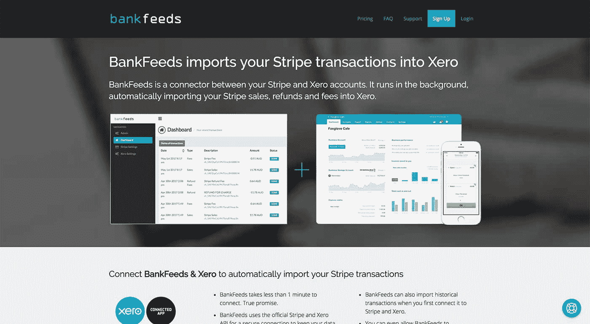
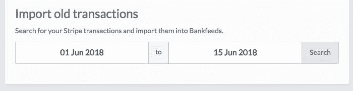
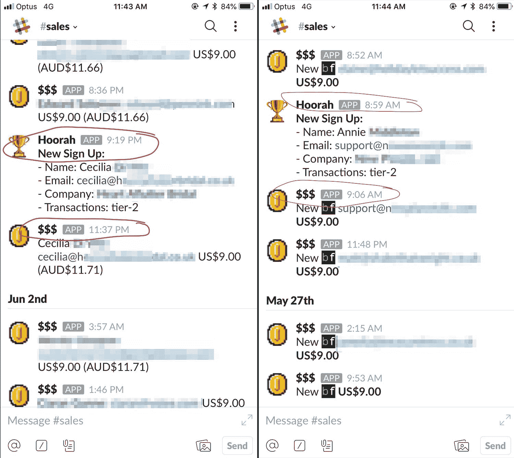

# 我们如何解决自己的问题并将解决方案推向市场

> 原文：<https://www.indiehackers.com/interview/how-we-solved-our-own-problem-and-brought-the-solution-to-the-market-6425eb57cf>

## 你好！你的背景是什么，你在做什么？

你好。我是迈克尔，来自澳大利亚的创始人。我过去一直经营着一家更传统(增长缓慢)的企业，直到我卖掉公司，开始用我学到的知识建立更快增长的企业。在过去的七年多时间里，我一直在和一位联合创始人(我生命中最老的朋友)一起创建有趣且令人兴奋的公司。

我们有一对更严肃的组合，分别叫做 [LeadChat](https://www.leadchat.com) 和 [PoweredLocal](https://www.poweredlocal.com) 。像许多独立黑客一样，我们开始了一些兼职，这些兼职产生于我们在追求成功时遇到的障碍。我们意识到没有其他人在解决这些问题，至少在我们看来是有意义的，所以我们尝试了一下。

[Bankfeeds.io](https://www.indiehackers.com/product/bankfeeds-io) 解决了将所有成功的 [Stripe](https://stripe.com) 交易(销售、费用、退款、转账等)转化为类似于[Xero.com](https://xero.com)银行账户的 feed 的令人毛骨悚然的限制——类似于你如何看到“真实的”银行账户和 Yodlee feeds。

这是一个简单的低收费 SaaS，目前每月收入约 1800 美元，分为免费(低使用率)和付费用户。

 

## 是什么促使你开始使用 bankfeeds？

我们正在开展一项规模可观的电子商务业务，并使用 Stripe 和 Paypal 作为支付选项。我们在 Xero 有一个作为银行账户的 PayPal，但 Stripe 销售的对账绝对是一场噩梦。

我们每天处理大约 2000 份外币订单。因此，我们每天有 2000 笔销售、2000 笔费用、一次银行转账和少量退款——但我们在 Xero 看到的只是每天有一批大宗款项打入我们的银行账户。更糟糕的是，那笔总额来自(当时)7 天前，费用包括可抵扣的税款，有些销售包括税款，有些不包括。我们没有真正的方法来协调它，这造成了一个巨大的问题。每次一次性存款后，我们运行一个大的会计规则，然后每三个月花几个小时做导出、导入、拆分、求和等等。你明白了。

我记得 2014 年 12 月在谷歌上搜索解决方案，结果一无所获。在这一点上，我认为我们需要建立一个解决方案，但没有付诸行动。2015 年 1 月或 2 月，我实际上遇到了一个*解决方案*。还可以。我想我一定是他们的前 10 个用户之一，可能是他们最大的交易客户。

我解决的问题是我的问题。

TweetShare

但是有件事困扰着我。没有真正的方法可以通过 API 用对账单行生成真正的银行 feed。所以这个应用程序(大概)使用了一个机器人来登录 Xero 并上传数据。它总是坏，任何来自 Xero 的小 UX 更新都会坏。但最让我担心的是安全风险。他们将所有这些 Xero 帐户的完全访问权限存储在一个用户中。但是它确实起作用了，把几个小时减少到一个月两个小时左右(它仍然需要分配和错误检查)。

所以我搁置了我的想法一年。直到我偶然发现了一个 Github 的回购，这个回购的人也有同样的问题，并为自己开发了一个解决问题的工具。我联系了他，建议我们把它造出来并商业化。我承诺成为第一批五个客户，因为当时我们有很多业务和副业，可以用我们的交易量严格测试它。

作为联合创始人，我们做的第一件事是建立一个售前登录页面，以评估人们的兴趣。我们将它与发布时的一年预付折扣计划捆绑在一起。由此，我们产生了大约 30 个注册用户，他们给银行汇了一些钱。

验证。

## 构建最初的产品需要什么？

我喜欢认为我在理解用户流和合理的 UX 方面有相当好的技能。幸运的是，我也熟悉 Xero.com 和 Stripe.com，并且大体上知道一个每天处理数千笔交易的企业是什么样子的。

我画了一个技术线框——从用户的角度来看，当有人点击注册按钮时会发生什么。我们的一位令人敬畏的创始人负责开发，他非常擅长将点点滴滴联系起来，并设想出构建框架所需的一切细节。

每个人都很遥远，所以我们和 Trello 一起管理了整个事情(现在仍然如此)。我们只在域名和主题上花了几美元，还不到 1000 美元。

一旦你有了想法，就去验证它。

TweetShare

不过，我们确实有一些东西，但不应该被视为理所当然:具有框架和经验的预先存在的业务。对我们来说，旋转东西、注册、分配等等更容易。，因为我们有多年的经验。开发人员花了大约两个月的兼职工作，从零开始到一个产品准备好让 Xero 通过他们的 API。

这就是事情卡住的地方。我是 Xero 的忠实粉丝，但当时在场的“开发者福音传道者”是一个真正的作品。因此，至少在当时，它的工作方式是你向 Xero 提交一大堆技术和一般细节，他们给你一个开发者 API 来构建。构建完成后，您必须为开发人员提供登录、查看应用程序以及批准您使用生产 API 的权限。基本上，检查你构建的东西是否符合你所说的你将要开发的东西。

我们知道这是一个 10 分钟的工作，*最多*。我们花了三个月的时间试图让这个家伙——他一直说他太忙了，没有时间看它——登录到演示帐户，给它一次机会。最终，我们决定利用我们之间的商业关系。我们有一个招聘人员，我们在另一个业务中使用，他联系了开发者福音传道者，因为我们知道他已经和他有了职业关系。在他们联系后大约 15 分钟，我们的应用程序被批准了。

这整个经历相当令人沮丧。在最初兴奋的创作、启动和宏伟的发展之后，我们艰难地度过了三个月的时间，我们认为我们都只是在浪费时间，因为一家大公司的一个人在扮演看门人，并利用他的自我来控制我们的命运。

## 你是如何吸引用户和增加银行供稿的？

论坛，帖子，还有一些针对性的邮件。然后没什么…就 SEO。

我认为，因为这是一个相对较小的副作用，我们没有做那么多。我们应该这样做，但却没有。我们知道我们解决了一个巨大的问题，这意味着人们自然会寻找我们的解决方案。

不久前，我们确实尝试过向会计师发送一些有针对性的出站电子邮件。有趣的是，我们给一位来自新西兰的前会计师发了封电子邮件，他已经开始在 Xero 工作了。没有意识到这种联系，他们向 Xero 举报我们是垃圾邮件。一个赛罗公司的代表让我们陷入困境，威胁要关闭我们的公司，等等。他要求我们给他们所有注册和联系记录的清单。这有点令人难以置信。又一次，我们该问问这个世界到底怎么了，这是否真的值得。我们告诉他，我们不愿意侵犯用户和注册用户的隐私，并对他的态度和要求感到有些震惊。

这家伙向他的经理提交了一份报告，目的是让我们关门。幸运的是，冷静的头脑占了上风。他的经理伸出手来，祝贺我们的成功，并要求 Xero 代表尽一切努力支持我们。

我们很震惊，但是嘿——最后，我们找到了冠军。

我们最终收到了 Xerocon 的邀请和 Xero 提供的推广帮助。事实证明，这位高级经理专注于业务目标，并认识到我们已经以一种智能的方式解决了 Xero 和 Stripe 用户的一个大功能请求，我们在应用程序上建立的活跃用户群证明了这一点。

最终遇到一个具有批判性思维的人，一个理解该部门目标的人——与第三方应用合作伙伴一起改进产品——而不仅仅是一个“不”的人或一个渴望权力的布道者，这是一种新鲜空气。

希望我不要因为写上面而惹上麻烦！

## 你的商业模式是什么，你是如何增加收入的？

我们的目标是非常低接触。

根据我们自己的经验，我们知道一些基本的真理:

1.  每个人都想知道它的成本。
2.  解释产品的最好方式是免费试用。
3.  很少有人会把信用卡放进去免费试用，所以不要要求。
4.  如果你是一个每月交易 100 笔或 10，000 笔的客户，服务器和存储负载在很大程度上是无关紧要的，因此统一定价是明智的。

考虑到这一点，我们为用户的前 100 笔交易建立了免费试用，根据用户的不同，可以持续一个小时或几年。你要做的第一件事就是在 app.bankfeeds.io/signup 注册。然后，您需要完成连接到 Stripe 和 Xero 的步骤，设置您的默认设置，然后最好永远不再登录我们的应用程序(除了从免费升级到付费)。

我们打造的一个对收入影响最大的杀手级功能:一个导入历史数据的工具。

当我们启动时，我们有一堆导入历史数据的支持请求，所以我们构建了一个工具来满足需求。然而，这意味着第一批免费的 100 笔交易会很快被使用，因为历史交易会计入总数，用户通常会升级到付费版本。

 

大约 30%的付费用户在两小时内从试用变为付费。另外 60%的人会在接下来的两个月里这么做。

这里有几张我们追踪销售的 slack 的截图——你可以看到他们从注册免费试用到付钱给我们的速度有多快。

 

## 你未来的目标是什么？

其目的是减少人类接触的时间，并建立一个工具，用户只需要登录一次，以连接它的一切。梦想是一个零接触的侧面冲撞，或者尽可能接近的侧面冲撞。

因此，我优先考虑自动化——我们尽可能使用工具来自动化通知。如果有人给支持部门发电子邮件，这意味着我们在某些方面沟通失败，或者缺少一个重要的功能。

我们不断跟踪功能请求。一旦我们看到对某个特性的足够多的请求，我们就把它推进管道。

## 你面临的最大挑战和克服的障碍是什么？

我之前提到过它们，但是它告诉我们使用 Xero 有多困难。我认为这说明了不要在别人的平台上构建。

虽然如今其他已存在的平台很难避免，但重要的是要考虑到其他人挥舞着一把斧头，可以在任何时候以任何理由砍倒你，或者根本没有。Stripe 有一个更好的评估和与开发者合作的流程，我认为独立黑客是这种关系的完美例子。

梦想是一个零接触的侧面冲撞，或者尽可能接近的侧面冲撞。

TweetShare

我怀疑，围绕开发者和合作伙伴社区的重要性，这里有必要和重要的对话，或者至少有一种理解，即开发者是扩张和增长的核心组成部分，而其他一些业务并没有建立在开发者第一的思想上。

除非我认识 Xero 的某个前辈，否则我再也不会在他们的平台上建 app 了。

## 有没有发现什么特别有帮助或者有优势的？

我解决的问题是我的问题。

我有一家公司每天运行数千笔交易，并使用 Stripe 和 Xero。我处于构建 bankfeeds.io 产品的最佳位置，因为我不仅对问题有深刻的了解，而且对我正在努力寻找的解决方案也有深刻的了解。

想了解市场需要什么，就要了解问题。

## 对于刚刚起步的独立黑客，你有什么建议？

如果有开发者可以随时下载你的应用，那么就要认真考虑你将会陷入什么样的境地。如果这是你正在寻找的道路，那么投入更多的时间和金钱与福音传道者交朋友，而不是开发你的产品，可能是明智的。

Stripe 有一个更好的评估和与开发者合作的流程，我认为独立黑客是这种关系的完美例子。

TweetShare

否则，看看 Stripe、Github、Zapier、Heroku、Twilio、Atlassian 和其他同样以开发者为先的公司。他们更有可能理解和尊重第三方开发者和应用，因为他们知道他们的用户群因此而增长。

一旦你有了想法，就去验证它。在你有产品之前，让一些人付钱。一旦你有了一个人(除了你自己)，你就知道有需求。一旦有了几个，就知道有市场了。

## 我们可以去哪里了解更多？

你可以在 [@michaeljankie](https://twitter.com/michaeljankie) 上找到我，或者发电子邮件给我，邮箱是 bankfeeds dot io 上的 michael。

想了解产品的更多信息？在 [bankfeeds.io](https://bankfeeds.io) 免费查看。如果你注册了付费网站，在第一个月的时候给我打电话，之后我会给你加几个月的免费时间，只要提到这篇文章。

—[<picture id="ember8118888" class="user-avatar ember-view user-link__avatar"></picture>迈克尔·J](/mjankie?id=Rtx1uVOafPPWtFOnuZjojIo3iwt1)【bank feeds . io 创始人

## 想像 Bankfeeds.io 一样建立自己的企业？

你应该加入[独立黑客社区](/)！🤗

我们是几千名创始人，互相帮助建立有利可图的业务和副业。来分享你正在做的事情，并从你的同事那里获得反馈。

还没准备好开始使用你的产品吗？没问题。这个社区是一个认识人、学习和实践的好地方。随意[随便浏览](/)！

——[<picture id="ember8118893" class="user-avatar ember-view user-link__avatar"></picture>考特兰艾伦](/csallen?id=ibTLPyjwVebnZjMGKvz6ztarnuV2)，独立黑客创始人

45votes