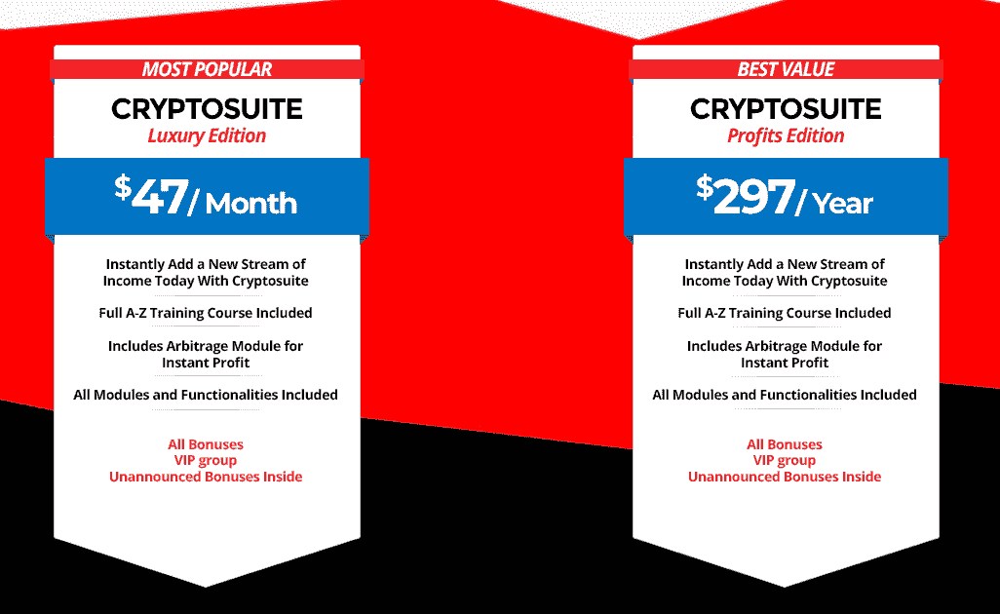

# 我们如何在动荡的市场中强势起步

> 原文：<https://www.indiehackers.com/interview/how-we-started-strong-in-a-tumultuous-marketplace-85425ecb18>

## 你好！你的背景是什么，你在做什么？

你好，我叫穆罕默德。我是一名计算机科学毕业生，已经在一家顶尖的科技公司工作了五年。 [CryptoSuite](http://www.cryptosuite.com/) 是加密货币领域的一套工具，允许您发现新硬币、设置价格警报、跟踪您的投资组合、研究 ico、发现套利机会等等。

CryptoSuite 于 8 个月前推出，到目前为止，我们已经取得了超过 35 万美元的销售额。

 

## 是什么促使你开始使用 CryptoSuite？

加密货币成为新闻的趋势，因此，加密市场被大量寻求投资和建立投资组合的人淹没。有一堆丑陋的投资和交易产品对专家来说是好的，但对新手来说，缺乏简单的工具来帮助他们入门、积累知识和进入市场。我真的觉得我们之间有隔阂。我自己做了一些交易，买了一些 alt 币，投资了一些加密基金。总的来说，事情看起来相当令人不知所措，即使对作为软件工程师的我来说也是如此，似乎没有一个地方可以获得开始工作所需的所有信息。

因此，我们决定通过早期访问网络研讨会来构建 Cryptosuite 的基本版本，我们在网络研讨会上出售该工具的一次性购买版本。我们明确表示这是一个仍在开发中的测试工具，但我们希望尽早开放，以便在我们继续构建产品和迭代时获得一些反馈。光是那场网络研讨会就赚了 4 万美元。

## 构建最初的产品需要什么？

我从围绕 crypto APIs 的示例代码开始，我对其进行了扩展，以构建一些警报功能。我在设计上也花了很多心思——我想让加密货币看起来更容易使用，更有趣。有很多丑陋的交易所完全建立在无聊、不祥的全黑之中，但我希望 CryptoSuite 看起来有趣而诱人。

确定目标受众，努力改善核心受众的体验。

TweetShare

从功能的角度来看，我们很清楚我们的目标受众:加密领域的新手。我们有意放弃了一些更复杂的特性，以扩大覆盖面，使这个工具对第一次接触 crypto 的人来说更容易使用和有用。我们还决定放弃自动交易等功能，因为管理这类服务的风险比我们愿意承担的要大。

## 你是如何吸引用户并发展 CryptoSuite 的？

我们通过向之前购买过我们产品的用户列表发送一封电子邮件，吸引潜在客户参加发布网上研讨会。那时，软件还没有完成，网上研讨会的目的是衡量人们的兴趣，并获得一些早期反馈和验证。我们出售了一个终身许可证，附带说明产品还没有完全准备好。网上研讨会取得了巨大成功，收入约为 40，000 美元。

网上研讨会的反响肯定了我们对该产品的信心，我们用 40k 美元购买了溢价。以 5000 美元的价格购买. com 域名，招募会员，举办销售竞赛。我们的销售很大一部分来自我们组织的发布竞赛，该竞赛有 20，000 美元的奖金池。

我强烈建议你尽早开始出售，以衡量你的兴趣。除了对市场可行性的验证，早期采用者也非常渴望给出好的反馈，你可以用它来区分特性的优先级。

## 你的商业模式是什么，你是如何增加收入的？

我们的业务模式基于按月订阅和按年折扣订阅的模式。我们的收入主要来自于我们与互联网营销领域的热门营销人员举办的联盟发布竞赛。我们还定期与受欢迎的营销人员一起开展一些私人促销活动，以从他们的受众中获得更多订户。

截至目前，我们的年订阅量约为 15 万美元，月订阅量约为 1.2 万美元。由于加密货币的下跌，订阅量一直在下降。虽然加密货币的流行确实给了我们快速的提振，但市场的不稳定性似乎也可能导致我们最终的灭亡。

我们的主要分销模式依赖于代销商，他们获得 50%的收入分成。这无疑是我们最大的开支，但也要考虑到促销方面。我们在广告上几乎没花什么钱。我们的服务器支出很少，最大的支出是事务性电子邮件支出，过去每月要花费 100 美元或更多。迁移到亚马逊 SES 后，这一成本降低到了每月 5 美元左右，这很不错。

 

## 你未来的目标是什么？

鉴于加密货币的衰落，我们对未来不抱太大希望。

## 你面临的最大挑战和克服的障碍是什么？如果你必须重新开始，你会做什么不同的事？

我认为我们面临的最大挑战是我们完全基于加密货币。我们的成败与加密货币的表现密切相关。

## 有没有发现什么特别有帮助或者有优势的？

有一个专注的受众是有帮助的，即不熟悉加密货币的人。一次又一次，我们收到了客户的反馈，他们要求复杂的功能来迎合高级用户。我们很清楚，我们不想涉足这些市场，我们没有在这些市场上花时间是件好事。

## 对于刚刚起步的独立黑客，你有什么建议？

确定目标受众，努力改善核心受众的体验。避免功能膨胀，尽早发布。LinkedIn 的雷德·霍夫曼提供了一些建议，我发现这些建议特别有帮助，他说，“如果你对你产品的第一个版本不感到尴尬，那你就推出得太晚了。”

## 我们可以去哪里了解更多？

你可以在[app.cryptosuite.com](https://app.cryptosuite.com)了解更多关于该工具的信息。如果你有任何问题，请告诉我，我很乐意帮忙。:)

——[<picture id="ember5315132" class="user-avatar ember-view user-link__avatar"></picture>穆罕默德](/mohammadshabaz?id=r3b2U0GiOifegv1u0h51LtRHVWt1)，CryptoSuite 创始人

## 想像 CryptoSuite 一样建立自己的事业？

你应该加入[独立黑客社区](/)！🤗

我们是几千名创始人，互相帮助建立有利可图的业务和副业。来分享你正在做的事情，并从你的同事那里获得反馈。

还没准备好开始使用你的产品吗？没问题。这个社区是一个认识人、学习和实践的好地方。随意[随便浏览](/)！

—[<picture id="ember5315137" class="user-avatar ember-view user-link__avatar"></picture>考特兰艾伦](/csallen?id=ibTLPyjwVebnZjMGKvz6ztarnuV2)，独立黑客创始人

12votes