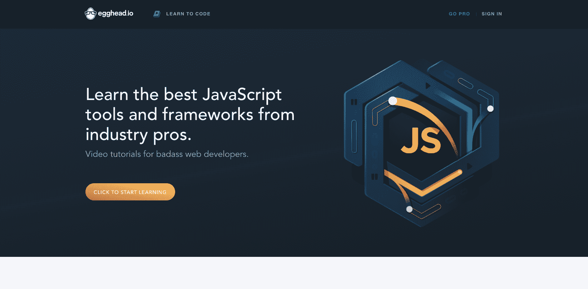
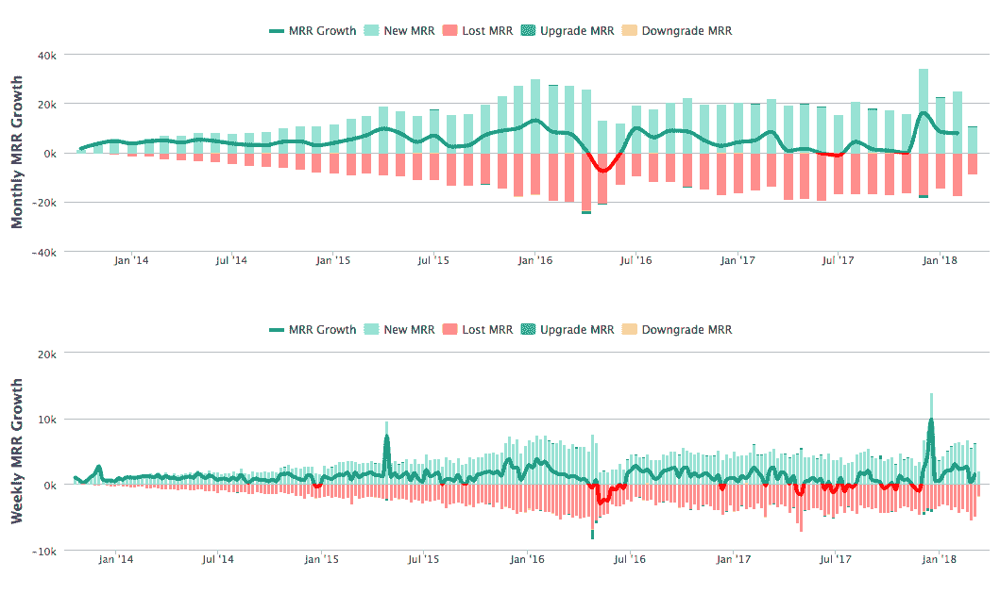
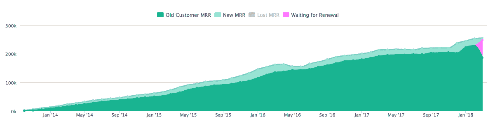

# 我们如何将编码截屏变成百万美元的生意

> 原文：<https://www.indiehackers.com/interview/how-we-turned-coding-screencasts-into-a-million-dollar-business-f20ef382a1>

## 你好！你的背景是什么，你在做什么？

你好。我是乔尔·胡克斯。我共同创立了 egghead.io，这是一个为网络开发者提供简短视频的平台。我住在华盛顿的温哥华，帮助家里教育我们的五个孩子。

我的职业生涯始于一名 3D 建模师/动画师。我花了 13 年才意识到，如果我想把自己推向更高的目标，我需要做一些不同的事情。

我的目标从来不是“成为一名程序员”。

我读了保罗·格拉厄姆的[黑客&画家](https://www.amazon.com/Hackers-Painters-Big-Ideas-Computer/dp/1449389554)，这让我彻底相信，如果我想要掌控自己的命运，不被困住，就必须有所改变。

“我需要创业...或者别的什么，”这是我读完这本书后所能想到的。但是你怎么去那里呢？你从哪里开始培养创造某样东西所需的技能？

如果你只有一个想法，那是不可能的。想法毫无价值。执行力就是一切。

于是我开始学习经济学、商学、计算机编程。学习编码是一个巨大的挑战，但是一旦它成功了，它就成功了。经过一年的自学，我在 2009 年找到了第一份职业程序员的工作。

我的第一份工作持续了几乎整整一年，我把我的空闲时间花在开源项目上，主要是写单元测试和文档。这导致了我的第一次会议演讲，两本书的交易，以及一份利润丰厚的顾问工作，在那里我是一名“高级技术架构师”

假装直到你成功！

经过一年的自学，我在 2009 年找到了第一份职业程序员的工作。

TweetShare

总的来说，咨询是一次很棒的经历。我能够在各种规模的不同企业中工作。它给了我在产品开发、项目管理方面的直接经验，以及无数在**不该做什么的教训。**

后台继续学习，2011 年开始考 [Amy Hoy 的 30x500](https://30x500.com/academy/) 。我花了几年时间才明白，因为我无法超越“解决方案优先”的方法。

2013 年夏天，电灯泡亮了，我和我的联合创始人约翰·林德奎斯特创办了 egghead.io。自 2013 年 11 月以来，我们已经发展到 12 人全职工作于 egghead，每月 275，000 美元的经常性收入，为 web 开发人员提供高质量的小屏幕广播。

 

## 是什么促使你开始使用 egghead.io？

“向你的观众推销。”

我第一次尝试做产品生意时，令人沮丧地失败了，因为我试图向一个我不了解的受众提供产品解决方案。所以我改变了态度。我不再继续为我不完全了解或不属于的观众解决问题，而是开始关注我已经有了观众的那群人。

软件开发人员是我的部落。我知道他们的问题。我知道他们在网上闲逛的地方，我是这个社区中值得信任的成员。

给计算机编程确实很难。编写计算机程序也是一项利润丰厚的职业。我就是一个活生生的例子，证明你可以在相对较短的时间内学会编程并开始一项职业。

问题是，“我们如何帮助人们到达那里？”

2013 年 AngularJS 达到了顶峰。我参加了费城的 BaconBiz 会议，每个人都问我在做什么。我的产品是什么？“我不知道，我想我会写一本关于棱角什么的书？”这有点尴尬，但我确实开始看这本书了。

我的联合创始人约翰在 YouTube 上创建了这些优秀的 AngularJS 截屏视频，并通过捐赠按钮在 [egghead.io](https://egghead.io/) 上以嵌入视频的形式发布。

比起制作内容，我更渴望在互联网上赚钱，所以我缠了约翰几个月，让我看看我能对他的视频做些什么。回过头来看，我通过 egghead.io 做的“第一笔销售”是让约翰相信我可以执行。

## 构建最初的产品需要什么？

早期，内容创作之外的一切都是我在做**。同样，我们不能在内容方面让约翰筋疲力尽，重要的是我也要保持理智和快乐。**

 **制作一个在线产品需要做很多事情:

*   服务器端开发
*   前端(UI)开发
*   网络营销
*   商业
*   会计
*   设计
*   用户体验
*   支持
*   分析学
*   通信
*   文案
*   …?

深入研究和编码的能力过去是，现在仍然是一个重要的优势。

我选择使用 Rails 来构建网站，并遵循了 RailsApps 教程，它让我获得了认证用户和 Stripe 集成。在两周内，我们从一无所有到在 Heroku 上部署了一个可以订阅的视频博客。

Wistia 的联合创始人兼首席执行官克里斯·萨维奇(Chris Savage)免费为我们提供视频托管服务。免费的！多酷啊。我只是给他发了邮件问了一下，他就帮我们牵线搭桥了。

很快我就知道我不想让约翰成为唯一一个创造内容的人。作为付费订阅服务的唯一贡献者，内容制作者面临着巨大的压力。它可以是无情的，令人筋疲力尽的，并且经常导致精疲力竭。

冷静。增量。一致。这就是我们计划如何到达那里，没有任何外部压力使这成为可能。

TweetShare

为了让 egghead 取得成功，我们需要引进其他教师来增加多样性，并卸下 John 肩上的重担。我们联系了业内的朋友，说服他们制作内容，并承诺我会“解决”，他们会得到报酬。

我们从只有约翰创建内容发展到几个人创建内容，我们开始兑现承诺，定期为人们提供优质内容。

这一系列事件发生在 2013 年 10 月至 2014 年 2 月，当时我辞去了全职工作，全职专注于 [egghead.io](https://egghead.io/) 。在接下来的几年里，现场培训补贴了我的收入，这让我有很大的自由，一个月“工作”几天，而在其余时间构建 egghead。

egghead.io 自推出以来一直盈利。

 

## 你们是如何吸引用户，壮大 egghead.io 的？

在约翰被说服让我出售他的作品后，我们将他的 50 个视频打包成 zip 文件，以 50 美元的价格出售。他有一份捐赠者名单，我有一份我正在博客上建立的电子邮件名单。

我们在第一周赚了 6000 美元，并且 100%验证了这个想法。这也给了我们工作的预算和口袋里的一点零用钱。

在我们卖出“前 50 个”zip 文件后，下一步是建立订阅服务。我们想提供一个只有会员才能观看的视频流，人们需要支付月费或年费才能观看。问题是，当时我们没有任何优质内容，只有约翰的前 50 个视频和一个制作更多视频的承诺。

那时我们俩都有稳定的全职工作。我已经准备好停止咨询，开始全职研究 egghead，但是账单仍然需要支付。

随着网站的建立和运行，我们使用我们的电子邮件列表，并发出了推介。没有任何实际的优质内容，网站仍在建设中，我们要求我们的观众以 99 美元的价格承诺一年的优质 [egghead.io](https://egghead.io/) 。

他们做到了。人们信任我们。这很鼓舞人心，我很晚才开始搭建并运行平台，而约翰则开始制作内容。

在整个过程中，建立电子邮件列表是必不可少的。

我们还尝试通过创建引人注目的内容并在文本中很好地描述它来遵循良好的 SEO 实践。我们的有机流量相当稳定，但建立电子邮件列表是关键。

在整个过程中，建立电子邮件列表是必不可少的。

TweetShare

随着我们的成长，电子邮件变得越来越复杂。当有人观看免费课程时，最终在四个左右的视频后，我们会要求发送电子邮件以继续。在此基础上，我们根据他们观看的主题向他们发送一系列电子邮件，以便更有针对性地满足他们的兴趣。

帮助我们的一件事是与开源产品维护者合作发布免费的社区资源内容。我们与维护者合作，为他们的项目创建课程，每个人都可以免费观看。他们在他们工具的文档中链接到他们的课程，我们向那些观看的人推销 egghead。结果是开源维护者定期检查他们的工作，我们的声誉和成员数量同时增长。

自从我们开始询问电子邮件地址以来，我们每天都有 200-300 人加入我们的电子邮件列表，这反过来又带来了强劲的转换数字和持续的增长趋势。

 

## 你的商业模式是什么，你是如何增加收入的？

[egghead.io](https://egghead.io/) 通过订阅赚钱。我们提供了稳定的新内容流，涵盖了对现代 web 开发有用且最新的库和框架。

当我们的 MRR 相对较低时，我们也四处旅行，为公司以及一些出售门票的公众举办现场研讨会。工作坊让我可以辞去全职工作，专注于书呆子。

自从我们开始以来，我们已经看到了缓慢而稳定的增长。T2 出现了一些小问题，而 MRR 则保持不变，甚至略有下降。

 

当我们跌入红色时，这是一个迹象，表明波动正在击败增长，这可能会导致“见鬼的恐慌！”当你不确定*为什么*会发生的时候。2016 年年中那次可怕的下跌就是其中之一。我仍然不确定为什么会发生这种情况，尽管这可能与我们的有机搜索流量有关。

我不是一个沉迷于分析的人。我每天从系统中得到一条消息，告诉我我们增加了多少客户，每天的收入是多少，以及当前的 MRR 是多少。除此之外，当事情看起来有点怪异时，我不太注意，也尽量不惊慌。

定价一直是一个挑战，而且常常让人觉得是流失/增长斗争的原因。对我来说，最突出的问题是反馈循环非常非常慢。当你改变价格时，你不知道几个月来它是如何影响你的业务的。如果你不断地做出改变，就很难确定它到底在做什么。我学会了耐心。

我尝试过几种定价方法。我们将重点放在年度订阅上，这对于降低客户流失率和获得现金收入非常有利，尽管它也可能会阻碍整体增长，并且可能会限制那些无法做出如此重大财务承诺的人。当我们完全取消月计划时，这引起了大量询问月计划的电子邮件。

2017 年感觉停滞不前，因为我们没有像前两年那样每周给 MRR+1000 美元，但当我回顾 12 月的数字时，我们经历了大约 20%的收入增长，这是一个很大的数字。

 

## 你未来的目标是什么？

egghead.io 是一个为内容创作者提供营销、制作和会计支持的平台。我们专注于 web 开发，将其作为我们制作内容的范围。我想把这个范围扩大到更像“在互联网上创业”的东西，并教授这个篮子里令人着迷的一系列主题。

到目前为止，对我来说，整个过程中最有意义的方面是能够客观地改善人们的生活。

我们有两组顾客。

1.  我们正在帮助我们的许多成员学习新的技能，从而带来更多的机会、更高的薪水和更多的职业发展机会。
2.  我们还为我们的导师提供了一个平台来分享他们的知识和专长，获得版税，并以一种促进其职业发展的方式放大他们的声音。我们帮助他们偿还抵押贷款，把食物放在桌子上，并获得自由，让他们在工作中承担更多风险，因为他们有稳定的收入。

我们希望在这方面突破极限，吸取迄今为止最有效的部分，并逐步改进它们。我们希望支付更多版税，帮助更多人在工作生活中体验自由。

当我们看到是什么让内容创作变得如此痛苦，并努力消除这种痛苦时，我们就能为内容创作者创造出出色的体验。内容创作者可以专注于分享知识，而我们获取这些原材料，并对其进行组织和润色。我们提供支持材料，并通过学习途径将内容联系起来，帮助消费者以流畅/非线性的方式获得实现目标所需的知识。

另一方面，我有一个白日梦般的想法，认为 egghead 可以作为一个工作培训引擎。我们一直雇佣不专业的人来以合理的价格审查内容。他们正在为我们的课程制作补充材料，如果他们愿意的话，最终他们会在这个过程中学习编码。

这条管道让我兴奋地想到随着我们的成长和扩张，创造就业的潜力。它不仅为我们提供了一个优秀的内部晋升人才库，而且如果运作良好，我们还可以作为一种就业安置服务，将合格的申请人与雇主联系起来，这将继续帮助他们在职业上成长。

自从我们开始创业，钱就是一个障碍。很慢。接受投资的吸引力在于加速。我们可以雇佣更多人，发展得更快，但我也知道我可能会不堪重负。我们将继续缓慢而稳定地运营。

*   我们没有截止日期。
*   我们不加班。
*   我们要求人们休假。
*   我们没有大量的积压。
*   我们不估计。
*   我们没有站着开会。
*   我们不 SCRUM。
*   我们不会坚持不懈地追求敏捷。

冷静。增量。一致。

这就是我们计划如何到达那里，没有任何外部压力使这成为可能。

经营企业对我来说也是一个学习的过程。egghead 是我的第一个在线业务。我读过很多书，但这并不能替代。我们平静从容的步伐让我得以学习和成长。它允许我戴上所有的帽子，然后慢慢摘下来，让其他人负责部分业务。作为一个控制狂，我花了很多时间来学习和接受这样一个事实，我不必控制一切，我甚至不必一直像一样*一切。没事的；我们可以稍后修复或改进它。*

## 你面临的最大挑战和克服的障碍是什么？如果你必须重新开始，你会做什么不同的事？

在 egghead 之前，我从未负责过雇佣或解雇员工。我曾是团队领导，这提供了一些管理技术团队的经验，但不是招聘和解雇。

人员配备对我来说是最重要的学习曲线，再加上在这方面搞砸是可怕的。当你雇佣了一个人，但没有成功，纠正措施会深刻地影响人们的生活。

关于招聘，我学到最多的一点是，对我来说，我们需要一起工作一段时间(合同)，然后才能建立全职关系，以确保我们是兼容的。

这些天来，我在“发现参与”阶段取得了成功，在这个阶段，我们付钱给一个人，让他看一下我们与其专业知识相关的系统，向我们提出问题，然后给我们一份报告，其中包含他们认为可以改进的地方的建议。然后，我们可以将这些想法作为项目，让他们作为顾问来实施他们提出的功能或建议。

如果成功了，那太好了。如果感觉合适，我们可以谈一个全职协议，或者如果个人愿意，也可以继续一段兼职关系。

如果没有，我们有一个建议清单，他们得到了很好的补偿，也没有什么不好的感觉。

## 有没有发现什么特别有帮助或者有优势的？

没那么努力。

说真的。有一种对“生产力”的崇拜，我就是不明白。在早期，我熬夜让一切运转起来。但最重要的是我不能筋疲力尽，所以随着时间的推移，我减少了工作时间。我经常休假。我有时会花一整天的时间在家里放松。我休假。我很冷。

你不需要自杀就能成功。这取决于你的目标和抱负，但我正努力为自己提供更多的时间，而不是更多的钱。这些经常是相关的，但是我努力优化快乐而不是利润。

我不太喜欢传统教育。我的五个孩子从来没有上过学，当我尝试的时候，又慢又乏味。虽然我不喜欢*学校*，但我是*教育*的超级粉丝。

参加网上课程是有益的。特别是艾米·霍伊的《30x500》和布伦南·邓恩的《顾问大师课》。当我接受他们的反馈和知识并加以应用时，这两点对我来说都是转折点。你可以上你能负担得起的所有昂贵的课程，但如果你不去申请，那只是在浪费你的时间。

我还注意到，如果你把某人的知识和建议放在心上并加以应用，他们会更愿意帮助你并回答问题。不要问愚蠢的问题。做你的研究。尽力而为，问出精彩的问题。当人们看到你努力尊重他们的知识和时间，他们会回报你。常以友情！

Amy Hoy、Alex Hillman、Joanna Weibe、Nathan Barry、Patrick McKenzie、Brennan Dunn、Nick Disabato、Kai Davis 和许多其他人都非常支持他们持续努力地教授和分享他们所知道的知识。

读书对我一直很有帮助。我完全同意为我的导师付费，在最基本的层面上，这就是你买书时所做的事情。显然，一本书不能给你提供具体的反馈，但它可以给你建议。

这些年来，有很多书帮助我明白，我可以创建一个企业，跳出每天工作的框框思考问题。以下并不是一份详尽的清单，而是一份按时间顺序排列的书籍清单，这些书籍有助于培养独立和企业家精神:

*   《富爸爸穷爸爸》:人们讨厌这本书，但它确实推动了**做些事情**,并且有很多优秀的参考资料。
*   电子神话重温:这本书是所有关于系统，侧重于专营权。它给出的建议是可重复性和写下你的东西是如何工作的，这样其他人也可以做。
*   高效能人士的 7 个习惯:不要担心自己控制不了的事情。
*   如何赢得朋友，影响人:题目解释了。这一次不负众望。年年读。
*   黑客和画家:这激励我开始认真工作，学习编码，并激发了我可以在互联网上赚钱的想法。
*   4 小时工作周:系统，系统，授权。

还有更多*，但这些都是基石，或者说代表了我在朝九晚五的工作中感到停滞不前时的顿悟。*

## 对于刚刚起步的独立黑客，你有什么建议？

我看到人们犯的最严重的错误是他们从解决方案开始。他们认为他们看到了一个问题，他们直接跳到这个想法。然后他们在有顾客之前就有了这个想法。

如果让我从头开始，我会审视自己，找出我所属的观众。我会接受这种自我认同，并开始向观众树立我的权威和专业知识。我会写博客来建立我的读者群，并以合理的价格为他们提供充满有用信息的指南。我会与购买我的材料的人交谈，看看他们还遇到了什么问题，我会考虑如何帮助他们解决这些问题。

这种方法适用于各种职业和主题。这是屡试不爽的。它不需要资本或大量的时间投入就可以开始。

与其寻找导师，**不如雇佣导师**。雇佣导师对我来说一次又一次被证明是有效的。有时，这是一种真正的牺牲，需要召开“家庭会议”来投资导师项目，但这是值得的。

## 我们可以去哪里了解更多？

我很少在 joelhooks.com 的 T2 写博客。我是推特上的 [@jhooks](https://twitter.com/jhooks) 。如果你是一名 web 开发人员，你可能想看看 [https://egghead.io](https://egghead.io) 。

如果你有任何问题，我非常乐意在下面的评论中尽力回答。

—[<picture id="ember8081453" class="user-avatar ember-view user-link__avatar"></picture>乔尔胡克](/joelhooks?id=tAbf3smCa2SZHon0OyvMNJADc1Y2)【egghead . io 创始人

## 想像 egghead.io 一样建立自己的事业？

你应该加入独立黑客社区！🤗

我们是几千名创始人，互相帮助建立有利可图的业务和副业。来分享你正在做的事情，并从你的同事那里获得反馈。

还没准备好开始使用你的产品吗？没问题。这个社区是一个认识人、学习和实践的好地方。随意[随便浏览](/)！

—[<picture id="ember8081458" class="user-avatar ember-view user-link__avatar"></picture>考特兰艾伦](/csallen?id=ibTLPyjwVebnZjMGKvz6ztarnuV2)，独立黑客创始人

145votes**