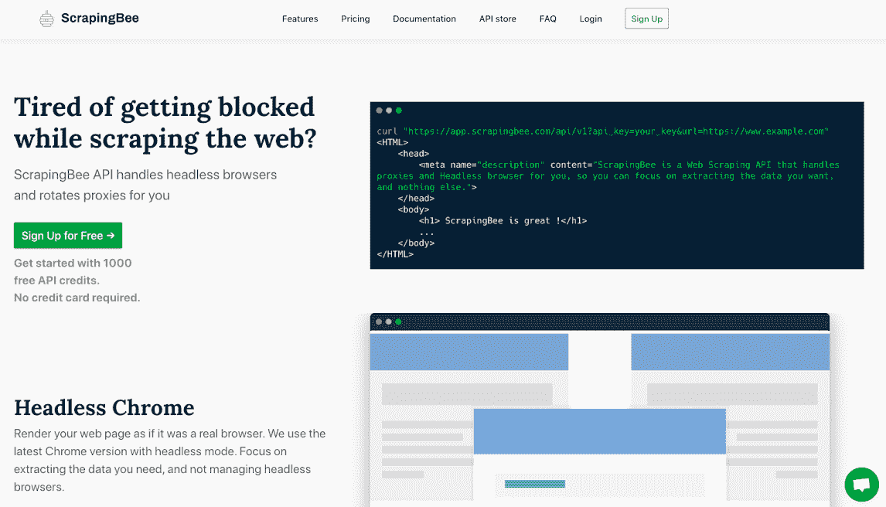
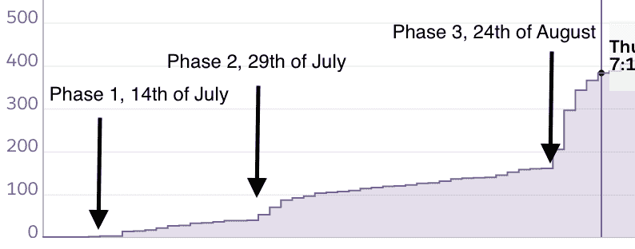
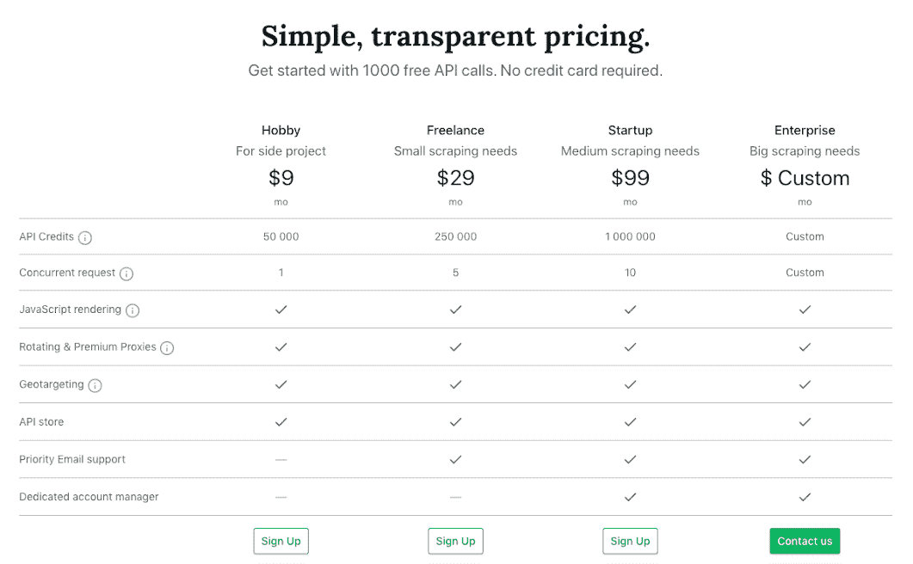

# 我们如何将两次失败变成价值 2500 美元的 MRR 成功

> 原文：<https://www.indiehackers.com/interview/how-we-turned-two-failures-into-a-2-500-mrr-success-33f7cd2114>

## 你好！你的背景是什么，你在做什么？

你好，我叫皮埃尔·德·伍尔夫。我 27 岁，目前住在巴黎。我是 [ScrapingBee](https://www.scrapingbee.com) 的联合创始人，这是一个网页抓取 API，为你处理代理、验证码解析和无头浏览器，这样你在抓取网页时就不会再被阻止了。

在专注于 ScrapingBee 之前，我花了 12 个月的时间和我一生的朋友兼联合创始人[凯文·沙欣](https://www.indiehackers.com/KevinSahin)一起开发产品。在那之前，我在一家最近被收购的成功创业公司担任数据工程师，专门从事房地产数据管理。在 T4 之前，我大部分时间都在法国的大学里度过。我还在波士顿做了一年的网页开发。

## 所以在开始报废之前，你花了 12 个月的时间努力打造成功的产品。发生了什么事？

所以基本上一切都是两年前开始的。我还在全职工作，而凯文刚刚离职。我和凯文谈了我女朋友的一个很棒的应用程序的想法。她希望能够在一个地方管理她有兴趣在线购买的所有商品。

我们认为这个想法很有趣，决定把它作为一个附带项目来做。当时凯文正在写他的 Java 网络抓取手册，我有一份全职工作。

三周后， [ShopToList](www.shoptolist.com) 诞生了。你可以从网上的任何网站添加产品，并每天收到价格下降的通知。我认识凯文已经有 15 年了，我们一起有过无数的边项目想法，但 ShopToList 是我们第一次真正发布有用的东西。

我们推出了产品搜索和 Reddit，并在两周内获得了约 3000 名注册用户。我们对此非常高兴。

然而，我们很快意识到，将这个副业项目转化为一个有利可图的产品真的很难。但这对我们来说无关紧要；这个东西不是很费时间，我们很高兴用我们制作的东西来帮助真实的人。

一天，在查看我们的数据库时，我们注意到 ShopToList 中的三个人拥有超过 1000 种产品。经过快速调查，我们发现这些人在网上管理电子商务，并使用 ShopToList 监控竞争对手的价格。

经过进一步的调查，我们注意到网上有很多监控价格的工具，但我们觉得我们可以做得更好，至少一样好。这一次，我们将为我们的产品收费。

我们试图通过制定一个比现有解决方案更好的解决方案来解决我们的一个痛点。

TweetShare

虽然如果我们只看产品，ShopToList 并不成功，但如果你看团队，我们会认为它是成功的。这向我和凯文展示了我们能够一起创造东西和工作。这一点，再加上我想辞职的事实，足以让我们决定开发 [PricingBot](https://www.pricingbot.co) ，一个价格监控工具。

2018 年 7 月，我离职了，我们正式创建了我们的公司。我们制作了一个登陆页面，解释 PricingBot 的目的，并在多个论坛和子栏目中发布。我们设法通过这种方式收集了 50 个电子邮件地址，并决定实际建立一个定价机器人。

在接下来的九个月里，发生了许多事情。我们设法很快地构建了 PricingBot，并在离开免费测试版两天后拥有了我们的第一个客户。起初，事情看起来很好。但是我们很快遇到了三个大问题:

*   问题 1:我们对电子商务或定价策略一无所知，这意味着我们很难理解我们的用户想要什么以及如何接触到他们
*   问题 2:当你需要建立一个价格监控系统时，将你的产品与你的竞争对手相匹配是非常耗时的。这意味着在我们的用户看到我们产品的价值之前，他们必须花很多时间来设置他们的账户。一开始，我们花了 120 个小时将我们的一款客户端产品与其竞争对手的产品进行人工匹配...一个月后他就要离职了。
*   问题 3:我们的转化率太低了，*方式*。我们尝试了几种策略，但从未成功达到 1%。

凯文和我靠墙站着。当我们成立时，我们希望能够在 15 个月内依靠我们的产品生存。当我们意识到 PricingBot 永远不会取得我们希望的成功时，我们只剩下四个月的时间了。

那时我们有两个选择。我们可以继续给机器人定价，或者做一些新东西。我们都厌倦了做那些看起来影响很小甚至没有影响的事情，所以我们决定休息一会儿，带着清晰的头脑回来，希望还有一些产品创意。正如你可能猜到的，其中一个想法是 ScrapingBee。

## 是什么促使你开始使用 ScrapingBee？

那是 2019 年 6 月，我们想给自己最后一次机会一起启动一些东西。我们只需要一个想法。在我们短暂的静修中，我们发现了两件事:

*   除了购物和定价，我们在全职工作中一直做的一件事是*网络搜集*。
*   有很多解决方案，但没有一个能完全解决我们的问题。大多数时候，这些解决方案要么不可靠，要么太贵，要么太复杂。

对于定价机器人，我们使用了一个成功的网络抓取服务，但它非常不可靠。我们想，如果这个产品成功了，我们的产品没有理由不成功。这基本上是从废品收购开始的。我们试图通过制定一个比现有解决方案更好的解决方案来解决我们的一个痛点。

因为在我们知道我们需要解决什么问题之前，我们做了大量的搜集工作:我们的问题。虽然抓取一个网站可能相对容易，但大规模抓取并不容易，主要有三个原因:

*   拥有一个庞大的代理池既昂贵又难以管理。
*   管理甚至超过 10 个无头浏览器的实例都很困难。
*   维护多个网站的提取规则既困难又耗时。

我们的竞争对手和我们过去的工作经验已经证实了这个想法。我们制作了一个登陆页面，并把它贴在各处(我真的建议你看看[兰登](https://www.landen.co/)，这是一个由[菲利克斯·格特勒](https://www.indiehackers.com/Felixg)制作的神奇工具)。我们设法用一半的时间收到了 150 封电子邮件，而我们用 PricingBot 收到了 50 封电子邮件。

促使我们开始 ScrapingBee 的另一个重要原因是，这次我们的目标是像我们一样的开发者。这改变了两件事。首先，我们知道如何联系开发者。我们知道他们喜欢什么网站，对什么主题感兴趣。第二，凯文和我都拥有技术博客，每月总共有大约 20，000 名访客，我们知道我们能够利用这些流量来推广 ScrapingBee。

我们需要尽快打电话，所以我们决定全力以赴。

## 构建最初的产品需要什么？你的技术是什么？

因为我们的产品是一个 API，所以我们决定只从一个端点开始，这个端点将返回任何 URL 的 HTML 内容。为了制作仪表板和支付系统，我们重复使用了我们为定价机器人所做的工作。在大约一周的时间里，我们找到了一些有用的东西。我们选择在 Heroku 上部署我们的应用。仅这一选择就让我们从第一天起就具备了可扩展性。

 

然而，我们很快意识到我们的 API 收费和我们的成本之间的数字并不一致。我们有一个可扩展的解决方案，但没有盈利。

因为我们是完全自助的，所以我们不能为每个新客户赔钱。因此，我们选择再花三周时间在 Heroku、AWS 和[裸机服务器](https://en.wikipedia.org/wiki/Bare-metal_server)上重建我们的基础设施，以便将我们的成本降至最低。

在七月底，我们决定推出，并发送了一封电子邮件给我们所有的测试人员。

## 你是如何吸引用户和壮大 ScrapingBee 的？

构建产品是最简单的部分。推广它要困难得多。

因为我们对 ShopToList 和 PricingBot 有一些经验，所以第一个月的推广分三个阶段进行。

**第一阶段:建立联系和普遍认知**

这个阶段的主要目标是向互联网展示我们的产品是活的，这样当人们在网上输入“ScrapingBee”时，他们就能找到我们。这个阶段将帮助我们建立一个小的搜索引擎优化，并有希望带来我们的第一批客户。

我们的待办事项列表大概是这样的:

*   给我们所有的博客读者、beta 测试者和 PricingBot 用户发送一封电子邮件
*   给独立的黑客发一个帖子，做一个关于发布的里程碑帖子
*   在我们参加的脸书团体中张贴废品
*   在 r/entrepreneur，r/scraping，r/startup 中谈论 ScrapingBee
*   在我们能找到的尽可能多的创业公司列表网站上张贴广告。(你看一下[这个列表](https://www.guesswhatblog.com/startups/list-of-the-best-startup-directories-and-listing-sites/)为例。)
*   我们也回答了很多 Quora 上关于抓取的问题

这带来了 41 个用户和两个客户。

**第二阶段:积累专业知识并接触目标受众**

我们决定全力以赴进行内容营销。在过去的五年里，我们都曾在网络抓取方面工作过，对此我们有很多了解。凯文甚至为此写了一本书。我们注意到很多抓取工具做内容营销，但是做的很差。所有的帖子都有同样吸引人的标题，给读者带来很少甚至没有价值。你知道我说的标题:

*   *你不会相信这个 Puppetteer 函数能做什么？*
*   *改变你生活的 10 个刮痧工具*
*   *OMG，感谢硒，我赚到了这个！*

好吧，也许我有点夸张了，但是你已经明白了。内容营销似乎经常是为了取悦谷歌而不是读者。

所以无论如何，我们决定花很多时间写一篇大型博客文章，这可能是某种实用信息搜集指南。我们已经在 Quora 上写了很多答案，我们利用这些内容写了一些值得一读的东西。但是因为我们真的想做一个好帖子，凯文和我花了整整两天的时间。

一旦我们对我们的博客帖子感到满意，我们决定把它贴在我们能贴的任何地方。看起来我们在这个帖子上花了这么多时间是对的，因为它的成功超出了我们的预期，特别是在 Reddit 上。我们在 7 月 30 日发布了这个帖子，在四天内，我们有将近 13000 个用户访问了我们的网站。

 

这给我们带来了 60 个用户和 4 个客户。

**第三阶段:产品搜寻**

我们的博客帖子带来的所有流量让我们能够大大改进我们的产品和登录页面。8 月 24 日，我们决定开始寻找产品。我们以将近 400 张赞成票获得了当天的第二名。

这当然给我们的网站带来了大量的流量和用户:将近 200 个用户和 6 个客户。

这是我们成长初期的最后一张图:

 

## 你的商业模式是什么，你是如何增加收入的？

ScrapingBee 完全是自举式的，所以从第一天开始盈利对我们来说非常重要。大规模运行一个 API，尤其是一个抓取 API，可能会非常昂贵。为了实现收入和转化率的最大化，我们在定价方面做出了两个重要决定。

首先是没有一个非常慷慨的免费计划。我们只提供 1000 个 API 调用。但是我们最便宜的方案是 9 美元起。所以总的来说，我们是慷慨的😇。

我们很高兴这个结果，因为我们的转换率，从注册到付费计划，是 5%。但是，45%的用户使用我们最便宜的方案也是事实。我们也很高兴，因为我们有六个客户开始使用我们最便宜的计划，但最终升级了他们的订阅。这个星期，我们甚至有一个用户完成了所有的升级，从 9 美元到 29 美元，两天后从 29 美元到 99 美元。

第二个决定是将我们最贵的方案定为 99 美元。这意味着，如果客户需要的通话次数超过该计划允许的次数，他们将自动获得一个定制计划。这很好，因为这让我们有了更多的谈判空间，而不是我们有更高的价格上限。这帮助我们选择在发布后仅两周就关闭了我们的第一个企业客户。

为了处理订阅，我们使用 Chargebee，这是一个 Stripe 包装器，使我们能够轻松管理客户、优惠券、税收、发票和计划。

如今，在推出三个月后，我们每月能赚 2500 美元。我们真的很高兴这个数字，但考虑到其中一半来自两个客户，我们知道我们目前的 MRR 是脆弱的。

我们读过无数关于定价的文章，我们知道它有多重要。自发布以来，我们的定价没有变化，可能还有许多事情要做来优化它。但是现在我们对结果很满意，我不认为在我们达到 5k MRR 之前我们会改变我们的计划。

## 你未来的目标是什么？

现在，我们唯一关心的是尽快实现拉面盈利。一旦 ScrapingBee 实现拉面盈利，凯文和我都将能够依靠它的收入生活。对我们来说，拉面的门槛是 5000 美元，所以我们的首要任务是让尽可能多的客户达到这个门槛。我们知道这很困难，但我们希望在 2020 年初达到这个目标。

这也意味着我们需要继续做大量的内容营销，以提高我们的搜索引擎优化和流量。我们有大量的作品内容，迫不及待地想要分享。我们真的想围绕对刮痧感兴趣的人创建一个社区，但我们仍然在思考如何以正确的方式做这件事。

## 你面临的最大挑战和克服的障碍是什么？

凯文和我都有技术背景；我们习惯于用异步解决方案来解决问题。

我的意思是，当你发现一个 bug，你部署一个补丁，问题立刻就被修复了。当您想要构建一个新特性时，即使您花了一些时间来构建它，一旦您部署了您的代码，该特性对每个人都是可用的。即时满足在工程界是一件常见的事情，但在营销界却不是。

 

在营销世界里，在你看到你的行动的影响之前，可能会有很多延迟。

当然，有时候，你的博客帖子或你的广告会带来大量的流量，但你在营销领域所做的大多数努力都是中长期的努力。当你从零开始构建你的产品时尤其如此，因为你不会在改变后的几天里观察到巨大的流量变化或转换。

我们的搜索引擎优化工作花了一个月的时间来影响我们的谷歌排名，而且至少花了一个月的时间来确保我们的教程和电子邮件活动提高了转化率。

我们必须学会耐心，不要期望我们所做的每一项努力都能立即得到满足。一句在当时引起我们很多共鸣的陈词滥调是:“每个人都倾向于高估自己一天能做的事，低估自己一年能做的事。”

## 有没有发现什么特别有帮助或者有优势的？

我们在 PricingBot 上最大的错误是，我们试图为不了解我们的受众开发产品。

对于 ScrapingBee，我们的目标是开发者和 scraper 爱好者，我们知道这些人是谁，他们喜欢什么。

我们都有个人技术博客，每月带来近 2 万的访问量。

这两点对我们帮助很大。

在营销方面，我读过很多关于它的书和博客帖子，但如果我只能提出一条建议，那就是加布里埃尔·温伯格(Gabriel Weinberg)和贾斯汀·马雷斯(Justin Mares)的[《牵引力》(Traction)中的这条。他们基本上说的是，刚开始的时候，尝试每一个不同的获取渠道(SEO，广告，内容营销，...)在外面。相反，你应该做的是找到一个行之有效或足够有效的渠道，在探索其他解决方案之前，坚持使用它，充分利用它。至少在开始的时候。](https://traction.eosworldwide.com/traction-book)

我们正是这样做的。我们 90%的营销工作都是内容营销，到目前为止，效果非常好。当然，在未来，我们会尝试其他的东西，但现在，我们很高兴我们坚持下来了。

如果竞争是好的，这意味着对你正在解决的问题有需求。

TweetShare

第二本真正帮助我的书是叶夫根尼·布里克曼的[《Hello Startup】](https://www.hello-startup.net/)。这是一本技术性的书，解释了你在产品层面上应该注意的所有事情，以构建一个可维护和可扩展的产品。我在五年前读了这本书，并从中学到了很多东西，特别是对于像我这样的人来说，在那个时候，我从来没有在拥有一流工程团队的大公司工作过。

当然，独立黑客也是我们成功的关键部分。凯文在 2016 年向我介绍了独立黑客，这让我大开眼界。过去，我认为孵化器和风险投资基金是打造可持续发展的科技产品的必要条件。独立黑客告诉我，我大错特错。我阅读了当时几乎所有的采访，学到了很多关于 MVP、营销策略、早期盈利、产品搜寻的知识...不胜枚举！

## 对于刚刚起步的独立黑客，你有什么建议？

我不太愿意给其他独立黑客提建议，因为感觉 ScrapingBee 现在才达到一个临界点，我们可以说它不是失败，但还不是成功。

如果我必须尝试，我会说如果你已经有了你想要的，那就去做吧。如果竞争是好的，这意味着对你正在解决的问题有需求。如果你对此有疑问，看看每周在产品搜索上发布的所有电子邮件营销工具。

去做实验而不是假设。很难知道这个功能何时会成功，或者获取渠道是否有效。尽可能多地将“MVP”智慧应用到产品的每个部分。

和你的早期客户多聊聊。不要害怕花一个小时和他们通电话，了解他们是谁，他们需要什么。为了做到这一点，我们向那些同意与我们通话 15 分钟的人提供额外的 API 呼叫(10 倍于免费计划)。

我们还在做，刚刚接到了第 60 个电话！

## 我们可以去哪里了解更多？

如果你想了解更多关于刮擦的知识，请不要犹豫，看看我们的[博客](http://www.scrapingbee.com/blog)。

我们还在我们的 IH 产品页面上记录我们达到的每一个重大里程碑，目前正在 [Twitter](https://twitter.com/ScrapingN) 和 [Linkedin](https://www.linkedin.com/company/26175275) 上建立抓取社区。

请随时向我提问，无论是在这里还是通过电子邮件 [【电子邮件保护】](/cdn-cgi/l/email-protection#aedec7cbdcdccbeeddcddccfdec7c0c9cccbcb80cdc1c3) 。我会尽快回答他们！

—[<picture id="ember5299440" class="user-avatar ember-view user-link__avatar"></picture>皮埃尔·德·伍尔夫](/Daolf?id=O0YpKY7B1gfWS37rJLdkUxsvOWW2)【scrapping bee】联合创始人

## 想像 ScrapingBee 一样建立自己的事业？

你应该加入独立黑客社区！🤗

我们是几千名创始人，互相帮助建立有利可图的业务和副业。来分享你正在做的事情，并从你的同事那里获得反馈。

还没准备好开始使用你的产品吗？没问题。这个社区是一个认识人、学习和实践的好地方。随意[随便浏览](/)！

——[<picture id="ember5299445" class="user-avatar ember-view user-link__avatar"></picture>柯特兰艾伦](/csallen?id=ibTLPyjwVebnZjMGKvz6ztarnuV2)，独立黑客创始人

40votes